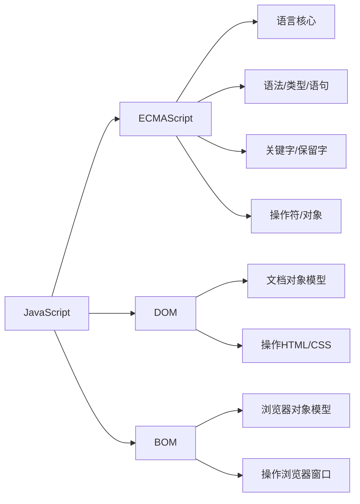
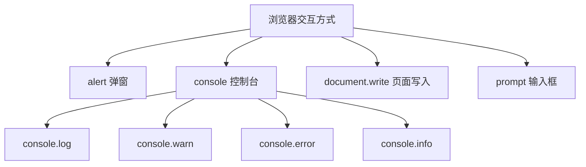

# 第18课：JavaScript 入门

## 学习目标

- 了解 JavaScript 的起源、历史和组成部分
- 掌握三种 JavaScript 编写方式
- 理解变量的声明、赋值和命名规则
- 认识 JavaScript 中的常见数据类型
- 掌握 typeof 操作符的使用

---

## 一. 邂逅 JavaScript

### 1.1 计算机语言与编程语言

计算机语言是人与计算机之间通信的语言，分为：

- **机器语言**：由二进制（0 和 1）组成，计算机直接执行
- **汇编语言**：使用助记符（如 MOV、ADD）代替二进制指令
- **高级语言**：接近人类自然语言，如 JavaScript、Python、Java 等

### 1.2 JavaScript 的起源

JavaScript 由 Brendan Eich 于 1995 年在 Netscape 公司创建，最初名为 Mocha，后改名 LiveScript，最终定名为 JavaScript。

**发展历程**：

| 年份 | 事件 |
|------|------|
| 1995 | Brendan Eich 在 10 天内创建了 JavaScript |
| 1996 | Netscape 提交给 ECMA 进行标准化 |
| 1997 | ECMAScript 1 (ES1) 发布 |
| 2009 | ES5 发布，添加了严格模式等特性 |
| 2015 | ES6/ES2015 发布，重大更新 |
| 2016+ | 每年发布新版本（ES2016, ES2017...） |

### 1.3 JavaScript 的组成部分



- **ECMAScript**：JavaScript 的语言核心，定义了语法、类型、语句等基础
- **DOM**（Document Object Model）：文档对象模型，提供操作网页内容的方法和接口
- **BOM**（Browser Object Model）：浏览器对象模型，提供与浏览器交互的方法和接口

### 1.4 JavaScript 引擎

JavaScript 引擎是浏览器内核的一部分，负责解析和执行 JS 代码。常见引擎：

| 浏览器 | 内核 | JS 引擎 |
|--------|------|---------|
| Chrome | Blink | V8 |
| Firefox | Gecko | SpiderMonkey |
| Safari | WebKit | JavaScriptCore |
| Edge | Blink | V8 |

> [!NOTE]
> V8 引擎是目前最流行的 JS 引擎，不仅用于 Chrome 浏览器，也被 Node.js 使用作为服务端 JS 运行时。

### 1.5 JavaScript 的应用场景

- **Web 前端开发**：网页交互和动态效果
- **移动端开发**：React Native、Flutter
- **小程序开发**：微信小程序、支付宝小程序
- **桌面端开发**：Electron（VS Code 就是用 Electron 开发的）
- **服务端开发**：Node.js
- **游戏开发**：Cocos2d、Three.js

---

## 二. JavaScript 编写基础

### 2.1 编写 JavaScript 的三种位置

#### 方式一：HTML 属性中（内联，不推荐）

```html
<a href="#" onclick="alert('Hello World')">点击我</a>
<a href="javascript: alert('Hello World')">点击我</a>
```

#### 方式二：script 元素中

```html
<script>
  var message = 'Hello World'
  console.log(message)
</script>
```

#### 方式三：外部独立 JS 文件（推荐）

```html
<script src="./js/app.js"></script>
```

```javascript
// app.js
var message = 'Hello World'
console.log(message)
```

### 2.2 noscript 元素

当浏览器不支持脚本或脚本被禁用时，显示 noscript 中的内容：

```html
<noscript>
  您的浏览器不支持 JavaScript，请启用后浏览本网站。
</noscript>
```

### 2.3 编写注意事项

- script 元素必须是双标签，不要混用引入 src 和内部代码
- type 属性在现代开发中可省略（默认为 `text/javascript`）
- 加载顺序：script 标签会阻塞 HTML 解析
- 严格区分大小写：`Name` 和 `name` 是不同的变量
- defer/async 属性用于控制脚本加载与执行时机（后续课程讲解）

### 2.4 浏览器交互方式

```javascript
// 1. alert - 弹窗
alert('这是一条警告信息')

// 2. console - 控制台输出
console.log('这是一条日志')
console.info('这是一条信息')
console.warn('这是一条警告')
console.error('这是一条错误')

// 3. document.write - 在页面中写入
document.write('<h1>这是标题</h1>')

// 4. prompt - 输入框
var name = prompt('请输入您的姓名：')
console.log('您输入的姓名是：', name)
```



### 2.5 Chrome 调试工具

- **Elements**：查看和修改 HTML/CSS
- **Console**：运行 JavaScript 代码、查看日志
- **Sources**：调试 JavaScript 代码，设置断点
- **Network**：查看网络请求

### 2.6 JavaScript 注释

```javascript
// 单行注释：使用两个斜杠

/*
  多行注释：
  可以跨越多行
*/

/**
 * 文档注释：用于生成 API 文档
 * @param {string} name - 姓名
 * @returns {void}
 */
function sayHello(name) {
  console.log('Hello', name)
}
```

---

## 三. 变量

### 3.1 变量的理解

变量是程序中用来存储数据的容器。可以将变量理解为"盒子"，盒子中存放具体的数据。

### 3.2 变量的声明和赋值

```javascript
// 方式一：先声明，后赋值
var name
name = '张三'

// 方式二：声明的同时赋值（推荐）
var age = 18

// 方式三：同时声明多个变量（不推荐，可读性差）
var a = 1, b = 2, c = 3
```

### 3.3 变量的命名规则

- 只能包含字母、数字、下划线 `_` 和美元符号 `$`
- 不能以数字开头
- 不能使用关键字和保留字（如 `var`、`if`、`for` 等）
- 严格区分大小写

**命名规范**：

- 使用小驼峰命名法（camelCase）：`myFirstName`
- `=` 两边加空格
- 语句末尾加分号
- 见名知意

### 3.4 变量的注意事项

```javascript
// 1. 未声明直接使用会报错
// console.log(test) // ReferenceError: test is not defined

// 2. 声明但未赋值，值为 undefined
var message
console.log(message) // undefined

// 3. 不使用 var 也可以声明变量（不推荐，会变成全局变量）
age = 20 // 不推荐
```

### 3.5 JavaScript 中的数据类型（动态类型）

JavaScript 是**动态类型语言**：变量类型在运行时确定，且可以随时改变。

```javascript
var data = 'Hello' // 字符串类型
data = 123 // 变成数字类型（动态类型的特点）
```

**8 种数据类型**：

| 类型 | 示例 | 说明 |
|------|------|------|
| String | `'Hello'` | 字符串 |
| Number | `123` | 数字（整数和小数） |
| Boolean | `true` | 布尔值 |
| Undefined | `undefined` | 未定义 |
| Null | `null` | 空值 |
| Object | `{}` | 对象（复杂类型） |
| BigInt | `123n` | 大整数（ES2020） |
| Symbol | `Symbol()` | 唯一值（ES6） |

> [!NOTE]
> 前 7 种是基本数据类型（原始类型），Object 是引用数据类型（复杂类型）。

### 3.6 typeof 操作符

`typeof` 用于获取变量的数据类型（注意：它是操作符，不是函数，因此不需要括号）。

```javascript
var name = '张三'
var age = 18
var isStudent = true
var address
var car = null
var person = {}

console.log(typeof name)     // "string"
console.log(typeof age)      // "number"
console.log(typeof isStudent) // "boolean"
console.log(typeof address)   // "undefined"
console.log(typeof car)       // "object"（历史遗留 bug）
console.log(typeof person)    // "object"
```

---

## 自测问题

<details>
<summary>1. JavaScript 由哪三部分组成？</summary>

**答案**：ECMAScript（语言核心）、DOM（文档对象模型）、BOM（浏览器对象模型）。
</details>

<details>
<summary>2. 编写 JavaScript 有哪三种方式？</summary>

**答案**：① 在 HTML 属性中（如 onclick）；② 在 script 元素内；③ 外部独立的 .js 文件引入。
</details>

<details>
<summary>3. var 定义变量但未赋值，其值是什么？</summary>

**答案**：`undefined`。
</details>

<details>
<summary>4. typeof 是函数还是操作符？typeof null 的结果是什么？</summary>

**答案**：typeof 是操作符，不是函数。`typeof null` 的结果是 `"object"`，这是 JavaScript 的一个历史遗留 bug。
</details>

<details>
<summary>5. JavaScript 中共有哪 8 种数据类型？</summary>

**答案**：String、Number、Boolean、Undefined、Null、Object、BigInt、Symbol。
</details>

---

## 参考资源

- 上节课：[[0017-html-css-advanced|HTML/CSS 进阶]]
- 下节课：[[0019-js-variables-types|变量和数据类型详解]]