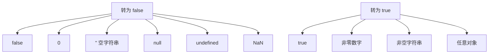

# 第19课：变量和数据类型详解

## 学习目标

- 深入理解 Number 类型的各种表示和运算
- 掌握 String 类型的定义和转义字符
- 理解 Boolean 类型和真假值转换
- 了解 Undefined 和 Null 的区别
- 掌握数据类型的显式和隐式转换

---

## 一. Number 类型

### 1.1 数字的表示

```javascript
// 整数
var age = 25
var count = 100

// 浮点数（小数）
var price = 99.9
var pi = 3.14159

// 科学计数法
var num1 = 5e3  // 5000
var num2 = 5e-3 // 0.005

// 十六进制
var hex = 0xff  // 255

// 八进制（不建议使用）
var oct = 0o10 // 8

// 二进制
var bin = 0b10 // 2
```

### 1.2 特殊数值

```javascript
// Infinity - 无穷大
console.log(1 / 0)         // Infinity
console.log(-1 / 0)        // -Infinity

// NaN - Not a Number（非数字）
console.log(0 / 0)         // NaN
console.log('abc' * 3)     // NaN

// 判断是否为有限数字
console.log(isFinite(100))   // true
console.log(isFinite(1/0))   // false

// 判断是否为 NaN
console.log(isNaN(NaN))      // true
console.log(isNaN(100))      // false
```

### 1.3 数字运算的精度问题

```javascript
// 浮点数计算不精确（IEEE 754 标准）
console.log(0.1 + 0.2)       // 0.30000000000000004
console.log(0.1 + 0.2 === 0.3) // false

// 解决方法：转换为整数计算
console.log((0.1 * 10 + 0.2 * 10) / 10) // 0.3
```

> [!WARNING]
> 浮点数运算精度问题是所有使用 IEEE 754 标准的编程语言都存在的，不仅是 JavaScript。对于精确计算（如金融），建议使用第三方库如 decimal.js。

---

## 二. String 类型

### 2.1 字符串的定义

```javascript
// 三种引号方式
var str1 = '单引号字符串'
var str2 = "双引号字符串"
var str3 = `模板字符串（ES6）`

// 模板字符串支持插值和换行
var name = '张三'
var age = 18
var info = `我叫${name}，今年${age}岁`
console.log(info) // "我叫张三，今年18岁"
```

### 2.2 转义字符

| 转义字符 | 含义 |
|---------|------|
| `\'` | 单引号 |
| `\"` | 双引号 |
| `\\` | 反斜杠 |
| `\n` | 换行 |
| `\t` | 制表符（Tab） |
| `\r` | 回车 |

```javascript
var message = '他说：\'你好\''
var multiLine = '第一行\n第二行'
var path = 'C:\\Users\\name'
```

### 2.3 字符串拼接

```javascript
var firstName = '张'
var lastName = '三'

// 方式一：使用 + 号
var fullName = firstName + ' ' + lastName
console.log(fullName) // "张 三"

// 方式二：使用 +=
var text = 'Hello'
text += ' World'
console.log(text) // "Hello World"

// 字符串和数字拼接（隐式转换）
console.log('年龄：' + 18) // "年龄：18"
```

---

## 三. Boolean 类型

Boolean 类型只有两个值：`true`（真）和 `false`（假）。

```javascript
var isStudent = true
var isLoggedIn = false
```

**常用于条件判断的转换规则**：



> [!NOTE]
> 以上 6 个值（`false`、`0`、`""`、`null`、`undefined`、`NaN`）在转换为 Boolean 时都是 `false`，其余值都是 `true`。

---

## 四. Undefined 和 Null

### 4.1 Undefined

```javascript
// 1. 声明变量但未赋值
var message
console.log(message) // undefined

// 2. 访问对象不存在的属性
var person = { name: '张三' }
console.log(person.age) // undefined

// 3. 函数没有返回值，默认返回 undefined
function test() {}
console.log(test()) // undefined
```

### 4.2 Null

```javascript
// null 表示"空值"或"没有对象"
var data = null
```

**Undefined vs Null 的区别**：

| 对比 | Undefined | Null |
|------|-----------|------|
| 含义 | 声明了但未赋值 | 主动设置为空 |
| 类型 | `typeof` 返回 `"undefined"` | `typeof` 返回 `"object"`（历史 bug） |
| 使用场景 | 变量未赋值时默认值 | 主动清空对象引用 |

---

## 五. Object 类型

Object 是 JavaScript 中的引用数据类型，用于存储键值对集合。

```javascript
// 创建一个对象
var person = {
  name: '张三',
  age: 18,
  height: 1.75
}

// 访问属性
console.log(person.name)     // "张三"
console.log(person['age'])   // 18
```

对象的更多内容将在第 23 课中详细讲解：[[0023-js-objects|对象基础]]

---

## 六. typeof 操作符

```javascript
console.log(typeof 'Hello')     // "string"
console.log(typeof 123)         // "number"
console.log(typeof true)        // "boolean"
console.log(typeof undefined)   // "undefined"
console.log(typeof null)        // "object"  (历史遗留 bug)
console.log(typeof {})          // "object"
console.log(typeof function(){}) // "function"
```

---

## 七. 数据类型转换

### 7.1 转换为 String

```javascript
// 方式一：String() 函数
console.log(String(123))     // "123"
console.log(String(true))    // "true"
console.log(String(null))    // "null"
console.log(String(undefined)) // "undefined"

// 方式二：toString() 方法（注意：null 和 undefined 不能调用）
console.log((123).toString())  // "123"
console.log(true.toString())   // "true"

// 方式三：字符串拼接（隐式转换）
console.log(123 + '')  // "123"
```

### 7.2 转换为 Number

```javascript
// 方式一：Number() 函数
console.log(Number('123'))      // 123
console.log(Number('123abc'))   // NaN
console.log(Number(true))       // 1
console.log(Number(false))      // 0
console.log(Number(null))       // 0
console.log(Number(undefined))  // NaN

// 方式二：parseInt() 和 parseFloat()
console.log(parseInt('123px'))   // 123
console.log(parseInt('3.14'))    // 3
console.log(parseFloat('3.14'))  // 3.14
console.log(parseInt('abc'))     // NaN

// 方式三：使用 + 号（隐式转换）
console.log(+'123')    // 123
console.log(+true)     // 1
```

### 7.3 转换为 Boolean

```javascript
// 方式一：Boolean() 函数
console.log(Boolean(1))        // true
console.log(Boolean(0))        // false
console.log(Boolean('hello'))  // true
console.log(Boolean(''))       // false
console.log(Boolean(null))     // false
console.log(Boolean(undefined)) // false
console.log(Boolean(NaN))      // false

// 方式二：!! 双重取反（隐式转换）
console.log(!!1)       // true
console.log(!!0)       // false
console.log(!!'hello') // true
console.log(!!'')      // false
```

---

## 自测问题

<details>
<summary>1. `0.1 + 0.2 === 0.3` 的结果是什么？为什么？</summary>

**答案**：结果是 `false`。因为浮点数采用 IEEE 754 标准存储，二进制无法精确表示 0.1 和 0.2，运算结果会有精度误差。
</details>

<details>
<summary>2. `typeof null` 的结果是什么？这是 bug 吗？</summary>

**答案**：结果是 `"object"`。这是 JavaScript 的一个历史遗留 bug，typeof null 本应返回 `"null"`，但早期实现中 null 的二进制前三位是 000，被误判为对象类型。
</details>

<details>
<summary>3. `Number('123abc')` 和 `parseInt('123abc')` 的区别？</summary>

**答案**：`Number('123abc')` 返回 `NaN`（整体转换，有非数字字符就失败）；`parseInt('123abc')` 返回 `123`（逐字符解析，遇到非数字字符停止）。
</details>

<details>
<summary>4. 以下哪些值在转换为 Boolean 时为 false？</summary>

**答案**：`false`、`0`、`""`（空字符串）、`null`、`undefined`、`NaN`，共 6 个。
</details>

<details>
<summary>5. `undefined` 和 `null` 有什么区别？</summary>

**答案**：`undefined` 表示声明了但未赋值，是变量默认值；`null` 表示主动设置为空。`typeof undefined` 返回 `"undefined"`，`typeof null` 返回 `"object"`。
</details>

---

## 参考资源

- 上节课：[[0018-javascript-basics|JavaScript 入门]]
- 下节课：[[0020-js-operators|运算符]]