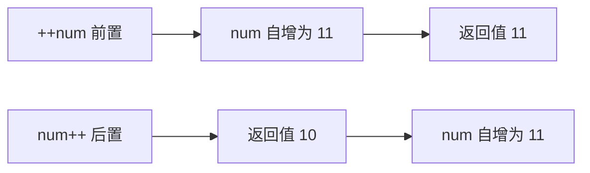

# 第20课：运算符

## 学习目标

- 掌握算术运算符的使用
- 理解赋值运算符和原地修改
- 区分 `==` 和 `===` 的差异
- 掌握逻辑运算符的短路运算
- 理解三元运算符和运算符优先级

---

## 一. 算术运算符

```javascript
var a = 10
var b = 3

console.log(a + b)  // 13  加法
console.log(a - b)  // 7   减法
console.log(a * b)  // 30  乘法
console.log(a / b)  // 3.3333333333333335  除法
console.log(a % b)  // 1   取余（模运算）
```

### 取余运算的应用

```javascript
// 判断奇偶数
var num = 7
console.log(num % 2 === 0) // false，是奇数

// 获取数字的个位数
console.log(123 % 10) // 3
```

---

## 二. 赋值运算符

```javascript
var num = 10

num = num + 5   // num = 15
```

### 原地修改（复合赋值运算符）

```javascript
var num = 10

num += 5   // num = num + 5 = 15
num -= 3   // num = num - 3 = 12
num *= 2   // num = num * 2 = 24
num /= 4   // num = num / 4 = 6
num %= 4   // num = num % 4 = 2
```

---

## 三. 自增和自减

```javascript
var num = 10

// 前置自增：先自增，再使用
console.log(++num) // 11（num 先变成 11，然后输出）
console.log(num)   // 11

// 后置自增：先使用，再自增
var count = 10
console.log(count++) // 10（先输出 10，然后 count 变成 11）
console.log(count)   // 11
```



---

## 四. 比较运算符

```javascript
console.log(10 > 5)   // true
console.log(10 >= 10) // true
console.log(10 < 5)   // false
console.log(10 <= 5)  // false
```

### `==` vs `===`

```javascript
// ==：相等运算符（会进行类型转换）
console.log(10 == '10')    // true（字符串 '10' 被转换为数字 10）
console.log(true == 1)     // true（true 被转换为 1）
console.log(null == undefined) // true

// ===：严格相等运算符（不进行类型转换，推荐使用）
console.log(10 === '10')   // false（类型不同）
console.log(true === 1)    // false（类型不同）
console.log(null === undefined) // false（类型不同）
```

> [!TIP]
> 在实际开发中，始终推荐使用 `===` 和 `!==`，避免 `==` 的类型转换导致意外的结果。

---

## 五. 逻辑运算符

### 5.1 逻辑非 `!`

```javascript
console.log(!true)   // false
console.log(!false)  // true
console.log(!0)      // true
console.log(!'')     // true
console.log(!'abc')  // false

// 双重取反：将值转换为 Boolean
console.log(!!1)     // true
console.log(!!0)     // false
```

### 5.2 逻辑与 `&&`（短路运算）

逻辑与的规则：从左到右依次判断，遇到 falsy 值就返回它，否则返回最后一个值。

```javascript
console.log(true && false)  // false
console.log(true && true)   // true

// 短路特性
console.log(0 && 'abc')     // 0（遇到 falsy 值 0，直接返回）
console.log(1 && 'abc')     // "abc"（都是 truthy，返回最后一个）
console.log(null && 'hello') // null

// 实际应用：条件执行
var isLoggedIn = true
isLoggedIn && console.log('用户已登录')
```

### 5.3 逻辑或 `||`（短路运算）

逻辑或的规则：从左到右依次判断，遇到 truthy 值就返回它，否则返回最后一个值。

```javascript
console.log(true || false)   // true
console.log(false || true)   // true

// 短路特性
console.log(1 || 'abc')      // 1（遇到 truthy 值 1，直接返回）
console.log(0 || 'default')  // "default"
console.log(null || undefined) // undefined

// 实际应用：设置默认值
var nickname = ''
var defaultName = nickname || '默认用户'
console.log(defaultName) // "默认用户"

var name = '张三'
var showName = name || '默认用户'
console.log(showName) // "张三"
```

---

## 六. 三元运算符（条件运算符）

```javascript
// 语法：条件 ? 表达式1 : 表达式2
// 条件为 true 时返回表达式1，否则返回表达式2

var age = 20
var result = age >= 18 ? '成年人' : '未成年人'
console.log(result) // "成年人"

// if-else 的等价写法
var result2
if (age >= 18) {
  result2 = '成年人'
} else {
  result2 = '未成年人'
}
```

---

## 七. 运算符优先级

从高到低的主要运算符优先级：

| 优先级 | 运算符 | 说明 |
|--------|--------|------|
| 1 | `()` | 括号 |
| 2 | `++` `--` `!` | 自增/自减/逻辑非 |
| 3 | `*` `/` `%` | 乘除取余 |
| 4 | `+` `-` | 加减 |
| 5 | `>` `>=` `<` `<=` | 比较运算符 |
| 6 | `==` `===` `!=` `!==` | 相等运算符 |
| 7 | `&&` | 逻辑与 |
| 8 | `\|\|` | 逻辑或 |
| 9 | `=` `+=` `-=` | 赋值运算符 |

```javascript
// 复合表达式的计算
var result = 3 + 4 * 5  // 先算 4*5=20，再算 3+20=23
var result2 = (3 + 4) * 5  // 先算括号 3+4=7，再算 7*5=35

var a = 1, b = 2, c = 3
var flag = a > b && b < c || a === 1
// 流程：先算 a>b → false，短路 && → false，再算 a===1 → true，false || true → true
console.log(flag) // true
```

> [!TIP]
> 当表达式较复杂时，建议适当使用括号 `()` 来明确优先级，提高代码可读性。

---

## 自测问题

<details>
<summary>1. `console.log(++num)` 和 `console.log(num++)` 的区别？</summary>

**答案**：`++num` 是先自增再使用（输出自增后的值），`num++` 是先使用再自增（输出原值后自增）。
</details>

<details>
<summary>2. `10 == '10'` 和 `10 === '10'` 的结果分别是什么？</summary>

**答案**：`10 == '10'` 是 `true`（== 会做类型转换，将字符串转数字），`10 === '10'` 是 `false`（=== 不做类型转换，类型不同）。
</details>

<details>
<summary>3. 逻辑与 `&&` 和逻辑或 `||` 的短路规则分别是什么？</summary>

**答案**：`&&` 遇到 falsy 值就返回它（短路），否则返回最后一个值；`||` 遇到 truthy 值就返回它（短路），否则返回最后一个值。
</details>

<details>
<summary>4. `0 && 'abc'` 和 `0 || 'abc'` 的结果分别是什么？</summary>

**答案**：`0 && 'abc'` 返回 `0`（遇到 falsy 值 0，&& 短路）；`0 || 'abc'` 返回 `"abc"`（遇到 falsy 值 0，|| 继续找，直到找到 truthy 值）。
</details>

<details>
<summary>5. 运算符优先级的顺序是什么？</summary>

**答案**：括号 `()` > 自增/自减/非 `!` > 乘除取余 > 加减 > 比较 > 相等 > `&&` > `||` > 赋值。
</details>

---

## 参考资源

- 上节课：[[0019-js-variables-types|变量和数据类型详解]]
- 下节课：[[0021-js-flow-control|流程控制]]