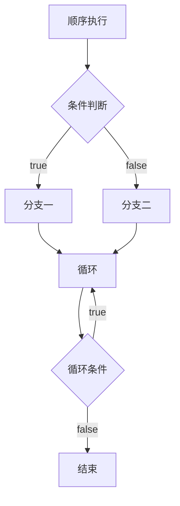
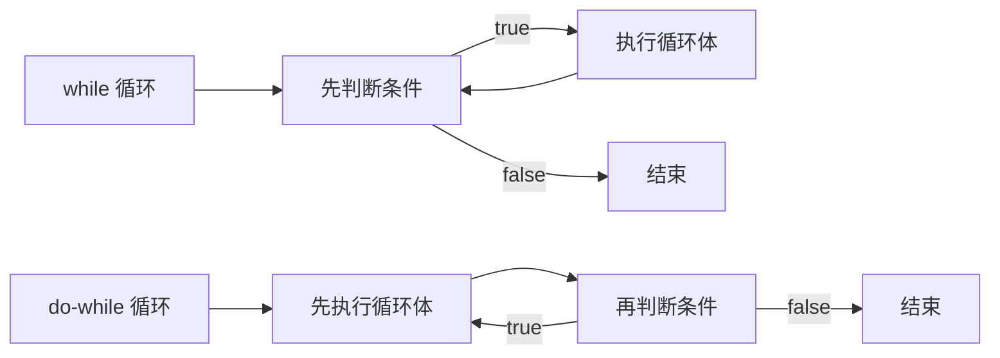

# 第21课：流程控制

## 学习目标

- 理解程序的执行流程和代码块的概念
- 掌握 if 分支语句的各种形式
- 掌握 switch 语句的使用
- 掌握 while、do-while 和 for 循环
- 理解 break 和 continue 的区别
- 能够编写嵌套循环

---

## 一. 程序的执行流程



程序有三种基本结构：

1. **顺序结构**：从上到下依次执行
2. **分支结构**：根据条件选择执行路径
3. **循环结构**：重复执行某段代码

---

## 二. 代码块

```javascript
// 使用 {} 包裹的代码称为代码块
{
  var message = 'Hello'
  console.log(message)
}

// 代码块中的变量在块外也可访问（var 没有块级作用域）
console.log(message) // "Hello"（可以访问）
```

> [!NOTE]
> 在 ES6 之前，JavaScript 没有块级作用域，用 `var` 声明的变量在代码块外部仍然可访问。ES6 引入的 `let` 和 `const` 具有块级作用域。

---

## 三. 分支语句

### 3.1 if 语句

```javascript
var score = 85

// 单分支
if (score >= 60) {
  console.log('及格')
}

// 双分支
if (score >= 60) {
  console.log('及格')
} else {
  console.log('不及格')
}

// 多分支
if (score >= 90) {
  console.log('优秀')
} else if (score >= 80) {
  console.log('良好')
} else if (score >= 60) {
  console.log('及格')
} else {
  console.log('不及格')
}
```

### 3.2 switch 语句

```javascript
var day = 3
var weekDay

switch (day) {
  case 1:
    weekDay = '星期一'
    break
  case 2:
    weekDay = '星期二'
    break
  case 3:
    weekDay = '星期三'
    break
  case 4:
    weekDay = '星期四'
    break
  case 5:
    weekDay = '星期五'
    break
  case 6:
  case 7:
    weekDay = '周末'
    break
  default:
    weekDay = '无效的日期'
}

console.log(weekDay) // "星期三"
```

> [!WARNING]
> 每个 case 后面要加 `break`，否则会穿透执行下一个 case（称为"fall-through"）。利用这个特性可以让多个 case 共享同一段代码。

### if vs switch 的选择

- **if**：适用于范围判断（如 `score >= 60`）
- **switch**：适用于固定值的匹配（如 `day === 3`）

---

## 四. 循环语句

### 4.1 while 循环

```javascript
// 语法：while (条件) { 循环体 }

var count = 1
while (count <= 5) {
  console.log('第', count, '次循环')
  count++
}
// 输出：第 1 次循环 ~ 第 5 次循环
```

**while 练习：计算 1~100 的和**

```javascript
var i = 1
var sum = 0
while (i <= 100) {
  sum += i
  i++
}
console.log(sum) // 5050
```

### 4.2 do-while 循环

```javascript
// do-while 至少执行一次循环体
var i = 1
do {
  console.log('至少执行一次', i)
  i++
} while (i <= 0)
// 输出："至少执行一次 1"（即使条件不满足也执行了一次）
```



### 4.3 for 循环

```javascript
// 语法：for (初始化; 条件; 更新) { 循环体 }

for (var i = 1; i <= 5; i++) {
  console.log('第', i, '次循环')
}

// for 循环最常用的场景：遍历数组
var arr = ['a', 'b', 'c']
for (var i = 0; i < arr.length; i++) {
  console.log(arr[i]) // 依次输出 a, b, c
}
```

### 4.4 循环控制：break 和 continue

```javascript
// break：立即退出整个循环
for (var i = 1; i <= 10; i++) {
  if (i === 5) {
    break // 当 i=5 时退出循环
  }
  console.log(i) // 输出：1, 2, 3, 4
}

// continue：跳过本次循环，进入下一次
for (var i = 1; i <= 5; i++) {
  if (i === 3) {
    continue // 跳过 i=3 这一次
  }
  console.log(i) // 输出：1, 2, 4, 5
}
```

### 4.5 嵌套循环

```javascript
// 打印 5x5 星号矩阵
for (var i = 0; i < 5; i++) {
  var row = ''
  for (var j = 0; j < 5; j++) {
    row += '* '
  }
  console.log(row)
}
```

**九九乘法表**：

```javascript
for (var i = 1; i <= 9; i++) {
  var row = ''
  for (var j = 1; j <= i; j++) {
    row += j + 'x' + i + '=' + (i * j) + '\t'
  }
  console.log(row)
}
```

---

## 五. 综合案例：猜数字游戏

```javascript
// 1. 生成 1~100 的随机数
var secret = Math.floor(Math.random() * 100) + 1

// 2. 给用户 7 次机会
for (var i = 0; i < 7; i++) {
  var guess = prompt('请输入你猜的数字（1~100）：')
  guess = Number(guess)

  if (guess === secret) {
    console.log('恭喜你，猜对了！')
    break
  } else if (guess > secret) {
    console.log('猜大了')
  } else {
    console.log('猜小了')
  }
}
```

---

## 自测问题

<details>
<summary>1. `break` 和 `continue` 的区别是什么？</summary>

**答案**：`break` 立即退出整个循环；`continue` 结束本次循环，继续执行下一次循环（跳过当前迭代中 continue 后面的代码）。
</details>

<details>
<summary>2. switch 语句中如果不写 break 会怎样？</summary>

**答案**：会发生"穿透"（fall-through），匹配到某个 case 后，会继续执行后面所有 case 的代码，直到遇到 break 或 switch 结束。
</details>

<details>
<summary>3. while 和 do-while 循环的区别是什么？</summary>

**答案**：while 是先判断条件再执行循环体（可能一次都不执行）；do-while 是先执行循环体再判断条件（至少执行一次）。
</details>

<details>
<summary>4. for 循环的三个部分分别是什么？</summary>

**答案**：`for (初始化表达式; 条件表达式; 更新表达式)`。初始化用于设置循环变量；条件决定是否继续循环；更新在每次循环结束后执行。
</details>

<details>
<summary>5. 使用 while 循环求 1~100 之间所有偶数的和。</summary>

**答案**：
```javascript
var i = 1
var sum = 0
while (i <= 100) {
  if (i % 2 === 0) {
    sum += i
  }
  i++
}
console.log(sum) // 2550
```
</details>

---

## 参考资源

- 上节课：[[0020-js-operators|运算符]]
- 下节课：[[0022-js-functions|函数基础]]