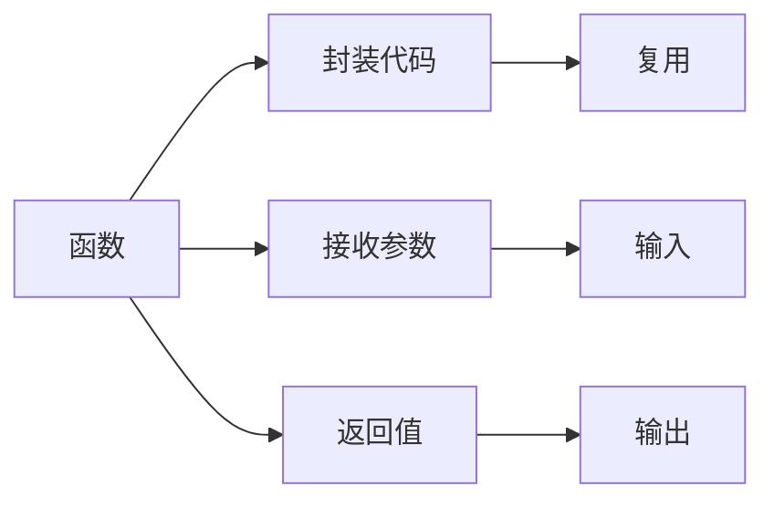
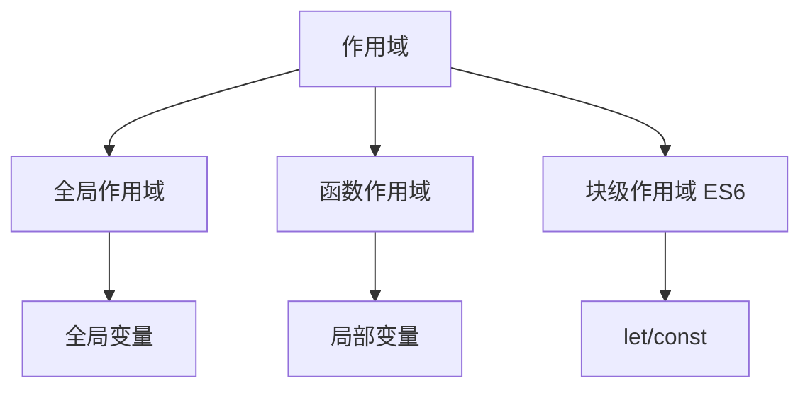

# 第22课：函数基础

## 学习目标

- 掌握函数的声明和调用方式
- 理解函数的参数和返回值
- 掌握变量的作用域规则
- 理解函数表达式和声明式函数的区别
- 了解递归的基本思想和应用
- 认识回调函数和一等公民

---

## 一. 认识函数

函数是 JavaScript 中最基本的代码组织方式，用于封装一段可重复使用的代码。



---

## 二. 函数的声明和调用

```javascript
// 声明式函数
function sayHello() {
  console.log('Hello!')
}

// 调用函数
sayHello() // "Hello!"
```

### 2.1 函数参数

```javascript
// 形参：函数定义时的参数
function greet(name) {
  console.log('你好，' + name)
}

// 实参：函数调用时传入的参数
greet('张三')  // "你好，张三"
greet('李四')  // "你好，李四"

// 多个参数
function add(a, b) {
  console.log(a + b)
}

add(3, 5)   // 8
add(10, 20) // 30
```

### 2.2 函数返回值

```javascript
function sum(a, b) {
  return a + b
}

var result = sum(3, 5)
console.log(result) // 8

// 没有 return 语句，函数返回 undefined
function noReturn() {
  var x = 10
}
console.log(noReturn()) // undefined

// return 后面的代码不会执行
function test() {
  return '结束'
  console.log('这行不会执行')
}
```

> [!TIP]
> 函数应该尽量做到"单一职责"：一个函数只做一件事。如果函数逻辑过于复杂，应该拆分为多个小函数。

---

## 三. arguments 对象

```javascript
function sum() {
  console.log(arguments) // 类数组对象，包含所有传入的参数
  var total = 0
  for (var i = 0; i < arguments.length; i++) {
    total += arguments[i]
  }
  return total
}

console.log(sum(1, 2, 3))     // 6
console.log(sum(1, 2, 3, 4, 5)) // 15
```

> [!NOTE]
> `arguments` 是一个类数组对象（不是真正的数组），包含了所有传入函数的参数。在箭头函数中没有 `arguments` 对象。

---

## 四. 递归函数

递归：函数内部调用自身。

```javascript
// 递归的两个要素：
// 1. 递归结束条件（基线条件）
// 2. 递归调用（向基线条件靠近）

// 计算 n 的阶乘
function factorial(n) {
  if (n === 1) {
    return 1 // 基线条件
  }
  return n * factorial(n - 1) // 递归调用
}

console.log(factorial(5)) // 5 * 4 * 3 * 2 * 1 = 120
```

**递归 vs 循环**：

```javascript
// 循环实现 pow
function pow1(x, n) {
  var result = 1
  for (var i = 0; i < n; i++) {
    result *= x
  }
  return result
}

// 递归实现 pow
function pow2(x, n) {
  if (n === 0) return 1
  return x * pow2(x, n - 1)
}

console.log(pow1(2, 3)) // 8
console.log(pow2(2, 3)) // 8
```

---

## 五. 变量的作用域



```javascript
// 全局变量：在函数外部声明的变量
var globalVar = '我是全局变量'

function test() {
  // 局部变量：在函数内部声明的变量
  var localVar = '我是局部变量'
  console.log(globalVar) // 可以访问全局变量
  console.log(localVar)  // 可以访问局部变量
}

test()
console.log(globalVar) // 可以访问
// console.log(localVar) // ReferenceError: localVar is not defined
```

### 变量访问顺序

```javascript
var name = '全局'

function outer() {
  var name = '外部'
  
  function inner() {
    var name = '内部'
    console.log(name) // "内部"（优先访问最近的变量）
  }
  
  inner()
  console.log(name) // "外部"
}

outer()
console.log(name) // "全局"
```

访问顺序：**局部变量 > 外部变量 > 全局变量**（作用域链）

---

## 六. 函数表达式

```javascript
// 声明式函数
function foo() {
  console.log('声明式函数')
}

// 函数表达式（将函数赋值给变量）
var bar = function() {
  console.log('函数表达式')
}

foo() // "声明式函数"
bar() // "函数表达式"
```

### 声明式 vs 表达式

| 对比 | 声明式函数 | 函数表达式 |
|------|-----------|-----------|
| 提升 | 函数声明提升（可提前调用） | 不会提升 |
| 语法 | `function name() {}` | `var name = function() {}` |

```javascript
// 声明式函数可以提前调用
sayHi() // "Hi!"
function sayHi() {
  console.log('Hi!')
}

// 函数表达式不能提前调用
// sayHello() // TypeError: sayHello is not a function
var sayHello = function() {
  console.log('Hello!')
}
```

---

## 七. JavaScript 的一等公民

在 JavaScript 中，函数是"一等公民"（First-Class Function），意味着：

1. 函数可以被赋值给变量
2. 函数可以作为参数传递给另一个函数
3. 函数可以作为另一个函数的返回值

```javascript
// 函数作为参数（回调函数）
function process(num, callback) {
  return callback(num)
}

function double(n) {
  return n * 2
}

function square(n) {
  return n * n
}

console.log(process(5, double)) // 10
console.log(process(5, square)) // 25
```

### 回调函数

```javascript
// 回调函数：作为参数传递给另一个函数的函数
function requestData(url, successCallback, failCallback) {
  // 模拟网络请求
  var isSuccess = true
  
  if (isSuccess) {
    successCallback('请求成功的数据')
  } else {
    failCallback('请求失败')
  }
}

requestData(
  '/api/data',
  function(data) {
    console.log('成功：', data)
  },
  function(error) {
    console.log('失败：', error)
  }
)
```

---

## 八. 立即执行函数（IIFE）

```javascript
// IIFE: Immediately Invoked Function Expression
(function() {
  var privateVar = '私有变量'
  console.log('立即执行！')
})()
// 输出："立即执行！"
// privateVar 在外部无法访问

// IIFE 的作用：创建独立的作用域，避免变量污染
```

---

## 自测问题

<details>
<summary>1. 声明式函数和函数表达式有什么区别？</summary>

**答案**：声明式函数会被提升（hoisting），可以在声明前调用；函数表达式不会被提升。声明式函数使用 `function name() {}` 语法，函数表达式使用 `var name = function() {}`。
</details>

<details>
<summary>2. 什么是作用域链？</summary>

**答案**：当访问一个变量时，JavaScript 会先在当前作用域查找，找不到则去外层作用域查找，直到全局作用域。这个查找链条就是作用域链。
</details>

<details>
<summary>3. 递归函数需要满足哪两个条件？</summary>

**答案**：① 必须有基线条件（结束条件）；② 每次递归调用都要向基线条件靠近，否则会无限递归导致栈溢出。
</details>

<details>
<summary>4. 什么是回调函数？</summary>

**答案**：回调函数是作为参数传递给另一个函数的函数，在特定时机被调用。常见于异步操作、事件处理、数组遍历等方法中。
</details>

<details>
<summary>5. 函数的返回值如果没有显式写 return，会返回什么？</summary>

**答案**：会返回 `undefined`。
</details>

---

## 参考资源

- 上节课：[[0021-js-flow-control|流程控制]]
- 下节课：[[0023-js-objects|对象基础]]