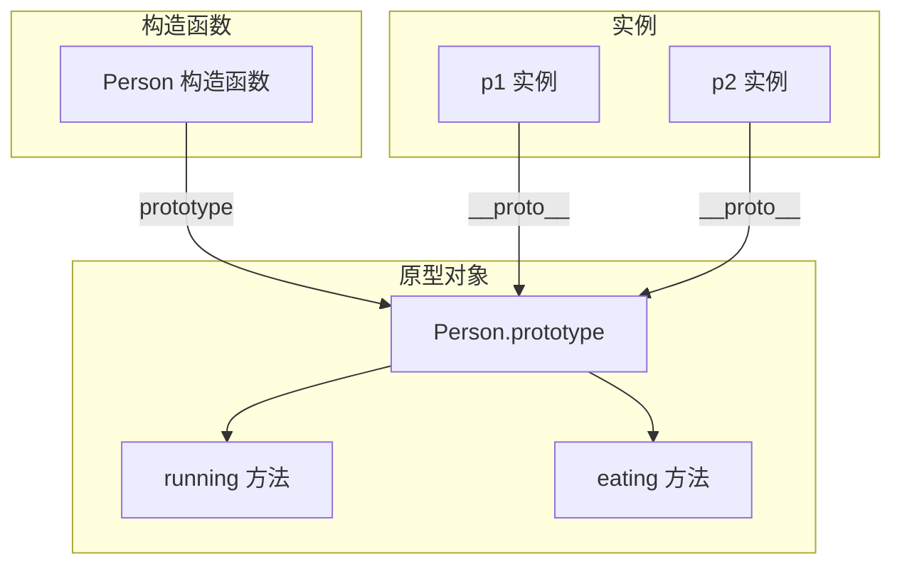

# 第26课：面向对象基础

## 学习目标

- 掌握构造函数的定义和使用
- 理解 new 运算符的执行过程
- 理解原型对象 prototype 的作用
- 掌握原型链的查找机制
- 理解 this 在不同场景的指向规则

---

## 一. 创建多个对象的问题

```javascript
// 使用字面量创建多个相似对象，代码重复
var p1 = { name: '张三', age: 18, running: function() { console.log('跑步') } }
var p2 = { name: '李四', age: 20, running: function() { console.log('跑步') } }
var p3 = { name: '王五', age: 22, running: function() { console.log('跑步') } }
```

**问题**：代码大量重复，每个对象都创建了独立的函数。

---

## 二. 工厂函数

```javascript
// 工厂函数：返回新对象的普通函数
function createPerson(name, age) {
  return {
    name: name,
    age: age,
    running: function() {
      console.log(this.name + '在跑步')
    }
  }
}

var p1 = createPerson('张三', 18)
var p2 = createPerson('李四', 20)
console.log(p1.name) // "张三"
```

**缺点**：无法通过 `instanceof` 识别对象的类型。

---

## 三. 构造函数

```javascript
// 构造函数名首字母大写（约定）
function Person(name, age) {
  this.name = name
  this.age = age
  this.running = function() {
    console.log(this.name + '在跑步')
  }
}

var p1 = new Person('张三', 18)
var p2 = new Person('李四', 20)

console.log(p1 instanceof Person) // true（可以识别类型）
console.log(p1.name) // "张三"
```

### new 运算符的执行过程

```mermaid
graph TD
    A[new Person] --> B[创建空对象 obj = {}]
    B --> C[设置原型链 obj.__proto__ = Person.prototype]
    C --> D[将 this 指向新对象]
    D --> E[执行构造函数体 this.name = name...]
    E --> F[返回新对象]
```

1. 创建一个空对象 `{}`
2. 将空对象的 `__proto__` 指向构造函数的 `prototype`
3. 将 `this` 绑定到新对象
4. 执行构造函数中的代码
5. 返回新对象

---

## 四. 原型对象（prototype）

### 4.1 为什么需要原型？

构造函数的问题：每次创建对象时，方法都会被重新创建一次，浪费内存。

```javascript
function Person(name) {
  this.name = name
  this.running = function() { console.log('跑步') }
}

var p1 = new Person('张三')
var p2 = new Person('李四')

console.log(p1.running === p2.running) // false（不同函数，浪费内存）
```

### 4.2 使用原型优化

```javascript
function Person(name, age) {
  this.name = name
  this.age = age
}

// 将方法放在原型上，所有实例共享
Person.prototype.running = function() {
  console.log(this.name + '在跑步')
}

Person.prototype.eating = function() {
  console.log(this.name + '在吃饭')
}

var p1 = new Person('张三', 18)
var p2 = new Person('李四', 20)

p1.running() // "张三在跑步"
p2.running() // "李四在跑步"

console.log(p1.running === p2.running) // true（共享同一函数）
```



### 4.3 原型链

```javascript
function Person(name) {
  this.name = name
}

Person.prototype.running = function() {
  console.log('跑步')
}

var p = new Person('张三')

// 属性/方法查找顺序：
console.log(p.name)     // "张三"（对象自身属性）

p.running() // "跑步"（对象自身没有，去原型上找）

// 原型链继续向上查找
console.log(p.toString()) // "[object Object]"（原型上也没有，去 Object.prototype 找）
```

**访问原则**：当访问对象的属性或方法时，JavaScript 会沿着原型链依次查找，直到找到或到达 `null`。

---

## 五. this 指向总结

| 调用方式 | this 指向 |
|---------|-----------|
| 普通函数调用 | window（严格模式 undefined） |
| 对象方法调用 | 调用该方法的对象 |
| 构造函数调用 | 新创建的对象 |
| call/apply/bind | 指定的对象 |

```javascript
// 1. 普通函数
function foo() {
  console.log(this) // window
}
foo()

// 2. 对象方法
var obj = {
  name: 'obj',
  foo: function() {
    console.log(this) // obj
  }
}
obj.foo()

// 3. 构造函数
function Person() {
  console.log(this) // Person 实例
}
new Person()

// 4. 显式绑定
function bar() {
  console.log(this.name)
}
bar.call({ name: 'call' })  // "call"
bar.apply({ name: 'apply' }) // "apply"
var bound = bar.bind({ name: 'bind' })
bound() // "bind"
```

---

## 六. 内置类之间的继承关系

```javascript
// Object.prototype 是所有对象的顶层原型
console.log(Person.prototype.__proto__ === Object.prototype) // true
console.log(Array.prototype.__proto__ === Object.prototype)  // true
console.log(String.prototype.__proto__ === Object.prototype) // true
console.log(Function.prototype.__proto__ === Object.prototype) // true

// 原型链的终点
console.log(Object.prototype.__proto__) // null
```

---

## 自测问题

<details>
<summary>1. new 运算符做了哪几件事？</summary>

**答案**：① 创建一个空对象；② 将空对象的 `__proto__` 指向构造函数的 `prototype`；③ 将 `this` 绑定到新对象；④ 执行构造函数代码；⑤ 返回新对象。
</details>

<details>
<summary>2. prototype 和 `__proto__` 分别是什么？</summary>

**答案**：`prototype` 是构造函数上的属性，指向原型对象；`__proto__` 是实例对象上的属性，指向其构造函数的原型对象。`实例.__proto__ === 构造函数.prototype`。
</details>

<details>
<summary>3. 为什么要把方法放在 prototype 上？</summary>

**答案**：如果方法放在构造函数中，每个实例都会创建一份独立的方法副本，浪费内存。放在 prototype 上后，所有实例共享同一个方法。
</details>

<details>
<summary>4. 对象访问属性时是如何查找的？</summary>

**答案**：先在对象自身属性中查找，找不到则沿 `__proto__` 去原型对象上查找，直到找到或到达 `null`（原型链终点）。
</details>

<details>
<summary>5. this 在构造函数和对象方法中的指向分别是什么？</summary>

**答案**：构造函数中 this 指向新创建的对象；对象方法中 this 指向调用该方法的对象。
</details>

---

## 参考资源

- 上节课：[[0025-js-string-math-date|字符串和 Math/Date]]
- 下节课：[[0027-dom-basics|DOM 基础]]