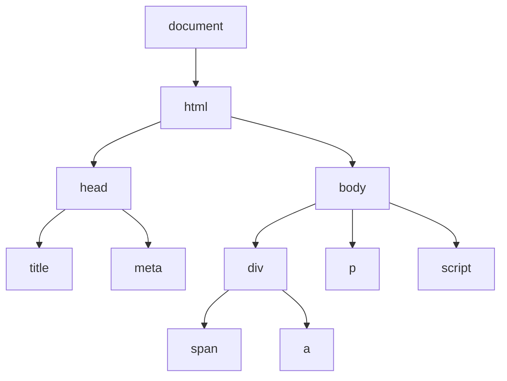

# 第27课：DOM 基础

## 学习目标

- 理解 DOM 树的概念和结构
- 掌握获取元素的多种方法
- 掌握元素属性的操作方式
- 掌握样式的操作方式
- 了解 classList 和 data- 属性的使用

---

## 一. 认识 DOM

DOM（Document Object Model，文档对象模型）是 JavaScript 操作网页的接口。



**DOM 树**：浏览器将 HTML 文档解析为树形结构，每个 HTML 元素都是一个节点（Node）。

```html
<!DOCTYPE html>
<html>
<head>
  <title>页面标题</title>
</head>
<body>
  <h1>主标题</h1>
  <p>一段文字</p>
</body>
</html>
```

---

## 二. document 对象

`document` 是 BOM 中 `window` 对象的属性，代表整个 HTML 文档。

```javascript
// 通过 document 操作页面
document.title = '新的标题'
document.body.style.backgroundColor = 'lightblue'

// document 是 DOM 的入口
```

> [!NOTE]
> `document` 是一个全局对象，在任何地方都可以直接使用。

---

## 三. 获取元素

### 3.1 基本方法

```javascript
// 1. getElementById：通过 id 获取（返回单个元素）
var title = document.getElementById('main-title')

// 2. getElementsByTagName：通过标签名获取（返回 HTMLCollection）
var divs = document.getElementsByTagName('div')

// 3. getElementsByClassName：通过类名获取
var boxes = document.getElementsByClassName('box')

// 4. querySelector：CSS 选择器（返回第一个匹配的元素）
var firstBox = document.querySelector('.box')
var mainTitle = document.querySelector('#main-title')
var link = document.querySelector('a[href="#"]')

// 5. querySelectorAll：CSS 选择器（返回所有匹配的 NodeList）
var allBoxes = document.querySelectorAll('.box')
```

> [!TIP]
> 推荐使用 `querySelector` 和 `querySelectorAll`，因为它们支持任意 CSS 选择器，更加灵活。

### 3.2 示例

```html
<div id="app">
  <div class="box">盒子1</div>
  <div class="box">盒子2</div>
  <div class="box">盒子3</div>
</div>

<script>
  var app = document.querySelector('#app')
  var boxes = document.querySelectorAll('.box')
  console.log(boxes.length) // 3
  
  for (var i = 0; i < boxes.length; i++) {
    console.log(boxes[i].textContent)
  }
</script>
```

---

## 四. 操作元素属性

### 4.1 直接访问属性

```javascript
var box = document.querySelector('.box')

// 标准属性可以直接通过 . 访问
console.log(box.id)        // "box1"
console.log(box.className) // "box active"
console.log(box.title)     // "提示信息"

// 修改属性
box.id = 'new-id'
box.className = 'new-class'
```

### 4.2 attribute 操作方法

```javascript
// HTML 属性（attribute）操作
var box = document.querySelector('.box')

// 获取属性
console.log(box.getAttribute('data-id'))   // "123"
console.log(box.getAttribute('name'))      // "box"

// 设置属性
box.setAttribute('data-id', '456')
box.setAttribute('new-attr', 'value')

// 判断是否有某属性
console.log(box.hasAttribute('data-id')) // true

// 删除属性
box.removeAttribute('new-attr')

// 获取所有属性
for (var attr of box.attributes) {
  console.log(attr.name, attr.value)
}
```

> [!NOTE]
> `property`（属性）和 `attribute`（特性）的区别：property 是 DOM 对象的属性，attribute 是 HTML 标签上的属性。对于自定义属性（如 `data-*`），只能通过 attribute 方法操作。

### 4.3 data-* 自定义属性

```html
<div class="box" data-index="1" data-user-name="张三">盒子</div>

<script>
  var box = document.querySelector('.box')
  
  // 通过 dataset 访问
  console.log(box.dataset.index)     // "1"
  console.log(box.dataset.userName)  // "张三"（data-user-name 转为驼峰）
  
  // 设置
  box.dataset.role = 'admin'
</script>
```

---

## 五. 操作样式

### 5.1 行内样式（style 属性）

```javascript
var box = document.querySelector('.box')

// 设置行内样式
box.style.color = 'red'
box.style.backgroundColor = 'blue'    // 驼峰命名
box.style.fontSize = '20px'           // 不能使用连字符
box.style.width = '200px'
box.style.marginTop = '10px'

// 获取行内样式
console.log(box.style.color)
```

> [!WARNING]
> 注意：CSS 中的连字符命名（如 `background-color`）在 JavaScript 中要转换为驼峰命名（如 `backgroundColor`）。

### 5.2 className 操作

```html
<style>
  .box { width: 100px; height: 100px; background: red; }
  .active { background: blue; }
  .highlight { border: 2px solid yellow; }
</style>

<div class="box">盒子</div>
<button id="toggleBtn">切换</button>

<script>
  var box = document.querySelector('.box')
  var btn = document.getElementById('toggleBtn')
  
  btn.onclick = function() {
    // className 会覆盖所有类名
    // box.className = 'active'
    
    // 推荐使用 classList
    box.classList.toggle('active')
  }
</script>
```

### 5.3 classList 操作（推荐）

```javascript
var box = document.querySelector('.box')

// add：添加类
box.classList.add('active')

// remove：移除类
box.classList.remove('active')

// toggle：切换类（有则删除，无则添加）
box.classList.toggle('highlight')

// contains：判断是否包含某个类
console.log(box.classList.contains('active')) // true/false

// 可以同时操作多个类
box.classList.add('class1', 'class2')
box.classList.remove('class1', 'class2')
```

---

## 六. 综合示例

```html
<!DOCTYPE html>
<html>
<head>
  <style>
    .box { width: 200px; height: 200px; background: #f0f0f0; margin: 20px; }
    .dark { background: #333; color: white; }
  </style>
</head>
<body>
  <div class="box" id="myBox">Hello, DOM!</div>
  <button id="changeBtn">切换主题</button>
  
  <script>
    var box = document.getElementById('myBox')
    var btn = document.getElementById('changeBtn')
    
    btn.onclick = function() {
      // 切换类
      box.classList.toggle('dark')
      
      // 修改内容
      if (box.classList.contains('dark')) {
        box.textContent = '暗色模式'
      } else {
        box.textContent = '亮色模式'
      }
    }
  </script>
</body>
</html>
```

---

## 自测问题

<details>
<summary>1. `getElementById` 和 `querySelector` 的区别？</summary>

**答案**：getElementById 只能通过 id 获取元素，性能更好；querySelector 支持任意 CSS 选择器，更灵活通用。
</details>

<details>
<summary>2. property 和 attribute 的区别是什么？</summary>

**答案**：property 是 DOM 对象的 JavaScript 属性，attribute 是 HTML 标签上的特性。自定义属性（如 data-*）需要通过 getAttribute/setAttribute 操作。
</details>

<details>
<summary>3. CSS 属性 `background-color` 在 JavaScript 中如何表示？</summary>

**答案**：转换为驼峰命名 `backgroundColor`。
</details>

<details>
<summary>4. 使用 `className` 和 `classList` 操作类名有什么区别？</summary>

**答案**：className 会覆盖所有已有的类名；classList 支持 add/remove/toggle/contains 方法，不会覆盖已有类名，推荐使用。
</details>

<details>
<summary>5. 如何读取 HTML 元素上的 `data-user-id` 属性？</summary>

**答案**：通过 `element.dataset.userId`（data- 后的部分转为驼峰命名）。或者通过 `element.getAttribute('data-user-id')`。
</details>

---

## 参考资源

- 上节课：[[0026-js-oop|面向对象基础]]
- 下节课：[[0028-dom-nodes|DOM 节点操作]]