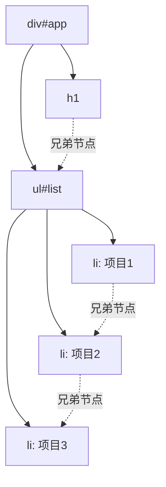

# 第28课：DOM 节点操作

## 学习目标

- 理解节点之间的层级关系
- 掌握创建和插入节点的多种方法
- 掌握节点的删除和克隆
- 理解 innerHTML 和 textContent 的区别
- 掌握节点的遍历方法

---

## 一. 节点之间的层级关系

```html
<div id="app">
  <h1>标题</h1>
  <ul id="list">
    <li>项目1</li>
    <li>项目2</li>
    <li>项目3</li>
  </ul>
</div>
```



**节点关系**：

| 关系 | 属性 |
|------|------|
| 父节点 | `parentNode` |
| 子节点列表 | `childNodes`、`children` |
| 第一个子节点 | `firstChild`、`firstElementChild` |
| 最后一个子节点 | `lastChild`、`lastElementChild` |
| 上一个兄弟节点 | `previousSibling`、`previousElementSibling` |
| 下一个兄弟节点 | `nextSibling`、`nextElementSibling` |

> [!NOTE]
> `childNodes` 包含文本节点（包括空格和换行），推荐使用 `children` 只获取元素节点。

---

## 二. 创建节点

```javascript
// 1. createElement：创建元素节点
var newDiv = document.createElement('div')
newDiv.textContent = '我是新创建的 div'

// 2. createTextNode：创建文本节点
var text = document.createTextNode('文本内容')

// 3. 创建文档片段（批量添加时使用）
var fragment = document.createDocumentFragment()
```

---

## 三. 插入节点

```html
<ul id="list">
  <li id="first">第一项</li>
  <li id="second">第二项</li>
</ul>
```

```javascript
var list = document.getElementById('list')
var thirdLi = document.createElement('li')
thirdLi.textContent = '第三项'

// 1. appendChild：在末尾追加
list.appendChild(thirdLi)
// 结果：第一项、第二项、第三项

// 2. insertBefore：在某个子节点之前插入
var secondLi = document.getElementById('second')
var newLi = document.createElement('li')
newLi.textContent = '插在第二项前面'
list.insertBefore(newLi, secondLi)
// 结果：第一项、插在第二项前面、第二项、第三项

// 3. append：支持直接插入文本和多个节点（较新 API）
list.append('文本内容')
list.append(firstLi.cloneNode(true), document.createElement('span'))
```

---

## 四. 删除节点

```javascript
var list = document.getElementById('list')
var firstLi = document.getElementById('first')

// 方式一：通过父节点删除子节点
list.removeChild(firstLi)

// 方式二：自己删除自己（较新 API）
var secondLi = document.getElementById('second')
secondLi.remove()
```

---

## 五. 克隆节点

```javascript
var firstLi = document.getElementById('first')

// cloneNode(false)：浅克隆（只克隆元素本身，不克隆子节点）
var clone1 = firstLi.cloneNode(false)

// cloneNode(true)：深克隆（克隆元素及其所有子节点）
var clone2 = firstLi.cloneNode(true)

// 将克隆的节点添加到页面
document.getElementById('list').appendChild(clone2)
```

> [!WARNING]
> 使用 `cloneNode(true)` 克隆时，元素上的事件监听不会被复制。

---

## 六. innerHTML 和 textContent

```javascript
var app = document.getElementById('app')

// innerHTML：获取或设置 HTML 内容（会解析 HTML 标签）
app.innerHTML = '<h2>新标题</h2><p>新段落</p>'

// textContent：获取或设置文本内容（不会解析 HTML 标签）
app.textContent = '<h2>新标题</h2>' // 显示为纯文本

// innerText：类似 textContent，但考虑 CSS 样式
console.log(app.innerText)
```

| 方法 | 特点 | 安全性 |
|------|------|--------|
| `innerHTML` | 解析 HTML 标签 | 可能引发 XSS 攻击 |
| `textContent` | 纯文本，不解析标签 | 安全 |
| `innerText` | 纯文本，受 CSS 影响 | 安全 |

> [!WARNING]
> 不要使用 `innerHTML` 插入用户输入的内容，否则可能引发 XSS（跨站脚本攻击）。

---

## 七. 综合示例

```javascript
// 动态列表
var data = ['苹果', '香蕉', '橘子', '西瓜']
var list = document.getElementById('fruitList')

// 清空列表
list.innerHTML = ''

// 使用文档片段批量添加（性能优化）
var fragment = document.createDocumentFragment()
for (var i = 0; i < data.length; i++) {
  var li = document.createElement('li')
  li.textContent = data[i]
  
  // 添加删除按钮
  var deleteBtn = document.createElement('button')
  deleteBtn.textContent = '删除'
  deleteBtn.onclick = function() {
    this.parentElement.remove()
  }
  
  li.appendChild(deleteBtn)
  fragment.appendChild(li)
}
list.appendChild(fragment)
```

```javascript
// 节点遍历示例
var list = document.getElementById('list')

// 获取所有子元素
var children = list.children
for (var i = 0; i < children.length; i++) {
  console.log(children[i].textContent)
}

// 遍历兄弟节点
var current = list.firstElementChild
while (current) {
  console.log(current.textContent)
  current = current.nextElementSibling
}

// 向上遍历父节点
var li = document.querySelector('li')
var parent = li.parentNode // ul
var grandParent = parent.parentNode // div#app
```

---

## 自测问题

<details>
<summary>1. `appendChild` 和 `insertBefore` 的区别？</summary>

**答案**：appendChild 在父元素的末尾追加子节点，insertBefore 在指定子节点之前插入新节点。
</details>

<details>
<summary>2. `cloneNode(true)` 和 `cloneNode(false)` 的区别？</summary>

**答案**：true 为深克隆（克隆元素及其所有子节点），false 为浅克隆（只克隆元素本身，不包含子节点）。
</details>

<details>
<summary>3. `innerHTML` 和 `textContent` 有什么区别？</summary>

**答案**：innerHTML 会解析 HTML 标签（可能存在 XSS 风险），textContent 只处理纯文本（安全）。
</details>

<details>
<summary>4. 如何删除一个 DOM 元素？</summary>

**答案**：两种方式：① 通过父节点删除：`parent.removeChild(child)`；② 自删除（较新 API）：`element.remove()`。
</details>

<details>
<summary>5. 什么是 DocumentFragment，有什么作用？</summary>

**答案**：DocumentFragment 是文档片段，它存在于内存中而非 DOM 树中。批量添加节点时，先将节点添加到 Fragment，再统一添加到 DOM，可以减少页面重排和重绘，提升性能。
</details>

---

## 参考资源

- 上节课：[[0027-dom-basics|DOM 基础]]
- 下节课：[[0029-event-mechanism|事件机制]]