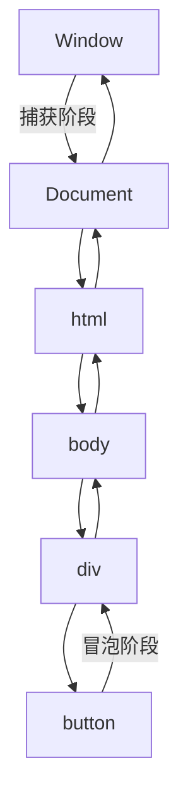

# 第29课：事件机制

## 学习目标

- 掌握事件监听的两种方式
- 理解事件流的三个阶段
- 掌握事件对象的使用
- 理解事件委托的原理和应用
- 掌握常见事件类型（鼠标、键盘、表单、加载）

---

## 一. 认识事件

事件是用户在浏览器上的操作或浏览器自身的行为，如点击、鼠标移动、键盘输入等。

```
用户点击按钮 → 浏览器检测到点击事件 → 执行事件处理函数
```

---

## 二. 事件监听的两种方式

### 2.1 传统方式（on 前缀）

```javascript
var btn = document.querySelector('button')

// 添加监听
btn.onclick = function() {
  alert('按钮被点击了')
}

// 移除监听（置为 null）
btn.onclick = null
```

**缺点**：同一个元素的同一个事件只能绑定一个处理函数。

### 2.2 标准方式（addEventListener 推荐）

```javascript
var btn = document.querySelector('button')

// 添加监听
btn.addEventListener('click', function() {
  alert('第一次点击')
})

btn.addEventListener('click', function() {
  alert('第二次点击')
})
// 两个处理函数都会被执行

// 移除监听（需要命名函数）
function handleClick() {
  alert('按钮点击')
}

btn.addEventListener('click', handleClick)
btn.removeEventListener('click', handleClick) // 移除
```

> [!TIP]
> 推荐使用 `addEventListener`，它支持绑定多个处理函数，且能更精确地控制事件流阶段。

---

## 三. 事件流

### 3.1 事件流的三个阶段



**事件流三阶段**：

1. **捕获阶段**（Capture）：事件从 Window 向下传播到目标元素
2. **目标阶段**（Target）：事件到达目标元素
3. **冒泡阶段**（Bubble）：事件从目标元素向上传播到 Window

```javascript
// 第三个参数控制监听阶段
// false（默认）：在冒泡阶段触发
// true：在捕获阶段触发

var div = document.querySelector('div')
var btn = document.querySelector('button')

div.addEventListener('click', function() {
  console.log('div 捕获')
}, true)

div.addEventListener('click', function() {
  console.log('div 冒泡')
}, false)

btn.addEventListener('click', function() {
  console.log('按钮')
})

// 点击按钮时输出：
// "div 捕获" → "按钮" → "div 冒泡"
```

### 3.2 阻止事件传播

```javascript
btn.addEventListener('click', function(event) {
  console.log('按钮点击')
  
  // 阻止事件冒泡
  event.stopPropagation()
  
  // 阻止事件捕获和冒泡（包括同一元素的其他事件）
  // event.stopImmediatePropagation()
})
```

---

## 四. 事件对象

事件处理函数会自动接收一个事件对象，包含事件的详细信息。

```javascript
btn.addEventListener('click', function(event) {
  // event 就是事件对象
  console.log(event.type)       // "click"：事件类型
  console.log(event.target)     // 触发事件的元素
  console.log(event.currentTarget) // 绑定事件的元素（this）
  console.log(event.clientX)    // 鼠标点击的 X 坐标（视口）
  console.log(event.clientY)    // 鼠标点击的 Y 坐标（视口）
  console.log(event.pageX)      // 鼠标点击的 X 坐标（页面）
  console.log(event.pageY)      // 鼠标点击的 Y 坐标（页面）
  
  // 阻止默认行为
  event.preventDefault()
})

// 注意：event.target 和 this 指向不同
// event.target：实际触发事件的元素
// this / event.currentTarget：绑定事件监听的元素
```

---

## 五. 事件委托

### 5.1 为什么要用事件委托？

```html
<ul id="list">
  <li>项目1</li>
  <li>项目2</li>
  <li>项目3</li>
</ul>
```

```javascript
// 传统方式：给每个 li 都绑定事件（性能差，且动态添加的 li 没有事件）
var lis = document.querySelectorAll('li')
for (var i = 0; i < lis.length; i++) {
  lis[i].addEventListener('click', function() {
    console.log(this.textContent)
  })
}
```

### 5.2 事件委托的实现

```javascript
// 事件委托：将事件绑定在父元素上，利用事件冒泡处理
var list = document.getElementById('list')

list.addEventListener('click', function(event) {
  var target = event.target
  
  // 判断点击的是否是 li
  if (target.tagName === 'LI') {
    console.log('点击了：', target.textContent)
  }
})
```

**事件委托的好处**：

1. 减少事件监听器的数量，提升性能
2. 动态添加的元素也会自动获得事件处理

---

## 六. 常见事件类型

### 6.1 鼠标事件

```javascript
element.addEventListener('click', fn)      // 点击
element.addEventListener('dblclick', fn)   // 双击
element.addEventListener('mousedown', fn)  // 鼠标按下
element.addEventListener('mouseup', fn)    // 鼠标松开
element.addEventListener('mousemove', fn)  // 鼠标移动
element.addEventListener('mouseenter', fn) // 鼠标进入（不冒泡）
element.addEventListener('mouseleave', fn) // 鼠标离开（不冒泡）
element.addEventListener('mouseover', fn)  // 鼠标经过（冒泡）
element.addEventListener('mouseout', fn)   // 鼠标移出（冒泡）
```

> [!NOTE]
> `mouseenter`/`mouseleave` 和 `mouseover`/`mouseout` 的区别：前者不冒泡，在进入/离开元素自身时触发；后者冒泡，在进入/离开元素或其子元素时都会触发。

### 6.2 键盘事件

```javascript
document.addEventListener('keydown', function(event) {
  console.log('按键代码：', event.key)     // 如 "Enter", "a", "1"
  console.log('按键码：', event.keyCode)   // 废弃但常用
  console.log('是否按下了 Ctrl：', event.ctrlKey)
  console.log('是否按下了 Shift：', event.shiftKey)
  console.log('是否按下了 Alt：', event.altKey)
})

document.addEventListener('keyup', function(event) {
  console.log('按键松开：', event.key)
})
```

### 6.3 表单事件

```javascript
var input = document.querySelector('input')
var form = document.querySelector('form')

// focus：获得焦点
input.addEventListener('focus', function() {
  this.style.outline = '2px solid blue'
})

// blur：失去焦点
input.addEventListener('blur', function() {
  this.style.outline = ''
})

// input：输入内容变化（每次输入都会触发）
input.addEventListener('input', function() {
  console.log('当前输入：', this.value)
})

// change：值改变且失去焦点时触发
input.addEventListener('change', function() {
  console.log('最终值：', this.value)
})

// submit：表单提交
form.addEventListener('submit', function(event) {
  event.preventDefault() // 阻止表单提交刷新页面
  console.log('表单提交')
})
```

### 6.4 页面加载事件

```javascript
// DOMContentLoaded：DOM 树加载完成（不包括图片等资源）
document.addEventListener('DOMContentLoaded', function() {
  console.log('DOM 加载完成')
})

// load：页面所有资源加载完成
window.addEventListener('load', function() {
  console.log('页面完全加载完成')
})

// beforeunload：页面即将关闭前
window.addEventListener('beforeunload', function(event) {
  event.preventDefault()
  event.returnValue = '确定离开吗？'
})
```

---

## 七. 综合示例

```html
<!DOCTYPE html>
<html>
<head>
  <style>
    .todo-item { cursor: pointer; }
    .todo-item.completed { text-decoration: line-through; color: gray; }
  </style>
</head>
<body>
  <input id="todoInput" placeholder="输入待办事项">
  <button id="addBtn">添加</button>
  <ul id="todoList"></ul>
  
  <script>
    var input = document.getElementById('todoInput')
    var addBtn = document.getElementById('addBtn')
    var list = document.getElementById('todoList')
    
    // 添加待办
    addBtn.addEventListener('click', function() {
      var text = input.value.trim()
      if (text === '') return
      
      var li = document.createElement('li')
      li.textContent = text
      li.className = 'todo-item'
      list.appendChild(li)
      input.value = ''
    })
    
    // 事件委托：点击 li 切换完成状态
    list.addEventListener('click', function(event) {
      if (event.target.tagName === 'LI') {
        event.target.classList.toggle('completed')
      }
    })
    
    // 按 Enter 键添加
    input.addEventListener('keydown', function(event) {
      if (event.key === 'Enter') {
        addBtn.click()
      }
    })
  </script>
</body>
</html>
```

---

## 自测问题

<details>
<summary>1. 事件流的三个阶段是什么？</summary>

**答案**：捕获阶段（从 Window 向下到目标元素）、目标阶段（到达目标元素）、冒泡阶段（从目标元素向上到 Window）。
</details>

<details>
<summary>2. `onclick` 和 `addEventListener` 的区别？</summary>

**答案**：onclick 只能绑定一个处理函数，再次赋值会覆盖；addEventListener 可以绑定多个处理函数，且支持第三个参数控制事件流阶段。
</details>

<details>
<summary>3. 什么是事件委托？有什么好处？</summary>

**答案**：事件委托是将事件监听器绑定在父元素上，利用事件冒泡机制处理子元素的事件。好处：① 减少事件监听器数量，提升性能；② 动态添加的元素也能自动获得事件处理。
</details>

<details>
<summary>4. 如何阻止事件冒泡？如何阻止默认行为？</summary>

**答案**：`event.stopPropagation()` 阻止事件冒泡；`event.preventDefault()` 阻止默认行为（如表单提交刷新页面、跳转链接）。
</details>

<details>
<summary>5. `mouseenter` 和 `mouseover` 的区别？</summary>

**答案**：mouseenter 不冒泡，只在进入元素自身时触发；mouseover 会冒泡，进入元素或其子元素时都会触发。
</details>

---

## 参考资源

- 上节课：[[0028-dom-nodes|DOM 节点操作]]
- 下节课：[[0030-bom-basics|BOM 操作和定时器]]