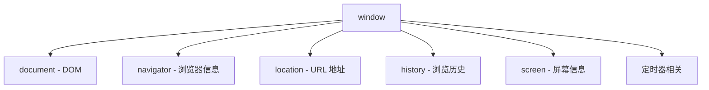
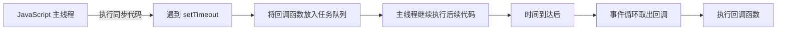

# 第30课：BOM 操作和定时器

## 学习目标

- 理解 BOM 的概念和组成
- 掌握 window 对象的常用属性和方法
- 掌握 location 对象操作 URL
- 掌握 navigator 和 history 对象
- 掌握 setTimeout 和 setInterval 的使用

---

## 一. 认识 BOM

BOM（Browser Object Model，浏览器对象模型）提供了与浏览器交互的接口。



**BOM 的核心对象是 `window`**，它既是浏览器的全局对象，也是 ECMAScript 中的 Global 对象。

> [!NOTE]
> 在浏览器环境中，所有全局变量和全局函数都是 `window` 对象的属性和方法。

---

## 二. window 对象

### 2.1 全局对象

```javascript
// window 是全局对象
var name = '张三'
console.log(window.name) // "张三"

function foo() {
  console.log('foo')
}
window.foo() // "foo"

// 内置的全局对象也是 window 的属性
console.log(window.Math)     // Math 对象
console.log(window.Date)     // Date 构造函数
console.log(window.setTimeout) // setTimeout 函数
```

### 2.2 window 的常用方法

```javascript
// 弹窗
window.alert('警告信息')
window.prompt('请输入：')
window.confirm('确定吗？') // 返回 true/false

// 打开/关闭窗口
window.open('https://www.baidu.com')
window.close()

// 滚动
window.scrollTo(0, 0)               // 滚动到指定位置
window.scrollBy(0, 100)             // 相对当前位置滚动

// 获取视口尺寸
console.log(window.innerWidth)      // 视口宽度（包含滚动条）
console.log(window.innerHeight)     // 视口高度
```

---

## 三. location 对象

`location` 对象用于操作浏览器的 URL 地址。

```javascript
// 当前 URL：https://www.example.com:8080/path/page.html?id=123&name=张三#section

console.log(location.href)      // 完整 URL
console.log(location.protocol)  // "https:"
console.log(location.host)      // "www.example.com:8080"
console.log(location.hostname)  // "www.example.com"
console.log(location.port)      // "8080"
console.log(location.pathname)  // "/path/page.html"
console.log(location.search)    // "?id=123&name=张三"
console.log(location.hash)      // "#section"
```

### 页面跳转

```javascript
// 四种方式跳转到新页面
location.href = 'https://www.baidu.com'
location.assign('https://www.baidu.com')  // 可回退
location.replace('https://www.baidu.com') // 不可回退（替换历史记录）
location.reload()                         // 刷新当前页面
```

---

## 四. navigator 对象

`navigator` 对象包含浏览器的信息。

```javascript
console.log(navigator.userAgent)    // 浏览器用户代理字符串
console.log(navigator.platform)     // 操作系统平台
console.log(navigator.language)     // 浏览器语言
console.log(navigator.onLine)       // 是否在线

// 检测浏览器类型
var userAgent = navigator.userAgent
if (userAgent.includes('Chrome')) {
  console.log('Chrome 浏览器')
} else if (userAgent.includes('Firefox')) {
  console.log('Firefox 浏览器')
}
```

---

## 五. history 对象

`history` 对象用于操作浏览器的会话历史。

```javascript
history.back()      // 后退一页（等同于点击浏览器后退按钮）
history.forward()   // 前进一页
history.go(-1)      // 后退一页
history.go(1)       // 前进一页
history.go(-2)      // 后退两页

console.log(history.length) // 历史记录的数量
```

---

## 六. 定时器

### 6.1 setTimeout：一次性定时器

```javascript
// 语法：setTimeout(函数, 延迟毫秒数)
var timerId = setTimeout(function() {
  console.log('3 秒后执行')
}, 3000)

// 清除定时器
clearTimeout(timerId)

// 带参数的写法
setTimeout(function(name) {
  console.log('Hello, ' + name)
}, 1000, '张三')

// 实际应用：延迟执行、倒计时
console.log('开始')
setTimeout(function() {
  console.log('延迟 2 秒执行')
}, 2000)
```

### 6.2 setInterval：周期性定时器

```javascript
// 语法：setInterval(函数, 间隔毫秒数)
var count = 0
var intervalId = setInterval(function() {
  count++
  console.log('第 ' + count + ' 次执行')
  
  if (count >= 5) {
    clearInterval(intervalId) // 清除定时器
  }
}, 1000)
// 每秒执行一次，共执行 5 次
```

### 6.3 倒计时综合案例

```javascript
function startCountdown(duration) {
  var remaining = duration
  
  var intervalId = setInterval(function() {
    var minutes = Math.floor(remaining / 60)
    var seconds = remaining % 60
    
    console.log(minutes + ':' + seconds.toString().padStart(2, '0'))
    
    remaining--
    
    if (remaining < 0) {
      clearInterval(intervalId)
      console.log('倒计时结束！')
    }
  }, 1000)
}

// 启动 10 秒倒计时
startCountdown(10)
```

---

## 七. 定时器的执行原理



> [!NOTE]
> `setTimeout` 的延迟时间并不是精确的保证，因为 JavaScript 是单线程的，需要等待前面的同步代码执行完毕。如果在主线程中有大量耗时操作，定时器可能会延迟执行。

---

## 自测问题

<details>
<summary>1. BOM 的核心对象是什么？它都有哪些子对象？</summary>

**答案**：核心对象是 `window`。子对象包括：document（DOM）、navigator（浏览器信息）、location（URL）、history（历史记录）、screen（屏幕信息）等。
</details>

<details>
<summary>2. `location.assign()` 和 `location.replace()` 的区别？</summary>

**答案**：assign 跳转后可回退（在历史记录中保留当前页），replace 替换当前历史记录（不可回退）。
</details>

<details>
<summary>3. `setTimeout` 和 `setInterval` 的区别？</summary>

**答案**：setTimeout 延迟指定时间后执行一次，setInterval 每隔指定时间周期性地执行。
</details>

<details>
<summary>4. 如何取消已经设置的定时器？</summary>

**答案**：`clearTimeout(timerId)` 取消 setTimeout，`clearInterval(timerId)` 取消 setInterval。
</details>

<details>
<summary>5. 为什么 setTimeout 的延迟时间可能不准确？</summary>

**答案**：JavaScript 是单线程的，定时器的回调函数会被放入任务队列等待主线程执行。如果主线程有大量同步代码正在执行，定时器回调只能等待，所以实际执行时间会晚于设定的延迟时间。
</details>

---

## 参考资源

- 上节课：[[0029-event-mechanism|事件机制]]
- 下节课：[[0031-js-comprehensive-case|JS 综合案例]]