# 第31课：JS 综合案例

## 学习目标

- 综合运用 DOM 操作和事件处理
- 实现常见的交互组件
- 掌握动态样式切换和动画效果
- 理解模块化编程的思路

---

## 案例一：Tab 切换

```html
<!DOCTYPE html>
<html>
<head>
  <style>
    * { margin: 0; padding: 0; box-sizing: border-box; }
    
    .tab-control { width: 600px; margin: 50px auto; }
    
    .tab-nav { display: flex; list-style: none; border-bottom: 2px solid #eee; }
    .tab-nav li {
      padding: 10px 20px; cursor: pointer;
      transition: all 0.3s;
    }
    .tab-nav li.active {
      color: #ff6a00; border-bottom: 2px solid #ff6a00; margin-bottom: -2px;
    }
    
    .tab-content { padding: 20px; border: 1px solid #eee; border-top: none; min-height: 200px; }
    .tab-panel { display: none; }
    .tab-panel.active { display: block; }
  </style>
</head>
<body>
  <div class="tab-control">
    <ul class="tab-nav">
      <li class="active">推荐</li>
      <li>热门</li>
      <li>最新</li>
      <li>视频</li>
    </ul>
    <div class="tab-content">
      <div class="tab-panel active">推荐内容</div>
      <div class="tab-panel">热门内容</div>
      <div class="tab-panel">最新内容</div>
      <div class="tab-panel">视频内容</div>
    </div>
  </div>
  
  <script>
    var tabNav = document.querySelectorAll('.tab-nav li')
    var tabPanel = document.querySelectorAll('.tab-panel')
    
    for (var i = 0; i < tabNav.length; i++) {
      tabNav[i].addEventListener('click', function() {
        // 移除所有 active
        for (var j = 0; j < tabNav.length; j++) {
          tabNav[j].classList.remove('active')
          tabPanel[j].classList.remove('active')
        }
        
        // 给当前点击的添加 active
        this.classList.add('active')
        
        // 获取索引：将伪数组转为数组再查找索引
        var index = Array.prototype.indexOf.call(tabNav, this)
        tabPanel[index].classList.add('active')
      })
    }
  </script>
</body>
</html>
```

---

## 案例二：登录框模态框

```html
<!DOCTYPE html>
<html>
<head>
  <style>
    .overlay {
      display: none; position: fixed; top: 0; left: 0;
      width: 100%; height: 100%; background: rgba(0,0,0,0.5);
      z-index: 1000;
    }
    .overlay.show { display: block; }
    
    .modal {
      position: absolute; top: 50%; left: 50%;
      transform: translate(-50%, -50%);
      background: white; padding: 30px; border-radius: 8px;
      width: 400px;
    }
    
    .modal h2 { margin-bottom: 20px; }
    .modal input {
      width: 100%; padding: 10px; margin-bottom: 15px;
      border: 1px solid #ddd; border-radius: 4px;
    }
    .modal button {
      padding: 10px 30px; border: none; border-radius: 4px;
      cursor: pointer;
    }
    .btn-login { background: #ff6a00; color: white; }
    .btn-close { background: #eee; margin-left: 10px; }
  </style>
</head>
<body>
  <button id="openBtn">登录</button>
  
  <div class="overlay" id="overlay">
    <div class="modal">
      <h2>用户登录</h2>
      <input type="text" id="username" placeholder="请输入用户名">
      <input type="password" id="password" placeholder="请输入密码">
      <div>
        <button class="btn-login" id="loginBtn">登录</button>
        <button class="btn-close" id="closeBtn">关闭</button>
      </div>
    </div>
  </div>
  
  <script>
    var overlay = document.getElementById('overlay')
    var openBtn = document.getElementById('openBtn')
    var closeBtn = document.getElementById('closeBtn')
    var loginBtn = document.getElementById('loginBtn')
    var username = document.getElementById('username')
    
    // 打开模态框
    openBtn.addEventListener('click', function() {
      overlay.classList.add('show')
      username.focus() // 自动聚焦
    })
    
    // 关闭模态框
    closeBtn.addEventListener('click', function() {
      overlay.classList.remove('show')
    })
    
    // 点击遮罩关闭
    overlay.addEventListener('click', function(event) {
      if (event.target === overlay) {
        overlay.classList.remove('show')
      }
    })
    
    // 按 ESC 键关闭
    document.addEventListener('keydown', function(event) {
      if (event.key === 'Escape' && overlay.classList.contains('show')) {
        overlay.classList.remove('show')
      }
    })
    
    // 登录
    loginBtn.addEventListener('click', function() {
      var name = username.value.trim()
      var pwd = document.getElementById('password').value
      
      if (name === '' || pwd === '') {
        alert('请输入用户名和密码')
        return
      }
      
      alert('登录成功！欢迎 ' + name)
      overlay.classList.remove('show')
    })
  </script>
</body>
</html>
```

> [!TIP]
> 这是一个典型的"模态框"交互模式，在几乎所有后台管理系统中都会用到。关键点：遮罩层的显示/隐藏、ESC 关闭、点击遮罩关闭、自动聚焦。

---

## 案例三：商品购物车

```html
<!DOCTYPE html>
<html>
<head>
  <style>
    body { font-family: Arial; padding: 20px; }
    table { width: 100%; border-collapse: collapse; }
    th, td { padding: 12px; text-align: center; border-bottom: 1px solid #eee; }
    th { background: #f5f5f5; }
    
    .btn { padding: 5px 10px; cursor: pointer; border: 1px solid #ddd; }
    .num { margin: 0 10px; font-size: 18px; }
    .total { text-align: right; margin-top: 20px; font-size: 20px; }
    .total span { color: #ff6a00; font-weight: bold; }
  </style>
</head>
<body>
  <h1>购物车</h1>
  <table id="cartTable">
    <thead>
      <tr>
        <th>商品</th>
        <th>单价</th>
        <th>数量</th>
        <th>小计</th>
        <th>操作</th>
      </tr>
    </thead>
    <tbody id="cartBody">
      <tr data-price="2999" data-count="1">
        <td>iPhone 15</td>
        <td class="price">¥2999</td>
        <td>
          <button class="btn minus">-</button>
          <span class="num">1</span>
          <button class="btn plus">+</button>
        </td>
        <td class="subtotal">¥2999</td>
        <td><button class="btn remove">删除</button></td>
      </tr>
      <tr data-price="199" data-count="1">
        <td>机械键盘</td>
        <td class="price">¥199</td>
        <td>
          <button class="btn minus">-</button>
          <span class="num">1</span>
          <button class="btn plus">+</button>
        </td>
        <td class="subtotal">¥199</td>
        <td><button class="btn remove">删除</button></td>
      </tr>
    </tbody>
  </table>
  <div class="total">
    总计：<span id="totalPrice">¥3198</span>
  </div>
  
  <script>
    var cartBody = document.getElementById('cartBody')
    
    // 计算总计
    function calcTotal() {
      var rows = cartBody.querySelectorAll('tr')
      var total = 0
      for (var i = 0; i < rows.length; i++) {
        var subtotalEl = rows[i].querySelector('.subtotal')
        var subtotal = parseInt(subtotalEl.textContent.replace('¥', ''))
        total += subtotal
      }
      document.getElementById('totalPrice').textContent = '¥' + total
    }
    
    // 事件委托
    cartBody.addEventListener('click', function(event) {
      var target = event.target
      var tr = target.closest('tr')
      
      // 增加数量
      if (target.classList.contains('plus')) {
        var numEl = tr.querySelector('.num')
        var count = parseInt(numEl.textContent) + 1
        numEl.textContent = count
        tr.dataset.count = count
        
        // 更新小计
        var price = parseInt(tr.dataset.price)
        tr.querySelector('.subtotal').textContent = '¥' + (price * count)
        
        calcTotal()
      }
      
      // 减少数量
      if (target.classList.contains('minus')) {
        var numEl = tr.querySelector('.num')
        var count = parseInt(numEl.textContent)
        if (count <= 1) return
        count--
        numEl.textContent = count
        tr.dataset.count = count
        
        var price = parseInt(tr.dataset.price)
        tr.querySelector('.subtotal').textContent = '¥' + (price * count)
        
        calcTotal()
      }
      
      // 删除商品
      if (target.classList.contains('remove')) {
        tr.remove()
        calcTotal()
      }
    })
  </script>
</body>
</html>
```

---

## 案例四：固定导航栏

```html
<!DOCTYPE html>
<html>
<head>
  <style>
    body { margin: 0; height: 2000px; }
    
    .header {
      height: 100px; background: #f5f5f5;
      display: flex; align-items: center; justify-content: center;
      font-size: 24px;
    }
    
    .nav {
      background: #333; color: white; width: 100%;
      transition: all 0.3s;
    }
    .nav.fixed {
      position: fixed; top: 0; left: 0;
      box-shadow: 0 2px 10px rgba(0,0,0,0.3);
    }
    
    .nav ul {
      display: flex; list-style: none; margin: 0;
      justify-content: center;
    }
    .nav li { padding: 15px 30px; cursor: pointer; }
    .nav li:hover { background: #555; }
    
    .content { padding: 30px; max-width: 800px; margin: auto; }
  </style>
</head>
<body>
  <div class="header">页面头部</div>
  
  <div class="nav" id="nav">
    <ul>
      <li>首页</li>
      <li>关于</li>
      <li>服务</li>
      <li>案例</li>
      <li>联系</li>
    </ul>
  </div>
  
  <div class="content">
    <h2>滚动测试</h2>
    <p>向下滚动页面，导航栏会固定在顶部。</p>
  </div>
  
  <script>
    var nav = document.getElementById('nav')
    var navTop = nav.offsetTop // 导航栏距离页面顶部的距离
    
    window.addEventListener('scroll', function() {
      var scrollY = window.scrollY
      
      if (scrollY >= navTop) {
        nav.classList.add('fixed')
      } else {
        nav.classList.remove('fixed')
      }
    })
  </script>
</body>
</html>
```

---

## 案例五：回到顶部

```javascript
// 回到顶部按钮
var backToTopBtn = document.createElement('button')
backToTopBtn.textContent = 'Top'
backToTopBtn.style.cssText =
  'position: fixed; bottom: 40px; right: 40px; ' +
  'padding: 12px 16px; border: none; border-radius: 50%; ' +
  'background: #ff6a00; color: white; cursor: pointer; ' +
  'display: none; z-index: 999;'

document.body.appendChild(backToTopBtn)

// 显示/隐藏按钮
window.addEventListener('scroll', function() {
  if (window.scrollY > 500) {
    backToTopBtn.style.display = 'block'
  } else {
    backToTopBtn.style.display = 'none'
  }
})

// 回到顶部
backToTopBtn.addEventListener('click', function() {
  // 平滑滚动到顶部
  window.scrollTo({
    top: 0,
    behavior: 'smooth'
  })
})
```

---

## 案例六：鼠标移入移出提示

```javascript
var box = document.querySelector('.box')

box.addEventListener('mouseenter', function() {
  // 鼠标进入时的效果
  this.style.transform = 'scale(1.1)'
  this.style.boxShadow = '0 5px 20px rgba(0,0,0,0.3)'
})

box.addEventListener('mouseleave', function() {
  // 鼠标离开时的效果
  this.style.transform = 'scale(1)'
  this.style.boxShadow = 'none'
})
```

---

## 知识体系总结

至此，Module 02 的 JavaScript 和 DOM、BOM 基础部分全部完成。以下是本模块的知识体系：

```mermaid
graph TD
    A[JavaScript 基础] --> B[变量和数据类型]
    A --> C[运算符]
    A --> D[流程控制]
    A --> E[函数]
    A --> F[对象和数组]
    A --> G[字符串和内置对象]
    A --> H[面向对象]
    
    B --> B1[String/Number/Boolean]
    B --> B2[Undefined/Null/Object]
    B --> B3[类型转换]
    
    D --> D1[if/switch]
    D --> D2[while/for]
    
    E --> E1[声明/参数/返回值]
    E --> E2[作用域链]
    E --> E3[回调函数]
    
    F --> F1[对象操作]
    F --> F2[数组方法]
    
    H --> H1[构造函数]
    H --> H2[原型 prototype]
    H --> H3[原型链]
    
    I[DOM/BOM] --> J[DOM 操作]
    I --> K[事件机制]
    I --> L[BOM 操作]
    
    J --> J1[获取元素]
    J --> J2[节点操作]
    J --> J3[样式/类操作]
    
    K --> K1[事件流]
    K --> K2[事件委托]
    K --> K3[事件对象]
    
    L --> L1[window/location]
    L --> L2[定时器]
```



---

## 自测问题

<details>
<summary>1. 如何实现点击遮罩层关闭模态框？</summary>

**答案**：在遮罩层（overlay）上绑定点击事件，判断 `event.target === overlay`（即点击的是遮罩本身而不是内部内容），然后移除显示的类名。
</details>

<details>
<summary>2. 如何实现固定导航栏效果？</summary>

**答案**：监听 `window.scroll` 事件，当 `window.scrollY >= nav.offsetTop` 时，给导航栏添加 `position: fixed` 和 `top: 0` 样式。
</details>

<details>
<summary>3. 如何计算购物车中所有商品的总价？</summary>

**答案**：遍历购物车表格的所有行，从每一行的小计元素中提取价格并累加。
</details>

<details>
<summary>4. 本模块学完了，下一步应该学习什么？</summary>

**答案**：JS 基础学完后，可以进入 Module 03：Vue.js 开发学习，或者先学习 ES6+ 新特性（let/const、箭头函数、Promise、async/await 等），再做框架学习。
</details>

---

## 参考资源

- 本模块起始课程：[[0018-javascript-basics|JavaScript 入门]]
- 下一个模块：Vue.js 开发（Module 03）

---

> 恭喜你完成了 Module 02：JavaScript 和 DOM、BOM 的全部学习！接下来可以进入 Vue.js 框架的学习，将所学的 JavaScript 知识应用到实际的项目开发中。