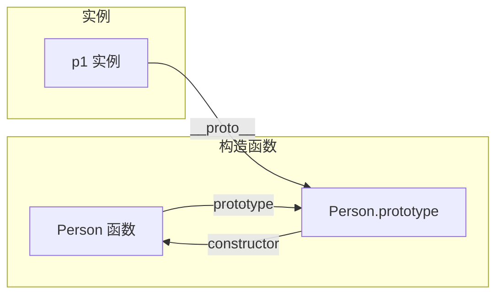
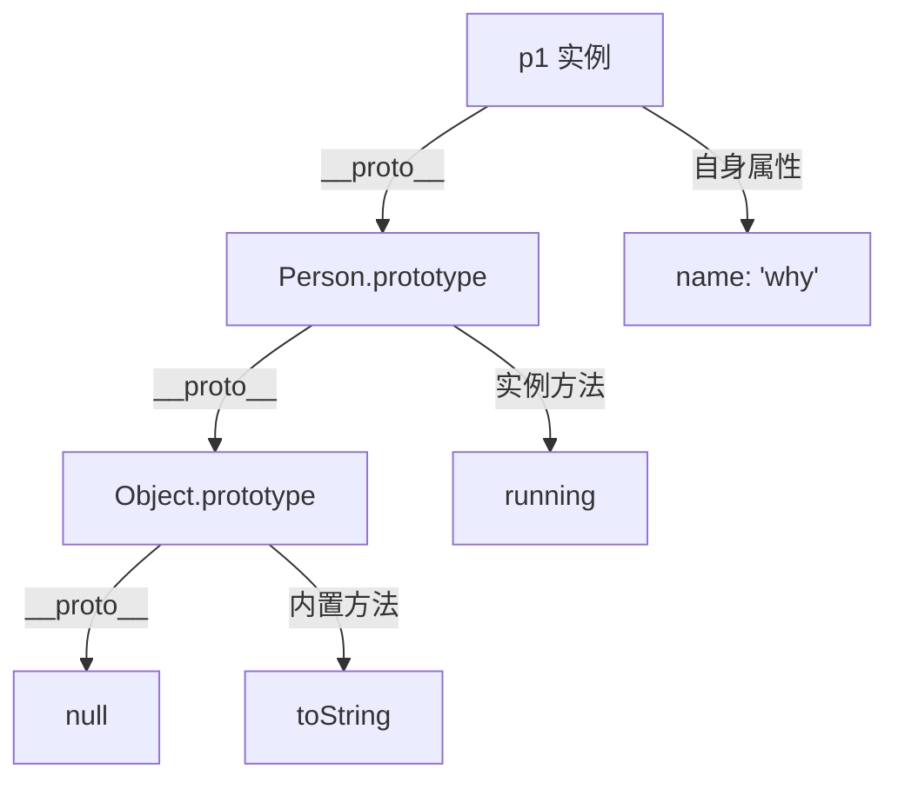
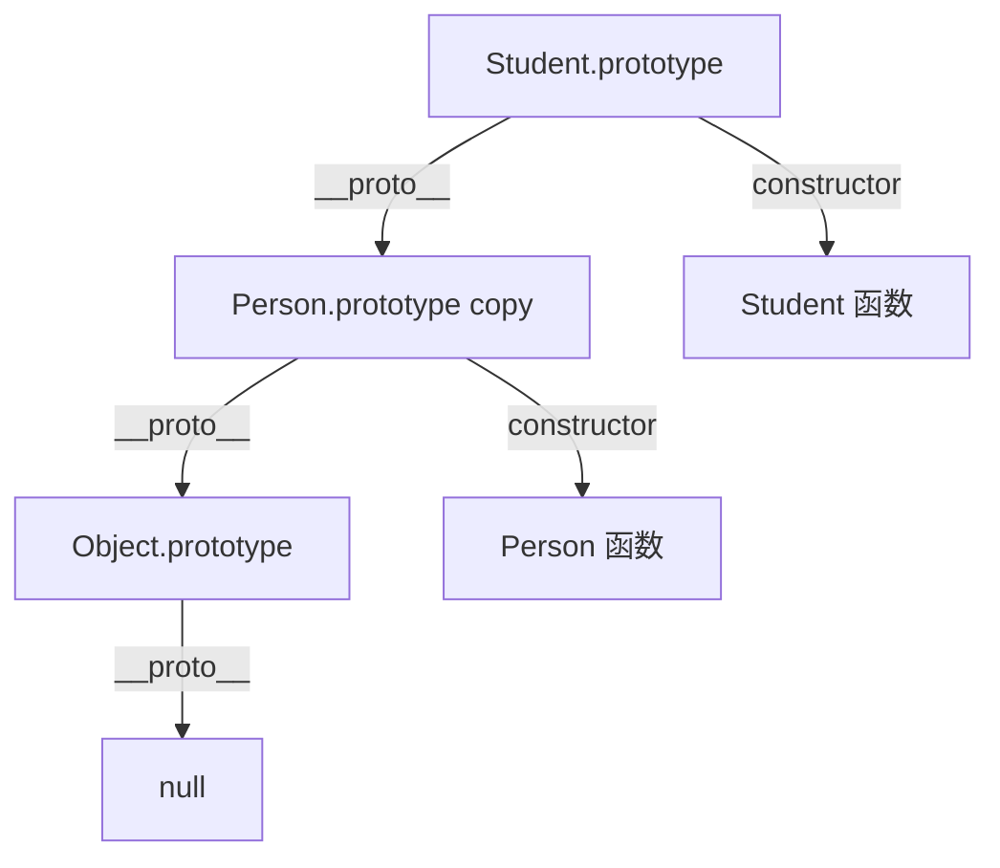

# 第35课：原型和原型链

> [!NOTE]
> 学习目标：理解 prototype/`__proto__`/constructor 三者的关系，掌握原型链查找机制，能够使用 ES5 方式实现继承。

---

## 一、原型基础

### 1.1 对象的隐式原型 `__proto__`

每个 JavaScript 对象都有一个隐式原型 `[[Prototype]]`（浏览器中通过 `__proto__` 访问）：

```js
const obj = { name: 'why' }

console.log(obj.__proto__) // 指向 Object.prototype
console.log(Object.getPrototypeOf(obj)) // 推荐方式，等价于上
```

**作用**：在对象上查找属性时，如果自身没有，会沿着 `__proto__` 向上查找。

```js
const obj = { name: 'why' }
console.log(obj.toString()) // 自身没有 toString，从 Object.prototype 找到
```

### 1.2 函数的显式原型 `prototype`

**只有函数**（非箭头函数）才有 `prototype` 属性：

```js
function foo() {}
console.log(foo.prototype) // { constructor: foo }

const obj = {}
console.log(obj.prototype) // undefined —— 普通对象没有 prototype
```

**作用**：当通过 `new` 调用函数时，创建的新对象的 `__proto__` 会指向该函数的 `prototype`。

```js
function Person(name) {
  this.name = name
}

Person.prototype.sayHello = function() {
  console.log(`Hello, I'm ${this.name}`)
}

const p1 = new Person('why')
// p1.__proto__ === Person.prototype
p1.sayHello() // "Hello, I'm why"
```

### 1.3 原型关系图



### 1.4 constructor 属性

`prototype` 对象上默认有一个 `constructor` 属性，指向函数本身：

```js
function Person() {}
console.log(Person.prototype.constructor === Person) // true

const p = new Person()
console.log(p.constructor === Person) // true（通过原型链找到）
```

### 1.5 重写显式原型

当给 `prototype` 重新赋值一个新的对象时，需要手动设置 `constructor`：

```js
function Person() {}

Person.prototype = {
  running() {
    console.log('running')
  }
}

// 手动设置 constructor（可选，但推荐）
Object.defineProperty(Person.prototype, 'constructor', {
  enumerable: false,
  writable: true,
  configurable: true,
  value: Person
})

console.log(Person.prototype.constructor === Person) // true
```

---

## 二、原型链

### 2.1 什么是原型链

原型对象本身也是一个对象，它也有自己的 `__proto__`，这样就形成了链条——**原型链**：

```js
const obj = {}
// obj -> Object.prototype -> null

function Person() {}
const p = new Person()
// p -> Person.prototype -> Object.prototype -> null
```



### 2.2 属性查找机制

```js
function Person(name) {
  this.name = name
}

Person.prototype.sayHello = function() {
  console.log(`Hi, ${this.name}`)
}

const p = new Person('why')

// 查找 p.name：在自身找到 -> 输出 "why"
// 查找 p.sayHello：自身没有 -> 到 Person.prototype 找到
// 查找 p.toString：自身没有 -> Person.prototype 没有 -> 到 Object.prototype 找到
// 查找 p.xxx：查找完整个链条没找到 -> undefined
```

### 2.3 instanceof 运算符

```js
function Person() {}
const p = new Person()

console.log(p instanceof Person)   // true
console.log(p instanceof Object)   // true
console.log(p instanceof Array)    // false
```

`instanceof` 的核心：检测构造函数的 `prototype` 是否出现在实例的原型链上。

---

## 三、ES5 继承方案

### 3.1 原型链继承（基本思路）

```js
function Person(name, age) {
  this.name = name
  this.age = age
}

Person.prototype.running = function() {
  console.log(`${this.name} is running`)
}

function Student(name, age, sno) {
  Person.call(this, name, age) // 借用构造函数，继承属性
  this.sno = sno
}
```

### 3.2 原型式继承

```js
function createObject(o) {
  function F() {}
  F.prototype = o
  return new F()
}

// 等价于 Object.create()
const person = { name: 'why', age: 18 }
const stu = Object.create(person)
console.log(stu.name) // "why"（原型链查找）
```

### 3.3 寄生式继承

```js
function createStudent(person) {
  const stu = Object.create(person) // 继承
  stu.studying = function() {       // 增强
    console.log('studying')
  }
  return stu
}
```

### 3.4 寄生组合式继承（最佳实践）

```js
function inherit(SubType, SuperType) {
  // 子类的 prototype 指向父类 prototype 的副本
  SubType.prototype = Object.create(SuperType.prototype)

  // 修复 constructor
  Object.defineProperty(SubType.prototype, 'constructor', {
    enumerable: false,
    configurable: true,
    writable: true,
    value: SubType
  })
}

function Person(name, age) {
  this.name = name
  this.age = age
}

Person.prototype.running = function() {
  console.log(`${this.name} is running`)
}

function Student(name, age, sno, score) {
  // 借用构造函数
  Person.call(this, name, age)
  this.sno = sno
  this.score = score
}

// 继承
inherit(Student, Person)

Student.prototype.studying = function() {
  console.log(`${this.name} is studying`)
}

const stu = new Student('why', 18, 111, 100)
stu.running()  // "why is running"
stu.studying() // "why is studying"
console.log(stu.constructor === Student) // true
```



### 3.5 Object 是最终的父类

所有对象最终都继承自 `Object.prototype`，所以所有对象都能调用 `toString()`、`valueOf()` 等方法。

```js
console.log(Object.prototype.__proto__) // null —— 原型链的尽头
```

### 3.6 对象判断方法

```js
const obj = { name: 'why', age: 18 }

// hasOwnProperty —— 是否是自身属性
console.log(obj.hasOwnProperty('name'))     // true
console.log(obj.hasOwnProperty('toString')) // false

// in —— 自身或原型链上有该属性
console.log('toString' in obj) // true

// for...in 会遍历自身+原型链上可枚举的属性
for (const key in obj) {
  if (obj.hasOwnProperty(key)) {
    console.log(key) // 只打印自身属性
  }
}

// isPrototypeOf
console.log(Person.prototype.isPrototypeOf(p)) // true
```

---

## 自测问题

<details>
<summary>1. 解释 `prototype`、`__proto__` 和 `constructor` 三者的关系。</summary>

- `prototype` 是函数的属性，指向该函数的原型对象
- `__proto__` 是对象的属性，指向该对象的原型（即构造函数的 `prototype`）
- `constructor` 是原型对象的属性，指向对应的构造函数
- 三者关系：`fn.prototype.constructor === fn`，`new fn().__proto__ === fn.prototype`
</details>

<details>
<summary>2. 描述原型链的属性查找机制。</summary>

访问对象属性时，先在该对象自身查找，如果找到则返回；如果没找到，沿着 `__proto__` 向上查找，直到找到或到达 `null` 为止。这就是原型链搜索机制。
</details>

<details>
<summary>3. 为什么寄生组合式继承被认为是 ES5 继承的最佳方案？</summary>

它结合了"借用构造函数"（解决属性继承，避免引用共享）和"原型链继承"（解决方法复用）的优点，同时避免了两者的缺点：只调用一次父类构造函数，子类原型不会包含父类多余属性，原型链完整。
</details>

<details>
<summary>4. `hasOwnProperty` 和 `in` 运算符有什么区别？</summary>

`hasOwnProperty` 只检查**自身属性**，`in` 运算符检查**自身+原型链**上所有可访问的属性。
</details>

---

> 下一课：[[0036-js-scope]] —— 作用域和作用域链