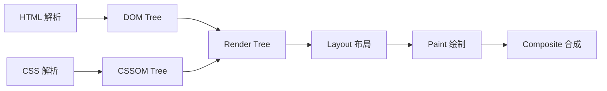
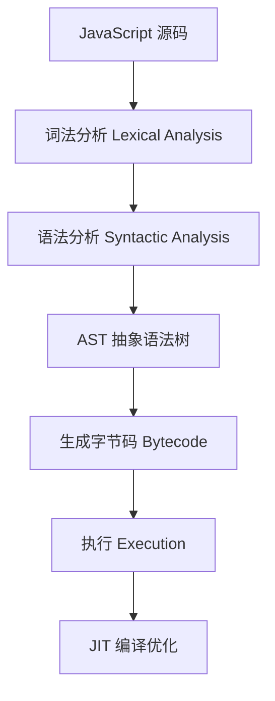
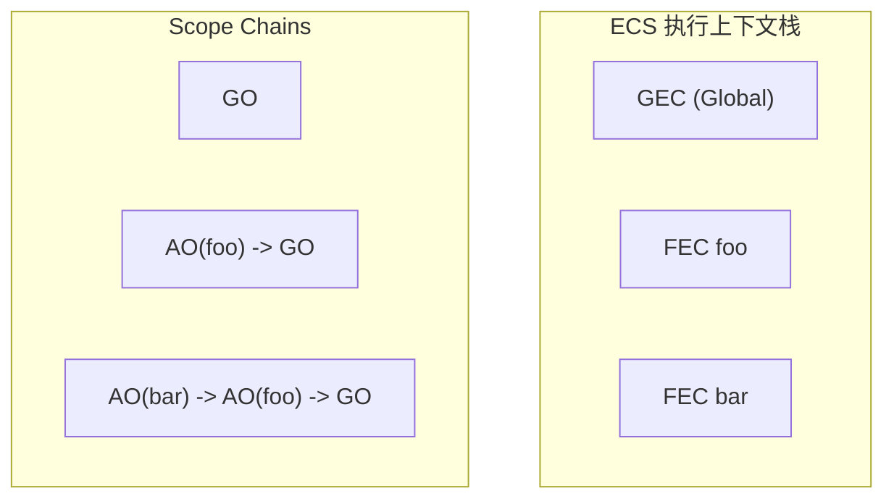

# 第36课：作用域和作用域链

> [!NOTE]
> 学习目标：理解 JavaScript 的作用域机制（全局/函数/块级作用域），掌握作用域链的查找规则，理解 VO/AO 与执行上下文的关系。

---

## 一、JavaScript 执行原理

### 1.1 浏览器渲染流程



### 1.2 script 元素的处理

| 属性 | 特性 |
|------|------|
| 普通 script | **阻塞** DOM 构建，需下载并执行后才继续解析 |
| `defer` | 不阻塞 DOM 构建，DOM 构建完成后在 `DOMContentLoaded` 之前按序执行 |
| `async` | 独立下载，下载完成后立即执行（不保证顺序） |

```html
<!-- defer：下载不阻塞，DOM 解析完成后按序执行 -->
<script defer src="app.js"></script>

<!-- async：下载不阻塞，下载完立即执行 -->
<script async src="analytics.js"></script>
```

### 1.3 回流与重绘

- **回流（reflow）**：修改 DOM 尺寸/位置/增删元素时，需要重新布局
- **重绘（repaint）**：修改颜色/背景等不影响布局的属性
- 回流**一定会**引起重绘，要尽量避免回流

优化策略：
- 一次性修改样式（使用 class 而非逐个修改 style）
- 减少 DOM 操作
- 使用 `position: absolute/fixed` 脱离文档流
- 避免频繁读取 `getComputedStyle`

### 1.4 合成图层

- 默认所有元素在同一个合成图层
- 以下属性会**新建合成图层**：`position: fixed`、`transform: 3D`、`will-change`、`opacity` 动画

---

## 二、V8 引擎执行 JavaScript 的流程



**核心模块**：
1. **Parser**：词法/语法分析，生成 AST
2. **Ignition**：解释器，将 AST 转化为字节码并执行
3. **TurboFan**：编译器，将热点代码编译为机器码优化执行

---

## 三、执行上下文和作用域

### 3.1 全局执行上下文

```js
// 代码执行前创建全局对象（GO: Global Object）
// 浏览器中全局对象就是 window

var message = 'Hello'
function foo() {
  console.log(message)
}

// 执行过程：
// 1. 创建全局对象 window
// 2. 创建全局执行上下文（GEC）
// 3. 将 GEC 推入执行上下文栈（ECS）
```

### 3.2 函数执行上下文

每次调用函数都会创建新的**函数执行上下文（FEC）**，包含：

- **AO（Activation Object）**：函数的活动对象，存放参数和局部变量
- **作用域链（Scope Chain）**
- **this 绑定**

```js
function foo(a) {
  var b = 20
  function bar(c) {
    var d = 30
    return a + b + c + d
  }
  return bar
}

var fn = foo(10)
console.log(fn(5)) // 65
```

### 3.3 作用域链的形成



**变量查找规则**：当前作用域找不到时，沿作用域链**向上**查找，直到全局作用域。

---

## 四、作用域类型

### 4.1 全局作用域

- 在代码最外层声明的变量/函数
- 浏览器中 `window` 就是全局对象
- 全局变量会挂载到 `window` 上（var 声明的）

### 4.2 函数作用域

- 函数内部声明的变量，在函数外部无法访问
- 函数执行完毕后，AO 被销毁（闭包情况除外）

```js
function foo() {
  var message = 'Hello'
  console.log(message) // 可以访问
}
console.log(message) // ReferenceError: message is not defined
```

### 4.3 块级作用域（ES6）

`let`、`const`、`class` 声明的变量会绑定在块级作用域中：

```js
{
  let a = 10
  const b = 20
  var c = 30 // var 没有块级作用域
}
console.log(a) // ReferenceError
console.log(b) // ReferenceError
console.log(c) // 30
```

**块级作用域的应用**：

```js
// 经典问题：使用 var 的 for 循环
for (var i = 0; i < 5; i++) {
  setTimeout(() => {
    console.log(i) // 全部输出 5
  }, 100)
}

// 使用 let 解决
for (let i = 0; i < 5; i++) {
  setTimeout(() => {
    console.log(i) // 0, 1, 2, 3, 4
  }, 100)
}
```

---

## 五、变量提升

### 5.1 var 的变量提升

```js
console.log(foo) // undefined（不会报错！）
var foo = 'Hello'

// 等价于：
// var foo
// console.log(foo) // undefined
// foo = 'Hello'
```

### 5.2 函数声明提升

```js
// 函数声明会被提升，可以在声明前调用
foo() // "foo running"
function foo() {
  console.log('foo running')
}

// 函数表达式不会被提升
bar() // TypeError: bar is not a function
var bar = function() {
  console.log('bar running')
}
```

### 5.3 let/const 和暂时性死区（TDZ）

`let` 和 `const` 也会被**创建**（在词法环境中注册），但**不能访问**，直到声明位置执行完毕：

```js
console.log(message) // ReferenceError: Cannot access before initialization
let message = 'Hello'

// 这个区域就是"暂时性死区" Temporal Dead Zone
```

```js
let message = 'Hello'

{
  console.log(message) // ReferenceError: 块级作用域内的 TDZ
  let message = 'World'
}
```

### 5.4 let/const 和 var 的区别

| 特性 | var | let / const |
|------|-----|-------------|
| 作用域 | 函数作用域 | 块级作用域 |
| 变量提升 | 提升（值为 undefined） | 提升（但不能访问，TDZ） |
| 重复声明 | 允许 | 不允许 |
| 挂载到 window | 是 | 否 |
| 全局声明 | 成为 window 属性 | 在全局的声明式环境记录中 |

---

## 六、JavaScript 内存管理

### 6.1 内存生命周期

1. **分配**内存
2. **使用**内存（读写）
3. **释放**内存

### 6.2 垃圾回收算法

| 算法 | 策略 | 问题 |
|------|------|------|
| 引用计数 | 计算引用数，0 时回收 | 循环引用无法回收 |
| 标记清除（Mark-Sweep） | 从根对象遍历，标记可达对象 | 会产生内存碎片 |
| 标记整理（Mark-Compact） | 标记 + 整理到连续内存 | 速度较慢 |

**V8 优化策略**：
- **分代收集**：新生代（Scavenge 算法）和老生代（Mark-Sweep/Mark-Compact）
- **增量收集**：将大 GC 拆分成小任务
- **闲时收集**：在 CPU 空闲时执行

---

## 自测问题

<details>
<summary>1. 什么是暂时性死区（TDZ）？</summary>

从作用域开始到变量声明语句所在位置之间的区域，在该区域内访问 `let`/`const` 声明的变量会报 `ReferenceError`。变量已被注册在词法环境中，但尚未完成初始化。
</details>

<details>
<summary>2. 简述作用域链的查找机制。</summary>

当访问一个变量时，JavaScript 引擎会先在当前执行上下文的 AO/VO 中查找，找不到则沿作用域链（通过 `[[scope]]` 属性）向上一个执行上下文的 AO/VO 中查找，直到全局作用域。如果全局作用域也找不到，则返回 `undefined`（非严格模式）或报错（严格模式）。
</details>

<details>
<summary>3. defer 和 async 有什么区别？</summary>

- `defer`：不阻塞 DOM 构建，多个 defer 按顺序执行，在 `DOMContentLoaded` 之前执行
- `async`：不阻塞 DOM 构建，下载完后立即执行，不保证执行顺序
- 都没有外部引用时，`defer` 无效
</details>

<details>
<summary>4. let/const 和 var 在作用域、变量提升、window 绑定方面的区别是什么？</summary>

- 作用域：var 是函数作用域，let/const 是块级作用域
- 变量提升：var 提升并初始化为 undefined；let/const 提升但不初始化（TDZ）
- window 绑定：var 声明的全局变量会挂载到 window 上，let/const 不会
</details>

---

> 下一课：[[0037-js-oop-advanced]] —— 面向对象高级