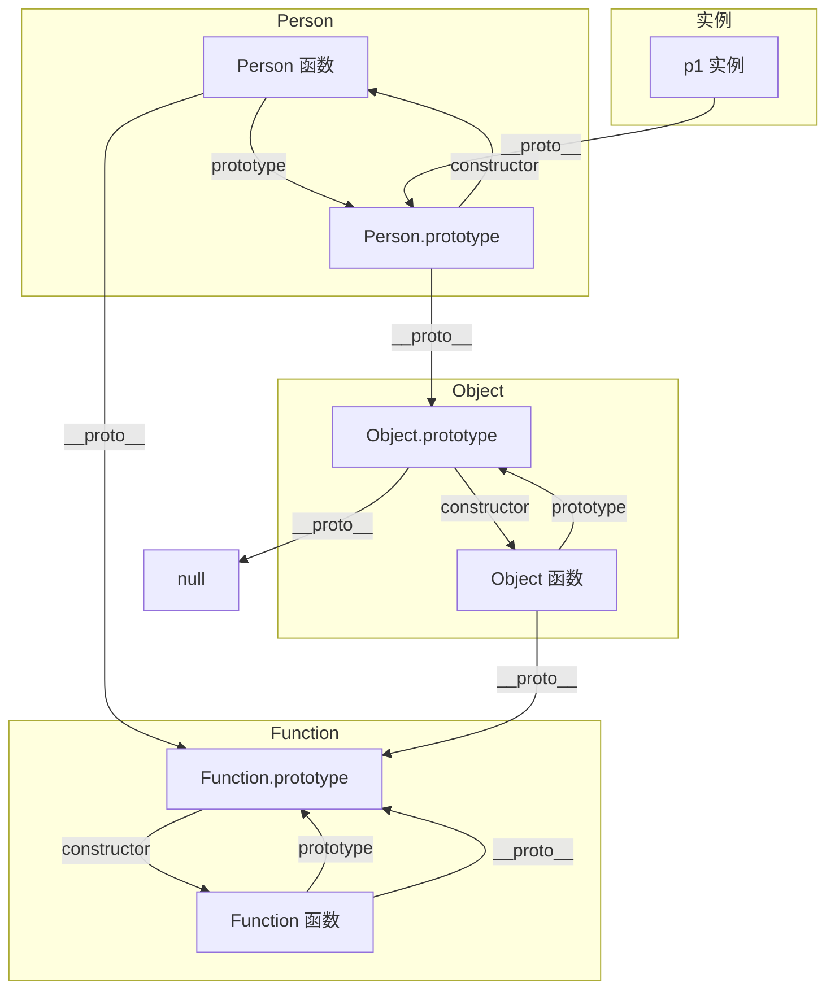

# 第37课：面向对象高级

> [!NOTE]
> 学习目标：掌握 ES6 class 语法，理解继承机制（extends + super），掌握多态和混入 Mixin 模式。

---

## 一、原型关系图

在深入 ES6 class 之前，先理清函数之间的原型关系：



关键结论：
- `Person.__proto__ === Function.prototype`
- `Person.prototype.__proto__ === Object.prototype`
- `Function.prototype.__proto__ === Object.prototype`
- `Object.prototype.__proto__ === null`

---

## 二、ES6 class 定义类

### 2.1 基本语法

```js
class Person {
  // 构造函数
  constructor(name, age) {
    this.name = name
    this.age = age
  }

  // 实例方法（挂在原型上）
  running() {
    console.log(`${this.name} is running`)
  }

  // 访问器方法
  get fullName() {
    return this.name + ' ' + this.age
  }

  set fullName(value) {
    this.name = value.split(' ')[0]
    this.age = value.split(' ')[1]
  }

  // 静态方法（类本身调用）
  static createPerson(name, age) {
    return new Person(name, age)
  }
}

// 使用
const p = new Person('why', 18)
p.running()        // "why is running"
console.log(p.fullName) // "why 18"

const p2 = Person.createPerson('kobe', 30)
```

> [!TIP]
> class 语法本质是语法糖，底层仍然是基于原型的继承。参见 [[0035-js-prototype]]。

### 2.2 class 与 ES5 构造函数的对比

```js
// ES5 写法
function Person(name, age) {
  this.name = name
  this.age = age
}
Person.prototype.running = function() {
  console.log(`${this.name} is running`)
}

// ES6 class 语法
class Person {
  constructor(name, age) {
    this.name = name
    this.age = age
  }
  running() {
    console.log(`${this.name} is running`)
  }
}

// 本质一样
console.log(typeof Person) // "function"
```

---

## 三、class 的继承

### 3.1 extends 关键字

```js
class Person {
  constructor(name, age) {
    this.name = name
    this.age = age
  }

  running() {
    console.log(`${this.name} is running`)
  }

  static eat() {
    console.log('eating')
  }
}

class Student extends Person {
  constructor(name, age, sno, score) {
    // 必须在使用 this 之前调用 super()
    super(name, age)
    this.sno = sno
    this.score = score
  }

  // 重写方法
  running() {
    console.log(`Student ${this.name} is running`)
  }

  studying() {
    console.log(`${this.name} is studying`)
  }

  static eat() {
    super.eat() // 调用父类静态方法
    console.log('student eating')
  }
}

const stu = new Student('why', 18, 111, 100)
stu.running()   // "Student why is running"
stu.studying()  // "why is studying"
Student.eat()   // "eating" -> "student eating"
```

### 3.2 super 关键字的用法

| 场景 | 语法 | 说明 |
|------|------|------|
| 构造函数中 | `super(参数)` | 调用父类构造器，必须在 `this` 前调用 |
| 实例方法中 | `super.method()` | 调用父类实例方法 |
| 静态方法中 | `super.staticMethod()` | 调用父类的静态方法 |

---

## 四、继承内置类

```js
// 扩展 Array
class HYArray extends Array {
  get firstItem() {
    return this[0]
  }

  get lastItem() {
    return this[this.length - 1]
  }
}

const arr = new HYArray(1, 2, 3)
console.log(arr.firstItem) // 1
console.log(arr.lastItem)  // 3
```

---

## 五、多态

### 5.1 严格意义上的多态

多态要求为不同的数据类型提供统一的接口：

```js
// 严格多态（Java 风格）
function makeArea(shape) {
  return shape.getArea()
}

class Rectangle {
  constructor(width, height) {
    this.width = width
    this.height = height
  }
  getArea() {
    return this.width * this.height
  }
}

class Circle {
  constructor(radius) {
    this.radius = radius
  }
  getArea() {
    return Math.PI * this.radius ** 2
  }
}

const rect = new Rectangle(10, 20)
const circle = new Circle(5)

console.log(makeArea(rect))  // 200
console.log(makeArea(circle)) // 78.5...
```

### 5.2 JavaScript 中的多态

JavaScript 本身是**动态类型**语言，任何函数都可以接收任意类型参数，只要该参数具有所需的方法，即可调用。因此可以说 **JavaScript 中到处都是多态**。

---

## 六、混入 Mixin

### 6.1 为什么需要混入

JavaScript 不支持**多重继承**，但有时一个类需要从多个来源获取功能。混入（Mixin）提供了一种解决方案。

### 6.2 实现混入

```js
// 定义功能模块
const runnerMixin = {
  run() {
    console.log(`${this.name} is running`)
  }
}

const eaterMixin = {
  eat() {
    console.log(`${this.name} is eating`)
  }
}

// 使用混入
class Person {
  constructor(name) {
    this.name = name
  }
}

// 将 Mixin 的方法混入到原型
Object.assign(Person.prototype, runnerMixin, eaterMixin)

const p = new Person('why')
p.run()  // "why is running"
p.eat()  // "why is eating"
```

### 6.3 多 Mixin 组合

```js
function mixinArray(BaseClass, ...mixins) {
  mixins.forEach(mixin => {
    Object.assign(BaseClass.prototype, mixin)
  })
  return BaseClass
}

const canSwim = {
  swim() { console.log(`${this.name} is swimming`) }
}

const canFly = {
  fly() { console.log(`${this.name} is flying`) }
}

class SuperAnimal {}
mixinArray(SuperAnimal, canSwim, canFly)

const duck = new SuperAnimal()
duck.name = '唐老鸭'
duck.swim() // "唐老鸭 is swimming"
duck.fly()  // "唐老鸭 is flying"
```

---

## 七、对象字面量增强

ES6 对对象字面量进行了增强：

```js
const name = 'why'
const age = 18

// 属性简写
const obj = {
  name,       // 等价于 name: name
  age,        // 等价于 age: age

  // 方法简写
  running() { // 等价于 running: function() {}
    console.log('running')
  },

  // 计算属性名
  [name + '01']: 'Hello'
}

console.log(obj.name)    // "why"
console.log(obj.why01)   // "Hello"
```

---

## 八、Babel ES6 转 ES5

Class 的本质是语法糖，Babel 会将 class 转译成 ES5 的寄生组合式继承：

```js
// 转换前
class Person {
  constructor(name) {
    this.name = name
  }
  running() {
    console.log('running')
  }
}

// 转换后核心（简化）
function _classCallCheck(instance, Constructor) {
  if (!(instance instanceof Constructor)) {
    throw new TypeError('Cannot call a class as a function')
  }
}

function _defineProperties(target, props) {
  for (let i = 0; i < props.length; i++) {
    Object.defineProperty(target, props[i].key, props[i])
  }
}

function _createClass(Constructor, protoProps, staticProps) {
  if (protoProps) _defineProperties(Constructor.prototype, protoProps)
  if (staticProps) _defineProperties(Constructor, staticProps)
  return Constructor
}

var Person = /*#__PURE__*/ function() {
  function Person(name) {
    _classCallCheck(this, Person)
    this.name = name
  }

  _createClass(Person, [
    {
      key: 'running',
      value: function running() {
        console.log('running')
      }
    }
  ])

  return Person
}()
```

---

## 自测问题

<details>
<summary>1. ES6 class 中的 `super` 关键字有哪些使用场景？</summary>

三种场景：1）构造函数中使用 `super(参数)` 调用父类构造器。2）实例方法中使用 `super.method()` 调用父类实例方法。3）静态方法中使用 `super.staticMethod()` 调用父类静态方法。注意构造函数中 `super()` 必须在 `this` 之前调用。
</details>

<details>
<summary>2. 什么是混入（Mixin）？它解决了什么问题？</summary>

Mixin 是一种将多个对象的功能混入到类的原型上的模式。JavaScript 不支持多重继承，Mixin 可以让一个类从多个来源获取功能，实现功能的组合复用。
</details>

<details>
<summary>3. JavaScript 中如何体现多态？</summary>

JavaScript 是动态类型语言，不关心参数的实际类型，只关心参数是否具有所需的方法/属性。任何函数都可以接收任意类型参数，只要该参数满足调用条件即可。因此"只要提供某个接口，就可以调用"，这就是多态的体现。
</details>

<details>
<summary>4. class 和普通构造函数在原型机制上有何异同？</summary>

本质相同：class 的 typeof 是 "function"，实例属性挂载在 this 上，方法挂在 prototype 上。区别：class 必须通过 new 调用（不能直接执行），class 定义的方法不可枚举，class 不存在变量提升。
</details>

---

> 下一课：[[0038-js-this]] —— this 绑定规则