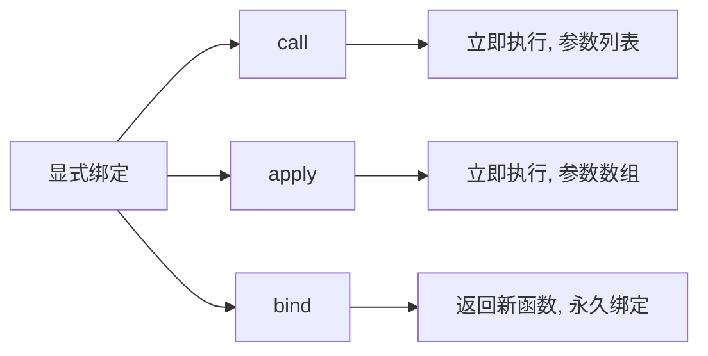

# 第38课：this 绑定规则

> [!NOTE]
> 学习目标：掌握 this 的四种绑定规则（默认/隐式/显式/new），理解箭头函数的 this 绑定，能够手写 call/apply/bind。

---

## 一、this 的四种绑定规则

### 1.1 默认绑定

独立函数调用时，`this` 指向全局对象（浏览器中为 `window`），严格模式下为 `undefined`：

```js
// 非严格模式
function foo() {
  console.log(this) // window
}
foo()

// 严格模式
'use strict'
function bar() {
  console.log(this) // undefined
}
bar()
```

```js
// 函数嵌套调用
function foo() {
  function bar() {
    console.log(this) // window（非严格模式）
  }
  bar()
}
foo()
```

### 1.2 隐式绑定

通过对象调用方法时，`this` 指向该对象：

```js
const obj = {
  name: 'obj',
  foo() {
    console.log(this.name)
  }
}

obj.foo() // "obj" —— this 指向 obj
```

**注意**：函数引用赋值会导致丢失 this：

```js
const obj = {
  name: 'obj',
  foo() {
    console.log(this.name)
  }
}

const fn = obj.foo
fn() // undefined（或 window.name）—— 默认绑定，this 指向 window
```

### 1.3 new 绑定

通过 `new` 关键字调用构造函数的 this 指向新创建的实例对象：

```js
function Person(name) {
  console.log(this) // Person {}
  this.name = name
}

const p = new Person('why')
console.log(p.name) // "why"
```

**new 的执行过程**：
1. 在内存中创建一个新对象
2. 将新对象的 `__proto__` 指向构造函数的 `prototype`
3. 将 this 指向新对象
4. 执行构造函数内部代码（为对象添加属性）
5. 返回新对象

### 1.4 显式绑定

通过 `call`、`apply`、`bind` 手动指定 `this`：



```js
function foo(name, age) {
  console.log(this, name, age)
}

const obj = { name: 'obj' }

// call —— 参数逐个传入
foo.call(obj, 'why', 18)  // { name: 'obj' } "why" 18

// apply —— 参数以数组传入
foo.apply(obj, ['why', 18]) // { name: 'obj' } "why" 18

// bind —— 返回绑定了 this 的新函数
const bar = foo.bind(obj, 'why')
bar(18) // { name: 'obj' } "why" 18
```

---

## 二、内置函数的 this 绑定

```js
// setTimeout
setTimeout(function() {
  console.log(this) // window
}, 1000)

// DOM 事件监听
btn.addEventListener('click', function() {
  console.log(this) // 触发事件的元素 btn
})

// 数组高阶函数
const arr = [1, 2, 3]
arr.forEach(function(item) {
  console.log(this) // 第二个参数指定 this
}, obj)
```

---

## 三、绑定规则优先级

```
new 绑定 > 显式绑定 > 隐式绑定 > 默认绑定
```

```js
function foo() {
  console.log(this.name)
}

const obj1 = { name: 'obj1', foo }
const obj2 = { name: 'obj2', foo }

// 隐式 vs 显式：显式优先级更高
obj1.foo.call(obj2) // "obj2"

// new vs 显式：new 优先级更高
const bindFn = foo.bind(obj1)
const instance = new bindFn()
console.log(instance.name) // undefined（this 指向新实例，不是 obj1）
```

---

## 四、this 绑定之外的情况

### 4.1 忽略显式绑定

```js
foo.call(null, args)   // this 指向 window（非严格模式）
foo.apply(undefined)    // this 指向 window（非严格模式）
```

### 4.2 间接引用

```js
const obj1 = { foo() { console.log(this) } }
const obj2 = {}

obj2.foo = obj1.foo
obj2.foo() // obj2（隐式绑定）

;(obj2.foo = obj1.foo)()
// window（赋值表达式返回函数引用，独立调用，默认绑定）
```

---

## 五、箭头函数的 this

### 5.1 箭头函数不绑定 this

箭头函数**没有自己的 this**，它会捕获**定义时**所在上下文的 `this`：

```js
const obj = {
  name: 'obj',
  foo() {
    const bar = () => {
      console.log(this.name)
    }
    bar()
  }
}

obj.foo() // "obj" —— 箭头函数 this 继承自 foo 的 this
```

### 5.2 箭头函数的其他特性

- 没有 `arguments`
- 不能用作构造函数（不能用 `new`）
- 没有 `prototype`
- 不能使用 `call/apply/bind` 改变 this（绑定无效）

```js
// 没有 arguments
const foo = () => {
  console.log(arguments) // 报错，会沿作用域链查找
}

// 不能 new
const Bar = () => {}
new Bar() // TypeError: Bar is not a constructor
```

### 5.3 应用场景

```js
// 定时器中保留 this
const obj = {
  name: 'obj',
  foo() {
    setTimeout(() => {
      console.log(this.name) // "obj" —— 箭头函数捕获 foo 的 this
    }, 1000)
  }
}
obj.foo()
```

---

## 六、手写 call/apply/bind

### 6.1 手写 call

```js
Function.prototype.hycall = function(thisArg, ...args) {
  // 处理 thisArg
  thisArg = thisArg ? Object(thisArg) : window

  // 将当前函数作为对象的方法
  thisArg.fn = this

  // 执行
  const result = thisArg.fn(...args)

  // 删除临时属性
  delete thisArg.fn

  return result
}

// 测试
function foo(name) {
  console.log(this, name)
  return 'done'
}
console.log(foo.hycall('obj', 'why'))
```

### 6.2 手写 apply

```js
Function.prototype.hyapply = function(thisArg, args) {
  // 复用 call 实现
  return this.hycall(thisArg, ...args)
}
```

### 6.3 手写 bind

```js
Function.prototype.hybind = function(thisArg, ...argArray) {
  // 保存当前函数
  const fn = this

  return function(...newArray) {
    // 合并参数
    const args = [...argArray, ...newArray]
    return fn.apply(thisArg, args)
  }
}

// 测试
function foo(name, age) {
  console.log(this, name, age)
  return 'done'
}
const bar = foo.hybind('obj', 'why')
console.log(bar(18))
```

### 6.4 统一封装

```js
Function.prototype.hyexec = function(thisArg, args) {
  thisArg = thisArg ? Object(thisArg) : window
  thisArg.fn = this
  args = args || []
  const result = thisArg.fn(...args)
  delete thisArg.fn
  return result
}

Function.prototype.hycall = function(thisArg, ...args) {
  return this.hyexec(thisArg, args)
}

Function.prototype.hyapply = function(thisArg, args) {
  return this.hyexec(thisArg, args)
}
```

---

## 自测问题

<details>
<summary>1. this 的四种绑定规则是什么？优先级如何？</summary>

四种规则：默认绑定（指向 window/undefined）、隐式绑定（指向调用对象）、显式绑定（call/apply/bind 指定）、new 绑定（指向新实例）。优先级：new > 显式 > 隐式 > 默认。
</details>

<details>
<summary>2. 箭头函数的 this 如何确定？能否通过 call/apply/bind 改变？</summary>

箭头函数不绑定 this，它的 this 在定义时从外层作用域捕获。一旦确定，不能通过 call/apply/bind 改变。箭头函数也没有 arguments，不能作为构造函数。
</details>

<details>
<summary>3. 手写一个 call 函数。</summary>

```js
Function.prototype.hycall = function(thisArg, ...args) {
  thisArg = thisArg ? Object(thisArg) : window
  thisArg.fn = this
  const result = thisArg.fn(...args)
  delete thisArg.fn
  return result
}
```
</details>

<details>
<summary>4. 下面代码输出什么？</summary>

```js
const obj = {
  name: 'obj',
  foo() {
    const bar = () => console.log(this.name)
    bar()
  }
}
const fn = obj.foo
fn()
```

输出：`undefined`（或全局对象的 name）。因为 `fn()` 是独立函数调用，foo 的 this 指向 window，箭头函数 bar 的 this 继承 foo 的 this。
</details>

---

> 下一课：[[0039-es6-features]] —— ES6+ 新特性