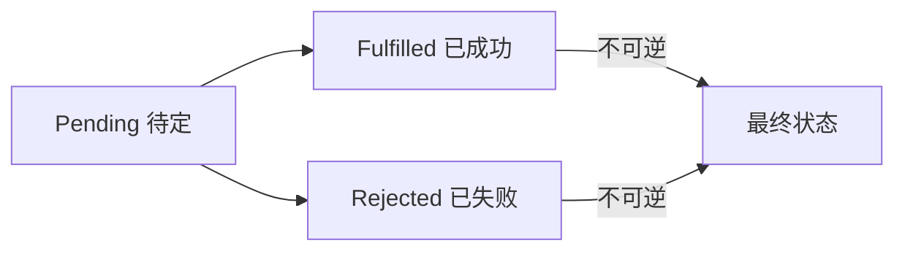
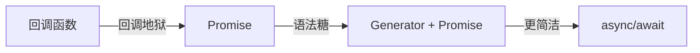
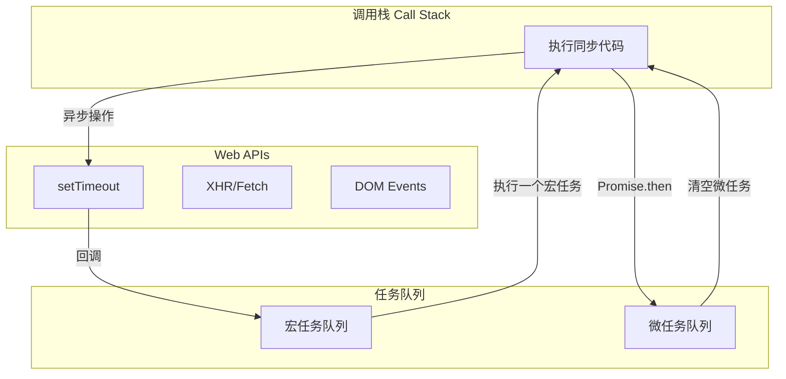

# 第40课：异步编程

> [!NOTE]
> 学习目标：理解 JavaScript 异步编程的演进过程，掌握 Promise 核心用法和手写实现，理解 async/await 语法糖，掌握迭代器和生成器，理解事件循环机制。

---

## 一、迭代器 Iterator

### 1.1 什么是迭代器

迭代器是一个对象，实现了 `next()` 方法，返回 `{ done: Boolean, value: any }`：

```js
// 创建迭代器
function createArrayIterator(arr) {
  let index = 0
  return {
    next() {
      if (index < arr.length) {
        return { done: false, value: arr[index++] }
      } else {
        return { done: true, value: undefined }
      }
    }
  }
}

const iterator = createArrayIterator([1, 2, 3])
console.log(iterator.next()) // { done: false, value: 1 }
console.log(iterator.next()) // { done: false, value: 2 }
console.log(iterator.next()) // { done: false, value: 3 }
console.log(iterator.next()) // { done: true, value: undefined }
```

### 1.2 可迭代对象

具有 `[Symbol.iterator]` 方法的对象：

```js
const iterableObj = {
  values: [1, 2, 3],
  [Symbol.iterator]() {
    let index = 0
    return {
      next: () => {
        if (index < this.values.length) {
          return { done: false, value: this.values[index++] }
        } else {
          return { done: true, value: undefined }
        }
      }
    }
  }
}

// 可迭代对象可以使用 for...of
for (const item of iterableObj) {
  console.log(item) // 1, 2, 3
}

// 也可以使用展开运算符
console.log([...iterableObj]) // [1, 2, 3]
```

### 1.3 原生可迭代对象

JavaScript 中以下类型是原生可迭代的：

| 类型 | 说明 |
|------|------|
| Array | 数组 |
| String | 字符串 |
| Set | Set 集合 |
| Map | Map 映射 |
| arguments | 函数参数列表 |
| NodeList | DOM 节点列表 |

```js
// 展开运算符依赖迭代器
console.log([...'Hello']) // ['H', 'e', 'l', 'l', 'o']
console.log([...new Set([1, 2, 3])]) // [1, 2, 3]
console.log([...new Map([['a', 1]])]) // [['a', 1]]
```

---

## 二、生成器 Generator

### 2.1 生成器函数

```js
function* createArrayIterator(arr) {
  for (const item of arr) {
    yield item
  }
}

const generator = createArrayIterator([1, 2, 3])
console.log(generator.next()) // { done: false, value: 1 }
console.log(generator.next()) // { done: false, value: 2 }
console.log(generator.next()) // { done: false, value: 3 }
console.log(generator.next()) // { done: true, value: undefined }
```

### 2.2 yield* 语法

`yield*` 用于**委托**给另一个可迭代对象：

```js
function* createRangeIterator(start, end) {
  yield* Array.from({ length: end - start + 1 }, (_, i) => start + i)
}

// 或者更直观
function* createRangeIterator(start, end) {
  let index = start
  while (index <= end) {
    yield index++
  }
}

const range = createRangeIterator(3, 6)
console.log([...range]) // [3, 4, 5, 6]
```

### 2.3 生成器的参数和返回值

```js
function* foo() {
  const value1 = yield 1
  console.log('value1:', value1) // 第二次 next 传入

  const value2 = yield 2
  console.log('value2:', value2) // 第三次 next 传入

  return 'done'
}

const gen = foo()
console.log(gen.next())         // { done: false, value: 1 }
console.log(gen.next('aaa'))    // value1: aaa -> { done: false, value: 2 }
console.log(gen.next('bbb'))    // value2: bbb -> { done: true, value: 'done' }
```

### 2.4 生成器替代迭代器

```js
class Classroom {
  constructor(students) {
    this.students = students
  }

  *[Symbol.iterator]() {
    yield* this.students
  }
}

const cls = new Classroom(['张三', '李四', '王五'])
for (const stu of cls) {
  console.log(stu)
}
```

---

## 三、Promise

### 3.1 为什么需要 Promise

解决**回调地狱**问题：

```js
// 回调地狱
request('/api/user', function(err, user) {
  request('/api/orders', function(err, orders) {
    request('/api/products', function(err, products) {
      // 无限嵌套...
    })
  })
})

// Promise 解决
request('/api/user')
  .then(user => request('/api/orders'))
  .then(orders => request('/api/products'))
  .then(products => {
    console.log(products)
  })
  .catch(err => console.error(err))
```

### 3.2 基本用法

```js
const promise = new Promise((resolve, reject) => {
  // 异步操作
  setTimeout(() => {
    const success = true
    if (success) {
      resolve('成功的数据')
    } else {
      reject('失败信息')
    }
  }, 1000)
})

promise
  .then(data => console.log(data))
  .catch(err => console.error(err))
  .finally(() => console.log('无论如何都执行'))
```

### 3.3 三种状态



```js
// 状态一旦改变就不可逆
const p = new Promise((resolve, reject) => {
  resolve('成功')
  reject('失败') // 无效，状态已变为 fulfilled
})
```

### 3.4 Promise 的方法

| 方法 | 类型 | 说明 |
|------|------|------|
| `then(onFulfilled, onRejected)` | 实例 | 处理成功/失败 |
| `catch(onRejected)` | 实例 | 处理失败 |
| `finally(onFinally)` | 实例 | 无论成功失败都执行（ES9） |
| `Promise.resolve(value)` | 静态 | 创建成功 Promise |
| `Promise.reject(reason)` | 静态 | 创建失败 Promise |
| `Promise.all(iterable)` | 静态 | 全部成功才成功 |
| `Promise.allSettled(iterable)` | 静态 | 全部有结果即返回 |
| `Promise.race(iterable)` | 静态 | 第一个有结果即返回 |
| `Promise.any(iterable)` | 静态 | 第一个成功即返回 |

### 3.5 Promise.all / allSettled / race / any

```js
const p1 = new Promise(resolve => setTimeout(() => resolve('A'), 1000))
const p2 = new Promise(resolve => setTimeout(() => resolve('B'), 2000))
const p3 = new Promise((_, reject) => setTimeout(() => reject('C error'), 1500))

// Promise.all —— 全部成功
Promise.all([p1, p2])
  .then(results => console.log(results)) // ['A', 'B']
  .catch(err => console.error(err))

// 如果有一个 reject，整体 reject
Promise.all([p1, p2, p3])
  .catch(err => console.error(err)) // "C error"

// Promise.allSettled —— 等所有 Promise 有结果
Promise.allSettled([p1, p2, p3])
  .then(results => {
    // [
    //   { status: 'fulfilled', value: 'A' },
    //   { status: 'fulfilled', value: 'B' },
    //   { status: 'rejected', reason: 'C error' }
    // ]
  })

// Promise.race —— 第一个有结果（不管成功还是失败）
Promise.race([p1, p2, p3])
  .then(value => console.log('第一个成功:', value))
  .catch(err => console.log('第一个失败:', err))

// Promise.any —— 等第一个成功
Promise.any([p3, p1, p2])
  .then(value => console.log('第一个成功:', value))
// 如果全部失败，抛出 AggregateError
```

### 3.6 then 的链式调用

```js
// then 方法返回一个新的 Promise
new Promise(resolve => resolve(1))
  .then(res => {
    console.log(res) // 1
    return res * 2
  })
  .then(res => {
    console.log(res) // 2
    return res * 2
  })
  .then(res => {
    console.log(res) // 4
  })
```

---

## 四、async/await

async/await 是生成器 + Promise 的语法糖：

### 4.1 async 函数

```js
// async 函数总是返回 Promise
async function foo() {
  return 'Hello'
}
foo().then(value => console.log(value)) // "Hello"

// 返回值规则
async function bar() {
  // 返回普通值 -> Promise.resolve(值)
  // 返回 Promise -> Promise 本身
  // 返回 thenable -> 包装为 Promise
  throw new Error('error') // 返回 rejected Promise
}
```

### 4.2 await 表达式

```js
function requestData(url) {
  return new Promise(resolve => {
    setTimeout(() => resolve(`数据: ${url}`), 1000)
  })
}

async function getData() {
  console.log('开始请求')
  const res1 = await requestData('/user')
  console.log(res1)

  const res2 = await requestData('/orders')
  console.log(res2)

  const res3 = await requestData('/products')
  console.log(res3)

  return '所有数据获取完成'
}

getData().then(msg => console.log(msg))
```

### 4.3 错误处理

```js
async function getData() {
  try {
    const res = await Promise.reject('出错了')
    console.log(res) // 不会执行
  } catch (err) {
    console.error('捕获:', err)
  } finally {
    console.log('无论如何执行')
  }
}
```

---

## 五、异步处理的演进



```js
// 1. 回调地狱
request('/api/user', (err, user) => {
  request(`/api/orders/${user.id}`, (err, orders) => {
    // ...
  })
})

// 2. Promise 链式
request('/api/user')
  .then(user => request(`/api/orders/${user.id}`))
  .then(orders => console.log(orders))
  .catch(err => console.error(err))

// 3. Generator + Promise（需要自动执行器）
function* getData() {
  const user = yield request('/api/user')
  const orders = yield request(`/api/orders/${user.id}`)
  return orders
}
// 需要自动执行函数来驱动 generator

// 4. async/await（推荐）
async function getData() {
  const user = await request('/api/user')
  const orders = await request(`/api/orders/${user.id}`)
  return orders
}
```

---

## 六、事件循环 Event Loop

### 6.1 进程和线程

- **进程**：资源分配的最小单位
- **线程**：CPU 调度的最小单位
- JavaScript 是**单线程**语言（一个进程中只有一个 JS 线程）

### 6.2 浏览器事件循环



### 6.3 宏任务和微任务

| 类型 | 常见任务 |
|------|---------|
| **宏任务** (MacroTask) | `setTimeout`、`setInterval`、`I/O`、UI 渲染、`MessageChannel` |
| **微任务** (MicroTask) | `Promise.then/catch/finally`、`MutationObserver`、`queueMicrotask` |

**执行规则**：
1. 执行一个宏任务
2. 执行过程中产生的微任务加入微任务队列
3. 宏任务执行完毕，**清空微任务队列**
4. 执行下一个宏任务
5. 浏览器可能进行 UI 渲染

### 6.4 经典面试题

```js
console.log(1)

setTimeout(() => {
  console.log(2)
}, 0)

new Promise(resolve => {
  console.log(3)
  resolve()
}).then(() => {
  console.log(4)
})

console.log(5)

// 输出顺序：1, 3, 5, 4, 2
// 解释：
// 1: 同步代码
// 3: Promise 构造器是同步执行的
// 5: 同步代码
// 4: 微任务（Promise.then）
// 2: 宏任务（setTimeout）
```

```js
// 进阶
async function async1() {
  console.log('async1 start')
  await async2()
  console.log('async1 end')
}

async function async2() {
  console.log('async2')
}

console.log('script start')

setTimeout(() => console.log('setTimeout'), 0)

async1()

new Promise(resolve => {
  console.log('promise1')
  resolve()
}).then(() => console.log('promise2'))

console.log('script end')

// 输出：script start, async1 start, async2, promise1, script end,
//        async1 end, promise2, setTimeout
```

---

## 七、手写 Promise 核心（思路）

```js
const PROMISE_STATUS_PENDING = 'pending'
const PROMISE_STATUS_FULFILLED = 'fulfilled'
const PROMISE_STATUS_REJECTED = 'rejected'

class HYPromise {
  constructor(executor) {
    this.status = PROMISE_STATUS_PENDING
    this.value = undefined
    this.reason = undefined
    this.onFulfilledFns = []
    this.onRejectedFns = []

    const resolve = (value) => {
      if (this.status === PROMISE_STATUS_PENDING) {
        this.status = PROMISE_STATUS_FULFILLED
        this.value = value
        this.onFulfilledFns.forEach(fn => fn())
      }
    }

    const reject = (reason) => {
      if (this.status === PROMISE_STATUS_PENDING) {
        this.status = PROMISE_STATUS_REJECTED
        this.reason = reason
        this.onRejectedFns.forEach(fn => fn())
      }
    }

    try {
      executor(resolve, reject)
    } catch (err) {
      reject(err)
    }
  }

  then(onFulfilled, onRejected) {
    // 链式调用返回新 Promise
    return new HYPromise((resolve, reject) => {
      // ...完整实现参考 day42 手写 Promise 系列代码
    })
  }

  catch(onRejected) {
    return this.then(undefined, onRejected)
  }

  finally(onFinally) {
    return this.then(
      value => { onFinally(); return value },
      reason => { onFinally(); throw reason }
    )
  }

  static resolve(value) {
    return new HYPromise(resolve => resolve(value))
  }

  static reject(reason) {
    return new HYPromise((_, reject) => reject(reason))
  }

  static all(promises) {
    return new HYPromise((resolve, reject) => {
      const results = []
      let count = 0
      promises.forEach((p, i) => {
        p.then(value => {
          results[i] = value
          count++
          if (count === promises.length) resolve(results)
        }).catch(reject)
      })
    })
  }

  static allSettled(promises) {
    // 参考 day42 手写代码
  }

  static race(promises) {
    // 参考 day42 手写代码
  }
}
```

---

## 自测问题

<details>
<summary>1. 迭代器和可迭代对象的区别是什么？</summary>

迭代器是实现了 `next()` 方法的对象。可迭代对象是实现了 `[Symbol.iterator]()` 方法的对象，该方法返回一个迭代器。可迭代对象可以使用 `for...of`、展开运算符等。
</details>

<details>
<summary>2. Promise 有哪些实例方法和类方法？</summary>

实例方法：`then`、`catch`、`finally`。类方法：`Promise.resolve`、`Promise.reject`、`Promise.all`、`Promise.allSettled`、`Promise.race`、`Promise.any`。
</details>

<details>
<summary>3. async/await 相对于 Promise 有哪些优势？</summary>

代码更接近同步风格，更易读易维护；不需要手动编写 `.then().catch()` 链；使用 `try/catch` 统一错误处理；避免了回调地狱。
</details>

<details>
<summary>4. 微任务和宏任务的执行顺序是怎样的？</summary>

每执行一个宏任务，清空所有微任务，然后执行下一个宏任务（可能触发 UI 渲染）。微任务包括 Promise.then/catch/finally、queueMicrotask。宏任务包括 setTimeout、setInterval、I/O。
</details>

---

> 下一课：[[0041-js-module]] —— 模块化