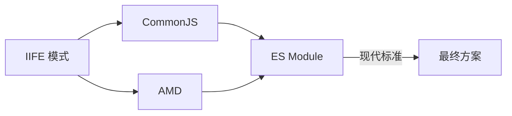

# 第41课：模块化

> [!NOTE]
> 学习目标：理解 JavaScript 模块化的演进历程，掌握 CommonJS 和 ES Module 的语法和原理，了解 AMD 规范。

---

## 一、为什么需要模块化

在没有模块化的时代，代码面临以下问题：

- **全局变量污染**：变量容易冲突
- **依赖关系混乱**：难以管理脚本加载顺序
- **代码复用困难**：难以抽离和共享功能

```html
<!-- 传统方式：依赖手动管理顺序 -->
<script src="jquery.js"></script>
<script src="utils.js"></script>
<script src="app.js"></script>
<!-- 必须按顺序加载，否则报错 -->
```

---

## 二、模块化规范演进



| 规范 | 环境 | 加载方式 | 特点 |
|------|------|---------|------|
| IIFE | 浏览器 | 同步 | 利用函数作用域隔离 |
| CommonJS | Node.js | 同步加载 | require / module.exports |
| AMD | 浏览器 | 异步加载 | define / require |
| ES Module | 浏览器+Node | 异步（静态分析） | import / export |

---

## 三、CommonJS

### 3.1 导出

```js
// utils.js

// 方式一：module.exports
module.exports = {
  name: 'utils',
  add(a, b) {
    return a + b
  }
}

// 方式二：exports 快捷方式
exports.name = 'utils'
exports.add = function(a, b) {
  return a + b
}

// exports 是 module.exports 的引用
// 不能直接 exports = {} 这样会切断引用
```

### 3.2 导入

```js
// app.js
const utils = require('./utils.js')
console.log(utils.name)
console.log(utils.add(1, 2))
```

### 3.3 加载机制

- CommonJS **同步加载**模块
- 模块**有缓存**，多次 `require` 同一模块只执行一次
- 模块加载顺序：**深度优先**（先加载最深层依赖）

```js
// module 被缓存
const m1 = require('./module')
const m2 = require('./module')
console.log(m1 === m2) // true —— 同一个引用
```

---

## 四、AMD（了解）

AMD（Asynchronous Module Definition）主要用在浏览器端，**异步加载**模块：

```js
// 定义模块
define('utils', ['jquery'], function($) {
  return {
    getData(url) {
      return $.get(url)
    }
  }
})

// 加载模块
require(['utils'], function(utils) {
  utils.getData('/api/data')
})
```

> [!NOTE]
> AMD 的代表实现是 **RequireJS**。现代开发中已经被 ES Module 替代，只需了解即可。

---

## 五、ES Module

### 5.1 导出

```js
// ----- 命名导出 -----

// 方式一：声明时导出
export const name = 'why'
export function foo() {
  console.log('foo')
}
export class Person {}

// 方式二：统一导出
const name = 'why'
function foo() {}
class Person {}
export { name, foo, Person }

// 方式三：别名
export { name as myName, foo as myFoo }

// ----- 默认导出 -----
export default function() {
  console.log('default')
}

// 混用
export default class Person {}
export { name, age }
```

### 5.2 导入

```js
// 命名导入
import { name, foo } from './utils.js'
import { name as myName } from './utils.js'

// 默认导入
import utils from './utils.js'

// 混合导入
import utils, { name, foo } from './utils.js'

// 整体导入（命名空间导入）
import * as utils from './utils.js'
utils.name
utils.foo()

// 动态导入（返回 Promise）
const module = await import('./utils.js')
console.log(module.name)
```

### 5.3 导入导出的注意事项

```js
// 1. export 导出的是引用（与 CommonJS 不同）
export let count = 0
export function increment() {
  count++ // 导入方会同步更新
}

// 2. import 不允许在条件中（静态分析）
if (condition) {
  import('./utils.js') // 语法错误，但可以用动态 import()
}

// 3. 可以在一个模块中重新导出
export { name } from './utils.js' // 中转导出
export * from './utils.js'
```

### 5.4 静态分析与 Tree Shaking

ES Module 的 `import`/`export` 是**静态**的，在编译时就能确定模块的依赖关系。这使得：

- **Tree Shaking**：打包时移除未使用的导出
- **更快的查找**：编译时确定模块结构
- **循环依赖检测**：静态分析时可以发现循环引用

```js
// 只有 foo 被使用
import { foo } from './utils.js'
// bar 会被 Tree Shaking 移除
```

---

## 六、CommonJS vs ES Module

| 特性 | CommonJS | ES Module |
|------|----------|-----------|
| 语法 | `require/module.exports` | `import/export` |
| 加载方式 | 动态（运行时） | 静态（编译时） |
| 输出 | 值的拷贝 | 值的引用 |
| 异步 | 同步 | 异步 |
| 环境 | Node.js | 浏览器 + Node.js |
| Tree Shaking | 不支持 | 支持 |
| 循环依赖 | 部分支持 | 通过 TDZ 避免问题 |

```js
// CommonJS —— 导出的是值的拷贝
// utils.js
let count = 0
module.exports = { count, increment: () => count++ }

// app.js
const { count, increment } = require('./utils')
console.log(count) // 0
increment()
console.log(count) // 0（还是 0！）

// ES Module —— 导出的是值的引用
// utils.js
export let count = 0
export function increment() { count++ }

// app.js
import { count, increment } from './utils'
console.log(count) // 0
increment()
console.log(count) // 1（引用同步更新）
```

---

## 七、在浏览器中使用 ES Module

```html
<!-- 通过 type="module" 使用 -->
<script type="module" src="main.js"></script>
<!-- 或内联 -->
<script type="module">
  import { foo } from './utils.js'
  foo()
</script>
```

**ES Module 的特性**：
- 自动启用严格模式
- 有独立的模块作用域
- `defer` 行为（延迟执行，按序执行）
- 支持跨域（需要服务器支持 CORS）

---

## 自测问题

<details>
<summary>1. CommonJS 和 ES Module 的主要区别是什么？</summary>

CommonJS 运行时加载、值的拷贝、同步；ES Module 编译时静态分析、值的引用、异步。ES Module 支持 Tree Shaking，这是其重要优势。
</details>

<details>
<summary>2. ES Module 的 `import` 为什么被称为"静态"的？</summary>

因为 `import` 语句必须在模块顶层，不能写在条件语句或函数中。这使得 JavaScript 引擎在编译阶段就能分析模块依赖关系，进行 Tree Shaking 和优化。
</details>

<details>
<summary>3. 什么是 Tree Shaking？它依赖什么基础？</summary>

Tree Shaking 是移除 JavaScript 上下文中未引用代码的优化技术。它依赖 ES Module 的静态分析能力，因为只有在编译时确定哪些导出被使用，才能安全地移除未使用的导出。
</details>

---

> 下一课：[[0042-js-proxy-reflect]] —— Proxy 和 Reflect