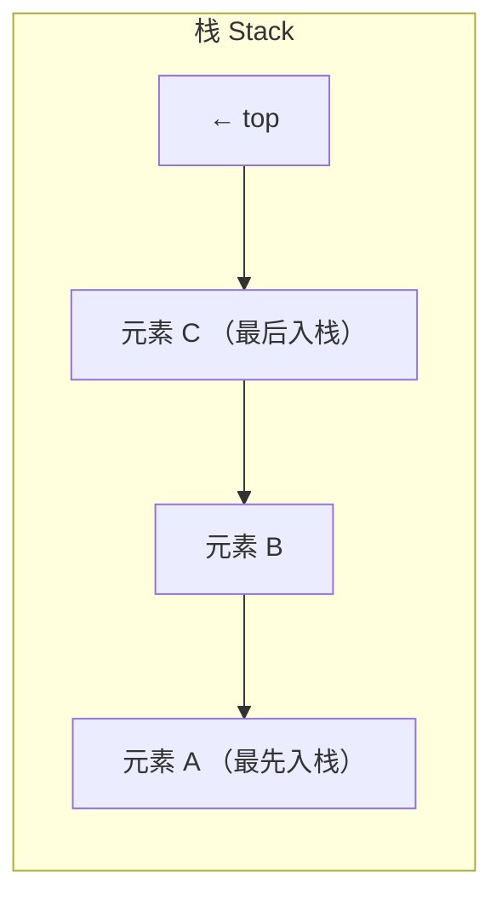
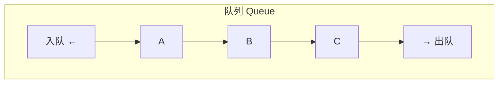
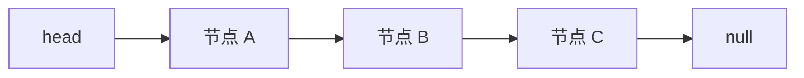
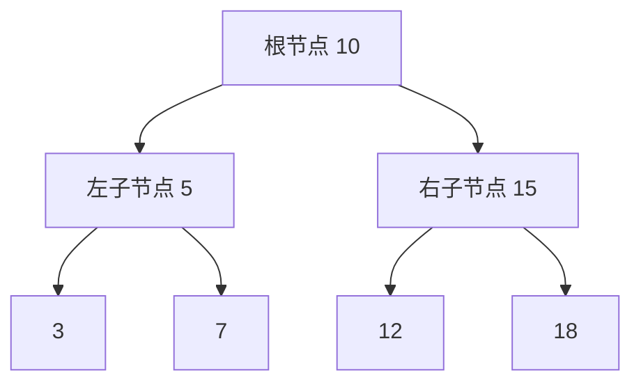

# 第43课：数据结构基础

> [!NOTE]
> 学习目标：掌握栈/队列/链表/二叉树四种基本数据结构的 JavaScript 实现，理解各自的特点和适用场景。

---

## 一、栈（Stack）

### 1.1 概念

栈是一种**后进先出（LIFO, Last In First Out）**的数据结构。类似一摞盘子——只能从顶部取放。



### 1.2 实现

```js
class Stack {
  constructor() {
    this.items = []
  }

  // 入栈
  push(element) {
    this.items.push(element)
  }

  // 出栈
  pop() {
    return this.items.pop()
  }

  // 查看栈顶
  peek() {
    return this.items[this.items.length - 1]
  }

  // 栈是否为空
  isEmpty() {
    return this.items.length === 0
  }

  // 栈的大小
  size() {
    return this.items.length
  }

  // 清空栈
  clear() {
    this.items = []
  }
}

// 使用
const stack = new Stack()
stack.push(10)
stack.push(20)
stack.push(30)
console.log(stack.peek()) // 30
console.log(stack.pop())  // 30
console.log(stack.size()) // 2
```

### 1.3 应用：十进制转二进制

```js
function decimalToBinary(decimal) {
  const stack = new Stack()

  while (decimal > 0) {
    stack.push(decimal % 2)
    decimal = Math.floor(decimal / 2)
  }

  let binary = ''
  while (!stack.isEmpty()) {
    binary += stack.pop()
  }

  return binary || '0'
}

console.log(decimalToBinary(10)) // "1010"
console.log(decimalToBinary(255)) // "11111111"
```

---

## 二、队列（Queue）

### 2.1 概念

队列是一种**先进先出（FIFO, First In First Out）**的数据结构。类似排队——先到先得。



### 2.2 实现

```js
class Queue {
  constructor() {
    this.items = []
  }

  // 入队（尾部添加）
  enqueue(element) {
    this.items.push(element)
  }

  // 出队（头部删除）
  dequeue() {
    return this.items.shift()
  }

  // 查看队头
  front() {
    return this.items[0]
  }

  // 是否为空
  isEmpty() {
    return this.items.length === 0
  }

  // 大小
  size() {
    return this.items.length
  }

  // 清空
  clear() {
    this.items = []
  }
}

// 使用
const queue = new Queue()
queue.enqueue('A')
queue.enqueue('B')
queue.enqueue('C')
console.log(queue.dequeue()) // "A"
console.log(queue.front())   // "B"
console.log(queue.size())    // 2
```

### 2.3 应用：击鼓传花

```js
function hotPotato(names, num) {
  const queue = new Queue()
  names.forEach(name => queue.enqueue(name))

  while (queue.size() > 1) {
    // 传递 num 次
    for (let i = 0; i < num; i++) {
      queue.enqueue(queue.dequeue())
    }
    // 淘汰拿到花的人
    const eliminated = queue.dequeue()
    console.log(`${eliminated} 被淘汰`)
  }

  return queue.dequeue() // 最终胜者
}

const winner = hotPotato(['张三', '李四', '王五', '赵六', '钱七'], 3)
console.log(`胜者: ${winner}`)
```

---

## 三、链表（LinkedList）

### 3.1 概念

链表由节点组成，每个节点包含**数据**和指向下一个节点的**指针**。



### 3.2 实现

```js
class Node {
  constructor(data) {
    this.data = data
    this.next = null
  }
}

class LinkedList {
  constructor() {
    this.head = null
    this.length = 0
  }

  // 追加
  append(data) {
    const newNode = new Node(data)
    if (this.head === null) {
      this.head = newNode
    } else {
      let current = this.head
      while (current.next) {
        current = current.next
      }
      current.next = newNode
    }
    this.length++
  }

  // 插入
  insert(position, data) {
    if (position < 0 || position > this.length) return false

    const newNode = new Node(data)
    if (position === 0) {
      newNode.next = this.head
      this.head = newNode
    } else {
      let current = this.head
      let previous = null
      let index = 0
      while (index < position) {
        previous = current
        current = current.next
        index++
      }
      newNode.next = current
      previous.next = newNode
    }
    this.length++
    return true
  }

  // 删除指定位置
  removeAt(position) {
    if (position < 0 || position >= this.length) return null
    let current = this.head
    if (position === 0) {
      this.head = current.next
    } else {
      let previous = null
      let index = 0
      while (index < position) {
        previous = current
        current = current.next
        index++
      }
      previous.next = current.next
    }
    this.length--
    return current.data
  }

  // 查找元素位置
  indexOf(data) {
    let current = this.head
    let index = 0
    while (current) {
      if (current.data === data) return index
      current = current.next
      index++
    }
    return -1
  }

  // 删除指定元素
  remove(data) {
    const index = this.indexOf(data)
    return this.removeAt(index)
  }

  // 是否为空
  isEmpty() {
    return this.length === 0
  }

  // 大小
  size() {
    return this.length
  }

  // 转字符串
  toString() {
    let current = this.head
    let result = ''
    while (current) {
      result += current.data + ' -> '
      current = current.next
    }
    return result + 'null'
  }
}

// 使用
const list = new LinkedList()
list.append('A')
list.append('B')
list.append('C')
console.log(list.toString()) // "A -> B -> C -> null"
list.insert(1, 'X')
console.log(list.toString()) // "A -> X -> B -> C -> null"
list.removeAt(2)
console.log(list.toString()) // "A -> X -> C -> null"
console.log(list.indexOf('X')) // 1
```

### 3.3 链表和数组的对比

| 操作 | 数组 | 链表 |
|------|------|------|
| 随机访问 | O(1) | O(n) |
| 头部插入/删除 | O(n) | O(1) |
| 尾部插入/删除 | O(1)（摊还） | O(n) |
| 内存 | 连续空间 | 分散空间（无碎片） |
| 扩容 | 需要 realloc | 不需要 |

---

## 四、树（Tree）

### 4.1 概念

树是一种**分层**数据结构：

- **根节点（Root）**：树的顶部节点
- **叶子节点（Leaf）**：没有子节点的节点
- **子树（Subtree）**：树中任何节点及其后代
- **深度/高度**：从根到叶子的层数

### 4.2 二叉树

每个节点**最多有两个子节点**（左子节点和右子节点）：



### 4.3 二叉搜索树（BST）

左子节点 < 父节点 < 右子节点：

```js
class BSTNode {
  constructor(data) {
    this.data = data
    this.left = null
    this.right = null
  }
}

class BSTree {
  constructor() {
    this.root = null
  }

  // 插入
  insert(data) {
    const newNode = new BSTNode(data)
    if (this.root === null) {
      this.root = newNode
    } else {
      this._insertNode(this.root, newNode)
    }
  }

  _insertNode(node, newNode) {
    if (newNode.data < node.data) {
      if (node.left === null) {
        node.left = newNode
      } else {
        this._insertNode(node.left, newNode)
      }
    } else {
      if (node.right === null) {
        node.right = newNode
      } else {
        this._insertNode(node.right, newNode)
      }
    }
  }

  // 搜索
  search(data) {
    return this._searchNode(this.root, data)
  }

  _searchNode(node, data) {
    if (node === null) return false
    if (data === node.data) return true
    if (data < node.data) {
      return this._searchNode(node.left, data)
    } else {
      return this._searchNode(node.right, data)
    }
  }

  // 中序遍历（升序）
  inOrder(callback) {
    this._inOrder(this.root, callback)
  }

  _inOrder(node, callback) {
    if (node) {
      this._inOrder(node.left, callback)
      callback(node.data)
      this._inOrder(node.right, callback)
    }
  }

  // 先序遍历
  preOrder(callback) {
    this._preOrder(this.root, callback)
  }

  _preOrder(node, callback) {
    if (node) {
      callback(node.data)
      this._preOrder(node.left, callback)
      this._preOrder(node.right, callback)
    }
  }

  // 后序遍历
  postOrder(callback) {
    this._postOrder(this.root, callback)
  }

  _postOrder(node, callback) {
    if (node) {
      this._postOrder(node.left, callback)
      this._postOrder(node.right, callback)
      callback(node.data)
    }
  }

  // 最小值
  min() {
    let current = this.root
    while (current && current.left) {
      current = current.left
    }
    return current?.data
  }

  // 最大值
  max() {
    let current = this.root
    while (current && current.right) {
      current = current.right
    }
    return current?.data
  }
}

// 使用
const bst = new BSTree()
bst.insert(10)
bst.insert(5)
bst.insert(15)
bst.insert(3)
bst.insert(7)
bst.insert(12)
bst.insert(18)

console.log(bst.search(7))  // true
console.log(bst.search(20)) // false
console.log(bst.min())      // 3
console.log(bst.max())      // 18

// 中序遍历
const result = []
bst.inOrder(data => result.push(data))
console.log(result) // [3, 5, 7, 10, 12, 15, 18]
```

---

## 五、常见算法复杂度

| 数据结构 | 查找 | 插入 | 删除 |
|---------|------|------|------|
| 数组 | O(n) | O(n) | O(n) |
| 栈 | O(n) | O(1) | O(1) |
| 队列 | O(n) | O(1) | O(1) |
| 链表 | O(n) | O(1)* | O(1)* |
| 二叉搜索树（平衡） | O(log n) | O(log n) | O(log n) |

> *链表在已知位置时插入/删除为 O(1)

---

## 自测问题

<details>
<summary>1. 栈和队列的区别是什么？</summary>

栈是后进先出（LIFO），只能在栈顶操作。队列是先进先出（FIFO），尾部入队、头部出队。
</details>

<details>
<summary>2. 链表相比数组有什么优缺点？</summary>

优点：头部插入/删除效率高（O(1)），内存使用灵活（不需连续空间）。缺点：不支持随机访问（需 O(n) 查找），占用更多内存（存储指针）。
</details>

<details>
<summary>3. 二叉搜索树的查找原理是什么？</summary>

从根节点开始，如果目标值小于当前节点值，则向左子树查找；如果大于当前节点值，则向右子树查找；直到找到或到达 null。由于每次排除一半的子树，平均时间复杂度为 O(log n)。
</details>

<details>
<summary>4. 树的三种遍历方式（先序、中序、后序）有什么区别？</summary>

- 先序：根 -> 左 -> 右（用于复制树、打印树结构）
- 中序：左 -> 根 -> 右（用于 BST 升序输出）
- 后序：左 -> 右 -> 根（用于删除树、计算表达式）
</details>

---

> 下一课：[[0044-js-error-handling]] —— 错误处理