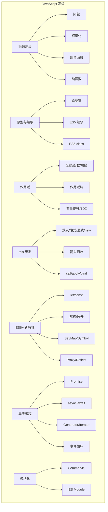

# 第46课：JS 高级总结

> [!NOTE]
> 学习目标：系统回顾 JavaScript 高级语法的核心知识点，通过面试题检验掌握程度，查漏补缺。

---

## 一、知识体系总览



---

## 二、核心概念速查

### 2.1 闭包

**定义**：函数捕获外部作用域的变量，即使外部函数执行完毕，内部函数仍可访问这些变量。

**应用**：防抖节流、柯里化、私有变量、状态保持。

**内存管理**：不再需要时置 `null` 释放。

> 详见 [[0034-js-advanced-functions]]

### 2.2 原型链

**核心公式**：
- `实例.__proto__ === 构造函数.prototype`
- `构造函数.prototype.constructor === 构造函数`
- `Object.prototype.__proto__ === null`

**最佳实践**：`Object.create()` 用于原型式继承。

> 详见 [[0035-js-prototype]]

### 2.3 this 绑定

**优先级**：`new 绑定 > 显式绑定 > 隐式绑定 > 默认绑定`

**箭头函数**：不绑定 this，捕获定义时的 this。

> 详见 [[0038-js-this]]

### 2.4 事件循环

**规则**：每执行一个宏任务 -> 清空微任务队列 -> 执行下一个宏任务。

**微任务**：Promise.then/catch/finally、queueMicrotask、MutationObserver

**宏任务**：setTimeout、setInterval、I/O、UI 渲染

> 详见 [[0040-js-async]]

---

## 三、面试题集锦

### 3.1 作用域与闭包

**题目一**：

```js
for (var i = 0; i < 5; i++) {
  setTimeout(() => console.log(i), 100)
}
// 输出什么？如何改为输出 0, 1, 2, 3, 4？
```

<details>
<summary>点击查看答案</summary>

输出：5, 5, 5, 5, 5。因为 var 没有块级作用域，循环结束后 i 为 5，五个定时器都引用同一个 i。

改为输出 0-4 的三种方法：
1. 将 `var` 改为 `let`（块级作用域）
2. 使用 IIFE 创建独立作用域：`for (var i = 0; i < 5; i++) { (function(j) { setTimeout(() => console.log(j), 100) })(i) }`
3. 使用 setTimeout 的第三个参数：`for (var i = 0; i < 5; i++) { setTimeout(console.log, 100, i) }`
</details>

---

**题目二**：

```js
function test() {
  var message = 'Hello'
  function inner() {
    console.log(message)
  }
  return inner
}

const fn = test()
fn() // 输出什么？
```

<details>
<summary>点击查看答案</summary>

输出 "Hello"。这是闭包的经典示例：inner 函数捕获了 test 作用域中的 message 变量，即使 test 执行完毕，message 仍然被保留在闭包中。
</details>

---

### 3.2 this 指向

**题目三**：

```js
const obj = {
  name: 'obj',
  foo() {
    console.log(this.name)
  },
  bar: () => {
    console.log(this.name)
  }
}

obj.foo() // ?
obj.bar() // ?
const fn1 = obj.foo
fn1()     // ?
```

<details>
<summary>点击查看答案</summary>

- `obj.foo()`：输出 "obj"（隐式绑定，this 指向 obj）
- `obj.bar()`：输出 undefined（箭头函数不绑定 this，捕获全局 this，浏览器中为 window.name）
- `fn1()`：输出 undefined（独立调用，默认绑定，this 指向 window）
</details>

---

**题目四**：

```js
const name = 'window'
function Person(name) {
  this.name = name
  this.foo = function() {
    console.log(this.name)
  }
  return () => {
    console.log(this.name)
  }
}

const p = new Person('why')
p.foo() // ?
p()     // ?
```

<details>
<summary>点击查看答案</summary>

- `p.foo()`：输出 "why"（隐式绑定，this 指向 p 实例）
- `p()`：输出 "why"（箭头函数捕获 Person 中的 this，即新创建的实例）
</details>

---

### 3.3 Promise 和事件循环

**题目五**：

```js
console.log(1)

setTimeout(() => console.log(2), 0)

Promise.resolve().then(() => console.log(3))

console.log(4)

// 输出顺序？
```

<details>
<summary>点击查看答案</summary>

输出：1, 4, 3, 2

1. 同步代码：1 和 4
2. 微任务：Promise.then 输出 3
3. 宏任务：setTimeout 输出 2
</details>

---

**题目六**（进阶）：

```js
async function async1() {
  console.log('async1 start')
  await async2()
  console.log('async1 end')
}

async function async2() {
  console.log('async2')
}

console.log('script start')

setTimeout(() => console.log('setTimeout'), 0)

async1()

new Promise(resolve => {
  console.log('promise1')
  resolve()
}).then(() => console.log('promise2'))

console.log('script end')
```

<details>
<summary>点击查看答案</summary>

输出顺序：
`script start`, `async1 start`, `async2`, `promise1`, `script end`, `async1 end`, `promise2`, `setTimeout`

关键点：`await async2()` 之后的代码相当于微任务，所以 `async1 end` 在 `promise2` 之前（先注册的微任务先执行）。
</details>

---

### 3.4 原型和继承

**题目七**：

```js
function Person() {}
Person.prototype.say = function() { return 'Person' }

function Student() {}
Student.prototype = new Person()
Student.prototype.say = function() { return 'Student' }

const s = new Student()
console.log(s.say())              // ?
console.log(s instanceof Person)  // ?
console.log(s instanceof Student) // ?
console.log(s.constructor)        // ?
```

<details>
<summary>点击查看答案</summary>

- `s.say()`：输出 "Student"（自身原型上有 say 方法）
- `s instanceof Person`：true（Student.prototype 的原型链上有 Person.prototype）
- `s instanceof Student`：true
- `s.constructor`：指向 Person（因为 Student.prototype = new Person() 后，constructor 被覆盖了）

修复 constructor：`Student.prototype.constructor = Student`
</details>

---

**题目八**：

```js
class Person {
  constructor(name) {
    this.name = name
  }
  static create(name) {
    return new Person(name)
  }
}

class Student extends Person {
  constructor(name, sno) {
    super(name)
    this.sno = sno
  }
}

const stu = Student.create('why')
console.log(stu instanceof Student) // ?
console.log(stu instanceof Person)  // ?
console.log(stu.name)               // ?
console.log(stu.sno)                // ?
```

<details>
<summary>点击查看答案</summary>

- `stu instanceof Student`：false（create 方法返回的是 Person 实例，不是 Student 实例）
- `stu instanceof Person`：true
- `stu.name`："why"
- `stu.sno`：undefined（Student 的 constructor 未执行）

注意：静态方法通过继承可以被调用，但 `Person.create` 内部使用的是 `new Person(name)`，所以创建的是 Person 实例。
</details>

---

### 3.5 深浅拷贝

**题目九**：

```js
const obj = {
  name: 'why',
  friend: { name: 'kobe' },
  hobbies: ['basketball', 'coding']
}

// 浅拷贝
const shallowCopy = { ...obj }
shallowCopy.friend.name = 'curry'
shallowCopy.hobbies.push('swimming')

console.log(obj.friend.name)   // ?
console.log(obj.hobbies)       // ?

// 深拷贝
const deepCopy = JSON.parse(JSON.stringify(obj))
deepCopy.friend.name = 'james'
console.log(obj.friend.name)   // ?
```

<details>
<summary>点击查看答案</summary>

- `obj.friend.name`："curry"（浅拷贝共享引用）
- `obj.hobbies`：["basketball", "coding", "swimming"]（浅拷贝共享引用）
- `obj.friend.name`："curry"（深拷贝后互不影响）

注意：`JSON.parse(JSON.stringify(obj))` 无法处理函数、undefined、Symbol、循环引用等。
</details>

---

### 3.6 防抖与节流

**题目十**：

```js
// 描述下面代码实现的是什么功能？并分析其输出结果
function debounce(fn, delay) {
  let timer = null
  return function(...args) {
    if (timer) clearTimeout(timer)
    timer = setTimeout(() => {
      fn.apply(this, args)
      timer = null
    }, delay)
  }
}

let count = 0
const fn = debounce(() => {
  count++
  console.log('执行次数:', count)
}, 1000)

fn()
setTimeout(() => fn(), 200)
setTimeout(() => fn(), 400)
setTimeout(() => fn(), 600)

// 输出几次？分别在什么时间？
```

<details>
<summary>点击查看答案</summary>

输出 1 次，在约 1600ms（1000 + 600）时输出 "执行次数: 1"。

因为每次调用都取消了上一次的定时器，最后一次调用（600ms）触发的定时器在 1600ms 时执行。防抖的效果：连续触发只执行最后一次。
</details>

---

### 3.7 模块化

**题目十一**：

```js
// CommonJS 的循环引用会有什么问题？
// a.js
const b = require('./b')
console.log('a: b.name =', b.name)
module.exports = { name: 'a' }

// b.js
const a = require('./a')
console.log('b: a.name =', a.name)
module.exports = { name: 'b' }

// 输出什么？
```

<details>
<summary>点击查看答案</summary>

输出：`b: a.name = undefined` 然后 `a: b.name = b`。

解释：Node.js 对每个模块有缓存。加载 a.js 时，先创建 a 的缓存（exports = {}），然后开始执行 a。a 中 require('./b')，开始加载执行 b。b 中 require('./a') 时，a 的缓存已经存在但还未赋值（exports = {}），所以 a.name 为 undefined。b 执行完后返回，a 继续执行。
</details>

---

## 四、知识掌握度自评表

| 知识点 | 是否掌握 | 需要复习的课程 |
|--------|---------|---------------|
| 闭包原理与内存管理 | | [[0034-js-advanced-functions]] |
| 函数柯里化与组合函数 | | [[0034-js-advanced-functions]] |
| 原型链与属性查找机制 | | [[0035-js-prototype]] |
| ES5 寄生组合式继承 | | [[0035-js-prototype]] |
| 作用域链与变量提升 | | [[0036-js-scope]] |
| 暂时性死区 TDZ | | [[0036-js-scope]] |
| ES6 class 继承 | | [[0037-js-oop-advanced]] |
| 混入 Mixin | | [[0037-js-oop-advanced]] |
| this 四种绑定规则 | | [[0038-js-this]] |
| 手写 call/apply/bind | | [[0038-js-this]] |
| 箭头函数 this | | [[0038-js-this]] |
| let/const/Set/Map/Symbol | | [[0039-es6-features]] |
| ES13 class 新语法 | | [[0039-es6-features]] |
| Promise 核心用法 | | [[0040-js-async]] |
| async/await | | [[0040-js-async]] |
| 迭代器和生成器 | | [[0040-js-async]] |
| 事件循环（宏任务/微任务） | | [[0040-js-async]] |
| 模块化（CommonJS/ESM） | | [[0041-js-module]] |
| Proxy 与 Reflect | | [[0042-js-proxy-reflect]] |
| 响应式原理基础 | | [[0042-js-proxy-reflect]] |
| 数据结构（栈/队列/链表/树） | | [[0043-js-data-structures]] |
| 错误处理与调试技巧 | | [[0044-js-error-handling]] |
| 正则表达式 | | [[0045-js-regexp]] |

---

## 五、推荐学习路线

完成本课程后，建议继续学习：

1. **Vue.js 框架** —— 理解响应式原理（Proxy）、组件化开发
2. **React 框架** —— 理解函数式编程（纯函数、immutable）、Hooks
3. **Node.js** —— CommonJS 模块化、事件驱动、流
4. **TypeScript** —— 类型系统、泛型、装饰器
5. **工程化** —— Webpack/Vite、Tree Shaking、代码分割

---

## 自测问题（综合）

<details>
<summary>1. 描述从浏览器输入 URL 到页面显示的过程中，JavaScript 的执行流程。</summary>

1. URL 解析、DNS 查询、TCP 连接
2. 服务器返回 HTML，浏览器开始解析
3. 遇到 `<script>` 标签（无 defer/async），暂停 DOM 解析，下载并执行 JS
4. V8 引擎解析 JS：词法分析 -> 语法分析 -> AST -> 字节码 -> 执行
5. 创建全局执行上下文，推入执行上下文栈
6. 变量提升、函数声明提升
7. 逐行执行代码，遇到函数调用创建新的函数执行上下文
8. 异步操作（setTimeout/AJAX）交给 Web APIs，回调进入任务队列
9. 微任务先执行，宏任务后执行
10. DOM 操作可能触发回流重绘
</details>

<details>
<summary>2. 如何实现一个支持取消功能、立即执行选项的防抖函数？</summary>

```js
function debounce(fn, delay, immediate = false) {
  let timer = null
  let isInvoke = false
  
  const _debounce = function(...args) {
    if (timer) clearTimeout(timer)
    if (immediate && !isInvoke) {
      fn.apply(this, args)
      isInvoke = true
    }
    timer = setTimeout(() => {
      fn.apply(this, args)
      timer = null
      isInvoke = false
    }, delay)
  }
  
  _debounce.cancel = function() {
    if (timer) clearTimeout(timer)
    timer = null
    isInvoke = false
  }
  
  return _debounce
}
```
</details>

<details>
<summary>3. WeakMap 和 Map 有什么区别？WeakMap 有什么实际应用场景？</summary>

WeakMap 的 key 必须是对象，且 key 是弱引用——当没有其他引用指向该对象时，GC 可以回收它。WeakMap 不可遍历（没有 keys/values/entries 方法），没有 size 属性。

应用场景：为对象存储私有数据或额外元数据而不影响 GC；Vue3 响应式系统中用 WeakMap 存储 target 和其依赖的映射关系。
</details>

---

> 本课程到此结束。恭喜你完成了 JavaScript 高级语法的系统学习！

> 点击查看前置课程：[[0034-js-advanced-functions]] | [[0035-js-prototype]] | [[0036-js-scope]] | [[0037-js-oop-advanced]] | [[0038-js-this]] | [[0039-es6-features]] | [[0040-js-async]] | [[0041-js-module]] | [[0042-js-proxy-reflect]] | [[0043-js-data-structures]] | [[0044-js-error-handling]] | [[0045-js-regexp]]