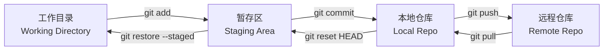
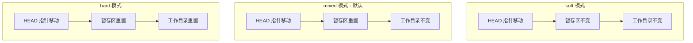
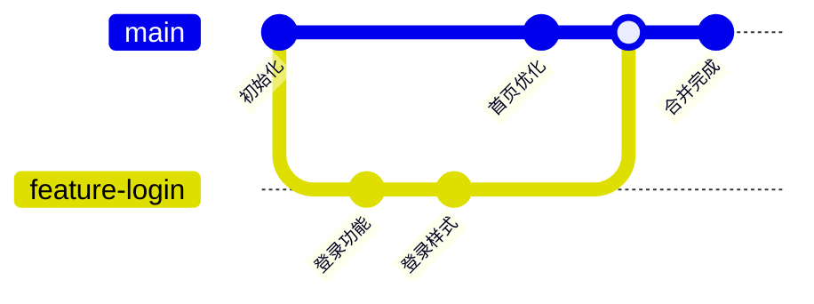

# 第58课：Git 基础

## 学习目标

- 理解 Git 的工作区域和工作原理
- 掌握 Git 的常用命令（init、add、commit、status、log、diff）
- 理解 reset 的三种模式（soft、mixed、hard）
- 掌握分支的创建、切换和合并
- 了解 .gitignore 的作用

---

## 一、Git 工作区

Git 有四个工作区域：



### 各区域说明

| 区域 | 说明 |
|------|------|
| 工作目录（Working Directory） | 实际文件存放的地方，可直接编辑 |
| 暂存区（Staging Area / Index） | 临时存放待提交的修改 |
| 本地仓库（Local Repository） | 存放已提交的历史版本 |
| 远程仓库（Remote Repository） | 远程服务器上的仓库（如 GitHub） |

---

## 二、基础命令

### 2.1 初始化与配置

```bash
# 初始化新仓库
git init

# 配置用户信息（首次使用需要）
git config --global user.name "Your Name"
git config --global user.email "your@email.com"

# 查看配置
git config --list
```

### 2.2 基本操作流程

```bash
# 查看文件状态
git status

# 添加文件到暂存区
git add index.html          # 添加单个文件
git add src/                # 添加整个目录
git add .                   # 添加所有更改（谨慎使用）

# 提交到本地仓库
git commit -m "feat: 初始化项目"

# 查看提交历史
git log                     # 完整日志
git log --oneline           # 单行显示
git log --graph             # 图形化显示分支

# 查看修改内容
git diff                    # 工作目录 vs 暂存区
git diff --cached           # 暂存区 vs 本地仓库
git diff HEAD               # 工作目录 vs 本地仓库
```

---

## 三、版本回退（reset）

`git reset` 用于撤销修改，有三种模式：

### 3.1 三种模式对比



```bash
# 查看历史提交
git log --oneline
# 输出示例：
# a1b2c3d commit 3
# e4f5g6h commit 2
# i7j8k9l commit 1

# soft：只移动 HEAD，暂存区和工作目录不变
git reset --soft HEAD~1
# 文件回到暂存区，可以重新 commit

# mixed（默认）：移动 HEAD，重置暂存区，工作目录不变
git reset --mixed HEAD~1
# 或简写 git reset HEAD~1
# 文件回到工作目录，需要重新 git add

# hard：移动 HEAD，重置暂存区和工作目录（危险操作）
git reset --hard HEAD~1
# 工作目录的文件内容也会变回之前的样子
# 未提交的修改会丢失！
```

> [!WARNING] --hard 危险
> `git reset --hard` 会丢弃工作目录和暂存区的所有未提交修改。执行前务必确认没有需要保留的更改。

---

## 四、分支管理

### 4.1 分支的概念

分支是 Git 的核心功能，让开发可以并行进行而不互相影响。



### 4.2 分支常用命令

```bash
# 查看分支
git branch                  # 列出本地分支
git branch -r               # 列出远程分支
git branch -a               # 列出所有分支

# 创建分支
git branch feature-login    # 创建分支（基于当前提交）

# 切换分支
git checkout feature-login  # 切换到指定分支
git switch feature-login    # 新式语法（Git 2.23+）

# 创建并切换
git checkout -b feature-login   # 创建并切换
git switch -c feature-login     # 新式语法

# 合并分支
git checkout main           # 先切换到目标分支
git merge feature-login     # 将 feature-login 合并到 main

# 删除分支
git branch -d feature-login          # 删除已合并的分支
git branch -D feature-login          # 强制删除未合并的分支
```

### 4.3 合并冲突解决

当两个分支修改了同一文件的同一部分时，合并会产生冲突。

```bash
# 合并时产生冲突
git merge feature-login
# 输出：CONFLICT in index.html

# 冲突标记格式
<<<<<<< HEAD
当前分支的内容
=======
合并分支的内容
>>>>>>> feature-login

# 解决步骤：
# 1. 手动编辑文件，保留需要的代码
# 2. 删除冲突标记 <<<<<, =====, >>>>>
# 3. git add 标记为已解决
# 4. git commit 完成合并
```

---

## 五、.gitignore

`.gitignore` 文件用于指定 Git 忽略哪些文件或目录。

```gitignore
# 依赖目录
node_modules/

# 构建产物
dist/
build/
*.bundle.js

# 环境变量
.env
.env.local

# IDE 配置
.vscode/
.idea/

# 操作系统文件
.DS_Store
Thumbs.db

# 日志
*.log
npm-debug.log*

# 包锁文件（不同项目策略不同）
# package-lock.json 通常要提交
# 但可以忽略某些特定文件
```

---

## 自测问题

<details>
<summary>1. Git 的三个工作区域分别是什么？</summary>

工作目录（编辑文件）、暂存区（准备提交的修改）、本地仓库（已提交的历史版本）。工作目录修改后需要 `git add` 到暂存区，再 `git commit` 到本地仓库。
</details>

<details>
<summary>2. git reset 的 soft、mixed、hard 三种模式有什么区别？</summary>

- soft：只移动 HEAD 指针，暂存区和工作目录都不变
- mixed（默认）：移动 HEAD，重置暂存区，工作目录不变
- hard：移动 HEAD，重置暂存区和工作目录（工作目录的修改会丢失）
</details>

<details>
<summary>3. 什么是分支合并冲突？如何解决？</summary>

当两个分支修改了同一个文件的同一区域时，Git 无法自动决定保留哪份代码，就会产生合并冲突。解决方法是手动编辑冲突文件，删除冲突标记（`<<<<<<<`、`=======`、`>>>>>>>`），保留需要的代码，然后 `git add` 和 `git commit`。
</details>

<details>
<summary>4. .gitignore 文件的作用是什么？</summary>

`.gitignore` 告诉 Git 哪些文件不应被跟踪版本。通常用于忽略依赖目录（`node_modules`）、构建产物（`dist`、`build`）、环境变量文件（`.env`）、IDE 配置等不应该提交到仓库的文件。
</details>