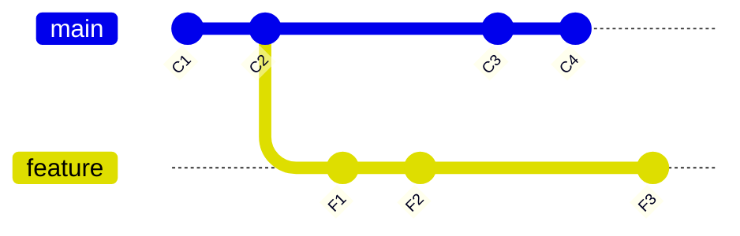
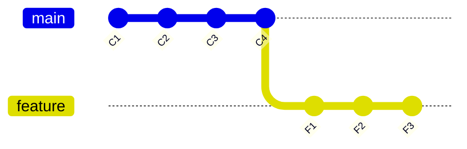
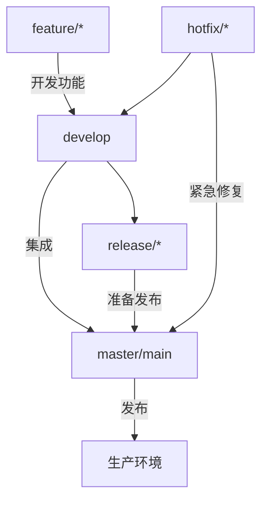

# 第59课：Git 高级和协作

## 学习目标

- 掌握远程仓库的常用操作（clone、push、pull、fetch）
- 理解 rebase 与 merge 的区别和适用场景
- 理解 Git Flow 工作流模型
- 掌握团队协作的最佳实践

---

## 一、远程仓库

### 1.1 关联远程仓库

```bash
# 克隆远程仓库到本地
git clone https://github.com/user/repo.git

# 克隆指定分支
git clone -b develop https://github.com/user/repo.git

# 查看远程仓库
git remote -v

# 添加远程仓库
git remote add origin https://github.com/user/repo.git

# 删除远程仓库
git remote remove origin
```

### 1.2 推送与拉取

```bash
# 推送到远程仓库
git push origin main               # 推送到 main 分支
git push -u origin main            # -u 建立上游关联（首次推送）

# 拉取远程更新（拉取 + 自动合并）
git pull origin main

# 获取远程更新（只下载，不自动合并）
git fetch origin

# 查看远程更新后再合并
git fetch origin
git log origin/main                # 查看远程分支历史
git merge origin/main              # 手动合并
```

> [!NOTE] fetch vs pull
> `git fetch` 只从远程下载最新数据，不自动合并。`git pull` 相当于 `git fetch` + `git merge`（或 `git rebase`）。`fetch` 更安全，可以在合并前查看远程的更改内容。

---

## 二、Rebase（变基）

### 2.1 rebase 的作用

`rebase` 可以将一个分支的提交移动到另一个分支的基础上，形成一条**线性**的历史记录。



执行 `git rebase main` 后：



### 2.2 rebase 的使用

```bash
# 变基：将当前分支的提交移到 main 分支的最新提交之后
git checkout feature
git rebase main

# 交互式变基：整理提交历史
git rebase -i HEAD~3
# 可以执行的操作：
# pick     — 保留该提交
# reword   — 保留提交，但修改提交信息
# squash   — 合并到前一个提交
# fixup    — 合并到前一个提交，丢弃提交信息
# drop     — 删除该提交
```

### 2.3 merge vs rebase

| 对比维度 | merge | rebase |
|---------|-------|--------|
| 历史记录 | 保留完整分支历史 | 线性历史 |
| 安全性 | 安全，不会改写历史 | 会改写提交哈希，需谨慎 |
| 适用场景 | 公共分支合并 | 私有分支整理 |
| 冲突解决 | 一次解决 | 每个提交都可能解决冲突 |

> [!WARNING] Rebase 黄金法则
> **永远不要在公共分支上执行 rebase**（如 main、develop、release）。Rebase 会改写提交历史，导致其他协作者的仓库与远程仓库不一致。

---

## 三、Git Flow 工作流

Git Flow 是一种规范的 Git 分支管理模型，适合有固定发布周期的项目。

### 3.1 分支类型



| 分支类型 | 命名规范 | 说明 |
|---------|---------|------|
| `main` / `master` | `main` | 生产分支，只接受合并 |
| `develop` | `develop` | 开发主分支，功能从这里拉取 |
| `feature` | `feature/xxx` | 功能开发分支，完成后合并到 develop |
| `release` | `release/v1.0` | 发布准备分支，测试修复后合并到 main 和 develop |
| `hotfix` | `hotfix/xxx` | 紧急修复分支，从 main 拉取，修复后合并到 main 和 develop |

### 3.2 Git Flow 工作流程

```bash
# 1. 从 develop 分支拉取功能分支
git checkout -b feature/login develop

# 2. 完成功能开发后合并到 develop
git checkout develop
git merge --no-ff feature/login
git branch -d feature/login

# 3. 准备发布时创建 release 分支
git checkout -b release/v1.0 develop

# 4. 测试修复后合并到 main 和 develop
git checkout main
git merge --no-ff release/v1.0
git tag -a v1.0 -m "v1.0 发布"

git checkout develop
git merge --no-ff release/v1.0
git branch -d release/v1.0

# 5. 生产环境紧急修复
git checkout -b hotfix/crash-fix main
# 修复后合并到 main 和 develop
```

---

## 四、团队协作最佳实践

### 4.1 提交信息规范

推荐使用 Conventional Commits 规范：

```
<type>(<scope>): <subject>

feat: 新功能
fix: 修复 bug
docs: 文档更新
style: 代码格式（不影响功能）
refactor: 代码重构
test: 测试相关
chore: 构建/工具相关
```

```bash
# 好的提交信息
feat: 添加用户登录功能
fix: 修复首页数据加载异常
refactor: 重构用户模块的数据查询逻辑
docs: 更新 API 文档

# 不好的提交信息
fix bug
update
asdf
```

### 4.2 协作注意事项

```bash
# 工作前先拉取最新代码
git pull --rebase origin develop

# 功能分支保持简短，频繁合并到 develop
# 避免长时间在大分支上开发

# 合并时使用 --no-ff 保留分支历史
git merge --no-ff feature/login

# 保持提交原子性：一个提交只做一件事
```

### 4.3 Pull Request 流程

1. 从 develop 拉取功能分支：`git checkout -b feature/login develop`
2. 在功能分支上开发，多次提交
3. 推送功能分支到远程：`git push origin feature/login`
4. 在 GitHub/GitLab 上创建 Pull Request
5. 团队成员 review 代码
6. 通过后合并到 develop 分支
7. 删除远程功能分支

---

## 自测问题

<details>
<summary>1. git fetch 和 git pull 有什么区别？</summary>

`git fetch` 只从远程仓库下载最新数据到本地，不会自动合并到当前分支。`git pull` 相当于 `git fetch` + 自动合并（merge 或 rebase）。`fetch` 更安全，允许在合并前审查远程的更改。
</details>

<details>
<summary>2. rebase 和 merge 各有什么优缺点？</summary>

merge 保留完整的分支历史（包括分叉），安全不会改写历史，适合公共分支。rebase 产生线性历史，更清晰整洁，但会改写提交哈希，不能在公共分支上使用。私有功能分支推荐 rebase，公共分支推荐 merge。
</details>

<details>
<summary>3. Git Flow 中有哪几种分支？各自的用途是什么？</summary>

五种分支：main（生产环境）、develop（开发主分支，持续集成）、feature/*（功能开发）、release/*（发布准备）、hotfix/*（紧急修复）。每种分支有不同的生命周期和合并规则。
</details>

<details>
<summary>4. 为什么不建议在公共分支上使用 rebase？</summary>

rebase 会改写提交历史，改变提交的 SHA-1 哈希值。如果公共分支被 rebase 了，其他协作者本地的仓库会与远程仓库不一致，再次推送时会被迫再次合并或 rebase，造成历史混乱。公共分支应该使用 merge 保持历史稳定可追溯。
</details>