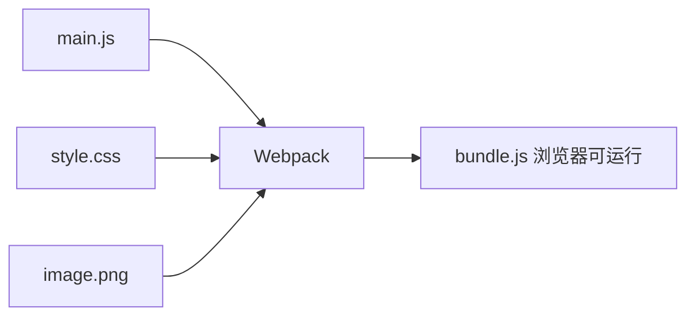
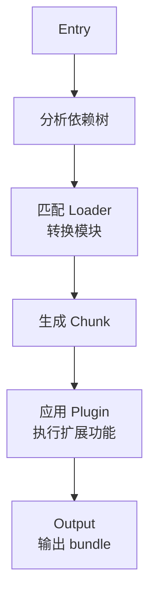

# 第60课：Webpack 入门

## 学习目标

- 理解 Webpack 是什么以及它的核心概念
- 掌握 Webpack 的基本配置（entry、output、mode）
- 理解 loader 和 plugin 的作用和区别
- 能手动搭建一个基础的 Webpack 项目

---

## 一、Webpack 简介

Webpack 是一个**静态模块打包工具**。它会分析项目中的模块依赖关系，然后将所有模块打包成一个或多个 bundle 文件。

### 为什么需要 Webpack？



| 痛点 | Webpack 的解决方案 |
|------|-------------------|
| ESModule 浏览器兼容性 | 编译为浏览器支持的语法 |
| 文件合并减少请求 | 模块打包为一个文件 |
| CSS/图片等非 JS 资源 | loader 处理各种资源 |
| 开发效率低 | HMR 热更新 |

---

## 二、核心概念

| 概念 | 说明 |
|------|------|
| **Entry（入口）** | 告诉 Webpack 从哪个文件开始分析依赖 |
| **Output（输出）** | 告诉 Webpack 打包后的文件输出到哪里 |
| **Loader（加载器）** | 处理非 JS 资源（CSS、图片、字体等） |
| **Plugin（插件）** | 扩展 Webpack 功能（如生成 HTML、清理目录） |
| **Mode（模式）** | 设置构建模式：development / production |

---

## 三、基本配置

### 3.1 项目初始化

```bash
# 创建项目目录并初始化
mkdir webpack-demo && cd webpack-demo
npm init -y

# 安装 webpack
npm install webpack webpack-cli --save-dev
```

### 3.2 创建基本文件

```javascript
// src/utils/math.js —— 工具模块
export function sum(num1, num2) {
  return num1 + num2
}

// src/main.js —— 入口文件
import { sum } from './utils/math'

const message = 'Hello World'
console.log(sum(20, 30))
console.log(sum(10, 12))

const bar = () => {
  console.log('bar function execution~')
}
bar()
```

### 3.3 编写 Webpack 配置

```javascript
// wk.config.js（或 webpack.config.js）
const path = require('path')

module.exports = {
  // 入口文件
  entry: './src/main.js',

  // 输出配置
  output: {
    filename: 'bundle.js',
    path: path.resolve(__dirname, './build')
  }
}
```

### 3.4 配置 package.json

```json
{
  "name": "01_webpack_basic",
  "version": "1.0.0",
  "scripts": {
    "build": "webpack --config wk.config.js"
  },
  "devDependencies": {
    "webpack": "^5.73.0",
    "webpack-cli": "^4.10.0"
  }
}
```

```bash
# 执行构建
npm run build
```

---

## 四、Mode 模式

Webpack 提供了三种模式，不同模式下会启用不同的内置优化。

| 模式 | 特点 |
|------|------|
| `development` | 开发模式，速度快，有详细的错误提示，不压缩代码 |
| `production` | 生产模式，自动压缩代码，优化输出体积 |
| `none` | 不启用任何优化 |

```javascript
module.exports = {
  mode: 'production',   // production / development / none
  entry: './src/main.js',
  output: {
    filename: 'bundle.js',
    path: path.resolve(__dirname, './build')
  }
}
```

---

## 五、Webpack 构建流程



| 步骤 | 说明 |
|------|------|
| 1. 读取配置 | 解析 `webpack.config.js` 配置 |
| 2. 分析入口 | 从 `entry` 开始，递归分析所有依赖 |
| 3. 模块转换 | 用 loader 将各种资源转换为 JS 模块 |
| 4. 生成 Chunk | 根据依赖关系图分割代码块 |
| 5. 插件处理 | 在构建过程中执行插件的 hooks |
| 6. 输出文件 | 输出打包后的文件到 `output.path` |

---

## 六、资源模块（Asset Modules）

Webpack 5 内置了资源模块类型，不再需要 `file-loader` 或 `url-loader`。

| 类型 | 说明 |
|------|------|
| `asset/resource` | 输出单独文件，生成 URL 引用（类似 file-loader） |
| `asset/inline` | Base64 编码内联到 JS 中（类似 url-loader） |
| `asset/source` | 导出资源的原始内容（类似 raw-loader） |
| `asset` | 自动选择：小文件 inline，大文件 resource |

```javascript
module.exports = {
  module: {
    rules: [
      {
        test: /\.(png|jpe?g|svg|gif)$/,
        // type: "asset/resource",   // 单独文件
        // type: "asset/inline",     // base64 内联
        type: "asset",                // 自动选择
        parser: {
          dataUrlCondition: {
            maxSize: 60 * 1024       // 60KB 以下转为 base64
          }
        },
        generator: {
          // 占位符：name(原名称) ext(扩展名) hash(内容哈希)
          filename: "img/[name]_[hash:8][ext]"
        }
      }
    ]
  }
}
```

---

## 七、路径解析配置

```javascript
module.exports = {
  resolve: {
    // 自动补全文件扩展名
    extensions: ['.js', '.json', '.vue', '.jsx', '.ts', '.tsx'],

    // 配置路径别名
    alias: {
      utils: path.resolve(__dirname, './src/utils')
    }
  }
}
```

配置别名后，引入模块时不用写相对路径：

```javascript
// 使用别名前
import { sum } from '../../utils/math'

// 使用别名后
import { sum } from 'utils/math'
```

---

## 自测问题

<details>
<summary>1. Webpack 的核心概念有哪些？</summary>

Entry（入口起点）、Output（输出配置）、Loader（模块转换器）、Plugin（功能扩展插件）、Mode（构建模式：development/production）。Webpack 5 还内置了 Asset Modules 处理资源文件。
</details>

<details>
<summary>2. Loader 和 Plugin 有什么区别？</summary>

Loader 是模块转换器，在模块加载时执行，将非 JS 文件转换为 Webpack 能处理的模块（如 CSS -> JS）。Plugin 是功能扩展，在构建生命周期的各个阶段执行，可以完成 Loader 做不到的事情（如生成 HTML、清理目录等）。
</details>

<details>
<summary>3. asset/resource 和 asset/inline 有什么区别？如何选择？</summary>

`asset/resource` 将资源输出为单独的文件，生成 URL 地址引用。`asset/inline` 将资源转为 Base64 编码内联到 JS 中。建议使用 `asset` 类型并设置 `maxSize` 阈值自动选择：小文件内联（减少 HTTP 请求），大文件单独打包（保持 JS 文件体积可控）。
</details>

<details>
<summary>4. resolve.alias 的作用是什么？</summary>

配置路径别名，避免在引用模块时使用复杂冗长的相对路径（如 `../../utils/math`）。通过别名可以简化为 `utils/math`，并且路径不受文件位置影响，更方便重构。
</details>