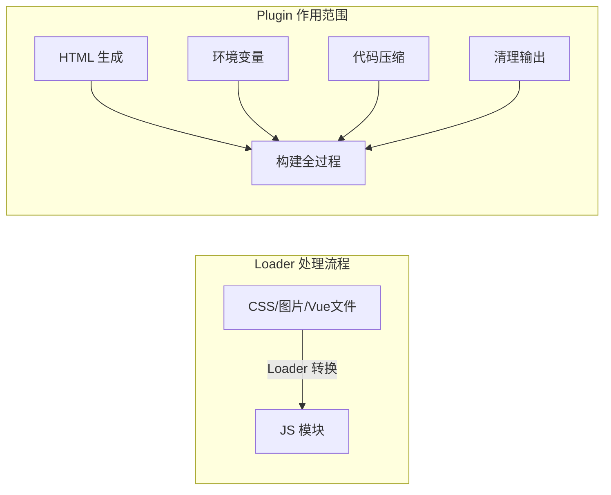

# 第62课：Webpack Plugin

## 学习目标

- 理解 Plugin 的作用和工作机制
- 掌握 HtmlWebpackPlugin 自动生成 HTML
- 掌握 CleanWebpackPlugin 清理构建产物
- 掌握 DefinePlugin 注入全局变量
- 理解 Plugin 与 Loader 的区别

---

## 一、Plugin 概述

### 1.1 Plugin 与 Loader 的区别



| 对比维度 | Loader | Plugin |
|---------|--------|--------|
| 作用范围 | 模块级别（单个文件） | 构建生命周期（全局） |
| 主要用途 | 转换各种资源为模块 | 扩展构建功能 |
| 配置方式 | `module.rules` 中配置 | `plugins` 数组中配置 |
| 执行时机 | 加载模块时 | 构建的不同阶段 |

---

## 二、HtmlWebpackPlugin

### 2.1 作用

自动在输出目录生成一个 HTML 文件，并自动引入打包后的 JS/CSS 文件。

### 2.2 安装

```bash
npm install html-webpack-plugin --save-dev
```

### 2.3 基本使用

```javascript
const HtmlWebpackPlugin = require('html-webpack-plugin')

module.exports = {
  plugins: [
    new HtmlWebpackPlugin({
      title: '电商项目',       // HTML 标题
      template: './index.html'  // 指定模板文件
    })
  ]
}
```

### 2.4 模板文件

```html
<!-- index.html —— 模板文件 -->
<!DOCTYPE html>
<html lang="en">
<head>
  <meta charset="UTF-8">
  <meta name="viewport" content="width=device-width, initial-scale=1.0">
  <title><%= htmlWebpackPlugin.options.title %></title>
</head>
<body>
  <div id="app"></div>
</body>
</html>
```

> [!NOTE] 为什么使用模板？
> 如果不指定 `template`，HtmlWebpackPlugin 会生成一个空的 HTML 文件。使用模板可以自定义结构（如添加 `meta` 标签、`div#app` 挂载点等），同时利用 EJS 模板语法注入标题等配置。

---

## 三、CleanWebpackPlugin

### 3.1 作用

在每次构建前清理输出目录（`output.path`），避免旧文件残留。

### 3.2 安装与使用

```javascript
const { CleanWebpackPlugin } = require('clean-webpack-plugin')

module.exports = {
  plugins: [
    new CleanWebpackPlugin()
  ]
}
```

### 3.3 Webpack 5 内置方案

Webpack 5 中可以通过 `output.clean` 实现同样的效果，无需额外安装插件：

```javascript
module.exports = {
  output: {
    filename: 'bundle.js',
    path: path.resolve(__dirname, './build'),
    clean: true   // Webpack 5 内置清理功能
  }
}
```

---

## 四、DefinePlugin

### 4.1 作用

在编译时创建全局常量，常用于区分开发/生产环境或注入环境变量。

### 4.2 使用方式

```javascript
const { DefinePlugin } = require('webpack')  // webpack 内置插件，无需安装

module.exports = {
  plugins: [
    new DefinePlugin({
      BASE_URL: "'./'",        // 注意：值需要是代码片段
      coderwhy: "'why'",
      counter: '123'           // 数字类型直接写，不用引号
    })
  ]
}
```

### 4.3 在代码中使用

```javascript
// 在源码中直接使用这些常量
console.log(BASE_URL)  // "./"
console.log(coderwhy)  // "why"
console.log(counter)   // 123

// 实际应用：配置 axios baseURL
const service = axios.create({
  baseURL: BASE_URL
})
```

> [!WARNING] DefinePlugin 值的写法
> DefinePlugin 替换是直接的文本替换，值必须是一段 JavaScript 代码片段。字符串需要额外加一层引号：`"'./'"`。这表示注入的代码是 `'./'` 这个字符串字面量。

---

## 五、完整配置示例

### 5.1 安装

```bash
npm install html-webpack-plugin clean-webpack-plugin --save-dev
```

### 5.2 配置

```javascript
// wk.config.js —— 完整的插件配置
const path = require('path')
const { VueLoaderPlugin } = require('vue-loader/dist/index')
const HtmlWebpackPlugin = require('html-webpack-plugin')
const { DefinePlugin } = require('webpack')

module.exports = {
  mode: 'production',
  entry: './src/main.js',
  output: {
    filename: 'bundle.js',
    path: path.resolve(__dirname, './build'),
    clean: true            // 清理输出目录
  },
  module: {
    rules: [
      { test: /\.css$/, use: [ 'style-loader', 'css-loader', 'postcss-loader' ] },
      { test: /\.less$/, use: [ 'style-loader', 'css-loader', 'less-loader', 'postcss-loader' ] },
      {
        test: /\.(png|jpe?g|svg|gif)$/,
        type: 'asset',
        parser: { dataUrlCondition: { maxSize: 60 * 1024 } },
        generator: { filename: 'img/[name]_[hash:8][ext]' }
      },
      { test: /\.js$/, use: [ 'babel-loader' ] },
      { test: /\.vue$/, loader: 'vue-loader' }
    ]
  },
  resolve: {
    extensions: ['.js', '.json', '.vue', '.jsx', '.ts', '.tsx'],
    alias: { utils: path.resolve(__dirname, './src/utils') }
  },
  plugins: [
    new VueLoaderPlugin(),
    new HtmlWebpackPlugin({
      title: '电商项目',
      template: './index.html'
    }),
    new DefinePlugin({
      BASE_URL: "'./'",
      coderwhy: "'why'",
      counter: '123'
    })
  ]
}
```

---

## 六、常用 Plugin 总结

| 插件 | 作用 |
|------|------|
| `HtmlWebpackPlugin` | 自动生成 HTML 文件并注入 JS/CSS 引用 |
| `CleanWebpackPlugin` | 构建前清理输出目录（Webpack 5 可用 `output.clean` 替代） |
| `DefinePlugin` | 注入编译时的全局常量 |
| `VueLoaderPlugin` | Vue 单文件组件必需的插件 |
| `MiniCssExtractPlugin` | 将 CSS 提取为独立文件（替代 style-loader） |
| `TerserPlugin` | 压缩 JavaScript |
| `ForkTsCheckerWebpackPlugin` | TypeScript 类型检查 |

---

## 自测问题

<details>
<summary>1. Loader 和 Plugin 的本质区别是什么？</summary>

Loader 是模块转换器，在模块加载时对单个文件进行转换（如 CSS -> JS）。Plugin 是功能扩展器，在构建的生命周期各阶段执行，可以处理全局性任务（如生成 HTML、注入环境变量、清理目录等）。
</details>

<details>
<summary>2. HtmlWebpackPlugin 的作用是什么？</summary>

在构建输出目录中自动生成 HTML 文件，并自动将打包后的 JS 和 CSS 文件以 `<script>` 和 `<link>` 标签的形式注入到 HTML 中。支持使用 EJS 模板自定义 HTML 结构。
</details>

<details>
<summary>3. DefinePlugin 注入的全局变量需要注意什么？</summary>

DefinePlugin 的值必须是 JavaScript 代码片段（不是字符串值）。例如字符串需要写成 `"'./'"`（即内嵌引号的字符串），而数字直接写 `123`。它执行的是纯文本替换，不是运行时赋值。
</details>

<details>
<summary>4. Webpack 5 中如何实现构建前清理输出目录？</summary>

Webpack 5 在 `output` 配置中新增了 `clean` 属性，设置为 `true` 即可自动清理输出目录。无需安装 `CleanWebpackPlugin` 插件。但使用插件的方式仍然兼容。
</details>