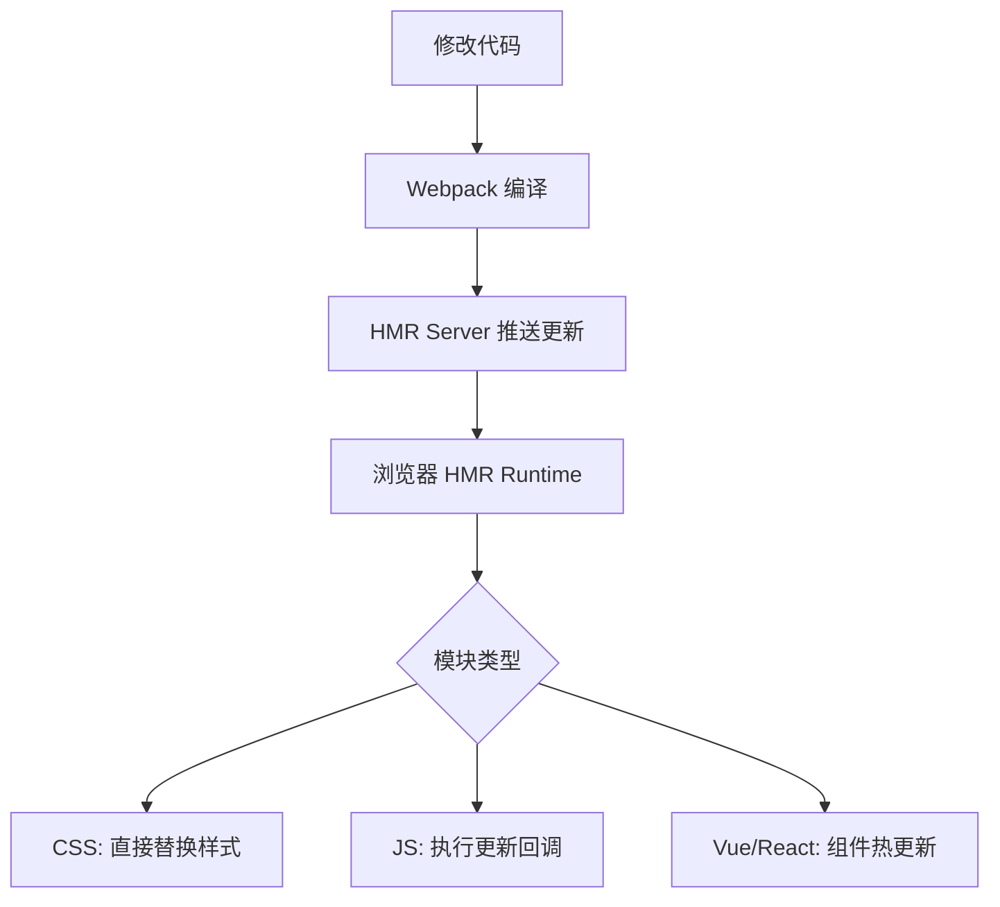

# 第63课：Webpack 开发环境

## 学习目标

- 掌握 webpack-dev-server 的配置和使用
- 理解 HMR 热更新的原理和配置
- 了解 SourceMap 的作用和配置方式
- 掌握开发/生产环境的配置分离

---

## 一、Webpack DevServer

### 1.1 安装

```bash
npm install webpack-dev-server --save-dev
```

### 1.2 基本配置

```javascript
// wk.config.js
module.exports = {
  mode: 'development',
  entry: './src/main.js',
  output: {
    filename: 'bundle.js',
    path: path.resolve(__dirname, './build'),
    clean: true
  },
  devServer: {
    hot: true,         // 启用 HMR（热更新）
    // host: '0.0.0.0',   // 监听所有网络接口
    // port: 8888,        // 自定义端口
    // open: true,        // 自动打开浏览器
    // compress: true      // 启用 gzip 压缩
  }
}
```

### 1.3 配置 npm scripts

```json
{
  "scripts": {
    "serve": "webpack serve --config wk.config.js",
    "build": "webpack --config wk.config.js"
  }
}
```

```bash
# 启动开发服务器
npm run serve

# 构建生产版本
npm run build
```

---

## 二、HMR（Hot Module Replacement）

### 2.1 什么是 HMR

HMR（热模块替换）让开发过程中模块修改后能够**在不刷新整个页面的情况下**实时更新。这比 Live Reload（自动刷新页面）的开发体验更好，因为它能保持应用的运行状态。

### 2.2 HMR 的工作原理



### 2.3 启用 HMR

```javascript
module.exports = {
  devServer: {
    hot: true  // 启用 HMR（默认在 webpack-dev-server 4+ 中已默认开启）
  }
}
```

> [!TIP] HMR 在框架中的使用
> 在 Vue 或 React 项目中，HMR 通常由框架的 Loader 或 Plugin 自动支持（如 `vue-loader` 原生支持 HMR，`react-hot-loader` 为 React 提供 HMR）。CSS 的 HMR 是默认支持的（style-loader 会自动处理）。

---

## 三、SourceMap

### 3.1 什么是 SourceMap

SourceMap 是一种映射文件，它将打包后的代码映射回源代码。当浏览器控制台中出现错误时，SourceMap 能让我们看到错误在**源代码**中的位置，而不是在打包后的 bundle 中。

### 3.2 配置 SourceMap

```javascript
module.exports = {
  mode: 'development',
  devtool: 'eval-cheap-module-source-map'  // SourceMap 策略
}
```

### 3.3 常用 SourceMap 策略

| devtool 值 | 构建速度 | 定位精度 | 说明 |
|-----------|---------|---------|------|
| `false` | 最快 | 无 | 不生成 SourceMap |
| `eval` | 快 | 行级（转换后代码） | 每个模块用 eval 包裹 |
| `eval-source-map` | 慢（初次） | 精确到原始代码 | 生成完整的 SourceMap |
| `eval-cheap-source-map` | 中等 | 行级（转换后代码） | 只定位到行，不含列 |
| `eval-cheap-module-source-map` | 中等 | 行级（源代码） | 推荐开发环境使用 |
| `source-map` | 最慢 | 精确到原始代码 | 推荐生产环境使用（但不暴露） |

> [!NOTE] 开发/生产环境的 SourceMap 策略
> 开发环境推荐 `eval-cheap-module-source-map`（速度和精度的平衡）。生产环境推荐 `hidden-source-map` 或 `source-map`（配合错误监控平台使用，不要暴露给用户）。

---

## 四、开发/生产环境配置分离

在实际项目中，开发环境和生产环境的配置差异很大，通常拆分为三个配置文件，通过 `webpack-merge` 合并。

### 4.1 安装

```bash
npm install webpack-merge --save-dev
```

### 4.2 目录结构

```
config/
├── webpack.comm.config.js   # 公共配置
├── webpack.dev.config.js    # 开发环境配置
└── webpack.prod.config.js   # 生产环境配置
```

### 4.3 公共配置

```javascript
// config/webpack.comm.config.js —— 公共配置
const path = require('path')
const { VueLoaderPlugin } = require('vue-loader/dist/index')
const HtmlWebpackPlugin = require('html-webpack-plugin')
const { DefinePlugin } = require('webpack')

module.exports = {
  entry: './src/main.js',
  output: {
    filename: 'bundle.js',
    path: path.resolve(__dirname, '../build')
  },
  resolve: {
    extensions: ['.js', '.json', '.vue', '.jsx', '.ts', '.tsx'],
    alias: {
      utils: path.resolve(__dirname, '../src/utils')
    }
  },
  module: {
    rules: [
      { test: /\.css$/, use: [ 'style-loader', 'css-loader', 'postcss-loader' ] },
      { test: /\.less$/, use: [ 'style-loader', 'css-loader', 'less-loader', 'postcss-loader' ] },
      {
        test: /\.(png|jpe?g|svg|gif)$/,
        type: 'asset',
        parser: { dataUrlCondition: { maxSize: 60 * 1024 } },
        generator: { filename: 'img/[name]_[hash:8][ext]' }
      },
      { test: /\.js$/, use: [ 'babel-loader' ] },
      { test: /\.vue$/, loader: 'vue-loader' }
    ]
  },
  plugins: [
    new VueLoaderPlugin(),
    new HtmlWebpackPlugin({
      title: '电商项目',
      template: './index.html'
    }),
    new DefinePlugin({
      BASE_URL: "'./'",
      coderwhy: "'why'",
      counter: '123'
    })
  ]
}
```

### 4.4 开发环境配置

```javascript
// config/webpack.dev.config.js —— 开发环境
const { merge } = require('webpack-merge')
const commonConfig = require('./webpack.comm.config')

module.exports = merge(commonConfig, {
  mode: 'development',
  devtool: 'eval-cheap-module-source-map',
  devServer: {
    hot: true,
    port: 8888,
    open: true
  }
})
```

### 4.5 生产环境配置

```javascript
// config/webpack.prod.config.js —— 生产环境
const { CleanWebpackPlugin } = require('clean-webpack-plugin')
const { merge } = require('webpack-merge')
const commonConfig = require('./webpack.comm.config')

module.exports = merge(commonConfig, {
  mode: 'production',
  output: {
    clean: true
  },
  plugins: [
    new CleanWebpackPlugin()
  ]
})
```

### 4.6 更新 package.json

```json
{
  "scripts": {
    "serve": "webpack serve --config config/webpack.dev.config.js",
    "build": "webpack --config config/webpack.prod.config.js"
  }
}
```

---

## 自测问题

<details>
<summary>1. webpack-dev-server 和 webpack 的常规构建有什么区别？</summary>

`webpack` 常规构建将打包结果输出到磁盘文件。`webpack-dev-server` 将打包结果保存在内存中（读取更快），并启动一个开发服务器，支持自动刷新和 HMR 热更新。
</details>

<details>
<summary>2. HMR 热更新的好处是什么？</summary>

HMR 可以在不刷新整个页面的情况下实时更新修改的模块。相比全量刷新，HMR 能保持应用的运行状态（如输入框内容、Vuex/Redux 状态），大幅提升开发效率。
</details>

<details>
<summary>3. 什么是 SourceMap？开发环境推荐使用哪个配置？</summary>

SourceMap 是打包后代码到源代码的映射文件，帮助开发者在浏览器中调试原始代码。开发环境推荐 `eval-cheap-module-source-map`，它能在速度和定位精度之间取得较好的平衡。
</details>

<details>
<summary>4. 为什么需要将 Webpack 配置拆分为公共、开发、生产三部分？</summary>

开发和生产的配置目标不同：开发环境追求快速构建和调试体验（SourceMap、DevServer、HMR），生产环境追求小体积和运行性能（代码压缩、Tree Shaking、缓存优化）。通过 `webpack-merge` 合并公共配置，可以避免重复，实现关注点分离。
</details>