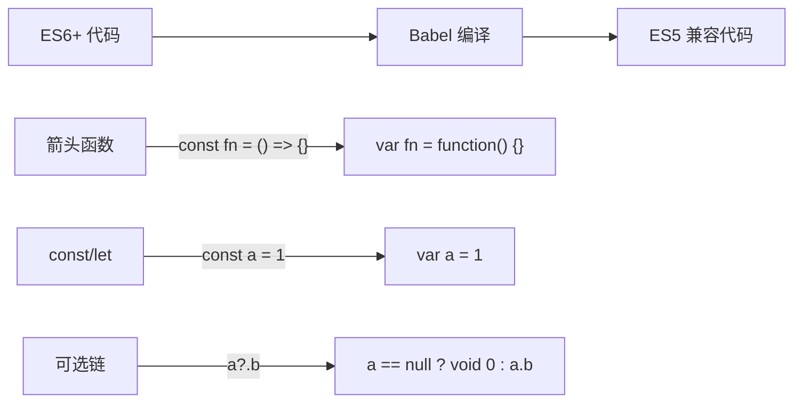
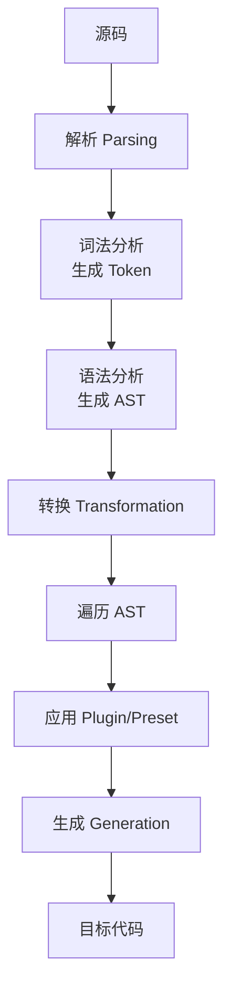

# 第64课：Babel 和 Polyfill

## 学习目标

- 理解 Babel 的作用和工作原理
- 掌握 Babel 的配置方式（presets 和 plugins）
- 理解 Polyfill 的概念和 core-js 的使用
- 掌握 @babel/preset-env 的配置选项

---

## 一、Babel 简介

Babel 是一个 JavaScript **编译器**，主要用途是将现代 JavaScript（ES6+）代码转换为当前和旧版浏览器或环境兼容的版本。



### Babel 的核心作用

1. **语法转换** —— 将 ES6+ 语法转为 ES5（箭头函数、const/let、解构赋值等）
2. **Polyfill 补丁** —— 在低版本浏览器中模拟缺失的 API（Promise、Array.includes 等）
3. **JSX 编译** —— 将 React 的 JSX 语法转为 `React.createElement` 调用
4. **TypeScript 编译** —— 将 TypeScript 转换为 JavaScript

---

## 二、Babel 配置

### 2.1 安装

```bash
# 核心包
npm install @babel/core @babel/cli --save-dev

# webpack 集成
npm install babel-loader @babel/core --save-dev
```

### 2.2 配置文件

Babel 的配置文件可以是以下几种形式（按优先级排序）：

- `babel.config.js`（推荐，项目级配置）
- `.babelrc`
- `.babelrc.js`
- `package.json` 中的 `babel` 字段

```javascript
// babel.config.js —— Babel 的推荐配置方式
module.exports = {
  // 方式一：使用预设（presets），一组插件的集合
  presets: [
    '@babel/preset-env'  // 智能预设，根据目标环境自动配置
  ]

  // 方式二：逐个配置插件（不推荐，太繁琐）
  // plugins: [
  //   '@babel/plugin-transform-arrow-functions',
  //   '@babel/plugin-transform-block-scoping'
  // ]
}
```

### 2.3 在 Webpack 中使用

```javascript
// wk.config.js
module.exports = {
  module: {
    rules: [
      {
        test: /\.js$/,
        use: [ 'babel-loader' ]  // Babel 将通过 babel.config.js 自动读取配置
      }
    ]
  }
}
```

---

## 三、Preset 预设

预设（preset）是 Babel 插件的集合，免去逐个安装配置插件的繁琐。

### 3.1 常用预设

| 预设 | 说明 |
|------|------|
| `@babel/preset-env` | 智能预设，根据目标环境自动包含所需插件 |
| `@babel/preset-react` | React 预设，包含 JSX 编译等 |
| `@babel/preset-typescript` | TypeScript 预设 |

### 3.2 @babel/preset-env

这是最常用的预设，它会根据配置的目标浏览器环境自动决定需要转换哪些语法特性。

```javascript
// babel.config.js
module.exports = {
  presets: [
    ['@babel/preset-env', {
      // 目标浏览器
      targets: {
        chrome: '58',
        ie: '11',
        edge: '14',
        firefox: '51'
      }

      // 或者使用 browserslist（推荐）
      // 也可以在 package.json 或 .browserslistrc 中配置
    }]
  ]
}
```

### 3.3 在 package.json 中配置 browserslist

```json
{
  "browserslist": [
    "> 1%",
    "last 2 versions",
    "not dead"
  ]
}
```

此配置表示：覆盖全球使用率超过 1% 的浏览器，每个浏览器最近的两个版本，排除已停止维护的浏览器。

---

## 四、Polyfill

### 4.1 什么是 Polyfill

Babel 只转换**语法**（如箭头函数、const/let），不转换**API**（如 Promise、Array.from、Object.assign）。Polyfill 用于在低版本浏览器中补充这些缺失的 API。

```javascript
// 语法转换 —— Babel 可以处理
const fn = () => {}
// 转换为：
var fn = function() {}

// API 补丁 —— 需要 Polyfill
const promise = new Promise((resolve) => resolve(1))
// Babel 不会处理 Promise，因为它是运行时的 API，不是语法
// 需要 core-js 提供 Promise 的 Polyfill
```

### 4.2 core-js

`core-js` 是目前最流行的 Polyfill 库，提供了 ES5+ 所有新 API 的 polyfill 实现。

```bash
npm install core-js --save  # 注意：生产依赖
```

```javascript
// babel.config.js —— 配置 core-js 自动 polyfill
module.exports = {
  presets: [
    ['@babel/preset-env', {
      targets: '> 0.25%, not dead',
      // 使用 corejs 进行 polyfill
      useBuiltIns: 'usage',    // 'usage' | 'entry' | false
      corejs: 3                // core-js 版本
    }]
  ]
}
```

### 4.3 useBuiltIns 选项

| 值 | 说明 |
|----|------|
| `false` | 不自动 polyfill（默认），需要手动引入 |
| `'entry'` | 根据目标环境，在入口文件引入所有需要的 polyfill |
| `'usage'` | **推荐**。根据代码中实际使用到的 API 按需引入 polyfill |

```javascript
// useBuiltIns: 'usage' 的效果
// 源码中使用了 Promise
const p = new Promise((resolve) => resolve(1))

// Babel 会自动在文件顶部引入 core-js 中 Promise 的 polyfill
// import "core-js/modules/es.promise"
```

> [!TIP] useBuiltIns: 'usage' 的优势
> `usage` 模式会根据目标浏览器环境和实际代码中使用的 API，自动按需引入 polyfill。这样不会引入未使用的 polyfill，从而减小打包体积。

---

## 五、完整配置示例

### 5.1 项目依赖

```bash
# 开发依赖
npm install babel-loader @babel/core @babel/preset-env --save-dev

# 生产依赖
npm install core-js --save
```

### 5.2 Babel 配置

```javascript
// babel.config.js
module.exports = {
  presets: [
    ['@babel/preset-env', {
      targets: {
        edge: '17',
        firefox: '60',
        chrome: '67',
        safari: '11.1'
      },
      useBuiltIns: 'usage',  // 按需 polyfill
      corejs: 3              // 使用 core-js@3
    }]
  ]
}
```

### 5.3 Webpack 配置

```javascript
// wk.config.js
const path = require('path')

module.exports = {
  entry: './src/main.js',
  output: {
    filename: 'bundle.js',
    path: path.resolve(__dirname, './build')
  },
  module: {
    rules: [
      {
        test: /\.js$/,
        exclude: /node_modules/,        // 排除 node_modules
        use: [ 'babel-loader' ]
      }
    ]
  }
}
```

---

## 六、Babel 编译流程



| 阶段 | 说明 |
|------|------|
| 解析 | 将源码解析为抽象语法树（AST） |
| 转换 | 遍历 AST，应用插件进行转换（核心步骤） |
| 生成 | 将修改后的 AST 重新生成为目标代码 |

---

## 自测问题

<details>
<summary>1. Babel 的 presets 和 plugins 有什么区别？</summary>

Plugin 是单个转换功能（如转换箭头函数的 `@babel/plugin-transform-arrow-functions`）。Preset 是一组相关插件的集合，`@babel/preset-env` 包含了所有 ES6+ 语法转换所需插件。推荐使用 Preset 而非逐个配置 Plugin。
</details>

<details>
<summary>2. Babel 和 Polyfill 各自负责什么？</summary>

Babel 负责语法转换（如箭头函数 `() => {}` 转 `function() {}`）。Polyfill 负责 API 补丁（如 `Promise`、`Array.includes` 等新 API 在旧浏览器中的模拟实现）。两者配合使用才能完整兼容现代 JavaScript。
</details>

<details>
<summary>3. @babel/preset-env 的 useBuiltIns: 'usage' 有什么好处？</summary>

`usage` 模式会根据代码中实际使用的 API 和目标浏览器环境，自动按需引入对应的 polyfill。相比手动引入或 `entry` 方式，`usage` 模式可以精确控制 polyfill 的引入范围，避免打包体积过大。
</details>

<details>
<summary>4. core-js 是什么？为什么需要它？</summary>

`core-js` 是最流行的 JavaScript 标准库 Polyfill 实现，提供了 Promise、Symbol、Array.from 等所有 ES5+ 新 API 的降级实现。它配合 `@babel/preset-env` 的 `useBuiltIns` 选项使用，按需为低版本浏览器补充缺失的 API。
</details>