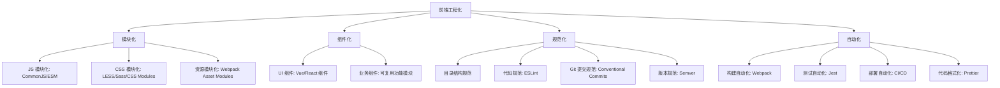
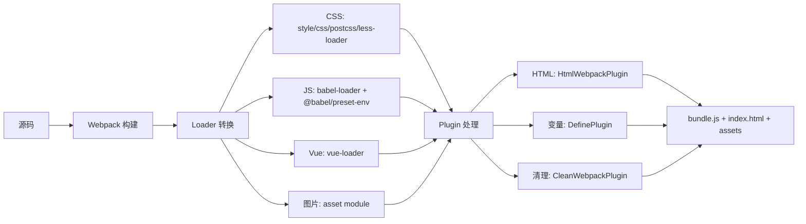

# 第65课：前端工程化实践

## 学习目标

- 理解前端工程化的核心目标和意义
- 掌握前端工程化的四个维度：模块化、组件化、规范化、自动化
- 回顾 Node.js、NPM、Git、Webpack 在整个工程化体系中的定位
- 构建完整的前端工程化知识框架

---

## 一、什么是前端工程化

前端工程化是**将软件开发中的工程化思想应用到前端开发中**，通过规范流程、自动化工具和最佳实践来解决以下问题：

| 痛点 | 工程化解决方案 |
|------|---------------|
| 全局变量冲突 | 模块化（CommonJS / ESModule） |
| 手动管理依赖 | 包管理工具（npm / yarn） |
| 代码风格不统一 | Lint 工具（ESLint / Prettier） |
| 无版本控制 | Git 版本管理 |
| 浏览器兼容性 | Babel / PostCSS |
| 手动构建部署 | Webpack / Vite |
| 重复机械工作 | 自动化脚本（npm scripts） |

### 前端工程化的四个核心维度



---

## 二、前端工程化体系全景

### 2.1 技术栈回顾

```
前端工程化技术栈
│
├── 运行时环境
│   └── Node.js ──── 全局对象 / 模块系统 / 核心模块
│
├── 包管理
│   └── npm / yarn ── 依赖管理 / package.json / 版本控制
│
├── 版本控制
│   └── Git ───────── 本地仓库 / 远程仓库 / 分支策略 / 工作流
│
├── 模块打包
│   ├── Webpack ───── entry / output / loader / plugin
│   ├── Babel ──────── 语法转换 / polyfill / preset
│   └── PostCSS ────── autoprefixer / CSS 新特性
│
└── 规范化
    ├── ESLint ─────── 代码质量检查
    ├── Prettier ───── 代码格式化
    └── Husky ──────── Git 钩子
```

### 2.2 构建流程



---

## 三、工程化规范最佳实践

### 3.1 项目目录结构规范

```
my-project/
├── src/                    # 源码目录
│   ├── assets/            # 静态资源
│   │   ├── css/          # 样式文件
│   │   ├── images/       # 图片
│   │   └── fonts/        # 字体
│   ├── components/        # 公共组件
│   ├── views/             # 页面组件
│   ├── utils/             # 工具函数
│   ├── router/            # 路由配置
│   ├── store/             # 状态管理
│   ├── main.js            # 入口文件
│   └── App.vue            # 根组件
├── public/                 # 公共资源（不经过构建）
├── config/                 # 构建配置
│   ├── webpack.comm.config.js
│   ├── webpack.dev.config.js
│   └── webpack.prod.config.js
├── dist/                   # 构建产物
├── node_modules/           # 依赖（不提交）
├── .gitignore              # Git 忽略配置
├── babel.config.js         # Babel 配置
├── postcss.config.js       # PostCSS 配置
├── package.json            # 项目配置
└── README.md               # 项目说明
```

### 3.2 Git 提交规范

推荐使用 Conventional Commits 规范：

```
<type>(<scope>): <description>

// 示例
feat: 添加用户登录功能
fix: 修复首页数据加载异常
refactor: 重构用户模块
docs: 更新 API 文档
chore: 升级 webpack 到 5.x
style: 格式化代码
test: 添加登录功能测试
```

### 3.3 版本规范（Semver）

语义化版本控制格式：`主版本号.次版本号.修订号`

| 版本变更 | 说明 |
|---------|------|
| `1.0.0` | 初始发布 |
| `1.0.1` | 修订号：bug 修复，向后兼容 |
| `1.1.0` | 次版本号：新增功能，向后兼容 |
| `2.0.0` | 主版本号：不兼容的 API 变更 |

---

## 四、工程化工具配置示例

### 4.1 完整的 package.json

```json
{
  "name": "my-project",
  "version": "1.0.0",
  "private": true,
  "scripts": {
    "serve": "webpack serve --config config/webpack.dev.config.js",
    "build": "webpack --config config/webpack.prod.config.js",
    "lint": "eslint src --fix",
    "format": "prettier --write src"
  },
  "browserslist": [
    "> 1%",
    "last 2 versions",
    "not dead"
  ]
}
```

### 4.2 完整的 Babel 配置

```javascript
// babel.config.js
module.exports = {
  presets: [
    ['@babel/preset-env', {
      targets: {
        edge: '17',
        firefox: '60',
        chrome: '67',
        safari: '11.1'
      },
      useBuiltIns: 'usage',
      corejs: 3
    }]
  ]
}
```

### 4.3 完整的 PostCSS 配置

```javascript
// postcss.config.js
module.exports = {
  plugins: [
    'postcss-preset-env'  // 自动添加前缀 + 支持未来 CSS 语法
  ]
}
```

### 4.4 完整的 .gitignore

```gitignore
node_modules/
dist/
build/
*.log
.DS_Store
.env
.env.local
.vscode/
.idea/
```

---

## 五、前端工程化的演进趋势

### 从 jQuery 到工程化

| 阶段 | 特点 | 工具/框架 |
|------|------|-----------|
| 刀耕火种 | 直接写 HTML/JS/CSS，手动管理依赖 | jQuery |
| 模块化 | CommonJS/ESModule，包管理 | Webpack + npm |
| 工程化 | 全链路自动化，规范流程 | Webpack + Babel + ESLint + Git |
| 现代化 | 开箱即用，极速体验 | Vite、Turbopack、esbuild |

### 为什么需要学习这套工程化体系？

1. **Webpack 是底层基础** —— 理解 Webpack 才能理解现代构建工具（Vite 等）的设计理念
2. **Babel 是兼容保障** —— 没有 Babel，现代 JavaScript 无法在老旧浏览器中运行
3. **Git 是协作根基** —— 团队开发的第一道门槛
4. **npm 是生态入口** —— 包管理是一切工具使用的基础

---

## 自测问题

<details>
<summary>1. 前端工程化的四个核心维度是什么？</summary>

模块化（JS/CSS/资源模块化）、组件化（UI 和业务组件复用）、规范化（目录结构/代码风格/Git 提交/版本号规范）、自动化（构建/测试/部署自动化）。这四个维度共同构成了前端工程化的完整体系。
</details>

<details>
<summary>2. 在整个工程化体系中，Webpack、Babel、npm、Git 分别扮演什么角色？</summary>

Webpack 是模块打包和构建工具，负责将各种资源打包为浏览器可用的文件。Babel 是 JS 编译器，负责将 ES6+ 代码转换为兼容性更佳的代码。npm 是包管理工具，负责依赖的安装、版本管理。Git 是版本控制工具，负责代码的版本管理和团队协作。
</details>

<details>
<summary>3. 一个完整的 Webpack 项目构建流程是怎样的？</summary>

从 Entry 入口开始分析依赖树，通过 Loader 转换各种资源（CSS/LESS/JS/Vue/图片），在构建过程中通过 Plugin 扩展功能（生成 HTML、注入环境变量、清理目录等），最终输出打包后的文件（bundle.js + index.html + 静态资源）。
</details>

<details>
<summary>4. 开发环境 Webpack 配置通常包含什么？生产环境又包含什么？</summary>

开发环境：`mode: 'development'`、SourceMap（`eval-cheap-module-source-map`）、DevServer（HMR、port、open）。生产环境：`mode: 'production'`、代码压缩、环境变量注入（DefinePlugin）、清理输出目录、不需要 DevServer。两者通过 `webpack-merge` 共享公共配置。
</details>