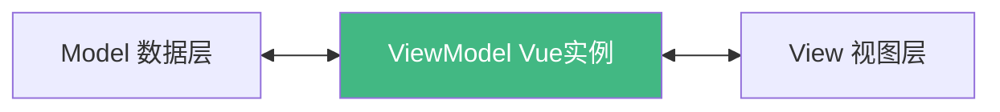

# Vue3 入门

## 学习目标

- 理解 Vue.js 的发展历程和前端框架定位
- 掌握 Vue3 的两种引入方式（CDN / 本地文件）
- 理解声明式编程与命令式编程的区别
- 掌握 Vue 实例的创建和挂载
- 理解 Options API 的 `data` 和 `methods` 选项
- 掌握 Mustache 插值语法和常用指令

---

## 1. 邂逅 Vue.js

### 1.1 Vue 是什么

Vue.js 是一套用于构建用户界面的**渐进式框架**。与 React、Angular 并称前端三大框架。

Vue3 相比 Vue2 的主要改进：

- 使用 Proxy 替代 Object.defineProperty 实现响应式
- 引入 Composition API（组合式 API）
- 更好的 TypeScript 支持
- 更小的打包体积（Tree-shaking）
- 更快的虚拟 DOM（PatchFlag、Block Tree）

### 1.2 引入 Vue3

**方式一：CDN 引入**

```html
<script src="https://unpkg.com/vue@3/dist/vue.global.js"></script>
```

**方式二：本地文件引入**

```html
<script src="./js/vue.js"></script>
```

### 1.3 第一个 Vue 应用

```html
<div id="app">
  <h2>{{title}}</h2>
  <ul>
    <li v-for="item in movies">{{item}}</li>
  </ul>
</div>

<script src="./js/vue.js"></script>
<script>
  const app = Vue.createApp({
    data() {
      return {
        title: "Hello Vue",
        movies: ["大话西游", "盗梦空间", "星际穿越"]
      }
    }
  })
  app.mount("#app")
</script>
```

**关键点**：

- `Vue.createApp` 创建应用实例
- `data` 选项必须是一个**返回对象的函数**
- `mount` 方法将应用挂载到 DOM 元素
- `{{ }}` Mustache 语法用于数据绑定
- `v-for` 指令用于列表渲染

## 2. 声明式 vs 命令式编程

### 2.1 命令式编程（原生 JavaScript）

```javascript
// 原生实现计数器
const h2El = document.createElement("h2")
const btnEl = document.createElement("button")
let counter = 0
h2El.textContent = `当前计数: ${counter}`
btnEl.textContent = "+1"
btnEl.onclick = function() {
  counter++
  h2El.textContent = `当前计数: ${counter}`
}
document.body.append(h2El, btnEl)
```

**特点**：关注"如何做"，每一步操作都由开发者手动控制 DOM。

### 2.2 声明式编程（Vue）

```html
<div id="app">
  <h2>当前计数: {{counter}}</h2>
  <button @click="increment">+1</button>
</div>

<script>
  Vue.createApp({
    data() {
      return { counter: 0 }
    },
    methods: {
      increment() { this.counter++ }
    }
  }).mount("#app")
</script>
```

**特点**：关注"做什么"，数据驱动视图，Vue 自动处理 DOM 更新。

> [!NOTE]
> 声明式编程是 Vue 的核心思想之一 --- 你只需要关心数据状态，Vue 负责将状态映射到 DOM。

## 3. MVC 与 MVVM 模式

### MVC 模式

- **Model**：数据模型
- **View**：视图（用户界面）
- **Controller**：控制器（业务逻辑）

### MVVM 模式



Vue 中的 MVVM：

- **View**：DOM 模板
- **ViewModel**：Vue 实例（`createApp` 返回的对象）
- **Model**：`data` 中的数据

## 4. Options API 核心选项

### 4.1 data 选项

```javascript
data() {
  return {
    message: "Hello",
    count: 0,
    user: { name: "why", age: 18 },
    list: [1, 2, 3]
  }
}
```

> [!WARNING]
> `data` 必须是函数（在组件中尤为重要），否则多个组件实例会共享同一份数据。

`data` 返回的对象会被 Vue 的响应式系统劫持，当数据改变时，视图自动更新。

### 4.2 methods 选项

```javascript
methods: {
  increment() {
    this.counter++  // this 指向 Vue 实例
  },
  decrement() {
    this.counter--
  }
}
```

> [!WARNING]
> methods 中的函数不能使用箭头函数，否则 `this` 将无法指向 Vue 实例。

## 5. 模板语法入门

### 5.1 Mustache 插值语法

```html
<!-- 支持表达式 -->
<h2>{{ message }}</h2>
<h2>{{ message + " 追加内容" }}</h2>
<h2>{{ count * 2 }}</h2>
<h2>{{ info.name }}</h2>
<h2>{{ age >= 18 ? "成年" : "未成年" }}</h2>
```

### 5.2 不常用的指令

| 指令 | 作用 |
|------|------|
| `v-once` | 只渲染一次，后续更新不重新渲染 |
| `v-text` | 相当于 `textContent` |
| `v-html` | 输出 HTML（**注意 XSS 风险**） |
| `v-pre` | 跳过该元素及其子元素的编译 |
| `v-cloak` | 配合 CSS 解决插值闪烁 |

```html
<!-- v-once: 只渲染一次 -->
<h2 v-once>{{ message }}</h2>

<!-- v-html: 输出 HTML（谨慎使用） -->
<div v-html="htmlContent"></div>

<!-- v-pre: 跳过编译 -->
<div v-pre>{{ 这里不会被编译 }}</div>
```

> [!WARNING]
> `v-html` 可能导致 XSS 攻击，永远不要用于用户提交的内容。

## 6. v-bind 指令

### 6.1 绑定基本属性

```html
<!-- 绑定 src 和 href -->

<a v-bind:href="linkHref">链接</a>

<!-- 缩写 -->

<a :href="linkHref">链接</a>
```

### 6.2 绑定 class

```html
<!-- 对象语法 -->
<div :class="{ active: isActive, 'text-danger': hasError }"></div>

<!-- 数组语法 -->
<div :class="['default-class', activeClass, errorClass]"></div>
```

### 6.3 绑定 style

```html
<!-- 对象语法 -->
<div :style="{ color: activeColor, fontSize: fontSize + 'px' }"></div>

<!-- 数组语法 -->
<div :style="[styleObj1, styleObj2]"></div>
```

### 6.4 动态绑定属性名

```html
<!-- 属性名动态绑定 -->
<div :[attributeName]="attributeValue"></div>
```

## 7. v-on 指令

### 7.1 基本使用

```html
<!-- 完整写法 -->
<button v-on:click="increment">+1</button>

<!-- 缩写 -->
<button @click="increment">+1</button>

<!-- 内联语句 -->
<button @click="counter++">+1</button>
```

### 7.2 参数传递

```html
<!-- 传递参数 -->
<button @click="addCount(10)">+10</button>

<!-- 事件对象 -->
<button @click="handleClick($event, 'param')">点击</button>
```

## 自测题

1. Vue3 相比 Vue2 做了哪些核心改进？
2. 声明式编程和命令式编程的区别是什么？
3. 为什么 `data` 必须是一个函数？
4. `v-bind` 绑定 class 有哪两种语法？
5. `v-html` 有什么安全风险？

<details>
<summary>查看答案</summary>

1. Proxy 代替 Object.defineProperty、Composition API、TypeScript 支持、Tree-shaking、更快虚拟 DOM
2. 命令式关注"如何做"（手动操作 DOM），声明式关注"做什么"（数据驱动视图）
3. 防止组件复用时的数据污染，函数每次返回新的对象
4. 对象语法 `{ className: boolean }` 和数组语法 `[class1, class2]`
5. XSS 跨站脚本攻击风险，不要用于用户提交的内容

</details>