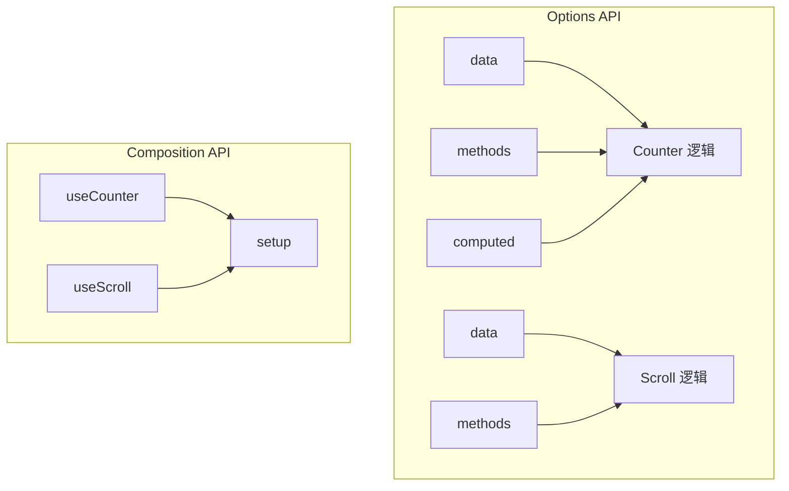
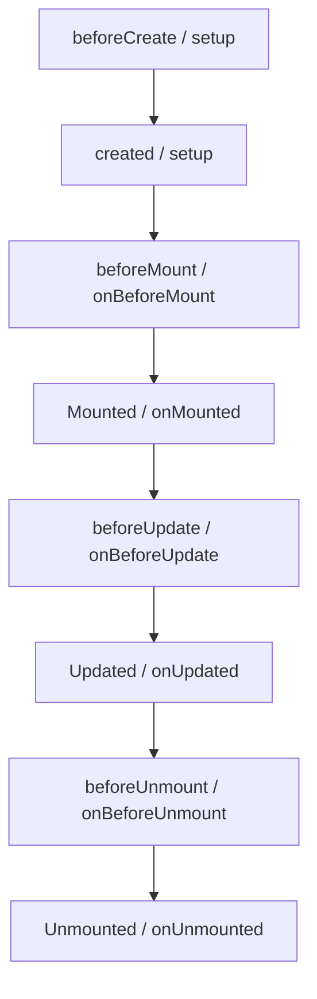

# Composition API

## 学习目标

- 理解 Composition API 与 Options API 的区别
- 掌握 `setup` 函数的用法和返回值
- 掌握 `ref` 和 `reactive` 定义响应式数据
- 掌握 `computed` 计算属性
- 掌握 `watch` 和 `watchEffect` 侦听器
- 掌握 `provide` / `inject` 依赖注入
- 掌握自定义 Hooks（组合函数）
- 掌握 `<script setup>` 语法糖

---

## 1. Composition API 概述

### 1.1 为什么需要 Composition API

Options API 的痛点：

- 逻辑分散：同一功能的代码分布在 `data`、`methods`、`computed` 等不同选项中
- 代码复用困难：Mixin 存在命名冲突和来源不明确的问题
- TypeScript 支持不友好：Options API 中 `this` 的类型推断较复杂

Composition API 的优势：

- 逻辑聚合：同一功能的代码可以写在一起
- 更易复用：通过自定义 Hooks 轻松抽离和共享逻辑
- 更好的 TypeScript 支持



### 1.2 setup 函数

`setup` 是 Composition API 的入口函数，在组件创建之前执行。

```vue
<script>
import { ref } from 'vue'

export default {
  setup() {
    // 响应式数据
    const counter = ref(0)

    // 函数
    function increment() {
      counter.value++
    }

    // 返回给模板使用
    return {
      counter,
      increment
    }
  }
}
</script>

<template>
  <div>
    <h2>当前计数: {{ counter }}</h2>
    <button @click="increment">+1</button>
  </div>
</template>
```

> [!WARNING]
> `setup` 中不能使用 `this`，因为它是在组件创建之前被调用的。

## 2. 响应式数据定义

### 2.1 reactive

`reactive` 用于定义**对象类型**的响应式数据，底层使用 Proxy 实现。

```javascript
import { reactive } from 'vue'

const account = reactive({
  username: "coderwhy",
  password: "123456"
})

function changeAccount() {
  account.username = "kobe"
  // 直接修改属性即可，不需要 .value
}
```

**限制**：

- 只能用于对象类型（Object、Array、Map、Set 等）
- 不能用于原始类型（string、number、boolean）
- 重新赋值会失去响应式

### 2.2 ref

`ref` 用于定义**任意类型**的响应式数据，底层将值包装成 `RefImpl` 对象。

```javascript
import { ref } from 'vue'

// 定义简单类型
const counter = ref(0)
const message = ref("Hello")

// 定义复杂类型
const info = ref({
  name: "why",
  age: 18
})

// 修改时需使用 .value
function increment() {
  counter.value++
}

// 复杂类型内部直接修改
function changeInfo() {
  info.value.name = "kobe"  // 不需要额外操作
}
```

> [!TIP]
> 在模板中访问 `ref` 数据时，Vue 会自动解包（不需要写 `.value`）。但在 `setup` 函数中必须使用 `.value`。

### 2.3 ref 的浅层解包

```javascript
const counter = ref(0)

// 直接解包
console.log(counter.value) // 0

// 浅层解包: ref 作为 reactive 对象的属性时会自动解包
const info = reactive({
  counter
})
console.log(info.counter) // 0 (自动解包)

// 浅层解包: ref 作为普通对象的属性时不会自动解包
const obj = {
  counter
}
console.log(obj.counter.value) // 必须 .value
```

### 2.4 toRefs 和 toRef

解构 reactive 对象时保持响应式：

```javascript
import { reactive, toRefs, toRef } from 'vue'

const state = reactive({
  name: "why",
  age: 18
})

// toRefs: 将 reactive 对象的每个属性转换为 ref
const { name, age } = toRefs(state)

// toRef: 只转换单个属性
const nameRef = toRef(state, 'name')
```

## 3. computed 计算属性

```vue
<script>
import { ref, computed } from 'vue'

const firstName = ref("Kobe")
const lastName = ref("Bryant")

// 只读计算属性
const fullName = computed(() => {
  return firstName.value + " " + lastName.value
})

// 可读写计算属性
const fullName2 = computed({
  get() {
    return firstName.value + " " + lastName.value
  },
  set(newValue) {
    const names = newValue.split(" ")
    firstName.value = names[0]
    lastName.value = names[1]
  }
})
</script>

<template>
  <h2>{{ fullName }}</h2>
</template>
```

## 4. 侦听器

### 4.1 watch

`watch` 需要指定要侦听的数据源，且默认不会立即执行。

```javascript
import { ref, watch } from 'vue'

const counter = ref(0)
const name = ref("why")

// 侦听单个 ref
watch(counter, (newValue, oldValue) => {
  console.log(`counter 从 ${oldValue} 变为 ${newValue}`)
})

// 侦听多个数据源
watch([counter, name], ([newCount, newName], [oldCount, oldName]) => {
  console.log(`count: ${oldCount}->${newCount}, name: ${oldName}->${newName}`)
})

// 侦听 reactive 对象
const info = reactive({ name: "why", age: 18 })

// 默认深度侦听（reactive 对象）
watch(info, (newValue) => {
  console.log("info 改变了", newValue)
})

// 侦听 ref 对象的某个属性
watch(() => info.age, (newAge, oldAge) => {
  console.log(`age: ${oldAge}->${newAge}`)
})

// 配置选项
watch(counter, (newValue) => {
  console.log(newValue)
}, {
  immediate: true,    // 立即执行一次
  deep: true,         // 深度侦听
  flush: 'post'       // DOM 更新后执行回调
})
```

### 4.2 watchEffect

`watchEffect` 自动收集依赖，且**默认立即执行**。

```javascript
import { ref, watchEffect } from 'vue'

const counter = ref(0)
const name = ref("why")

// watchEffect 会自动跟踪其内部使用的所有响应式依赖
const stopWatch = watchEffect(() => {
  console.log("------", counter.value, name.value)

  // 当 counter >= 10 时停止侦听
  if (counter.value >= 10) {
    stopWatch()  // 调用返回的函数停止侦听
  }
})
```

**watch vs watchEffect 对比**：

| 特性 | watch | watchEffect |
|------|-------|-------------|
| 需要指定数据源 | 是 | 否（自动收集） |
| 立即执行 | 需配置 `immediate` | 默认立即执行 |
| 获取新旧值 | 可以 | 只能获取新值 |
| 使用场景 | 需要旧值的场景 | 不需要旧值的副作用 |

## 5. 生命周期

### 5.1 选项式 vs 组合式生命周期



### 5.2 组合式生命周期示例

```vue
<script>
import {
  onBeforeMount,
  onMounted,
  onBeforeUpdate,
  onUpdated,
  onBeforeUnmount,
  onUnmounted
} from 'vue'

export default {
  setup() {
    onBeforeMount(() => {
      console.log("组件挂载前")
    })

    onMounted(() => {
      console.log("组件挂载完成")
    })

    onBeforeUpdate(() => {
      console.log("组件更新前")
    })

    onUpdated(() => {
      console.log("组件更新完成")
    })

    onBeforeUnmount(() => {
      console.log("组件卸载前")
    })

    onUnmounted(() => {
      console.log("组件卸载完成")
    })
  }
}
</script>
```

> [!NOTE]
> 组合式 API 中，`beforeCreate` 和 `created` 对应的逻辑直接写在 `setup` 函数体中即可，无需特殊钩子。

## 6. Provide / Inject

### 6.1 基本使用

顶层组件（Provide）：

```javascript
import { provide, ref } from 'vue'

const name = ref("why")
const age = ref(18)

// 提供数据
provide("name", name)
provide("age", age)
```

子孙组件（Inject）：

```javascript
import { inject } from 'vue'

const name = inject("name")
const age = inject("age", 0) // 可指定默认值
```

### 6.2 响应式数据传递

`provide` 传递 `ref` 或 `reactive` 数据时，**子孙组件修改会触发更新**。

> [!WARNING]
> 建议避免在子孙组件中直接修改注入的数据，应当使用 `provide` 提供的修改函数来保持数据流清晰。

## 7. 自定义 Hooks（组合函数）

自定义 Hooks 是一种利用 Composition API 抽离可复用逻辑的机制。

### 7.1 useCounter

```javascript
// hooks/useCounter.js
import { ref, onMounted } from 'vue'

export default function useCounter() {
  const counter = ref(0)

  function increment() {
    counter.value++
  }

  function decrement() {
    counter.value--
  }

  onMounted(() => {
    setTimeout(() => {
      counter.value = 989
    }, 1000)
  })

  return {
    counter,
    increment,
    decrement
  }
}
```

### 7.2 useScrollPosition

```javascript
// hooks/useScrollPosition.js
import { reactive } from 'vue'

export default function useScrollPosition() {
  const scrollPosition = reactive({
    x: 0,
    y: 0
  })

  document.addEventListener("scroll", () => {
    scrollPosition.x = window.scrollX
    scrollPosition.y = window.scrollY
  })

  return {
    scrollPosition
  }
}
```

### 7.3 使用自定义 Hooks

```vue
<script>
import useCounter from './hooks/useCounter'
import useScrollPosition from './hooks/useScrollPosition'

export default {
  setup() {
    const { counter, increment, decrement } = useCounter()
    const { scrollPosition } = useScrollPosition()

    return {
      counter,
      increment,
      decrement,
      scrollPosition
    }
  }
}
</script>
```

## 8. `<script setup>` 语法糖

`<script setup>` 是 Composition API 的简化写法，是**推荐方式**。

```vue
<script setup>
import { ref, onMounted } from 'vue'
import ShowInfo from './ShowInfo.vue'

// 所有顶层代码默认暴露给模板
const message = ref("Hello World")

function changeMessage() {
  message.value = "你好啊, 李银河!"
}

// 声明使用组件
// 会自动注册，无需 components 选项

// 获取组件实例
const showInfoRef = ref()
onMounted(() => {
  showInfoRef.value.foo()
})
</script>

<template>
  <div>{{ message }}</div>
  <button @click="changeMessage">修改</button>
  <ShowInfo ref="showInfoRef" />
</template>
```

**特性总结**：

- 自动暴露顶层绑定到模板
- 组件自动注册
- 支持 `defineProps` 和 `defineEmits`
- 支持 `defineExpose` 暴露属性和方法给父组件

## 自测题

1. `ref` 和 `reactive` 的区别是什么？各自适用场景？
2. `watch` 和 `watchEffect` 的核心区别是什么？
3. 为什么 `setup` 中不能使用 `this`？
4. 如何让解构后的 `reactive` 属性保持响应式？
5. 自定义 Hooks 相比 Mixin 的优势有哪些？

<details>
<summary>查看答案</summary>

1. `ref` 可用于任意类型（底层包装为 RefImpl），使用时需 `.value`；`reactive` 只能用于对象类型（底层使用 Proxy）。推荐：简单值用 `ref`，对象用 `reactive` 或统一用 `ref`。
2. `watch` 需指定源、可获取新旧值；`watchEffect` 自动收集依赖、默认立即执行、不能获取旧值。
3. `setup` 在组件创建前调用，此时组件实例尚未创建。
4. 使用 `toRefs()` 或 `toRef()` 将属性转换为 ref。
5. 无命名冲突、来源明确、更好的 TS 支持、更自然的组合方式。

</details>