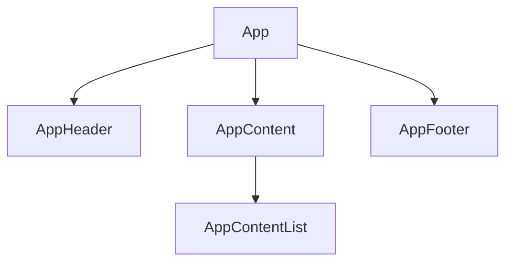
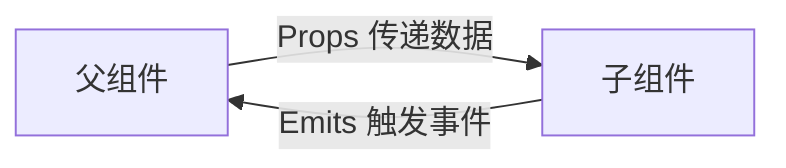
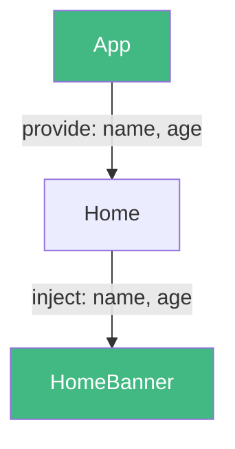
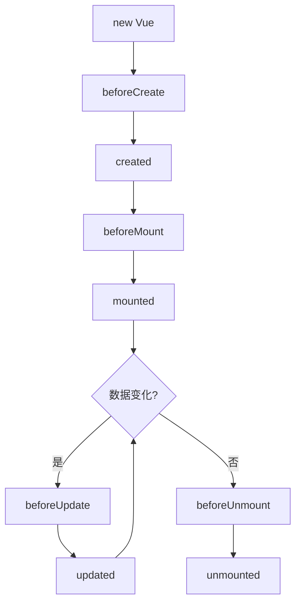

# 组件化开发

## 学习目标

- 掌握组件的嵌套使用和注册方式
- 掌握父子组件通信（Props 和 Emits）
- 掌握插槽 Slot 的三种类型
- 掌握非父子组件通信（Provide/Inject、EventBus）
- 理解生命周期函数的执行时机
- 掌握 `ref` 获取元素和组件实例
- 掌握动态组件和 Keep-Alive 的使用
- 理解异步组件的作用和用法

---

## 1. 组件嵌套

### 1.1 组件注册

**全局注册**：

```javascript
import { createApp } from 'vue'
import App from './App.vue'
import MyComponent from './MyComponent.vue'

const app = createApp(App)
app.component('MyComponent', MyComponent)
app.mount('#app')
```

**局部注册**：

```vue
<script>
import MyComponent from './MyComponent.vue'

export default {
  components: {
    MyComponent
  }
}
</script>

<!-- script setup 中导入即注册 -->
<script setup>
import MyComponent from './MyComponent.vue'
</script>
```

### 1.2 组件嵌套结构



```vue
<!-- App.vue -->
<template>
  <div class="app">
    <app-header />
    <app-content />
    <app-footer />
  </div>
</template>
```

## 2. 父子组件通信

### 2.1 父传子：Props

**父组件传递**：

```vue
<!-- Parent.vue -->
<script setup>
import ShowInfo from './ShowInfo.vue'
import { ref } from 'vue'

const name = ref("why")
const age = ref(18)
</script>

<template>
  <show-info name="why" :age="18" />
  <show-info :name="name" :age="age" />
</template>
```

**子组件接收**：

```vue
<!-- ShowInfo.vue -->
<script setup>
// defineProps 是编译宏，不需要导入
const props = defineProps({
  name: {
    type: String,
    required: true
  },
  age: {
    type: Number,
    default: 0
  }
})
</script>

<template>
  <h2>{{ name }} - {{ age }}</h2>
</template>
```

**Props 验证**：

```javascript
defineProps({
  // 基础类型检查
  name: String,
  // 多个类型
  propB: [String, Number],
  // 必填
  propC: { type: String, required: true },
  // 带默认值
  propD: { type: Number, default: 100 },
  // 对象/数组默认值
  propE: { type: Object, default: () => ({}) },
  // 自定义验证
  propF: { validator: (value) => value > 10 }
})
```

### 2.2 子传父：Emits

**子组件触发**：

```vue
<!-- SubCounter.vue -->
<script setup>
const emit = defineEmits(["add", "sub"])

function addCount(count) {
  emit("add", count)
}

function subCount(count) {
  emit("sub", count)
}
</script>

<template>
  <button @click="addCount(1)">+1</button>
  <button @click="subCount(1)">-1</button>
</template>
```

**父组件监听**：

```vue
<!-- App.vue -->
<script setup>
import SubCounter from './SubCounter.vue'

function onAdd(count) {
  console.log("增加:", count)
}

function onSub(count) {
  console.log("减少:", count)
}
</script>

<template>
  <sub-counter @add="onAdd" @sub="onSub" />
</template>
```



## 3. 插槽 Slot

### 3.1 基本插槽

```vue
<!-- ShowMessage.vue -->
<template>
  <div class="message-box">
    <slot></slot>
  </div>
</template>

<!-- 使用 -->
<show-message>
  <h2>标题内容</h2>
  <p>详细内容</p>
</show-message>
```

### 3.2 具名插槽

```vue
<!-- NavBar.vue -->
<template>
  <div class="nav-bar">
    <div class="left">
      <slot name="left"></slot>
    </div>
    <div class="center">
      <slot name="center"></slot>
    </div>
    <div class="right">
      <slot name="right"></slot>
    </div>
  </div>
</template>

<!-- 使用 -->
<nav-bar>
  <template v-slot:left>
    <button>返回</button>
  </template>
  <template #center>
    <span>标题</span>
  </template>
  <template #right>
    <button>更多</button>
  </template>
</nav-bar>
```

> [!TIP]
> `v-slot:name` 可简写为 `#name`。

### 3.3 作用域插槽

子组件向父组件插槽暴露数据：

```vue
<!-- TabControl.vue -->
<template>
  <div class="tab-control">
    <template v-for="(item, index) in titles" :key="item">
      <slot :item="item" :index="index">
        <button>{{ item }}</button>
      </slot>
    </template>
  </div>
</template>

<script setup>
defineProps({
  titles: { type: Array, required: true }
})
</script>
```

```vue
<!-- 使用 -->
<tab-control :titles="['衣服', '鞋子', '包包']">
  <template #default="slotProps">
    <span>{{ slotProps.item }} - {{ slotProps.index }}</span>
  </template>
</tab-control>
```

## 4. 非父子组件通信

### 4.1 Provide / Inject

适用于跨多层级的组件通信（祖先传后代）。



```javascript
// 祖先组件
import { provide, ref } from 'vue'
const name = ref("why")
provide("name", name)

// 后代组件
import { inject } from 'vue'
const name = inject("name", "默认值")
```

### 4.2 事件总线（EventBus）

适用于任意组件间的通信。

```javascript
// utils/event-bus.js
import mitt from 'mitt'
const emitter = mitt()
export default emitter
```

```vue
<!-- 发送方 -->
<script setup>
import emitter from '../utils/event-bus'

function handleClick() {
  emitter.emit("event-name", payload)
}
</script>

<!-- 接收方 -->
<script setup>
import { onMounted, onUnmounted } from 'vue'
import emitter from '../utils/event-bus'

onMounted(() => {
  emitter.on("event-name", (payload) => {
    console.log("接收到:", payload)
  })
})

onUnmounted(() => {
  emitter.off("event-name")
})
</script>
```

> [!NOTE]
> 事件总线在 Vue3 中不再是内置功能，需要使用第三方库 `mitt` 或 `tiny-emitter`。

## 5. 生命周期

### 5.1 组件生命周期图



### 5.2 生命周期执行顺序（父子组件）

```
父 beforeCreate -> 父 created -> 父 beforeMount ->
  子 beforeCreate -> 子 created -> 子 beforeMount -> 子 mounted ->
父 mounted ->
  更新: 父 beforeUpdate -> 子 beforeUpdate -> 子 updated -> 父 updated ->
  卸载: 父 beforeUnmount -> 子 beforeUnmount -> 子 unmounted -> 父 unmounted
```

## 6. ref 获取元素和组件

```vue
<script setup>
import { ref, onMounted } from 'vue'
import Banner from './Banner.vue'

// 获取 DOM 元素
const h2Ref = ref(null)

// 获取组件实例
const bannerRef = ref(null)

onMounted(() => {
  // DOM 元素
  h2Ref.value.textContent = "修改内容"

  // 组件实例（需子组件使用 defineExpose 暴露）
  bannerRef.value.foo()
})
</script>

<template>
  <h2 ref="h2Ref">标题</h2>
  <banner ref="bannerRef" />
</template>
```

```vue
<!-- Banner.vue -->
<script setup>
function foo() {
  console.log("Banner foo")
}

// 暴露给父组件
defineExpose({ foo })
</script>
```

## 7. 动态组件

```vue
<script setup>
import { shallowRef } from 'vue'
import Home from './views/Home.vue'
import About from './views/About.vue'
import Category from './views/Category.vue'

const currentTab = shallowRef(Home)

function switchTab(tab) {
  currentTab.value = tab
}
</script>

<template>
  <button @click="switchTab(Home)">首页</button>
  <button @click="switchTab(About)">关于</button>
  <button @click="switchTab(Category)">分类</button>

  <component :is="currentTab"></component>
</template>
```

## 8. Keep-Alive

`<keep-alive>` 缓存动态组件，避免反复销毁和创建。

```vue
<keep-alive>
  <component :is="currentTab"></component>
</keep-alive>
```

**新增生命周期**（配合 keep-alive时）：

```javascript
import { onActivated, onDeactivated } from 'vue'

onActivated(() => {
  console.log("组件被激活")
})

onDeactivated(() => {
  console.log("组件被失活")
})
```

> [!TIP]
> `keep-alive` 的 `include` / `exclude` 属性可控制哪些组件需要被缓存。

## 9. 异步组件

用于代码分割，减少首屏加载体积。

```vue
<script setup>
import { defineAsyncComponent } from 'vue'

// 写法一：全局注册
const AsyncHome = defineAsyncComponent(() =>
   import('./views/Home.vue')
)

// 写法二：带加载状态
const AsyncCategory = defineAsyncComponent({
  loader: () => import('./views/Category.vue'),
  loadingComponent: LoadingComponent,
  errorComponent: ErrorComponent,
  delay: 200,
  timeout: 3000
})
</script>

<template>
  <AsyncHome />
  <AsyncCategory />
</template>
```

## 10. 组件上的 v-model

```vue
<!-- Counter.vue -->
<script setup>
const props = defineProps({
  modelValue: { type: Number, default: 0 }
})

const emit = defineEmits(["update:modelValue"])

function increment() {
  emit("update:modelValue", props.modelValue + 1)
}
</script>

<template>
  <button @click="increment">{{ modelValue }}</button>
</template>

<!-- 使用 -->
<counter v-model="count" />
<!-- 等价于 -->
<counter :modelValue="count" @update:modelValue="count = $event" />
```

## 自测题

1. Props 和 Emits 在父子通信中各扮演什么角色？
2. 具名插槽和作用域插槽有何区别？
3. Provide / Inject 适合什么场景？有什么注意事项？
4. Keep-Alive 的作用是什么？配合它有哪些生命周期钩子？

<details>
<summary查看答案</summary>

1. Props 用于父向子传递数据（单向数据流），Emits 用于子向父传递消息
2. 具名插槽通过 name 区分多个插槽位置；作用域插槽允许子组件向父组件插槽暴露数据
3. 适合跨多层级的祖先向后代传递数据。注意：最好同时提供修改函数，避免后代直接修改注入数据
4. Keep-Alive 缓存失活的组件实例，避免反复销毁创建。配合 onActivated / onDeactivated 钩子处理激活/失活逻辑
</details>```