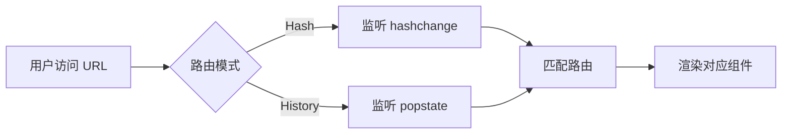
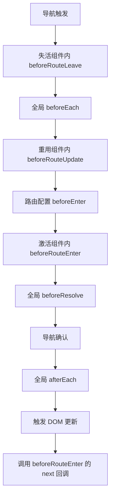

# Vue Router

## 学习目标

- 理解前端路由的原理（Hash / History 模式）
- 掌握 Vue Router 的安装和基本配置
- 掌握嵌套路由和动态路由匹配
- 掌握编程式导航和声明式导航
- 掌握路由守卫（全局/路由级/组件内）
- 掌握路由懒加载和代码分割

---

## 1. 前端路由原理

### 1.1 Hash 模式

URL 中包含 `#` 符号，`#` 后面的部分变化不会触发页面重新加载。

```javascript
// hash 变化监听
window.addEventListener("hashchange", () => {
  console.log("hash:", location.hash)
})
```

### 1.2 History 模式

利用 HTML5 的 History API，URL 不带 `#`，更美观。

```javascript
// pushState / replaceState 改变 URL 但不刷新页面
history.pushState({}, "", "/home")
history.replaceState({}, "", "/about")

// 前进/后退
history.back()
history.forward()

// 监听 popstate（前进/后退时触发）
window.addEventListener("popstate", () => {
  console.log("popstate:", location.pathname)
})
```



> [!NOTE]
> History 模式需要服务器端配合（所有路径指向 index.html），否则刷新页面会导致 404。

## 2. 安装和配置

### 2.1 安装

```bash
npm install vue-router@4
```

### 2.2 创建路由器

```javascript
// src/router/index.js
import { createRouter, createWebHashHistory } from 'vue-router'

const router = createRouter({
  history: createWebHashHistory(),
  // history: createWebHistory(), // History 模式
  routes: [
    { path: "/", redirect: "/home" },
    {
      path: "/home",
      name: "home",
      component: () => import("../Views/Home.vue")
    },
    {
      path: "/about",
      name: "about",
      component: () => import("../Views/About.vue")
    },
    {
      path: "/:pathMatch(.*)*",
      component: () => import("../Views/NotFound.vue")
    }
  ]
})

export default router
```

### 2.3 注册路由

```javascript
// src/main.js
import { createApp } from 'vue'
import App from './App.vue'
import router from './router'

const app = createApp(App)
app.use(router)
app.mount('#app')
```

### 2.4 模板中使用

```vue
<template>
  <div class="nav">
    <router-link to="/home">首页</router-link>
    <router-link to="/about">关于</router-link>
  </div>
  <!-- 路由出口 -->
  <router-view />
</template>
```

## 3. 导航方式

### 3.1 声明式导航

```vue
<!-- router-link 基本使用 -->
<router-link to="/home">首页</router-link>
<router-link :to="{ path: '/home' }">首页</router-link>

<!-- 命名路由 -->
<router-link :to="{ name: 'home' }">首页</router-link>

<!-- query 参数 -->
<router-link :to="{ path: '/about', query: { name: 'why', age: 18 } }">
  关于
</router-link>

<!-- replace / active-class -->
<router-link to="/home" replace active-class="active">首页</router-link>
```

### 3.2 编程式导航

```vue
<script setup>
import { useRouter } from 'vue-router'

const router = useRouter()

function goHome() {
  router.push("/home")
}

function goAbout() {
  router.push({ path: "/about", query: { name: "why", age: 18 } })
}

function goBack() {
  router.back()
}

function replaceHome() {
  router.replace("/home")
}
</script>
```

## 4. 动态路由匹配

```javascript
const routes = [
  {
    // 动态段以冒号开头
    path: "/user/:id",
    component: () => import("../Views/User.vue")
  }
]
```

```vue
<!-- 跳转 -->
<router-link to="/user/123">用户 123</router-link>
<router-link :to="{ path: '/user/321' }">用户 321</router-link>

<!-- 获取参数 -->
<script setup>
import { useRoute } from 'vue-router'

const route = useRoute()
console.log(route.params.id)
</script>
```

### 4.1 匹配语法

```javascript
// 404 匹配（通配符）
{ path: "/:pathMatch(.*)*", component: NotFound }

// 一个或多个参数
{ path: "/user/:id(\\d+)", component: User } // 只匹配数字 ID
```

## 5. 嵌套路由

```javascript
const routes = [
  {
    path: "/home",
    component: () => import("../Views/Home.vue"),
    children: [
      {
        path: "",
        redirect: "/home/recommend"
      },
      {
        path: "recommend",  // /home/recommend
        component: () => import("../Views/HomeRecommend.vue")
      },
      {
        path: "ranking",    // /home/ranking
        component: () => import("../Views/HomeRanking.vue")
      }
    ]
  }
]
```

```vue
<!-- Home.vue -->
<template>
  <div class="home">
    <router-link to="/home/recommend">推荐</router-link>
    <router-link to="/home/ranking">排行</router-link>
    <router-view />
  </div>
</template>
```

## 6. router-link 的样式

```css
/* 默认激活类名 */
.router-link-active {
  color: red;
}

/* 精确匹配激活类名 */
.router-link-exact-active {
  font-weight: bold;
}

/* 自定义激活类名 */
<router-link to="/home" active-class="my-active">首页</router-link>
```

## 7. 路由守卫

### 7.1 全局守卫

```javascript
const router = createRouter({ ... })

// 全局前置守卫
router.beforeEach((to, from) => {
  console.log(`从 ${from.path} 去往 ${to.path}`)

  // 检查是否需要登录
  if (to.meta.requiresAuth && !isLoggedIn) {
    return { path: "/login" }
  }
})

// 全局后置守卫
router.afterEach((to, from) => {
  // 修改页面标题
  document.title = to.meta.title || "默认标题"
})
```

### 7.2 路由级守卫

```javascript
const routes = [
  {
    path: "/admin",
    component: Admin,
    beforeEnter: (to, from) => {
      // 仅进入该路由时触发
      if (!isAdmin) {
        return { path: "/login" }
      }
    }
  }
]
```

### 7.3 组件内守卫

```vue
<script>
export default {
  beforeRouteEnter(to, from) {
    // 渲染前调用，不能访问 this
  },
  beforeRouteUpdate(to, from) {
    // 路由参数变化时（如 /user/:id 的 id 变化）
    console.log("路由更新:", this.$route.params.id)
  },
  beforeRouteLeave(to, from) {
    // 离开路由时
    const answer = confirm("确认离开?")
    if (!answer) return false
  }
}
</script>

<!-- 或使用 onBeforeRouteUpdate 组合式 API -->
<script setup>
import { onBeforeRouteLeave, onBeforeRouteUpdate } from 'vue-router'

onBeforeRouteUpdate((to, from) => {
  console.log("路由参数更新")
})

onBeforeRouteLeave((to, from) => {
  console.log("离开路由")
})
</script>
```

### 7.4 路由守卫流程



## 8. 路由元信息 meta

```javascript
const routes = [
  {
    path: "/home",
    component: Home,
    meta: {
      title: "首页",
      requiresAuth: false
    }
  },
  {
    path: "/admin",
    component: Admin,
    meta: {
      title: "管理",
      requiresAuth: true
    }
  }
]

// 在守卫中访问
router.beforeEach((to, from) => {
  document.title = to.meta.title
})
```

## 9. 路由懒加载

```javascript
// 语法：动态 import
const Home = () => import("../Views/Home.vue")
const About = () => import("../Views/About.vue")

// 或直接在路由配置中使用
const routes = [
  {
    path: "/home",
    component: () => import("../Views/Home.vue")
  }
]

// 命名 chunk（webpack）
const Home = () => import(/* webpackChunkName: 'home' */ "../Views/Home.vue")
const About = () => import(/* webpackChunkName: 'about' */ "../Views/About.vue")
```

> [!TIP]
> 路由懒加载可以实现代码分割，在用户访问特定路由时才加载对应的 JavaScript 文件，减少首屏加载时间。

## 自测题

1. Hash 模式和 History 模式的区别是什么？各有什么优缺点？
2. 编程式导航和声明式导航分别适用于什么场景？
3. 路由守卫有哪些类型？执行顺序是怎样的？
4. 动态路由 `/user/:id` 中，如何获取参数？参数变化时如何响应？

<details>
<summary>查看答案</summary>

1. Hash 模式使用 `#`，不会触发页面刷新，兼容性好；History 模式 URL 更美观，但需要服务器端支持（处理 404 回退）。
2. 声明式导航（`router-link`）适用于模板中的导航链接；编程式导航（`router.push`）适用于事件处理或逻辑跳转。
3. 全局守卫（beforeEach、beforeResolve、afterEach）、路由级守卫（beforeEnter）、组件内守卫（beforeRouteEnter、beforeRouteUpdate、beforeRouteLeave）。执行顺序：beforeRouteLeave -> beforeEach -> beforeRouteUpdate -> beforeEnter -> beforeRouteEnter -> beforeResolve -> afterEach。
4. 通过 `route.params.id` 获取。参数变化时可用 `watch(() => route.params.id, ...)` 或 `onBeforeRouteUpdate` 响应。

</details>