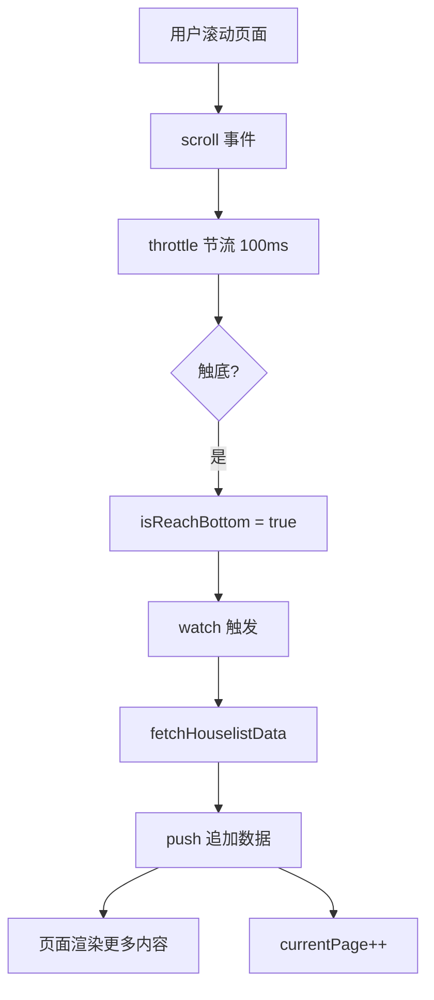

# Vue3 项目实战

## 学习目标

- 掌握从零搭建 Vue3 项目的完整流程
- 掌握项目目录结构的规划和组织
- 掌握网络请求的封装（Axios 实例、拦截器）
- 掌握 Store 的模块化设计
- 掌握常用自定义 Hooks 的开发
- 掌握 Vant UI 组件库的集成
- 掌握项目优化和常见问题处理

---

## 1. 项目概述

hy-trip 是一个旅行预订平台，包含首页、城市选择、搜索、收藏、订单、消息等模块。

### 1.1 项目技术栈

| 技术 | 用途 |
|------|------|
| Vue 3 + Vite | 前端框架和构建工具 |
| Vue Router 4 | 路由管理 |
| Pinia | 状态管理 |
| Axios | 网络请求 |
| Vant | 移动端 UI 组件库 |
| Less | CSS 预处理器 |

### 1.2 目录结构

```
hy-trip/
  src/
    assets/           # 静态资源（图片、数据）
      data/
        tabbar.js     # TabBar 配置数据
    components/       # 全局通用组件
      tab-bar/        # TabBar 底部导航
      house-item-v3/  # 房源卡片（类型3）
      house-item-v9/  # 房源卡片（类型9）
      search-bar/     # 搜索栏
    hooks/            # 自定义 Hooks
      useScroll.js    # 滚动监听 Hook
    router/           # 路由配置
      index.js
    services/         # 网络请求
      index.js        # 统一导出
      request/        # Axios 实例封装
        config.js     # 基础配置
        index.js      # HYRequest 类
      modules/        # 按模块划分的 API
        home.js
        city.js
    stores/           # Pinia Store
      index.js
      modules/
        home.js
        city.js
        search.js
        main.js
    utils/            # 工具函数
      load_assets.js  # 动态加载图片资源
      format_date.js  # 日期格式化
    views/            # 页面组件
      home/
      city/
      search/
      favor/
      order/
      message/
    App.vue           # 根组件
    main.js           # 入口文件
  vite.config.js
```

## 2. 项目启动

### 2.1 使用 Vite 创建项目

```bash
npm create vite@latest hy-trip
# 选择 Vue + JavaScript
cd hy-trip
npm install
npm install vue-router@4 pinia axios vant @vant/auto-import-resolver
npm install less -D
npm install unplugin-vue-components -D
```

### 2.2 配置 Vite

```javascript
// vite.config.js
import { defineConfig } from 'vite'
import vue from '@vitejs/plugin-vue'
import Components from 'unplugin-vue-components/vite'
import { VantResolver } from '@vant/auto-import-resolver'

export default defineConfig({
  plugins: [
    vue(),
    Components({
      resolvers: [VantResolver()]
    })
  ],
  resolve: {
    alias: {
      '@': '/src'
    }
  }
})
```

## 3. 网络请求封装

### 3.1 配置常量

```javascript
// services/request/config.js
export const BASE_URL = "http://123.207.32.32:1888/api"
export const TIMEOUT = 10000
```

### 3.2 HYRequest 类封装

```javascript
// services/request/index.js
import axios from 'axios'
import { BASE_URL, TIMEOUT } from './config'

class HYRequest {
  constructor(baseURL, timeout = 10000) {
    this.instance = axios.create({
      baseURL,
      timeout
    })
  }

  request(config) {
    return new Promise((resolve, reject) => {
      this.instance.request(config)
        .then(res => resolve(res.data))
        .catch(err => reject(err))
    })
  }

  get(config) {
    return this.request({ ...config, method: "get" })
  }

  post(config) {
    return this.request({ ...config, method: "post" })
  }
}

export default new HYRequest(BASE_URL, TIMEOUT)
```

### 3.3 按模块组织 API

```javascript
// services/modules/home.js
import hyRequest from '../request'

export function getHomeHotSuggests() {
  return hyRequest.get({
    url: "/home/hotSuggests"
  // 注意: 实际 url 可能不同
  })
}

export function getHomeCategories() {
  return hyRequest.get({
    url: "/home/categories"
  })
}

export function getHomeHouselist(currentPage) {
  return hyRequest.get({
    url: "/home/houselist",
    params: { page: currentPage }
  })
}
```

```javascript
// services/index.js
export * from "./modules/city"
export * from "./modules/home"
```

### 3.4 使用 store 对接网络请求

```javascript
// stores/modules/home.js
import { defineStore } from 'pinia'
import {
  getHomeHotSuggests,
  getHomeCategories,
  getHomeHouselist
} from '@/services'

const useHomeStore = defineStore("home", {
  state: () => ({
    hotSuggests: [],
    categories: [],
    currentPage: 1,
    houselist: []
  }),
  actions: {
    async fetchHotSuggestData() {
      const res = await getHomeHotSuggests()
      this.hotSuggests = res.data
    },
    async fetchCategoriesData() {
      const res = await getHomeCategories()
      this.categories = res.data
    },
    async fetchHouselistData() {
      const res = await getHomeHouselist(this.currentPage)
      // 追加数据（分页加载）
      this.houselist.push(...res.data)
      this.currentPage++
    }
  }
})

export default useHomeStore
```

> [!NOTE]
> `push(...res.data)` 是追加模式，用于实现"上拉加载更多"的分页效果。

## 4. TabBar 底部导航

### 4.1 路由配置

```javascript
// router/index.js
const router = createRouter({
  history: createWebHashHistory(),
  routes: [
    { path: "/", redirect: "/home" },
    { path: "/home", component: () => import("@/views/home/home.vue") },
    { path: "/favor", component: () => import("@/views/favor/favor.vue") },
    { path: "/order", component: () => import("@/views/order/order.vue") },
    { path: "/message", component: () => import("@/views/message/message.vue") },
    { path: "/city", component: () => import("@/views/city/city.vue") },
    {
      path: "/search",
      component: () => import("@/views/search/search.vue"),
      meta: { hideTabBar: true }
    }
  ]
})
```

### 4.2 TabBar 组件

```vue
<!-- components/tab-bar/tab-bar.vue -->
<template>
  <div class="tab-bar">
    <template v-for="(item, index) in tabbarData" :key="index">
      <div class="tab-item" @click="itemClick(item)">
        
        <span :class="{ active: currentIndex === index }">{{ item.text }}</span>
      </div>
    </template>
  </div>
</template>

<script setup>
import tabbarData from '@/assets/data/tabbar'
</script>
```

### 4.3 首页布局

```vue
<template>
  <div class="home">
    <home-nav-bar />
    <div class="banner">
      
    </div>
    <home-search-box />
    <home-categories />
    <home-content />
  </div>
</template>

<script setup>
import useHomeStore from '@/stores/modules/home'
import HomeNavBar from './cpns/home-nav-bar.vue'
import HomeSearchBox from './cpns/home-search-box.vue'
import HomeCategories from './cpns/home-categories.vue'
import HomeContent from './cpns/home-content.vue'

const homeStore = useHomeStore()
homeStore.fetchHotSuggestData()
homeStore.fetchCategoriesData()
homeStore.fetchHouselistData()
</script>
```

## 5. 上拉加载更多（useScroll Hook）

```javascript
// hooks/useScroll.js
import { onMounted, onUnmounted, ref } from 'vue'
import { throttle } from 'underscore'

export default function useScroll() {
  const isReachBottom = ref(false)
  const clientHeight = ref(0)
  const scrollTop = ref(0)
  const scrollHeight = ref(0)

  const scrollListenerHandler = throttle(() => {
    clientHeight.value = document.documentElement.clientHeight
    scrollTop.value = document.documentElement.scrollTop
    scrollHeight.value = document.documentElement.scrollHeight

    if (clientHeight.value + scrollTop.value >= scrollHeight.value) {
      isReachBottom.value = true
    }
  }, 100)

  onMounted(() => {
    window.addEventListener("scroll", scrollListenerHandler)
  })

 ​onUnmounted(() => {
    window.removeEventListener("scroll", scrollListenerHandler)
  })

  return { isReachBottom, clientHeight, scrollTop, scrollHeight }
}
```

**在页面中使用：**

```vue
<script setup>
import { watch } from 'vue'
import { computed } from '@vue/reactivity'
import useHomeStore from '@/stores/modules/home'
import useScroll from '@/hooks/useScroll'

const homeStore = useHomeStore()
homeStore.fetchHouselistData()

const { isReachBottom, scrollTop } = useScroll()

// 滚动到底部时加载更多
watch(isReachBottom, (newValue) => {
  if (newValue) {
    homeStore.fetchHouselistData().then(() => {
      isReachBottom.value = false
    })
  }
})

// 搜索栏固定（根据滚动位置控制显示）
const isShowSearchBar = computed(() => {
  return scrollTop.value >= 360
})
</script>
```



> [!TIP]
> 使用 `throttle` 节流优化滚动事件性能，使用 `isReachBottom` + `watch` 模式避免在滚动回调中直接发起网络请求。

## 6. 城市选择页面

### 6.1 Store

```javascript
// stores/modules/city.js
import { defineStore } from 'pinia'
import { getAllCityData } from '@/services'

const useCityStore = defineStore("city", {
  state: () => ({
    allCityData: {}
  }),
  actions: {
    async fetchAllCityData() {
      const res = await getAllCityData()
      this.allCityData = res.data
    }
  }
})
```

### 6.2 页面结构

```vue
<!-- views/city/city.vue -->
<template>
  <div class="city">
    <city-group :group-data="allCityData" />
  </div>
</template>

<script setup>
import { onActivated } from 'vue'
import useCityStore from '@/stores/modules/city'
import CityGroup from './cpns/city-group.vue'

const cityStore = useCityStore()

onActivated(() => {
  cityStore.fetchAllCityData()
})
</script>
```

## 7. 搜索页面

```vue
<!-- views/search/search.vue -->

<template>
  <div class="search">
    <search-bar :start-date="startDate" :end-date="endDate" />
    <!-- 搜索结果 -->
  </div>
</template>

<script setup>
import SearchBar from '@/components/search-bar/search-bar.vue'
import useMainStore from '@/stores/modules/main'

const mainStore = useMainStore()
const { startDate, endDate } = storeToRefs(mainStore)
</script>
```

## 8. Vant 集成

```javascript
// 使用自动导入插件（vite.config.js）
import Components from 'unplugin-vue-components/vite'
import { VantResolver } from '@vant/auto-import-resolver'

// 插件配置后，在组件中直接使用 Vant 组件
```

```vue
<template>
  <!-- 使用 Vant NavBar -->
  <van-nav-bar title="标题" left-text="返回" left-arrow />
  <!-- 使用 Vant Search -->
  <van-search v-model="searchValue" shape="round" />
</template>
```

## 9. 项目优化技巧

### 9.1 动态加载图片

```javascript
// utils/load_assets.js
export function loadImage(url) {
  // 根据环境动态加载静态资源
  return new URL(url, import.meta.url).href
}
```

### 9.2 函数节流

```javascript
import { throttle } from 'underscore'

// 对滚动处理函数节流
const scrollListenerHandler = throttle(() => {
  // 处理逻辑
}, 100)
```

### 9.3 图片懒加载

集成 `vue-lazyload` 或使用 Vant 的 `LazyLoad` 指令：

```vue

```

### 9.4 Keep-Alive 缓存

```vue
<!-- App.vue -->
<router-view v-slot="{ Component }">
  <keep-alive>
    <component :is="Component" />
  </keep-alive>
</router-view>
```

## 自测题

1. 项目中使用什么方式封装 Axios？为什么要封装？
2. 分页加载数据时，为什么使用 `push(...)` 而不是直接赋值？
3. 自定义 `useScroll` Hook 解决了哪些问题？
4. 什么情况下使用 `meta.hideTabBar` 控制 TabBar 显示？
5. 使用 Vite 的 `unplugin-vue-components` 有哪些好处？

<details>
<summary>查看答案</summary>

1. 使用 HYRequest 类封装，统一配置 baseURL、timeout，并封装 get/post 方法。封装使代码更易于维护和复用。
2. `push(...)` 实现追加（分页加载），直接赋值会覆盖已有数据。每页数据追加到数组末尾。
3. 抽离滚动监听的通用逻辑（挂载/卸载事件、节流处理、触底检测），避免多个页面重复编写。
4. 对于全屏覆盖页面如搜索页、城市选择页，不需要显示底部 TabBar。
5. 自动导入组件，无需手动 import 和注册，减少样板代码。

</details>