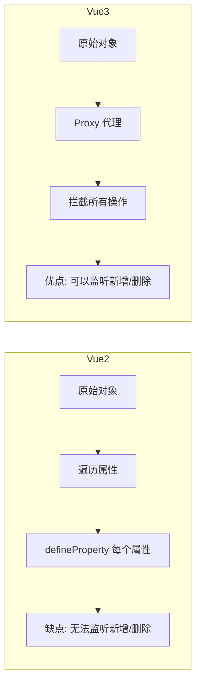
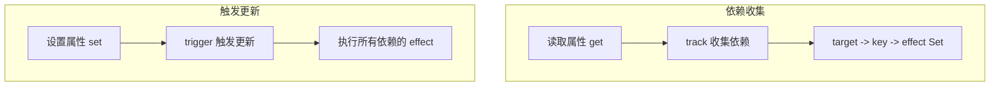
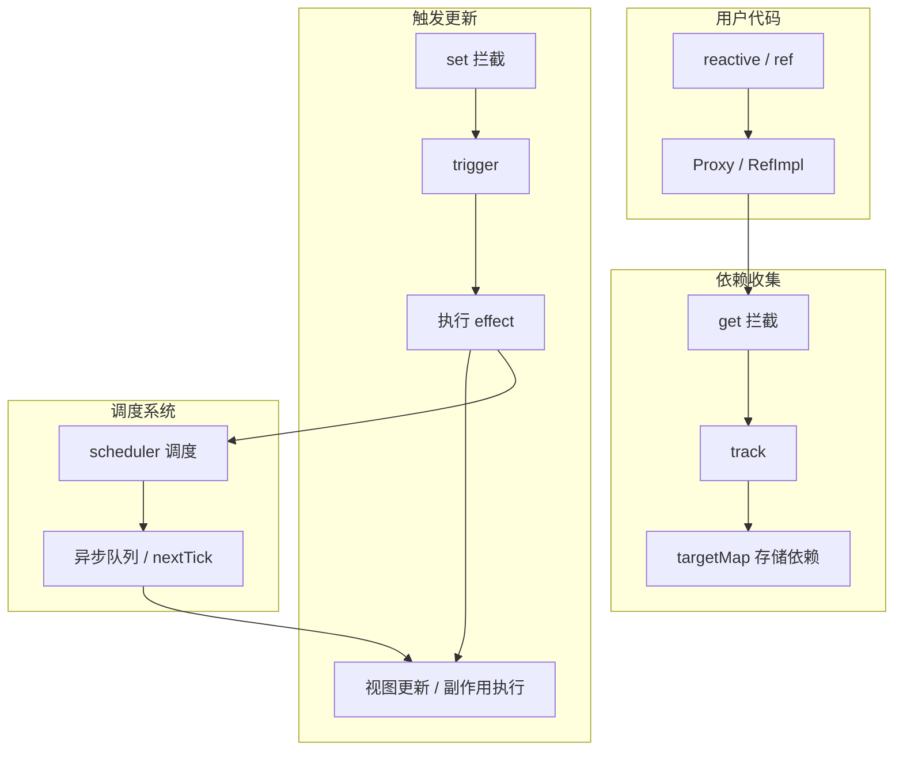

# Vue3 响应式原理

## 学习目标

- 理解 Vue2 和 Vue3 响应式方案的差异
- 掌握 Proxy 的核心 API 和使用方式
- 掌握 Reflect 的作用和用法
- 理解 Vue3 响应式系统的整体架构
- 理解依赖收集和触发更新的机制（effect、track、trigger）
- 理解 ref 和 reactive 的底层实现

---

## 1. Vue2 vs Vue3 响应式

### 1.1 Vue2 的 Object.defineProperty

Vue2 使用 `Object.defineProperty` 劫持对象的属性访问器。

```javascript
function defineReactive(obj, key, val) {
  Object.defineProperty(obj, key, {
    get() {
      return val
    },
    set(newValue) {
      if (newValue !== val) {
        val = newValue
        // 触发更新...
      }
    }
  })
}
```

**Vue2 响应式的缺陷**：

- 无法侦测**新增属性**（需用 `Vue.set`）
- 无法侦测**删除属性**（需用 `Vue.delete`）
- 无法直接侦测**数组索引和长度变化**
- 需要递归遍历对象所有属性
- 性能较差

### 1.2 Vue3 的 Proxy

Vue3 使用 `Proxy` 代理整个对象，无需单独处理每个属性。



| 对比维度 | Vue2 (Object.defineProperty) | Vue3 (Proxy) |
|---------|------------------------------|--------------|
| 监测方式 | 重定义属性的 getter/setter | 代理整个对象 |
| 新增属性 | 无法自动监测 | 自动监测 |
| 删除属性 | 无法自动监测 | 自动监测 |
| 数组变化 | 有限支持（7 个方法） | 完全支持 |
| 性能 | 递归遍历所有属性 | 懒代理（访问时再代理） |
| 兼容性 | IE9+ | 不支持 IE |

## 2. Proxy 基础

### 2.1 基本用法

```javascript
const target = {
  name: "why",
  age: 18
}

const handler = {
  get(target, key, receiver) {
    console.log(`获取属性: ${key}`)
    return Reflect.get(target, key, receiver)
  },
  set(target, key, value, receiver) {
    console.log(`设置属性: ${key} = ${value}`)
    return Reflect.set(target, key, value, receiver)
  },
  deleteProperty(target, key) {
    console.log(`删除属性: ${key}`)
    return Reflect.deleteProperty(target, key)
  },
  has(target, key) {
    console.log(`判断属性: ${key}`)
    return Reflect.has(target, key)
  }
}

const proxy = new Proxy(target, handler)

proxy.name        // 输出: 获取属性: name
proxy.age = 20    // 输出: 设置属性: age = 20
delete proxy.name // 输出: 删除属性: name
"age" in proxy     // 输出: 判断属性: age
```

### 2.2 Proxy 可拦截的操作

| 拦截操作 | 触发条件 |
|---------|---------|
| `get` | 读取属性值 |
| `set` | 设置属性值 |
| `deleteProperty` | 删除属性 |
| `has` | `in` 操作符 |
| `ownKeys` | `Object.keys()` / `for...in` |
| `getOwnPropertyDescriptor` | `Object.getOwnPropertyDescriptor()` |
| `defineProperty` | `Object.defineProperty()` |
| `apply` | 调用函数 |
| `construct` | `new` 操作符 |

## 3. Reflect 的作用

`Reflect` 是一个内置对象，提供与 Proxy handler 一一对应的 API。

### 3.1 为什么要用 Reflect 而不是直接操作 target

```javascript
// 问题：直接设置 this 指向问题
const obj = {
  _name: "why",
  get name() {
    return this._name
  },
  set name(value) {
    this._name = value
  }
}

const proxy = new Proxy(obj, {
  get(target, key, receiver) {
    // 直接使用 target[key] 可能有问题
    // return target[key]  // 这里的 this 指向 target，不是 proxy

    // 使用 Reflect，receiver 可正确传递 this
    return Reflect.get(target, key, receiver)
  },
  set(target, key, value, receiver) {
    return Reflect.set(target, key, value, receiver)
  }
})
```

> [!NOTE]
> `Reflect.get` / `Reflect.set` 的 `receiver` 参数可以指定 `this` 指向。当对象通过继承访问属性时，这尤为重要，可以保证 `this` 指向正确的代理对象。

## 4. effect 依赖追踪

Vue3 的响应式系统核心是**依赖收集**和**触发更新**机制。



### 4.1 简单实现

```javascript
// 当前正在执行的 effect
let activeEffect = null

// 存储依赖的数据结构
const targetMap = new WeakMap()

class ReactiveEffect {
  constructor(fn) {
    this.fn = fn
  }

  run() {
    activeEffect = this
    this.fn()
    activeEffect = null
  }
}

// 依赖收集
function track(target, key) {
  if (!activeEffect) return

  let depsMap = targetMap.get(target)
  if (!depsMap) {
    depsMap = new Map()
    targetMap.set(target, depsMap)
  }

  let deps = depsMap.get(key)
  if (!deps) {
    deps = new Set()
    depsMap.set(key, deps)
  }

  deps.add(activeEffect)
}

// 触发更新
function trigger(target, key) {
  const depsMap = targetMap.get(target)
  if (!depsMap) return

  const deps = depsMap.get(key)
  if (deps) {
    deps.forEach(effect => effect.run())
  }
}

// 响应式代理
function reactive(raw) {
  return new Proxy(raw, {
    get(target, key, receiver) {
      const result = Reflect.get(target, key, receiver)
      track(target, key)  // 收集依赖
      return result
    },
    set(target, key, value, receiver) {
      const result = Reflect.set(target, key, value, receiver)
      trigger(target, key) // 触发更新
      return result
    }
  })
}

// 使用
const state = reactive({ count: 0 })

new ReactiveEffect(() => {
  console.log("effect 执行:", state.count)
}).run()

// 输出：effect 执行: 0

state.count++  // 输出：effect 执行: 1
state.count++  // 输出：effect 执行: 2
```

### 4.2 数据结构

依赖存储采用三级结构：

```
targetMap (WeakMap)
  target (对象) -> depsMap (Map)
    key (属性名) -> deps (Set)
      effect (ReactiveEffect 实例)
      effect (ReactiveEffect 实例)
```

> [!TIP]
> 使用 `WeakMap` 存储 target 到 depsMap 的映射，当 target 对象不再被引用时，可以自动被垃圾回收，避免内存泄漏。

## 5. reactive 的实现

### 5.1 完整实现

```javascript
import { track, trigger } from './effect'

// 缓存已经代理过的对象
const reactiveMap = new WeakMap()

function reactive(target) {
  // 只代理对象类型
  if (typeof target !== 'object' || target === null) {
    return target
  }

  // 如果已经代理过，直接返回缓存的代理
  if (reactiveMap.has(target)) {
    return reactiveMap.get(target)
  }

  // 已经是代理的跳过
  if (target.__v_raw) {
    return target
  }

  const proxy = new Proxy(target, {
    get(target, key, receiver) {
      // 如果是访问 __v_raw，返回原始对象
      if (key === '__v_raw') return target

      const result = Reflect.get(target, key, receiver)

      // 收集依赖
      track(target, key)

      // 懒代理：如果结果是对象，递归代理
      if (typeof result === 'object' && result !== null) {
        return reactive(result)
      }

      return result
    },
    set(target, key, value, receiver) {
      const oldValue = target[key]
      const hadKey = Object.prototype.hasOwnProperty.call(target, key)

      const result = Reflect.set(target, key, value, receiver)

      // 只有值真正变化时才触发
      if (oldValue !== value) {
        // 新增还是修改
        if (!hadKey) {
          console.log('新增属性')
        }
        trigger(target, key)
      }

      return result
    },
    deleteProperty(target, key) {
      const hadKey = Object.prototype.hasOwnProperty.call(target, key)
      const result = Reflect.deleteProperty(target, key)

      if (hadKey) {
        trigger(target, key)
      }

      return result
    },
    has(target, key) {
      const result = Reflect.has(target, key)
      track(target, key)
      return result
    },
    ownKeys(target) {
      track(target, Symbol.for('iterate'))
      return Reflect.ownKeys(target)
    }
  })

  reactiveMap.set(target, proxy)
  return proxy
}
```

## 6. ref 的实现

`ref` 的核心是将一个值包装为一个带有 `value` 属性的响应式对象。

```javascript
import { reactive } from './reactive'
import { track, trigger } from './effect'

function ref(value) {
  // 如果是对象类型，底层使用 reactive
  if (typeof value === 'object' && value !== null) {
    return reactive(value)
  }

  return new RefImpl(value)
}

class RefImpl {
  constructor(value) {
    this.__v_isRef = true  // 标记为 ref
    this._value = value
  }

  // 在模板中自动解包：当作为 reactive 的属性时也自动解包
  get value() {
    track(this, 'value')
    return this._value
  }

  set value(newValue) {
    if (newValue !== this._value) {
      this._value = newValue
      trigger(this, 'value')
    }
  }
}
```

### 6.1 模板中的自动解包

在模板中使用 ref 时不需要写 `.value`，是因为 Vue 在编译模板时做了处理。但在 `setup` 函数中必须手动 `.value`。

### 6.2 shallowRef 和 triggerRef

```javascript
function shallowRef(value) {
  return new ShallowRefImpl(value)
}

class ShallowRefImpl {
  constructor(value) {
    this.__v_isRef = true
    this._value = value
  }

  get value() {
    track(this, 'value')
    return this._value
  }

  set value(newValue) {
    if (newValue !== this._value) {
      this._value = newValue
      trigger(this, 'value')
    }
  }
}

// 手动触发与 shallowRef 关联的副作用
function triggerRef(ref) {
  trigger(ref, 'value')
}
```

## 7. computed 的实现

```javascript
import { ReactiveEffect } from './effect'

function computed(getterOrOptions) {
  let getter, setter

  if (typeof getterOrOptions === 'function') {
    getter = getterOrOptions
    setter = () => {
      console.warn('Computed value is readonly')
    }
  } else {
    getter = getterOrOptions.get
    setter = getterOrOptions.set || (() => {})
  }

  return new ComputedRefImpl(getter, setter)
}

class ComputedRefImpl {
  constructor(getter, setter) {
    this._setter = setter
    this._dirty = true        // 缓存标志
    this._value = undefined

    this.effect = new ReactiveEffect(getter, () => {
      // 调度器：依赖变化时标记脏值但不立即执行
      if (!this._dirty) {
        this._dirty = true
        trigger(this, 'value')
      }
    })
  }

  get value() {
    track(this, 'value')

    // 懒计算：只有被访问且依赖变化时才重新计算
    if (this._dirty) {
      this._dirty = false
      this._value = this.effect.run()
    }

    return this._value
  }

  set value(newValue) {
    this._setter(newValue)
  }
}
```

> [!NOTE]
> computed 实现了**懒计算**和**缓存**特性：只有在值被访问时才计算，且依赖未变化时直接返回缓存值。

## 8. 整体架构总结



**Vue3 响应式的工作流程**：

1. **初始化**：`reactive` / `ref` 创建响应式对象
2. **渲染**：执行渲染函数 -> 读取响应式数据 -> `track` 收集依赖
3. **更新**：修改数据 -> `set` 拦截 -> `trigger` 触发依赖
4. **调度**：effect 调度器 -> 异步队列 -> 批量更新 DOM
5. **渲染**：再次执行渲染函数，使用最新的数据

## 自测题

1. Vue3 为什么选择 Proxy 而非 Object.defineProperty？
2. Reflect 在响应式系统中扮演什么角色？
3. 依赖收集的三级数据结构是什么？为什么使用 WeakMap？
4. ref 的自动解包在模板中是如何实现的？
5. computed 为什么是"懒计算"的？它的缓存机制是怎样的？

<details>
<summary>查看答案</summary>

1. Proxy 可以拦截新增/删除属性、完全支持数组、不需要递归遍历所有属性（懒代理），性能更好。
2. Reflect 提供与 Proxy handler 一一对应的方法，receiver 参数可以正确传递 this 指向，确保在继承场景中也能正确触发响应式。
3. targetMap(WeakMap) -> depsMap(Map) -> deps(Set)。WeakMap 的键是弱引用，当 target 对象不再被引用时可以自动垃圾回收。
4. 模板编译时，Vue 编译器对 ref 类型的绑定自动添加 `.value` 访问。在 reactive 中作为属性时，Proxy 的 get 拦截中判断如果是 ref 类型则自动解包返回 `.value`。
5. computed 的 `_dirty` 标志控制：初始化时 `_dirty = true`，首次 get 时计算并置为 false；依赖变化时通过调度器将 `_dirty` 设为 true 但不立即计算，等到下次 get 时再计算。这样避免了不必要的计算。

</details>