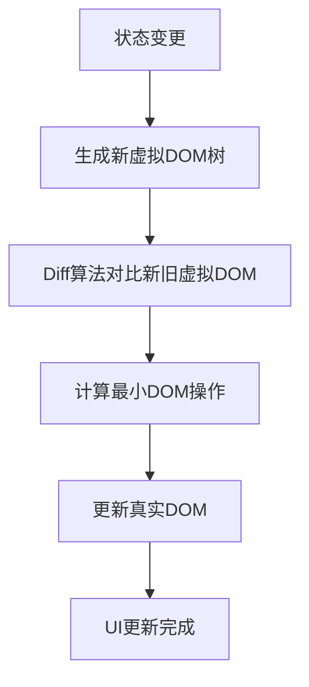
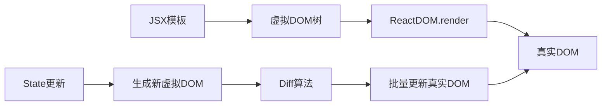

# React 和 JSX

## 学习目标

- 理解 React 的设计理念和核心特点
- 掌握 JSX 语法及其编译原理
- 理解虚拟 DOM 和元素渲染机制
- 能够创建函数组件和类组件

---

## React 介绍

### 什么是 React

React 是由 Facebook（现 Meta）开发和维护的一个声明式、高效、灵活的用于构建用户界面的 JavaScript 库。它不是完整的 MVC 框架，而专注于视图层（View）。

### React 的设计理念

1. **声明式开发**：开发者描述 UI 应该是什么样子，React 负责更新和渲染
2. **组件化**：将 UI 拆分为独立、可复用的小部件
3. **单向数据流**：数据从父组件流向子组件，易于追踪和调试
4. **学习一次，到处编写**：React Native、React 360 等

### React 的核心特点

- **虚拟 DOM（Virtual DOM）**：通过 JS 对象模拟真实 DOM，最小化 DOM 操作
- **Diff 算法**：高效对比虚拟 DOM 树的差异，只更新变化的部分
- **合成事件（SyntheticEvent）**：跨浏览器兼容的事件系统



---

## JSX 语法

### JSX 的本质

JSX 是 JavaScript 的语法扩展，看起来像 HTML/XML，但最终会被 Babel 编译为 `React.createElement()` 调用。

```jsx
// JSX 写法
const element = <h1 className="greeting">Hello, World!</h1>;

// 编译后的 JavaScript
const element = React.createElement(
  'h1',
  { className: 'greeting' },
  'Hello, World!'
);
```

### JSX 中的表达式

在 JSX 中，使用 `{}` 嵌入 JavaScript 表达式：

```jsx
const name = 'React';
const element = (
  <div>
    <h1>Hello, {name}!</h1>
    <p>{2 + 3 * 4}</p>
    <p>{new Date().toLocaleString()}</p>
  </div>
);
```

### JSX 中的属性

- 使用驼峰命名（camelCase）：`className`、`tabIndex`、`htmlFor`
- 使用 `{}` 传入 JavaScript 表达式作为属性值

```jsx
const element = (
  <div className="container" tabIndex={0}>
    <label htmlFor="input">Name:</label>
    <input id="input" type="text" disabled={false} />
  </div>
);
```

### JSX 的条件渲染

```jsx
function Greeting({ isLoggedIn }) {
  // 三元运算符
  return (
    <div>
      {isLoggedIn ? <UserGreeting /> : <GuestGreeting />}
      {/* 逻辑与 */}
      {isLoggedIn && <Dashboard />}
    </div>
  );
}
```

### JSX 注意事项

- JSX 必须有一个根元素（可以使用 Fragment `<></>`）
- JSX 中不能使用 `if/else` 语句，但可以使用三元表达式或逻辑运算符
- JSX 中的注释使用 `{/* 注释内容 */}`

---

## 元素渲染

### 虚拟 DOM 的工作原理

虚拟 DOM 是一个轻量级的 JavaScript 对象，是对真实 DOM 的抽象表示。



```jsx
// 虚拟 DOM 对象结构
const vdom = {
  type: 'div',
  props: {
    className: 'container',
    children: [
      { type: 'h1', props: { children: 'Hello' } }
    ]
  }
};
```

### 元素渲染到页面

```jsx
import React from 'react';
import ReactDOM from 'react-dom/client';

const root = ReactDOM.createRoot(document.getElementById('root'));
const element = <h1>Hello, React!</h1>;
root.render(element);
```

### React 18 的并发模式

React 18 引入了并发模式（Concurrent Mode），允许 React 中断渲染任务、处理更高优先级的更新，然后继续或放弃当前渲染。

---

## 组件

### 函数组件

```jsx
// 函数组件（推荐）
function Welcome(props) {
  return <h1>Hello, {props.name}</h1>;
}

// 箭头函数
const Welcome = (props) => {
  return <h1>Hello, {props.name}</h1>;
};
```

### 类组件

```jsx
import React, { Component } from 'react';

class Welcome extends Component {
  render() {
    return <h1>Hello, {this.props.name}</h1>;
  }
}
```

### 组件命名规范

- 组件名称必须以大写字母开头
- React 会将小写字母开头的标签视为原生 DOM 标签

### 组件的组合与提取

```jsx
// 组合组件
function App() {
  return (
    <div>
      <Welcome name="Alice" />
      <Welcome name="Bob" />
      <Welcome name="Charlie" />
    </div>
  );
}
```

---

## React 开发环境搭建

### 使用 Create React App

```bash
npx create-react-app my-app
cd my-app
npm start
```

### 使用 Vite（推荐）

```bash
npm create vite@latest my-app -- --template react
cd my-app
npm install
npm run dev
```

### 项目结构

```
my-app/
├── public/
│   └── index.html        # HTML 模板
├── src/
│   ├── App.jsx           # 根组件
│   ├── App.css           # 根组件样式
│   ├── index.jsx         # 入口文件
│   └── index.css         # 全局样式
├── package.json
└── vite.config.js
```

---

## 自测题

### 问题 1
JSX 被 Babel 编译后实际上调用的是什么函数？

<details>
<summary>查看答案</summary>
`React.createElement(type, props, ...children)`。JSX 只是语法糖，最终会被编译为 `React.createElement` 函数调用，这个函数会返回一个描述 DOM 结构的 JavaScript 对象（虚拟 DOM）。
</details>

### 问题 2
React 中为什么推荐使用函数组件而不是类组件？

<details>
<summary>查看答案</summary>
1. 函数组件更简洁，没有 `this` 绑定问题
2. React Hooks 让函数组件拥有了类组件的全部能力
3. 函数组件在打包时体积更小
4. 函数组件更容易测试和推理
</details>

### 问题 3
虚拟 DOM 相比直接操作真实 DOM 的优势是什么？

<details>
<summary>查看答案</summary>
1. 减少直接操作真实 DOM 带来的性能损耗（DOM API 调用成本高）
2. 通过 Diff 算法只更新变化的部分，避免全量渲染
3. 跨平台能力：虚拟 DOM 可以映射到不同平台（Web、Mobile）
4. 批量更新：将多次状态变更合并为一次 DOM 操作
</details>