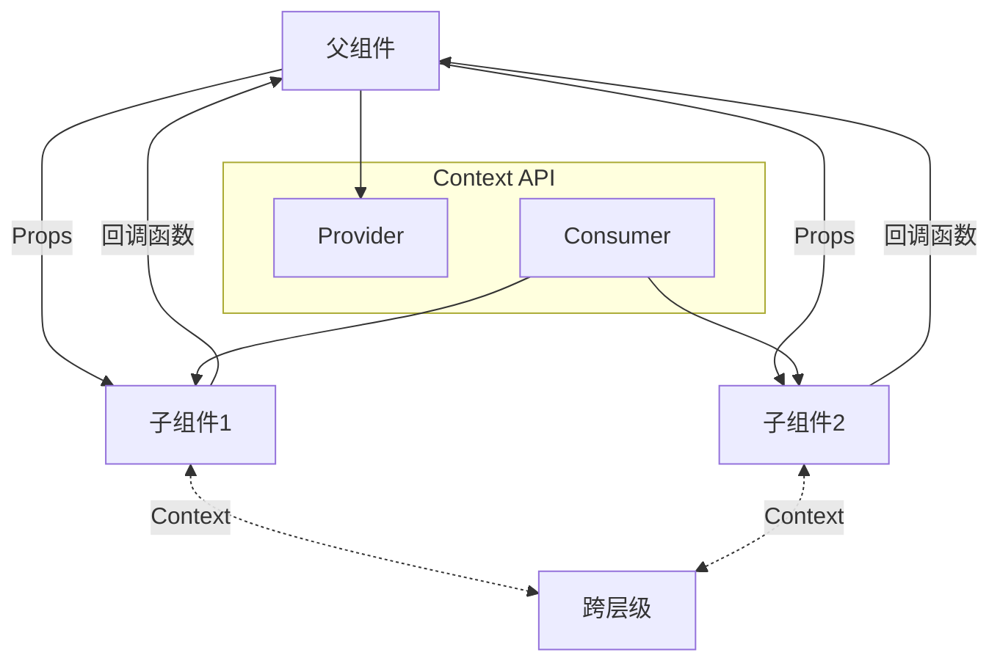

# React 组件通信

## 学习目标

- 掌握 Props 的定义和使用
- 理解父子组件通信、兄弟组件通信、跨层级通信
- 掌握插槽（Slot / children）模式
- 理解 Context 的使用场景和 API

---

## Props

### Props 的基本使用

Props 是父组件传递给子组件的数据，子组件不能修改 props（遵循单向数据流原则）。

```jsx
// 父组件传递 props
function App() {
  return (
    <Child
      name="React"
      version={18}
      isStable={true}
      features={['Hooks', 'Concurrent', 'Suspense']}
      onAction={() => console.log('Action triggered')}
    />
  );
}

// 子组件接收 props
function Child(props) {
  return (
    <div>
      <h2>{props.name}</h2>
      <p>Version: {props.version}</p>
    </div>
  );
}
```

### Props 的类型验证

使用 `prop-types` 库进行类型检查（开发环境有效）：

```jsx
import PropTypes from 'prop-types';

function User({ name, age, isAdmin, hobbies }) {
  return (
    <div>
      <p>Name: {name}</p>
      <p>Age: {age}</p>
    </div>
  );
}

User.propTypes = {
  name: PropTypes.string.isRequired,
  age: PropTypes.number,
  isAdmin: PropTypes.bool,
  hobbies: PropTypes.arrayOf(PropTypes.string),
  onUpdate: PropTypes.func
};

User.defaultProps = {
  age: 18,
  isAdmin: false
};
```

### Props 解构

```jsx
// 在函数参数中解构
function Child({ name, version, children }) {
  return (
    <div>
      <h2>{name}</h2>
      <p>{version}</p>
      {children}
    </div>
  );
}
```

---

## 组件通信方式



### 1. 父传子：Props

```jsx
function Parent() {
  const data = '来自父组件的数据';
  return <Child message={data} />;
}

function Child({ message }) {
  return <p>{message}</p>;
}
```

### 2. 子传父：回调函数

```jsx
function Parent() {
  const handleChildData = (data) => {
    console.log('收到子组件数据:', data);
  };
  return <Child onSend={handleChildData} />;
}

function Child({ onSend }) {
  return (
    <button onClick={() => onSend('子组件消息')}>
      发送数据给父组件
    </button>
  );
}
```

### 3. 兄弟组件通信

通过共同的父组件中转：

```jsx
function Parent() {
  const [sharedData, setSharedData] = useState('');

  return (
    <div>
      <SiblingA onDataChange={setSharedData} />
      <SiblingB data={sharedData} />
    </div>
  );
}
```

### 4. 跨层级通信：Context

```jsx
// 1. 创建 Context
import React, { createContext, useContext } from 'react';
const ThemeContext = createContext('light');

// 2. Provider 提供数据
function App() {
  return (
    <ThemeContext.Provider value="dark">
      <Toolbar />
    </ThemeContext.Provider>
  );
}

// 3. Consumer 消费数据（方式一：useContext）
function Button() {
  const theme = useContext(ThemeContext);
  return <button className={theme}>按钮</button>;
}

// 4. Consumer 消费数据（方式二：Consumer 组件）
function Button2() {
  return (
    <ThemeContext.Consumer>
      {theme => <button className={theme}>按钮</button>}
    </ThemeContext.Consumer>
  );
}
```

---

## 插槽 / Children

### 默认插槽（children）

```jsx
function Card({ children }) {
  return (
    <div className="card">
      <div className="card-body">
        {children}
      </div>
    </div>
  );
}

// 使用
<Card>
  <h2>标题</h2>
  <p>内容</p>
</Card>
```

### 具名插槽

```jsx
function Layout({ header, sidebar, children }) {
  return (
    <div className="layout">
      <header>{header}</header>
      <aside>{sidebar}</aside>
      <main>{children}</main>
    </div>
  );
}

// 使用
<Layout
  header={<Header />}
  sidebar={<Sidebar />}
>
  <Main />
</Layout>
```

### render props 模式

```jsx
function DataProvider({ render }) {
  const [data, setData] = useState(null);

  useEffect(() => {
    fetchData().then(setData);
  }, []);

  return render(data);
}

// 使用
<DataProvider
  render={(data) => (
    <div>
      {data ? <DataList data={data} /> : <Loading />}
    </div>
  )}
/>
```

---

## Context 深入

### Context 的完整 API

```jsx
// 创建
const MyContext = React.createContext(defaultValue);

// Provider
<MyContext.Provider value={/* 某个值 */}>

// Consumer
<MyContext.Consumer>
  {value => /* 基于 context 值渲染 */}
</MyContext.Consumer>

// useContext Hook
const value = useContext(MyContext);
```

### 多个 Context

```jsx
const ThemeContext = createContext('light');
const UserContext = createContext({ name: '', role: '' });

function App() {
  return (
    <ThemeContext.Provider value="dark">
      <UserContext.Provider value={{ name: 'Alice', role: 'admin' }}>
        <Dashboard />
      </UserContext.Provider>
    </ThemeContext.Provider>
  );
}

function Dashboard() {
  const theme = useContext(ThemeContext);
  const user = useContext(UserContext);
  return (
    <div className={theme}>
      <p>Welcome, {user.name}</p>
    </div>
  );
}
```

### Context 的性能优化

Provider 的 value 发生变化时，所有 Consumer 都会重新渲染。使用 `useMemo` 优化：

```jsx
function AppProvider({ children }) {
  const [user, setUser] = useState(null);

  const value = useMemo(() => ({
    user,
    login: (data) => setUser(data),
    logout: () => setUser(null)
  }), [user]);

  return (
    <UserContext.Provider value={value}>
      {children}
    </UserContext.Provider>
  );
}
```

---

## 自测题

### 问题 1
React 中为什么 props 是只读的？

<details>
<summary>查看答案</summary>
React 遵循单向数据流原则。如果子组件可以修改 props，会导致数据流混乱难以追踪。props 由父组件管理，子组件只能通过回调函数通知父组件修改。这保证了数据的可预测性和调试的便利性。
</details>

### 问题 2
Context 和 Props 分别适用于什么场景？

<details>
<summary>查看答案</summary>
- Props：适用于父子组件间的直接通信，数据传递层级少（1-2 层）
- Context：适用于跨多层组件传递共享数据（主题、用户信息、语言等全局状态），避免 props drilling（逐层透传）
</details>

### 问题 3
插槽模式（children）相比直接传 props 有什么优势？

<details>
<summary>查看答案</summary>
1. 更灵活的组件组合：父组件可以控制子组件的结构和顺序
2. 逻辑与 UI 分离：容器组件专注于布局，内容由使用者决定
3. 减少 props 数量：避免为每个子元素定义 props
4. 更好的可读性：JSX 嵌套结构更接近 HTML 语义
</details>