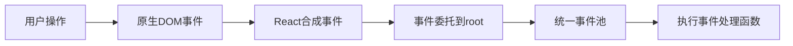
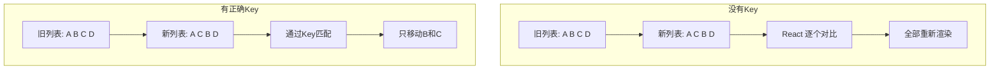

# React 事件和列表

## 学习目标

- 掌握 React 事件绑定的方式和区别
- 理解事件处理中的 this 指向
- 掌握列表渲染和 Key 的正确使用
- 能够实现购物车案例

---

## 事件绑定

### 基本事件绑定

```jsx
function Button() {
  const handleClick = (event) => {
    console.log('Button clicked', event);
  };

  return <button onClick={handleClick}>点击</button>;
}
```

### 合成事件（SyntheticEvent）

React 将原生 DOM 事件封装为合成事件，提供跨浏览器兼容性：



```jsx
function EventDemo() {
  const handleEvent = (e) => {
    // e 是 SyntheticEvent
    console.log(e.nativeEvent);   // 原生事件
    console.log(e.type);          // 事件类型
    console.log(e.target);        // 触发事件的 DOM 元素

    // 异步访问事件属性需要调用 persist()（React 17 之前）
    // React 18 已不需要
  };

  return <button onClick={handleEvent}>Click</button>;
}
```

### 事件绑定的 4 种方式（类组件）

```jsx
class Toggle extends React.Component {
  constructor(props) {
    super(props);
    this.state = { isOn: true };

    // 方式1：构造函数中 bind
    this.handleClick1 = this.handleClick1.bind(this);
  }

  // 方式2：使用 class fields
  handleClick1() {
    this.setState(prev => ({ isOn: !prev.isOn }));
  }

  handleClick2 = () => {
    this.setState(prev => ({ isOn: !prev.isOn }));
  }

  render() {
    return (
      <div>
        {/* 方式1 */}
        <button onClick={this.handleClick1}>方式1</button>
        {/* 方式2 */}
        <button onClick={this.handleClick2}>方式2</button>
        {/* 方式3：箭头函数（不推荐，每次渲染创建新函数） */}
        <button onClick={() => this.handleClick1()}>方式3</button>
        {/* 方式4：bind（不推荐，每次渲染创建新函数） */}
        <button onClick={this.handleClick1.bind(this)}>方式4</button>
      </div>
    );
  }
}
```

### 事件参数传递

```jsx
function List({ items }) {
  const handleDelete = (id, event) => {
    console.log('Delete item:', id);
  };

  return (
    <ul>
      {items.map(item => (
        <li key={item.id}>
          {item.name}
          {/* 方式1：箭头函数 */}
          <button onClick={(e) => handleDelete(item.id, e)}>
            删除
          </button>
        </li>
      ))}
    </ul>
  );
}
```

### 常见事件类型

```jsx
function EventTypes() {
  return (
    <div>
      {/* 鼠标事件 */}
      <div onClick={handleClick} onContextMenu={handleRightClick}
           onDoubleClick={handleDblClick} onMouseEnter={handleEnter}>
      </div>

      {/* 键盘事件 */}
      <input onKeyDown={handleKeyDown} onKeyUp={handleKeyUp}
             onKeyPress={handleKeyPress} />

      {/* 表单事件 */}
      <form onSubmit={handleSubmit}>
        <input onChange={handleChange} onFocus={handleFocus}
               onBlur={handleBlur} />
      </form>

      {/* 滚动事件 */}
      <div onScroll={handleScroll}></div>
    </div>
  );
}
```

---

## 列表渲染

### 使用 map 渲染列表

```jsx
function NumberList({ numbers }) {
  const listItems = numbers.map(number =>
    <li>{number}</li>
  );
  return <ul>{listItems}</ul>;
}
```

### Key 的作用

Key 帮助 React 识别哪些元素发生了变化、被添加或被移除。



### Key 的最佳实践

```jsx
// 正确：使用唯一且稳定的 ID
const items = data.map(item => <li key={item.id}>{item.name}</li>);

// 尽量避免：使用索引（只在列表静态且不会重新排序时使用）
const items = data.map((item, index) => <li key={index}>{item.name}</li>);

// 错误：使用随机数
const items = data.map(item => <li key={Math.random()}>{item.name}</li>);
```

### 使用索引作为 Key 的问题

当列表发生以下变化时，使用索引作为 Key 会导致渲染错误：

1. 在列表中间插入或删除元素
2. 列表重新排序
3. 列表项包含输入框等有状态的组件

```jsx
// 反例：列表动态变化时使用索引作为 key
function BuggyList() {
  const [items, setItems] = useState(['A', 'B', 'C']);

  const insertAtTop = () => {
    setItems([`新元素`, ...items]);  // 索引全部变化！
  };

  return (
    <ul>
      {items.map((item, index) => (
        <li key={index}>  {/* 问题：所有元素的 key 都会变 */}
          {item}
        </li>
      ))}
    </ul>
  );
}
```

---

## 购物车案例

### 组件结构

```
App
├── Header (购物车标题)
├── CartList (商品列表)
│   └── CartItem (商品项)
│       ├── 商品信息
│       ├── 数量控制
│       └── 删除按钮
├── CartFooter (结算区域)
│   ├── 全选按钮
│   ├── 总计金额
│   └── 结算按钮
```

### 数据模型

```jsx
const initialCart = [
  { id: 1, name: 'Web前端高级课程', price: 299, count: 1, checked: true },
  { id: 2, name: 'Node.js实战课程', price: 199, count: 2, checked: false },
  { id: 3, name: 'React全栈课程', price: 399, count: 1, checked: true },
];
```

### 核心实现

```jsx
import { useState } from 'react';

function ShoppingCart() {
  const [cart, setCart] = useState(initialCart);

  // 修改数量
  const updateCount = (id, delta) => {
    setCart(prev =>
      prev.map(item =>
        item.id === id
          ? { ...item, count: Math.max(0, item.count + delta) }
          : item
      )
    );
  };

  // 切换选中
  const toggleCheck = (id) => {
    setCart(prev =>
      prev.map(item =>
        item.id === id
          ? { ...item, checked: !item.checked }
          : item
      )
    );
  };

  // 删除商品
  const removeItem = (id) => {
    setCart(prev => prev.filter(item => item.id !== id));
  };

  // 全选/取消全选
  const toggleAll = () => {
    const allChecked = cart.every(item => item.checked);
    setCart(prev =>
      prev.map(item => ({ ...item, checked: !allChecked }))
    );
  };

  // 计算总计
  const total = cart
    .filter(item => item.checked)
    .reduce((sum, item) => sum + item.price * item.count, 0);

  return (
    <div className="shopping-cart">
      <h2>购物车</h2>
      {cart.map(item => (
        <CartItem
          key={item.id}
          item={item}
          onUpdateCount={updateCount}
          onToggleCheck={toggleCheck}
          onRemove={removeItem}
        />
      ))}
      <div className="cart-footer">
        <label>
          <input
            type="checkbox"
            checked={cart.every(item => item.checked)}
            onChange={toggleAll}
          />
          全选
        </label>
        <span>总计: ¥{total.toFixed(2)}</span>
        <button disabled={total === 0}>结算</button>
      </div>
    </div>
  );
}

function CartItem({ item, onUpdateCount, onToggleCheck, onRemove }) {
  return (
    <div className="cart-item">
      <input
        type="checkbox"
        checked={item.checked}
        onChange={() => onToggleCheck(item.id)}
      />
      <span className="name">{item.name}</span>
      <span className="price">¥{item.price}</span>
      <div className="count-control">
        <button onClick={() => onUpdateCount(item.id, -1)}>-</button>
        <span>{item.count}</span>
        <button onClick={() => onUpdateCount(item.id, 1)}>+</button>
      </div>
      <span className="subtotal">
        ¥{(item.price * item.count).toFixed(2)}
      </span>
      <button onClick={() => onRemove(item.id)}>删除</button>
    </div>
  );
}
```

---

## 自测题

### 问题 1
React 合成事件相比原生 DOM 事件有什么优势？

<details>
<summary>查看答案</summary>
1. 跨浏览器兼容：统一了不同浏览器的事件接口差异
2. 事件委托：React 将事件委托到根节点，减少了事件监听器的数量
3. 自动清理：组件卸载时 React 自动清理事件监听，避免内存泄漏
4. 性能优化：通过事件池复用事件对象（React 17 以前的机制）
</details>

### 问题 2
列表渲染时为什么不推荐使用数组索引作为 key？

<details>
<summary>查看答案</summary>
当列表顺序会变化时（增删改排序），使用索引作为 key 会导致错误的渲染结果。因为 React 通过 key 匹配新旧元素，索引变化会导致 React 认为所有元素都变了，造成不必要的重新渲染。如果元素包含有状态组件或输入框，甚至会导致状态错乱。只有列表完全静态且不会重新排序时才安全使用索引。
</details>

### 问题 3
React 中如何向事件处理函数传递额外参数？

<details>
<summary>查看答案</summary>
有两种方式：1）箭头函数包裹：`onClick={() => handleClick(id)}`，简洁直观，但每次渲染创建新函数；2）使用 bind：`onClick={handleClick.bind(null, id)}`，同样每次渲染创建新函数。两种方式性能差异可忽略，推荐箭头函数写法。如果需要传递事件对象，箭头函数中传入：`onClick={(e) => handleClick(id, e)}`。
</details>