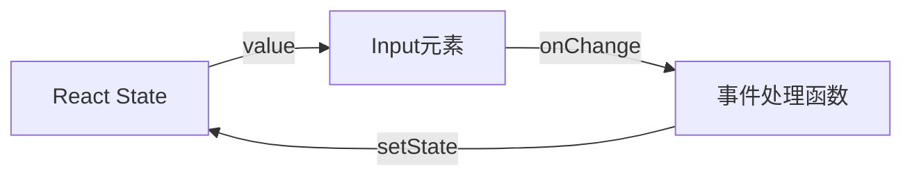

# React 组件状态

## 学习目标

- 掌握 useState Hook 的使用和原理
- 理解受控组件和非受控组件的区别
- 掌握表单处理的各种场景
- 理解状态提升的概念

---

## useState

### 基本语法

```jsx
import { useState } from 'react';

function Counter() {
  const [count, setCount] = useState(0);
  // count:      当前状态值
  // setCount:   更新状态的函数
  // useState(0): 初始值为 0

  return (
    <div>
      <p>Count: {count}</p>
      <button onClick={() => setCount(count + 1)}>+1</button>
      <button onClick={() => setCount(prev => prev - 1)}>-1</button>
      <button onClick={() => setCount(0)}>重置</button>
    </div>
  );
}
```

### 更新状态的两种方式

```jsx
// 方式1：直接传入新值
setCount(count + 1);

// 方式2：传入回调函数（推荐，获取最新状态）
setCount(prevCount => prevCount + 1);
```

### 状态的不可变性

React 状态更新遵循不可变性原则，永远不要直接修改状态：

```jsx
// 错误：直接修改状态
const [user, setUser] = useState({ name: 'Alice', age: 18 });
user.age = 20;  // 直接修改，React 不会重新渲染
setUser(user);  // 对象引用未变，React 认为没有变化

// 正确：创建新对象
setUser({ ...user, age: 20 });

// 数组的正确更新方式
const [items, setItems] = useState([1, 2, 3]);

// 添加
setItems([...items, 4]);

// 删除
setItems(items.filter(item => item !== 2));

// 修改
setItems(items.map(item => item === 2 ? 20 : item));
```

### 多个状态变量

```jsx
// 推荐：将不同状态拆分为多个 useState
const [name, setName] = useState('');
const [age, setAge] = useState(0);
const [email, setEmail] = useState('');

// 不推荐：将所有状态放在一个对象中
// 除非这些状态总是同时更新
const [form, setForm] = useState({ name: '', age: 0, email: '' });
```

### 惰性初始化

`useState` 支持惰性初始化，初始值只有第一次渲染时计算：

```jsx
// 直接传入：每次渲染都会计算
const [state, setState] = useState(expensiveComputation());

// 传入函数：只在首次渲染时计算
const [state, setState] = useState(() => {
  const result = expensiveComputation();
  return result;
});
```

---

## 受控组件

### 什么是受控组件

表单元素的值由 React 状态控制，状态的变更通过 `onChange` 事件驱动：



```jsx
function ControlledForm() {
  const [value, setValue] = useState('');

  const handleChange = (event) => {
    setValue(event.target.value);
  };

  return (
    <input
      type="text"
      value={value}
      onChange={handleChange}
    />
  );
}
```

### 多种表单元素

```jsx
function FullForm() {
  const [form, setForm] = useState({
    username: '',
    password: '',
    gender: 'male',
    hobbies: [],
    city: 'beijing',
    intro: '',
    agreed: false
  });

  const handleChange = (e) => {
    const { name, value, type, checked } = e.target;
    setForm(prev => ({
      ...prev,
      [name]: type === 'checkbox' ? checked : value
    }));
  };

  const handleHobbyChange = (hobby) => {
    setForm(prev => ({
      ...prev,
      hobbies: prev.hobbies.includes(hobby)
        ? prev.hobbies.filter(h => h !== hobby)
        : [...prev.hobbies, hobby]
    }));
  };

  const handleSubmit = (e) => {
    e.preventDefault();
    console.log('Form data:', form);
  };

  return (
    <form onSubmit={handleSubmit}>
      {/* 文本输入 */}
      <input name="username" value={form.username}
             onChange={handleChange} placeholder="用户名" />

      {/* 密码 */}
      <input type="password" name="password" value={form.password}
             onChange={handleChange} placeholder="密码" />

      {/* 单选 */}
      <label>
        <input type="radio" name="gender" value="male"
               checked={form.gender === 'male'} onChange={handleChange} />
        男
      </label>
      <label>
        <input type="radio" name="gender" value="female"
               checked={form.gender === 'female'} onChange={handleChange} />
        女
      </label>

      {/* 多选 */}
      <label>
        <input type="checkbox" checked={form.hobbies.includes('reading')}
               onChange={() => handleHobbyChange('reading')} />
        阅读
      </label>
      <label>
        <input type="checkbox" checked={form.hobbies.includes('music')}
               onChange={() => handleHobbyChange('music')} />
        音乐
      </label>

      {/* 下拉选择 */}
      <select name="city" value={form.city} onChange={handleChange}>
        <option value="beijing">北京</option>
        <option value="shanghai">上海</option>
        <option value="shenzhen">深圳</option>
      </select>

      {/* 文本域 */}
      <textarea name="intro" value={form.intro}
                onChange={handleChange} />

      {/* 复选框 */}
      <label>
        <input type="checkbox" name="agreed" checked={form.agreed}
               onChange={handleChange} />
        同意条款
      </label>

      <button type="submit" disabled={!form.agreed}>提交</button>
    </form>
  );
}
```

---

## 非受控组件

### 什么是非受控组件

表单元素的值由 DOM 自身管理，通过 ref 获取值：

```jsx
import { useRef } from 'react';

function UncontrolledForm() {
  const inputRef = useRef(null);
  const fileRef = useRef(null);

  const handleSubmit = (e) => {
    e.preventDefault();
    console.log('Input value:', inputRef.current.value);
    console.log('File:', fileRef.current.files[0]);
  };

  return (
    <form onSubmit={handleSubmit}>
      <input type="text" ref={inputRef} defaultValue="默认值" />
      <input type="file" ref={fileRef} />
      <button type="submit">提交</button>
    </form>
  );
}
```

### 受控 vs 非受控

| 特性 | 受控组件 | 非受控组件 |
|------|---------|-----------|
| 数据来源 | React state | DOM 自身 |
| 值控制 | `value` + `onChange` | `defaultValue` + `ref` |
| 实时校验 | 容易实现 | 较难实现 |
| 条件禁用 | 容易 | 较难 |
| 动态值 | 完全可控 | 不可控 |
| 表单重置 | 容易（重置 state） | 需要操作 DOM（`ref.current.value = ''`） |

---

## 状态提升

### 概念

将多个组件共享的状态提升到它们的最近共同父组件中管理：

```jsx
function App() {
  const [temperature, setTemperature] = useState('');

  return (
    <div>
      <Input
        scale="celsius"
        temperature={temperature}
        onTemperatureChange={setTemperature}
      />
      <Input
        scale="fahrenheit"
        temperature={temperature}
        onTemperatureChange={setTemperature}
      />
      <BoilingVerdict celsius={parseFloat(temperature)} />
    </div>
  );
}

function Input({ scale, temperature, onTemperatureChange }) {
  const scaleNames = { celsius: '摄氏度', fahrenheit: '华氏度' };

  const handleChange = (e) => {
    onTemperatureChange(e.target.value);
  };

  return (
    <fieldset>
      <legend>{scaleNames[scale]}</legend>
      <input value={temperature} onChange={handleChange} />
    </fieldset>
  );
}

function BoilingVerdict({ celsius }) {
  if (isNaN(celsius)) return <p>请输入温度</p>;
  return <p>{celsius >= 100 ? '水沸腾了' : '水没有沸腾'}</p>;
}
```

---

## 自测题

### 问题 1
useState 的更新函数传入普通值和传入回调函数有什么区别？

<details>
<summary>查看答案</summary>
直接传入新值：`setCount(count + 1)` 使用的是闭包中的 count，如果多次连续调用，每次使用的都是相同的旧值，导致更新不生效。传入回调函数：`setCount(prev => prev + 1)` 每次获取的都是最新的状态值。因此在依赖前一次状态的场景中，必须使用回调函数形式。
</details>

### 问题 2
什么时候应该使用受控组件，什么时候使用非受控组件？

<details>
<summary>查看答案</summary>
受控组件：需要频繁读取或验证输入值、需要动态修改输入值、需要实时响应输入变化的场景。非受控组件：文件上传、简单表单且不需要实时验证、集成非 React 代码时。大部分场景推荐使用受控组件，因为它让 React 成为唯一的数据源。
</details>

### 问题 3
什么是状态提升？解决了什么问题？

<details>
<summary>查看答案</summary>
状态提升是指将多个组件共同依赖的状态移到它们的最近公共父组件中管理，通过 props 传递给子组件。它解决了兄弟组件间的数据共享和同步问题，避免了冗余的状态定义，使数据流向更清晰可追踪。
</details>