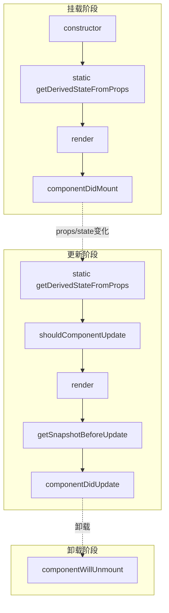

# React 生命周期和 Hooks

## 学习目标

- 理解类组件生命周期各阶段和对应方法
- 掌握 useEffect 的三种执行时机
- 掌握 useMemo 和 useCallback 的性能优化
- 掌握 useRef 的两种使用场景
- 能够编写自定义 Hooks

---

## 类组件生命周期



### 挂载阶段

```jsx
class LifecycleDemo extends React.Component {
  constructor(props) {
    super(props);
    this.state = { count: 0 };
    console.log('1. constructor');
  }

  static getDerivedStateFromProps(props, state) {
    console.log('2. getDerivedStateFromProps');
    return null; // 返回对象更新 state，返回 null 不更新
  }

  componentDidMount() {
    console.log('4. componentDidMount');
    // 适合：发送网络请求、订阅事件、操作 DOM、设置定时器
  }

  render() {
    console.log('3. render');
    return <div>{this.state.count}</div>;
  }
}
```

### 更新阶段

```jsx
class UpdateLifecycle extends React.Component {
  shouldComponentUpdate(nextProps, nextState) {
    console.log('shouldComponentUpdate');
    // 性能优化：返回 false 跳过本次更新
    return nextState.count !== this.state.count;
  }

  getSnapshotBeforeUpdate(prevProps, prevState) {
    console.log('getSnapshotBeforeUpdate');
    // 在 DOM 更新前获取一些信息（如滚动位置）
    return { scrollPosition: window.scrollY };
  }

  componentDidUpdate(prevProps, prevState, snapshot) {
    console.log('componentDidUpdate');
    // 适合：根据 prop 变化发起网络请求
    if (snapshot) {
      console.log('Previous scroll position:', snapshot.scrollPosition);
    }
  }
}
```

### 卸载阶段

```jsx
class CleanupDemo extends React.Component {
  componentDidMount() {
    this.timer = setInterval(() => {
      console.log('tick');
    }, 1000);

    window.addEventListener('resize', this.handleResize);
  }

  componentWillUnmount() {
    // 清除定时器、取消订阅、移除事件监听
    clearInterval(this.timer);
    window.removeEventListener('resize', this.handleResize);
  }

  handleResize = () => {
    console.log('窗口尺寸变化');
  }
}
```

---

## useEffect

### 基本用法

```jsx
import { useState, useEffect } from 'react';

function Timer() {
  const [count, setCount] = useState(0);

  // 1. 不传依赖数组：每次渲染后执行
  useEffect(() => {
    console.log('每次渲染后执行');
  });

  // 2. 空依赖数组：只在挂载时执行一次
  useEffect(() => {
    console.log('组件挂载');
  }, []);

  // 3. 有依赖项：依赖变化时执行
  useEffect(() => {
    document.title = `Count: ${count}`;
  }, [count]);

  return <button onClick={() => setCount(count + 1)}>{count}</button>;
}
```

### 清除副作用

```jsx
function SubscriptionDemo() {
  const [status, setStatus] = useState('online');

  useEffect(() => {
    const timer = setInterval(() => {
      console.log('Heartbeat...');
    }, 5000);

    // 返回清除函数
    return () => {
      clearInterval(timer);
      console.log('清除定时器');
    };
  }, []); // 组件卸载时清除

  return <p>Status: {status}</p>;
}
```

### useEffect 的执行时机

```jsx
function EffectTiming() {
  const [count, setCount] = useState(0);

  // useEffect 的执行是异步的，在浏览器绘制之后执行
  // useLayoutEffect 的执行是同步的，在 DOM 变更后立即执行

  useEffect(() => {
    console.log('useEffect: 浏览器绘制后执行');
  });

  // 对比：useLayoutEffect
  // useLayoutEffect(() => {
  //   console.log('useLayoutEffect: DOM 变更后、浏览器绘制前执行');
  // });

  return <button onClick={() => setCount(count + 1)}>{count}</button>;
}
```

---

## useMemo

### 作用

缓存计算结果，避免在每次渲染时都执行昂贵的计算：

```jsx
import { useState, useMemo } from 'react';

function ExpensiveCalc({ list, filter }) {
  // 不使用 useMemo：每次渲染都重新计算
  // const filteredList = list.filter(item => item.includes(filter));

  // 使用 useMemo：只有依赖变化时才重新计算
  const filteredList = useMemo(
    () => {
      console.log('执行过滤计算');
      return list.filter(item => item.includes(filter));
    },
    [list, filter] // 依赖项
  );

  return (
    <ul>
      {filteredList.map((item, index) => (
        <li key={index}>{item}</li>
      ))}
    </ul>
  );
}
```

### 缓存组件

```jsx
function Parent() {
  const [count, setCount] = useState(0);
  const [search, setSearch] = useState('');

  // useMemo 也可以缓存 JSX
  const searchResult = useMemo(
    () => <SearchList query={search} />,
    [search]
  );

  return (
    <div>
      <input value={search} onChange={e => setSearch(e.target.value)} />
      <button onClick={() => setCount(count + 1)}>{count}</button>
      {searchResult}
    </div>
  );
}
```

---

## useCallback

### 作用

缓存函数引用，避免子组件因父组件重新渲染而创建新的函数实例：

```jsx
import { useState, useCallback, memo } from 'react';

const ExpensiveChild = memo(function ExpensiveChild({ onClick }) {
  console.log('Child rendered');
  return <button onClick={onClick}>Click</button>;
});

function Parent() {
  const [count, setCount] = useState(0);

  // 不使用 useCallback：每次渲染都创建新函数
  // const handleClick = () => setCount(c => c + 1);

  // 使用 useCallback：依赖不变时函数引用不变
  const handleClick = useCallback(
    () => setCount(c => c + 1),
    [] // 空依赖：函数永远不变
  );

  return (
    <div>
      <p>{count}</p>
      <ExpensiveChild onClick={handleClick} />
    </div>
  );
}
```

---

## useRef

### 两种使用场景

```jsx
import { useRef, useEffect } from 'react';

function RefDemo() {
  // 场景1：绑定 DOM 元素
  const inputRef = useRef(null);
  const videoRef = useRef(null);

  // 场景2：存储可变值（不会触发重新渲染）
  const timerRef = useRef(null);

  useEffect(() => {
    inputRef.current?.focus();
  }, []);

  const handleStart = () => {
    timerRef.current = setInterval(() => {
      console.log('计时中...');
    }, 1000);
  };

  const handleStop = () => {
    clearInterval(timerRef.current);
  };

  const handlePlay = () => {
    videoRef.current?.play();
  };

  return (
    <div>
      <input ref={inputRef} placeholder="自动聚焦" />
      <video ref={videoRef} src="video.mp4" />
      <button onClick={handleStart}>开始</button>
      <button onClick={handleStop}>停止</button>
      <button onClick={handlePlay}>播放</button>
    </div>
  );
}
```

### 解决闭包陷阱

```jsx
function ClosureTrap() {
  const [count, setCount] = useState(0);
  const countRef = useRef(count);

  // 同步 ref 的值
  useEffect(() => {
    countRef.current = count;
  }, [count]);

  // 定时器中获取最新值
  useEffect(() => {
    const timer = setInterval(() => {
      // 直接使用 count 会得到旧值（闭包陷阱）
      // 通过 ref 获取最新值
      console.log('Current count:', countRef.current);
    }, 1000);

    return () => clearInterval(timer);
  }, []); // 即使依赖为空，也能获取最新值

  return <button onClick={() => setCount(count + 1)}>{count}</button>;
}
```

---

## 自定义 Hooks

### 状态逻辑复用

自定义 Hook 是一个以 `use` 开头的函数，内部可以调用其他 Hooks：

```jsx
// useDocumentTitle.js
import { useEffect } from 'react';

function useDocumentTitle(title) {
  useEffect(() => {
    document.title = title;
  }, [title]);
}

// 使用
function Home() {
  useDocumentTitle('首页');
  return <h1>Home Page</h1>;
}

function About() {
  useDocumentTitle('关于我们');
  return <h1>About Page</h1>;
}
```

### useLocalStorage

```jsx
import { useState, useEffect } from 'react';

function useLocalStorage(key, defaultValue) {
  const [value, setValue] = useState(() => {
    try {
      const stored = localStorage.getItem(key);
      return stored ? JSON.parse(stored) : defaultValue;
    } catch {
      return defaultValue;
    }
  });

  useEffect(() => {
    localStorage.setItem(key, JSON.stringify(value));
  }, [key, value]);

  return [value, setValue];
}
```

### useRequest

```jsx
import { useState, useEffect } from 'react';

function useRequest(requestFn, deps = []) {
  const [data, setData] = useState(null);
  const [loading, setLoading] = useState(false);
  const [error, setError] = useState(null);

  useEffect(() => {
    let cancelled = false;
    setLoading(true);

    requestFn()
      .then(res => {
        if (!cancelled) {
          setData(res);
          setError(null);
        }
      })
      .catch(err => {
        if (!cancelled) {
          setError(err);
          setData(null);
        }
      })
      .finally(() => {
        if (!cancelled) setLoading(false);
      });

    return () => {
      cancelled = true;
    };
  }, deps);

  return { data, loading, error };
}
```

---

## 自测题

### 问题 1
useEffect 的清除函数在什么时候执行？

<details>
<summary>查看答案</summary>
清除函数在两种情况下执行：1）组件卸载时，执行所有未清除的 effect 的清除函数；2）effect 重新执行前，先执行上一次 effect 的清除函数，再执行新的 effect。这确保了每次 effect 执行前，上一次的副作用都被正确清理。
</details>

### 问题 2
useMemo 和 useCallback 的区别是什么？

<details>
<summary>查看答案</summary>
useMemo 缓存计算结果（返回值），useCallback 缓存函数本身（返回函数引用）。useMemo(() => fn, deps) 等价于 useCallback(fn, deps)。两者都用于性能优化，但 useMemo 适合缓存昂贵的计算结果，useCallback 适合将函数传递给使用 memo 优化的子组件。
</details>

### 问题 3
自定义 Hook 必须以 use 开头命名，为什么？

<details>
<summary>查看答案</summary>
这是一个约定，React 通过函数名是否以 use 开头来判断该函数是否包含 Hook 调用。React 的规则检查工具（eslint-plugin-react-hooks）也依赖这个命名约定来检测 Hook 使用是否违反规则（如在条件语句中调用 Hook），确保 Hook 的调用顺序在每次渲染中保持一致。
</details>