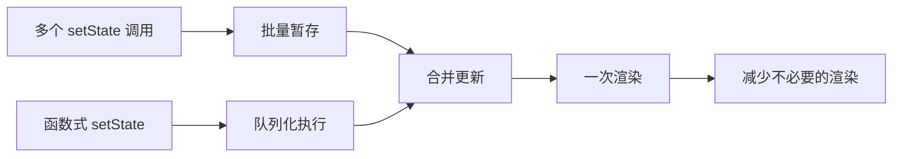

# React 性能优化

## 学习目标

- 理解 setState 的异步更新机制和批量更新
- 掌握不可变数据的概念和重要性
- 掌握 React.memo 和 PureComponent 的使用
- 掌握常见的 React 性能优化策略

---

## setState 原理

### setState 的异步特性

```jsx
class AsyncDemo extends React.Component {
  constructor() {
    super();
    this.state = { count: 0 };
  }

  handleClick = () => {
    this.setState({ count: this.state.count + 1 });
    console.log(this.state.count); // 0（异步，未立即更新）
  }

  // 回调函数中获取最新状态
  handleClickWithCallback = () => {
    this.setState(
      { count: this.state.count + 1 },
      () => {
        console.log('最新值:', this.state.count); // 这里能获取到
      }
    );
  }
}
```

### setState 的合并策略

```jsx
function MergeDemo() {
  const [user, setUser] = useState({ name: 'Alice', age: 18, email: '' });

  // 对象状态的合并：useState 不会自动合并，需手动合并
  const updateName = (name) => {
    setUser(prev => ({ ...prev, name }));
  };

  // 对比：类组件的 setState 会自动浅合并
  // this.setState({ name: 'Bob' }); // 不会丢失 age 和 email
}

// 类组件中：setState 自动浅合并
class ClassMerge extends React.Component {
  state = { name: 'Alice', age: 18 };

  updateName = () => {
    this.setState({ name: 'Bob' }); // age 仍然保留
    // 等效于：this.setState({ ...this.state, name: 'Bob' });
  }
}
```

### 批量更新

```jsx
class BatchUpdate extends React.Component {
  state = { count: 0 };

  // React 合成事件中：批量更新（只触发一次渲染）
  handleBatch = () => {
    this.setState({ count: this.state.count + 1 });
    this.setState({ count: this.state.count + 1 });
    this.setState({ count: this.state.count + 1 });
    // 结果 count = 1（合并为一次更新）
  };

  // 使用函数形式可以解决
  handleCorrectBatch = () => {
    this.setState(prev => ({ count: prev.count + 1 }));
    this.setState(prev => ({ count: prev.count + 1 }));
    this.setState(prev => ({ count: prev.count + 1 }));
    // 结果 count = 3
  };
}
```



### React 18 的自动批处理

React 18 中，所有更新（包括 Promise、setTimeout、原生事件）都会自动批处理：

```jsx
function AutoBatching() {
  const [count, setCount] = useState(0);
  const [flag, setFlag] = useState(false);

  // React 18：所有场景都会批处理
  const handleClick = () => {
    fetchSomething().then(() => {
      setCount(c => c + 1);  // React 18：批处理
      setFlag(f => !f);      // 只触发一次渲染
    });
  };

  // 如果需要跳出批处理（不推荐）
  // import { flushSync } from 'react-dom';
  // flushSync(() => setCount(c => c + 1));
  // flushSync(() => setFlag(f => !f));
  // 会触发两次渲染
}
```

---

## 不可变数据

### 为什么需要不可变数据

```jsx
// 错误示例：直接修改状态
function WrongExample() {
  const [items, setItems] = useState([{ id: 1, text: 'A' }]);

  const updateItem = () => {
    // 直接修改对象
    items[0].text = 'Modified';
    setItems(items); // React 认为引用没变，不重新渲染！
  };
}
```

### 正确的不可变更新

```jsx
// 对象的不可变更新
const updateUser = (user, updates) => {
  return { ...user, ...updates }; // 展开运算符创建新对象
};

// 数组的不可变更新
const addItem = (items, newItem) => [...items, newItem];
const removeItem = (items, id) => items.filter(item => item.id !== id);
const updateItem = (items, id, updates) =>
  items.map(item => item.id === id ? { ...item, ...updates } : item);

// 嵌套对象的不可变更新
const updateNested = (state, path, value) => {
  // 使用展开运算符逐层创建新对象
  return {
    ...state,
    user: {
      ...state.user,
      address: {
        ...state.user.address,
        city: value
      }
    }
  };
};
```

### Immer 库

```jsx
import produce from 'immer';

function ImmerDemo() {
  const [state, setState] = useState({
    users: [
      { id: 1, name: 'Alice', scores: [85, 92] },
      { id: 2, name: 'Bob', scores: [78, 88] },
    ]
  });

  const addScore = (userId, newScore) => {
    setState(produce(draft => {
      const user = draft.users.find(u => u.id === userId);
      if (user) {
        user.scores.push(newScore); // 可以直接修改！
      }
    }));
  };
}
```

---

## React.memo 和 PureComponent

### React.memo

```jsx
import { memo } from 'react';

// 函数组件的性能优化
const Child = memo(function Child({ name, age, onUpdate }) {
  console.log('Child rendered');
  return (
    <div>
      <p>{name} - {age}</p>
      <button onClick={onUpdate}>Update</button>
    </div>
  );
});

// 自定义比较函数
const DeepChild = memo(
  function DeepChild({ data }) {
    console.log('DeepChild rendered');
    return <div>{data.name}</div>;
  },
  (prevProps, nextProps) => {
    // 返回 true 表示 props 相等，不重新渲染
    return prevProps.data.id === nextProps.data.id;
  }
);
```

### PureComponent

```jsx
import React, { PureComponent } from 'react';

// 类组件的性能优化：自动进行浅比较
class ChildItem extends PureComponent {
  render() {
    console.log('ChildItem rendered');
    return <li>{this.props.name} - {this.props.value}</li>;
  }
}

// 手动实现 shouldComponentUpdate
class ManualOptimized extends React.Component {
  shouldComponentUpdate(nextProps, nextState) {
    // 深度比较（性能较差，仅在必要时使用）
    return JSON.stringify(this.props) !== JSON.stringify(nextProps);
  }

  render() {
    return <div>{this.props.data}</div>;
  }
}
```

### React.memo 的注意事项

```jsx
// 注意 1：函数和对象每次渲染都是新引用
function Parent() {
  const [count, setCount] = useState(0);

  // 每次渲染都创建新对象/函数，memo 无法优化
  const user = { name: 'Alice' };
  const handleClick = () => {};

  // 解决方案：useMemo 和 useCallback
  const stableUser = useMemo(() => ({ name: 'Alice' }), []);
  const stableClick = useCallback(() => {}, []);

  return <Child user={stableUser} onClick={stableClick} />;
}
```

---

## 性能优化策略

### 1. 减少不必要的渲染

```jsx
// 使用 React.memo 包裹常渲染的子组件
// 使用 useMemo/useCallback 稳定引用
// 将状态下移（State Colocation）
const ExpensiveWidget = memo(() => {
  // 只有在 props 变化时才重新渲染
});
```

### 2. 代码分割和懒加载

```jsx
import { lazy, Suspense } from 'react';

const HeavyComponent = lazy(() => import('./HeavyComponent'));

function App() {
  return (
    <Suspense fallback={<Loading />}>
      <HeavyComponent />
    </Suspense>
  );
}
```

### 3. 虚拟列表

```jsx
// 使用 react-window 或 react-virtuoso
import { FixedSizeList as List } from 'react-window';

function VirtualList({ items }) {
  const Row = ({ index, style }) => (
    <div style={style}>
      {items[index].name}
    </div>
  );

  return (
    <List
      height={400}
      itemCount={items.length}
      itemSize={50}
      width={300}
    >
      {Row}
    </List>
  );
}
```

### 4. 优化条件渲染

```jsx
// 避免隐藏大量 DOM
// 不推荐：
// <div style={{ display: isVisible ? 'block' : 'none' }}>
//   <HeavyComponent />
// </div>

// 推荐：
// {isVisible && <HeavyComponent />}
```

---

## 自测题

### 问题 1
为什么 setState 是异步的？

<details>
<summary>查看答案</summary>
1. 性能优化：将多个 setState 合并为一次更新，避免不必要的多次渲染
2. 保持状态一致性：确保所有组件在同一个更新周期内看到一致的状态
3. 批量更新机制：React 在合成事件和生命周期函数中开启批量更新模式，收集所有状态变更后统一执行
</details>

### 问题 2
React.memo 和 useMemo 的区别是什么？

<details>
<summary>查看答案</summary>
React.memo 是一个高阶组件，用于包裹组件，对 props 进行浅比较来决定是否重新渲染组件。useMemo 是一个 Hook，用于缓存计算结果或值。React.memo 优化的是组件渲染，useMemo 优化的是值的计算。两者可以配合使用：用 React.memo 避免组件重复渲染，用 useMemo 缓存传给子组件的 props 值。
</details>

### 问题 3
不可变数据为什么对 React 性能优化很重要？

<details>
<summary>查看答案</summary>
React 使用浅比较来判断数据是否变化。如果直接修改对象，引用不变，React 无法检测到变化。创建新对象后，引用变化，React 能快速判断状态已更新。这使得浅比较效率极高（O(1) 的引用比较），避免了深比较的高昂成本。这也是 React.memo 和 PureComponent 能高效工作的基础。
</details>