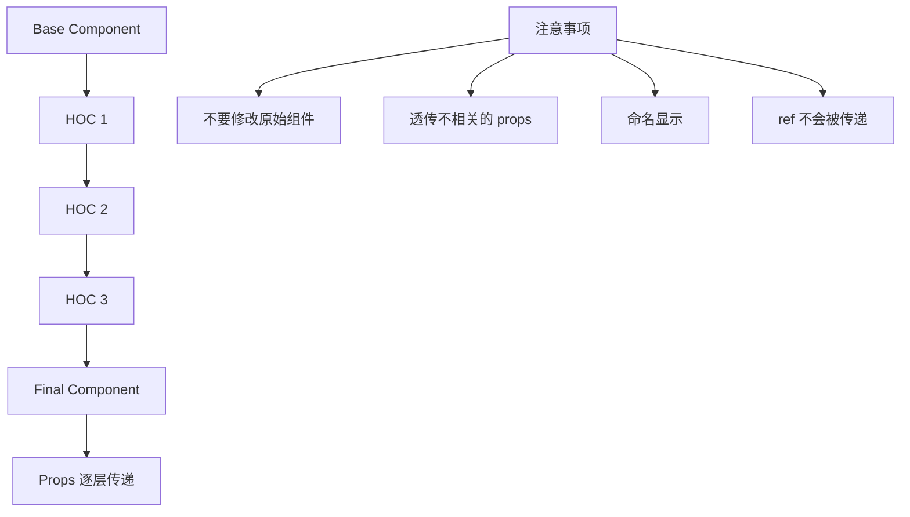

# React 高级特性

## 学习目标

- 理解高阶组件（HOC）的概念和适用场景
- 掌握 Fragment 的使用
- 掌握 Portal 实现弹窗等场景
- 理解 ref 转发的机制

---

## 高阶组件（HOC）

### 概念

高阶组件是参数为组件、返回值为新组件的函数。它是一种复用组件逻辑的模式。

```jsx
// HOC 的基本形式
const EnhancedComponent = higherOrderComponent(WrappedComponent);
```

### 常见 HOC 示例

```jsx
// withLogger.js - 日志记录 HOC
function withLogger(WrappedComponent) {
  return class extends React.Component {
    componentDidMount() {
      console.log(`${WrappedComponent.name} mounted`);
    }

    componentWillUnmount() {
      console.log(`${WrappedComponent.name} unmounted`);
    }

    render() {
      return <WrappedComponent {...this.props} />;
    }
  };
}

// withLoading.js - 加载状态 HOC
function withLoading(WrappedComponent) {
  return function WithLoading({ isLoading, ...props }) {
    if (isLoading) {
      return <div className="loading">Loading...</div>;
    }
    return <WrappedComponent {...props} />;
  };
}

// 使用
const UserListWithLoading = withLoading(UserList);
<UserListWithLoading isLoading={loading} users={data} />;
```

### HOC 的使用场景

```jsx
// 1. 权限控制
function withAuth(WrappedComponent) {
  return function AuthenticatedComponent(props) {
    const { isAuthenticated, ...restProps } = props;
    if (!isAuthenticated) {
      return <Redirect to="/login" />;
    }
    return <WrappedComponent {...restProps} />;
  };
}

// 2. 数据获取
function withData(WrappedComponent, fetchData) {
  return class extends React.Component {
    state = { data: null, loading: true };

    componentDidMount() {
      fetchData().then(data => {
        this.setState({ data, loading: false });
      });
    }

    render() {
      return (
        <WrappedComponent
          {...this.props}
          data={this.state.data}
          loading={this.state.loading}
        />
      );
    }
  };
}
```

### HOC 注意事项



---

## Fragment

### Fragment 的作用

Fragments 允许将多个元素分组，而不向 DOM 添加额外节点：

```jsx
// 不使用 Fragment：需要额外的 div 包裹
function TableWithoutFragment() {
  return (
    <div>  {/* 多余的 div */}
      <td>Cell 1</td>
      <td>Cell 2</td>
    </div>
  );
}

// 使用 Fragment
function TableWithFragment() {
  return (
    <>
      <td>Cell 1</td>
      <td>Cell 2</td>
    </>
  );
}
```

### Fragment 的语法

```jsx
import React, { Fragment } from 'react';

// 1. 短语法（不能加 key）
function ShortSyntax() {
  return (
    <>
      <ChildA />
      <ChildB />
    </>
  );
}

// 2. 完整语法（可以加 key）
function WithKey() {
  return items.map(item => (
    <Fragment key={item.id}>
      <dt>{item.term}</dt>
      <dd>{item.description}</dd>
    </Fragment>
  ));
}
```

---

## Portal

### 概念

Portal 允许将子节点渲染到父组件以外的 DOM 节点中：

```jsx
import { createPortal } from 'react-dom';

function Modal({ children, isOpen, onClose }) {
  if (!isOpen) return null;

  return createPortal(
    <div className="modal-overlay" onClick={onClose}>
      <div className="modal-content" onClick={e => e.stopPropagation()}>
        <button className="modal-close" onClick={onClose}>X</button>
        {children}
      </div>
    </div>,
    document.body  // 渲染到 body 下
  );
}
```

### Portal 的使用场景

```jsx
// 1. 对话框 / Modal
<Portal target={document.body}>
  <ModalContent />
</Portal>

// 2. 提示信息 / Tooltip
<Portal target={document.getElementById('tooltip-root')}>
  <TooltipContent />
</Portal>

// 3. 全局通知
<Portal target={document.getElementById('notification-root')}>
  <NotificationList />
</Portal>

// 4. 下拉菜单 / Dropdown
<Portal target={document.body}>
  <DropdownMenu />
</Portal>
```

### Portal 的事件冒泡

```jsx
// 虽然渲染到 body 下，但事件冒泡遵循 React 组件树
function PortalDemo() {
  const handleClick = () => {
    console.log('父组件捕获点击');
  };

  return (
    <div onClick={handleClick}>
      <Portal>
        <button>这个按钮点击会冒泡到父组件</button>
      </Portal>
    </div>
  );
}
```

---

## ref 转发

### forwardRef

`forwardRef` 允许父组件获取子组件内部的 DOM 节点引用：

```jsx
import { forwardRef, useRef, useImperativeHandle } from 'react';

// 定义支持 ref 转发的组件
const FancyInput = forwardRef(function FancyInput(props, ref) {
  return (
    <input
      ref={ref}
      className="fancy-input"
      {...props}
    />
  );
});

// 父组件使用
function Parent() {
  const inputRef = useRef(null);

  const focusInput = () => {
    inputRef.current.focus();
  };

  return (
    <div>
      <FancyInput ref={inputRef} placeholder="Click button to focus" />
      <button onClick={focusInput}>聚焦输入框</button>
    </div>
  );
}
```

### useImperativeHandle

控制暴露给父组件的实例值：

```jsx
const CustomInput = forwardRef(function CustomInput(props, ref) {
  const inputRef = useRef(null);

  useImperativeHandle(ref, () => ({
    focus: () => {
      inputRef.current.focus();
    },
    blur: () => {
      inputRef.current.blur();
    },
    getValue: () => {
      return inputRef.current.value;
    },
    setValue: (value) => {
      inputRef.current.value = value;
    },
    select: () => {
      inputRef.current.select();
    }
  }), []);

  return <input ref={inputRef} {...props} />;
});

// 使用
function Form() {
  const customRef = useRef(null);

  const handleSubmit = (e) => {
    e.preventDefault();
    console.log('Value:', customRef.current.getValue());
    customRef.current.focus();
  };

  return (
    <form onSubmit={handleSubmit}>
      <CustomInput ref={customRef} />
      <button type="submit">Submit</button>
    </form>
  );
}
```

---

## 自测题

### 问题 1
高阶组件（HOC）和自定义 Hook 在逻辑复用上的区别是什么？

<details>
<summary>查看答案</summary>
HOC 是组件层面的逻辑复用，通过包装组件来添加功能，存在 props 命名冲突、wrapper hell 等问题。自定义 Hook 是函数层面的逻辑复用，不涉及组件层级，更简洁灵活，没有命名冲突问题。在 React 16.8+ 之后，官方推荐优先使用自定义 Hook 替代 HOC。
</details>

### 问题 2
Portal 的事件冒泡机制是怎样的？

<details>
<summary>查看答案</summary>
虽然 Portal 的子元素被渲染到 DOM 树的不同位置，但事件冒泡遵循 React 组件树结构而非 DOM 树结构。这意味着 Portal 内部的事件会冒泡到 React 组件树的父组件，即使 DOM 层级上它们没有直接关系。这保持了 React 组件模型的完整性。
</details>

### 问题 3
forwardRef 解决了什么场景的问题？

<details>
<summary>查看答案</summary>
函数组件默认不接收 ref 属性（因为没有实例）。forwardRef 允许函数组件接收 ref 并转发给子 DOM 节点。这在封装可复用的表单组件、操作第三方库 DOM、需要聚焦/选择文本等场景中非常有用。配合 useImperativeHandle 可以精确控制暴露给父组件的 API。
</details>