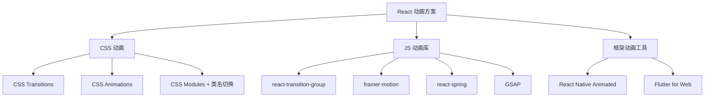

# React 动画

## 学习目标

- 掌握 react-transition-group 的使用
- 理解 React 中的 CSS 动画方案
- 能够实现常见的过渡和动画效果

---

## React 动画方案概览



---

## React Transition Group

### 安装

```bash
npm install react-transition-group
npm install @types/react-transition-group  # TypeScript
```

### CSSTransition

```jsx
import { CSSTransition } from 'react-transition-group';
import { useState } from 'react';

function FadeInOut() {
  const [show, setShow] = useState(true);

  return (
    <div>
      <button onClick={() => setShow(!show)}>
        {show ? '隐藏' : '显示'}
      </button>

      <CSSTransition
        in={show}
        timeout={300}
        classNames="fade"
        unmountOnExit
        appear
      >
        <div className="box">动画盒子</div>
      </CSSTransition>
    </div>
  );
}
```

```css
/* 进入动画 */
.fade-enter {
  opacity: 0;
}
.fade-enter-active {
  opacity: 1;
  transition: opacity 300ms ease-in;
}
.fade-enter-done {
  opacity: 1;
}

/* 退出动画 */
.fade-exit {
  opacity: 1;
}
.fade-exit-active {
  opacity: 0;
  transition: opacity 300ms ease-out;
}
.fade-exit-done {
  opacity: 0;
  display: none;
}

/* 初次渲染动画 */
.fade-appear {
  opacity: 0;
}
.fade-appear-active {
  opacity: 1;
  transition: opacity 300ms;
}
```

### CSSTransition 的 props

```jsx
<CSSTransition
  in={inProp}                 // 触发进入或退出
  timeout={500}               // 动画持续时间（ms）
  classNames="my-animation"   // CSS 类名前缀
  unmountOnExit               // 退出时移除 DOM
  mountOnEnter                // 进入时添加 DOM
  appear                      // 初次渲染也执行动画
  enter={true}                // 启用进入动画
  exit={true}                 // 启用退出动画

  // 生命周期回调
  onEnter={() => {}}
  onEntering={() => {}}
  onEntered={() => {}}
  onExit={() => {}}
  onExiting={() => {}}
  onExited={() => {}}
>
  <div>Animated Content</div>
</CSSTransition>
```

### TransitionGroup

```jsx
import { TransitionGroup, CSSTransition } from 'react-transition-group';

function TodoList() {
  const [items, setItems] = useState([
    { id: 1, text: '学习 React' },
    { id: 2, text: '学习 TypeScript' },
  ]);

  const addItem = () => {
    const id = Date.now();
    setItems([...items, { id, text: `新任务 ${id}` }]);
  };

  const removeItem = (id) => {
    setItems(items.filter(item => item.id !== id));
  };

  return (
    <div>
      <button onClick={addItem}>添加</button>
      <TransitionGroup>
        {items.map(item => (
          <CSSTransition
            key={item.id}
            timeout={300}
            classNames="list-item"
          >
            <div className="todo-item">
              <span>{item.text}</span>
              <button onClick={() => removeItem(item.id)}>删除</button>
            </div>
          </CSSTransition>
        ))}
      </TransitionGroup>
    </div>
  );
}
```

### SwitchTransition

```jsx
import { SwitchTransition, CSSTransition } from 'react-transition-group';

function ToggleView() {
  const [view, setView] = useState('list');

  return (
    <div>
      <button onClick={() => setView(view === 'list' ? 'grid' : 'list')}>
        切换视图
      </button>

      <SwitchTransition mode="out-in">
        <CSSTransition
          key={view}
          timeout={200}
          classNames="view"
        >
          {view === 'list' ? <ListView /> : <GridView />}
        </CSSTransition>
      </SwitchTransition>
    </div>
  );
}
```

---

## CSS 动画方案

### 类名切换

```jsx
function AnimatedBox() {
  const [is Animated, setIsAnimated] = useState(false);

  return (
    <div
      className={`box ${isAnimated ? 'box--animated' : ''}`}
      onClick={() => setIsAnimated(!isAnimated)}
    >
      点击我
    </div>
  );
}
```

### CSS Animation

```css
@keyframes slideIn {
  from {
    transform: translateX(-100%);
    opacity: 0;
  }
  to {
    transform: translateX(0);
    opacity: 1;
  }
}

@keyframes pulse {
  0%, 100% { transform: scale(1); }
  50% { transform: scale(1.05); }
}

.slide-in {
  animation: slideIn 0.5s ease-out forwards;
}

.pulsing {
  animation: pulse 2s ease-in-out infinite;
}
```

### CSS Variables + React State

```jsx
function ProgressBar({ progress }) {
  return (
    <div
      className="progress-bar"
      style={{ '--progress': `${progress}%` }}
    />
  );
}
```

```css
.progress-bar {
  width: var(--progress);
  height: 20px;
  background: linear-gradient(90deg, #4CAF50, #8BC34A);
  transition: width 0.3s ease;
}
```

---

## framer-motion 简介

```jsx
import { motion, AnimatePresence } from 'framer-motion';

function MotionDemo() {
  const [isVisible, setIsVisible] = useState(true);

  return (
    <div>
      <button onClick={() => setIsVisible(!isVisible)}>Toggle</button>

      <AnimatePresence>
        {isVisible && (
          <motion.div
            initial={{ opacity: 0, scale: 0.5 }}
            animate={{ opacity: 1, scale: 1 }}
            exit={{ opacity: 0, scale: 0.5 }}
            transition={{ duration: 0.3 }}
            whileHover={{ scale: 1.1 }}
            whileTap={{ scale: 0.9 }}
          >
            Framer Motion Box
          </motion.div>
        )}
      </AnimatePresence>
    </div>
  );
}
```

---

## 自测题

### 问题 1
CSSTransition 的 classNames 和 CSS 类名之间的关系是什么？

<details>
<summary>查看答案</summary>
classNames 指定 CSS 类名的前缀。例如 classNames="fade" 会生成以下类名：fade-enter、fade-enter-active、fade-enter-done、fade-exit、fade-exit-active、fade-exit-done。加上 appear 属性后还会生成 fade-appear、fade-appear-active、fade-appear-done。开发者只需定义这些 CSS 类名即可控制不同阶段的样式。
</details>

### 问题 2
TransitionGroup 和 CSSTransition 如何配合工作？

<details>
<summary>查看答案</summary>
TransitionGroup 管理一组动画元素的添加和删除。它会自动识别子元素中新增或移除的项，并为每个子元素包裹相应的动画生命周期。CSSTransition 定义单个元素的进出动画。两者配合可实现列表项的增删动画，TransitionGroup 负责管理列表变化，CSSTransition 负责单个元素的具体动画效果。
</details>

### 问题 3
SwitchTransition 的 mode 属性 "out-in" 和 "in-out" 有什么区别？

<details>
<summary>查看答案</summary>
"out-in"：先执行当前元素的退出动画，完成后再执行新元素的进入动画，适用于页面的切换、视图模式的切换等场景。"in-out"：先执行新元素的进入动画，完成后再执行当前元素的退出动画。通常情况下 "out-in" 更常用，因为用户体验更自然。
</details>