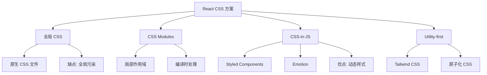

# React CSS 方案

## 学习目标

- 掌握 React 中多种 CSS 方案的使用
- 理解 CSS Modules 的原理和优势
- 掌握 Styled Components 的使用
- 能够根据不同场景选择合适的 CSS 方案

---

## CSS 方案对比



| 方案 | 作用域 | 动态样式 | 学习成本 | 构建工具 |
|------|-------|---------|---------|---------|
| 全局 CSS | 全局 | 类名切换 | 低 | 原生支持 |
| CSS Modules | 局部 | 类名切换 | 低 | Webpack/Vite |
| Styled Components | 局部 | Props 驱动 | 中 | Babel 插件 |
| Tailwind CSS | 全局+局部 | 条件类名 | 中 | PostCSS |
| 内联样式 | 局部 | 直接绑定 | 低 | 原生支持 |

---

## 全局 CSS

```css
/* styles.css */
.container {
  max-width: 1200px;
  margin: 0 auto;
  padding: 20px;
}

.btn {
  padding: 8px 16px;
  border: none;
  border-radius: 4px;
  cursor: pointer;
}

.btn-primary {
  background-color: #007bff;
  color: white;
}

.primary {
  color: #007bff;
}
```

```jsx
import './styles.css';

function App() {
  return (
    <div className="container">
      <button className="btn btn-primary">按钮</button>
    </div>
  );
}
```

---

## CSS Modules

### 基本使用

CSS Modules 通过构建工具（Webpack/Vite）将类名编译为唯一标识，实现样式隔离：

```css
/* Button.module.css */
.btn {
  padding: 12px 24px;
  border-radius: 6px;
  font-size: 16px;
  cursor: pointer;
  transition: all 0.3s;
}

.primary {
  background: #1890ff;
  color: #fff;
  border: 1px solid #1890ff;
}

.danger {
  background: #ff4d4f;
  color: #fff;
  border: 1px solid #ff4d4f;
}

.large {
  padding: 16px 32px;
  font-size: 18px;
}

.disabled {
  opacity: 0.5;
  cursor: not-allowed;
}
```

```jsx
import styles from './Button.module.css';
import { clsx } from 'clsx';

function Button({ type = 'primary', size, disabled, children }) {
  const classNames = clsx(
    styles.btn,
    styles[type],
    size && styles[size],
    disabled && styles.disabled
  );

  return (
    <button className={classNames} disabled={disabled}>
      {children}
    </button>
  );
}
```

### 组合类名

```css
/* compose 继承另一个类的样式 */
.heading {
  font-size: 24px;
  font-weight: bold;
}

.primaryHeading {
  composes: heading;
  color: #1890ff;
}

.sectionHeading {
  composes: heading from './shared.module.css';
  margin-bottom: 16px;
}
```

### CSS Modules 变量

```css
/* variables.module.css */
:export {
  primaryColor: #1890ff;
  successColor: #52c41a;
  warningColor: #faad14;
  errorColor: #ff4d4f;
}
```

---

## Styled Components

### 基本使用

```jsx
import styled from 'styled-components';

// 创建带样式的组件
const Button = styled.button`
  padding: 12px 24px;
  border-radius: 6px;
  font-size: 16px;
  cursor: pointer;
  border: none;
  transition: all 0.3s;

  // 支持嵌套
  &:hover {
    transform: translateY(-2px);
    box-shadow: 0 4px 12px rgba(0, 0, 0, 0.15);
  }

  // 支持媒体查询
  @media (max-width: 768px) {
    width: 100%;
  }
`;

const PrimaryButton = styled(Button)`
  background: #1890ff;
  color: white;
`;

const DangerButton = styled(Button)`
  background: #ff4d4f;
  color: white;
`;

function App() {
  return (
    <div>
      <PrimaryButton>主要按钮</PrimaryButton>
      <DangerButton>危险按钮</DangerButton>
    </div>
  );
}
```

### Props 驱动样式

```jsx
const Card = styled.div`
  background: ${props => props.$bgColor || '#fff'};
  padding: ${props => props.$padding || '20px'};
  border-radius: 8px;
  box-shadow: 0 2px 8px rgba(0, 0, 0, 0.1);

  // 根据 props 条件渲染样式
  border: ${props => props.$active
    ? '2px solid #1890ff'
    : '1px solid #e8e8e8'};
`;

const Title = styled.h2`
  color: ${({ $type }) =>
    $type === 'primary' ? '#1890ff' :
    $type === 'warning' ? '#faad14' :
    '#333'};
  font-size: ${({ $size }) => $size || '18px'};
  margin-bottom: 12px;
`;

function ProductCard({ product, active }) {
  return (
    <Card $active={active} $padding="24px">
      <Title $type="primary">{product.name}</Title>
      <p>{product.description}</p>
    </Card>
  );
}
```

### 全局样式

```jsx
import { createGlobalStyle } from 'styled-components';

const GlobalStyle = createGlobalStyle`
  * {
    margin: 0;
    padding: 0;
    box-sizing: border-box;
  }

  body {
    font-family: -apple-system, BlinkMacSystemFont, 'Segoe UI', sans-serif;
    line-height: 1.6;
    color: #333;
  }

  a {
    color: #1890ff;
    text-decoration: none;

    &:hover {
      text-decoration: underline;
    }
  }
`;

function App() {
  return (
    <>
      <GlobalStyle />
      <MainContent />
    </>
  );
}
```

### 动画和主题

```jsx
import styled, { keyframes, ThemeProvider } from 'styled-components';

// 关键帧动画
const spin = keyframes`
  from { transform: rotate(0deg); }
  to { transform: rotate(360deg); }
`;

const Spinner = styled.div`
  width: 40px;
  height: 40px;
  border: 4px solid #f3f3f3;
  border-top: 4px solid #1890ff;
  border-radius: 50%;
  animation: ${spin} 1s linear infinite;
`;

// 主题
const theme = {
  colors: {
    primary: '#1890ff',
    success: '#52c41a',
    warning: '#faad14',
    error: '#ff4d4f'
  },
  spacing: {
    small: '8px',
    medium: '16px',
    large: '24px'
  }
};

function ThemedButton = styled.button`
  background: ${({ theme }) => theme.colors.primary};
  padding: ${({ theme }) => theme.spacing.medium};
`;

function App() {
  return (
    <ThemeProvider theme={theme}>
      <ThemedButton>主题按钮</ThemedButton>
    </ThemeProvider>
  );
}
```

---

## Tailwind CSS

```jsx
function TailwindExample() {
  return (
    <div className="max-w-4xl mx-auto p-6">
      <h1 className="text-3xl font-bold text-gray-900 mb-4">
        Tailwind CSS in React
      </h1>

      <button className="
        px-6 py-3
        bg-blue-500 text-white font-medium
        rounded-lg shadow-md
        hover:bg-blue-600 hover:shadow-lg
        active:bg-blue-700
        transition-all duration-200
        disabled:opacity-50 disabled:cursor-not-allowed
      ">
        点击
      </button>

      <div className="grid grid-cols-3 gap-4 mt-8">
        {items.map(item => (
          <div key={item.id} className="
            p-4 bg-white rounded-lg shadow
            hover:shadow-md transition-shadow
          ">
            <h3 className="text-lg font-medium">{item.title}</h3>
          </div>
        ))}
      </div>
    </div>
  );
}
```

---

## 方案选择建议

| 项目类型 | 推荐方案 | 原因 |
|---------|---------|------|
| 小型项目/原型 | CSS Modules | 简单，无额外依赖 |
| 大型企业项目 | CSS Modules / Tailwind | 可维护性强 |
| 组件库开发 | Styled Components | 动态样式、主题化 |
| 快速开发 | Tailwind CSS | 开发效率高 |
| 已有 CSS 项目 | CSS Modules | 渐进迁移 |

---

## 自测题

### 问题 1
CSS Modules 如何实现样式隔离？

<details>
<summary>查看答案</summary>
CSS Modules 在构建时（Webpack/Vite）将 CSS 类名编译为唯一标识符，通常是 [filename]_[classname]__[hash] 的格式。编译后的 JavaScript 导入的是一个类名映射对象，引用的是哈希后的唯一类名，从而避免全局冲突。Vite 开箱即支持 CSS Modules，文件命名约定为 *.module.css。
</details>

### 问题 2
Styled Components 的样式是如何注入到页面中的？

<details>
<summary>查看答案</summary>
Styled Components 在运行时将样式字符串转换为 CSS，创建一个唯一的类名，将样式注入到 `<style>` 标签中（通常放在 `<head>` 底部），然后将生成的类名应用到 React 组件上。它会自动处理样式注入的时机（组件挂载时注入，卸载时移除），并支持服务端渲染（SSR）时提取关键 CSS。
</details>

### 问题 3
在什么场景下应该避免使用 CSS-in-JS 方案？

<details>
<summary>查看答案</summary>
1. 对首屏性能要求极高的项目：CSS-in-JS 会增加运行时开销和 JS bundle 体积
2. 项目有严格的设计系统且已经存在 CSS 变量：使用 CSS Modules + CSS 自定义属性更合适
3. 需要最大化利用浏览器缓存 CSS 文件的场景
4. 服务端渲染中如果未正确配置，可能会导致无样式内容闪烁（FOUC）
</details>