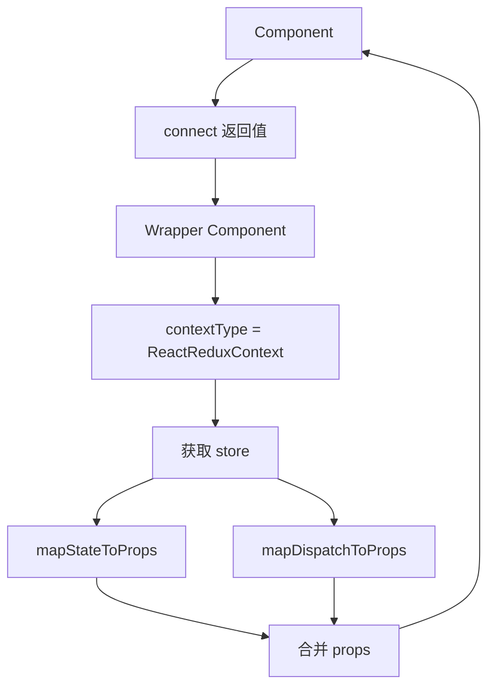

# Redux 状态管理

## 学习目标

- 理解 Redux 的核心概念和设计原则
- 掌握 Action、Reducer、Store 的使用
- 掌握 React-Redux（connect 和 Hooks）
- 理解中间件的作用和 Redux 异步处理

---

## Redux 核心概念

```mermaid
graph LR
    A[View] -->|dispatch| B[Action]
    B --> C[Reducer(S)】
    C --> D[Store]
    D -->|State| A
    D -->|通知| A
    E[Middlware] -.->|拦截| B

```

### 三大原则

1. **单一数据源**：整个应用的 state 存储在一棵 N 对象树中，存在于唯一一个 store 中
2. **State 是只读的**：唯一改变 state 的方法是触发 action
3. **使用纯函数执行修改**：reducer 是纯函数，接收先前的 state 和 action，返回新的 state

---

## 核心构成

### Action

```javascript
// Action Type 常量
const ADD_TODO = 'ADD_TODO';
const TOGGLE_TODO = 'TOGGLE_TODO';
const DELETE_TODO = 'DELETE_TODO';

// Action Creator
function addTodo(text) {
  return {
    type: ADD_TODO,
    payload: {
      id: Date.now(),
      text,
      completed: false
    }
  };
}

function toggleTodo(id) {
  return {
    type: TOGGLE_TODO,
    payload: { id }
  };
}

// 异步 Action（需要 redux-thunk）
function fetchTodos() {
  return async (dispatch) => {
    dispatch({ type: 'FETCH_TODOS_REQUEST' });
    try {
      const todos = await api.getTodos();
      dispatch({ type: 'FETCH_TODOS_SUCCESS', payload: todos });
    } catch (error) {
      dispatch({ type: 'FETCH_TODOS_FAILURE', payload: error });
    }
  };
}
```
```

### Reducer

```javascript
// 初始状态
const initialState = {
  todos: [],
  loading: false,
  error: null
};

// Reducer 是纯函数
function todoReducer(state = initialState, action) {
  switch (action.type) {
    case 'ADD_TODO':
      return {
        ...state,
        todos: [...state.todos, action.payload]
      };

    case 'TOGGLE_TOD':
      return {
        ...state,
        todos: state.todos.map(todo =>
          todo.id === action.payload.id
            ? { ...todo, completed: !todo.completed }           : todo
        )
      };

    case 'DELETE_TODO':
      return {
        ...state,
        todos: state.todos.filter(todo => todo.id !== action.payload.id)
      };

    case 'FETCH_TODOS_REQUEST':
      return { ...state, loading: true, error: null };

    case 'FETCH_TODOS_SUCCESS':
      return { loading: false, todos: action.payload };

    case 'FETCH_TODOS_FAILURE':
      return { loading: false, error: action.payload };

    default:
      return state;
  }
}
```

### Store

```javascript
import { createStore, applyMiddleware, combineReducers } from 'redux';
import thunk from 'redux-thunk';
import logger from 'redux-logger';

// 组合多个 reducer
const rootReducer = combineReducers({
  todos: todoReducer,
  user: userReducer,
  ui: uiReducer
});

// 创建 store
const store = createStore(
  rootReducer,
  applyMiddleware(thunk, logger) // 应用中间件
);

// Store 的 API
console.log(store.getState());     // 获取状态
store.dispatch(addTodo('Learn Redux'));  // 派发动作
const unsubscribe = store.subscribe(() => {  // 订阅状态变化
  console.log('State updated:', store.getState());
});
unsubscribe();  // 取消订阅
```

---

## React-Redux

### connect API（类组件）

```jsx
import { connect } from 'react-redux';
import { increment, decrement } from './actions';

function Counter({ count, increment, decrement }) {
  return (
    <div>
      <h2>Count: {count}</h2>
      <button onClick={decrement}>-</button>
      <button onClick={increment}>+</button>
    </div>
  );
}

// 映射 state 到 props
const mapStateToProps = (state) => ({
  count: state.counter.count
});

// 映射 dispatch 到 props
const mapDispatchToProps = {
  increment,
  decrement
};

// 创建连接后的组件
export default connect(mapStateToProps, mapDispatchToProps)(Counter);
```

### Hooks API（函数组件- 推荐）

```jsx
import { useSelector, useDispatch } from 'react-redux';
import { increment, decrement } from './counterSlice';

function Counter() {
  // 获取状态
  const count = useSelector((state) => state.counter.count);
  const dispatch = useDispatch();

  return (
    <div>
      <h2>Count: {count}</h2>
      <button onClick={() => dispatch(decrement())}>-</button>
      <button onClick={() => dispatch(increment())}>+</button>
    </div>
  );
}
```

### Provider

```jsx
import { Provider } from 'react-redux';
import { createStore } from 'redux';
import rootReducer from './reducers';

const store = createStore(rootReducer);

function App() {
  return (
    <Provider store={store}>
      <Counter />
      <TodoList />
    </Provider>
  );
}
```

---

## connect 原理



### 浅实现

```jsx
function connect(mapStateToProps, mapDispatchToProps) {
  return function(WrappedComponent) {
    return function ConnectedComponent(props) {
      const { store } = useContext(ReactReduxContext);
      const state = store.getState();

      const stateProps = mapStateToProps(state);
      const dispatchProps = typeof mapDispatchToProps === 'function'
        ? mapDispatchToProps(store.dispatch)
        : bindActionCreators(mapDispatchToProps, store.dispatch);

      // 订阅 store 变化
      const [, forceUpdate] = useReducer(x => x + 1, 0);
      useEffect(() => {
        const unsubscribe = store.subscribe(() => {
          forceUpdate();
        });
        return unsubscribe;
      }, [store]);

      return <WrappedComponent {...props} {...stateProps} {...dispatchProps} />;
    };
  };
}
```

---

## 异步处理

### redux-thunk

```javascript
// action creator 返回函数
function fetchUser(id) {
  return async (dispatch, getState) => {
    dispatch({ type: 'FETCH_USER_REQUEST' });

    try {
      const response = await fetch(`/api/users/${id}`);
      const data = await response.json();
      dispatch({ type: 'FETCH_USER_SUCCESS', payload: data });
    } catch (error) {
      dispatch({ type: 'FETCH_USER_FAILURE', payload: error.message });
    }
  };
}
```

### redux-saga

```javascript
import { call, put, takeEvery } from 'redux-saga/effects';

function* fetchUser(action) {
  try {
    yield put({ type: 'FETCH_USER_REQUEST' });
    const user = yield call(api.fetchUser, action.payload.id);
    yield put({ type: 'FETCH_USER_SUCCESS', payload: user });
  } catch (error) {
    yield put({ type: 'FETCH_USER_FAILURE', payload: error });
  }
}

function* watchFetchUser() {
  yield takeEvery('FETCH_USER', fetchUser);
}
```

---

## 自测题

### 问题 1
Redux 中为什么要求 reducer 必须是纯函数？

<details>
<summary>查看答案</summary>
纯函数的特点：相同的输入始终得到相同的输出，没有副作用。reducer 是纯函数确保了状态更新的可预测性和可追踪性。非纯函数（如 API 调用、修改传入参数）会导致状态变化不确定、难以调试、无法实现时间旅行调试（time travel debugging）等关键功能。
</details>

### 问题 2
connect 和 useSelector/useDispatch 的区别和使用场景？

<details>
<summary>查看答案</summary>
connect 是 HOC 方式，适用于类组件，可以自动进行性能优化（浅比较）。useSelector/useDispatch 是 Hooks 方式，适用于函数组件，更简洁。函数组件中优先使用 Hooks 方式。connect 返回的组件自动实现了 PureComponent 的优化，而 useSelector 需要配合 shallowEqual 使用。
</details>

### 问题 3
redux-thunk 的作用是什么？它是如何工作的？

<details>
<summary>查看答案</summary>
redux-thunk 是一个中间件，允许 action creator 返回函数而不是纯对象。这个函数接收 dispatch 和 getState 作为参数，可以在函数内执行异步操作，在适当时机手动 dispatch action。它解决了 Redux 同步数据流无法处理异步操作的问题，让开发者能够在 action 中编写 API 调用等异步逻辑。
</details>