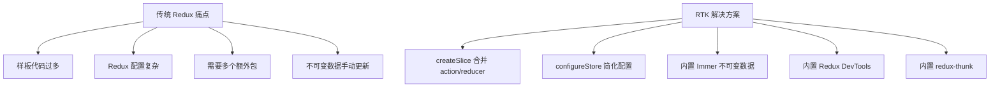

# Redux Toolkit

## 学习目标

- 掌握 Redux Toolkit 的核心 API
- 掌握 createSlice 和 configureStore
- 理解 RTK 的不可变数据机制（Immer）
- 掌握 RTK 中的异步操作

---

## Redux Toolkit 介绍

Redux Toolkit（RTK）是 Redux 官方推荐的现代化 Redux 编写方式，简化了传统 Redux 的样板代码。

### 解决的问题



### 安装

```bash
npm install @reduxjs/toolkit react-redux
```

---

## createSlice

```javascript
import { createSlice } from '@reduxjs/toolkit';

// createSlice 自动生成 action creators 和 action types
const counterSlice = createSlice({
  name: 'counter',
  initialState: {
    value: 0,
    status: 'idle'
  },
  reducers: {
    // 可以直接"修改"state（Immer 处理不可变）
    increment: (state) => {
      state.value += 1;
    },
    decrement: (state) => {
      state.value -= 1;
    },
    incrementByAmount: (state, action) => {
      state.value += action.payload;
    },
    reset: (state) => {
      state.value = 0;
    }
  }
});

// 自动生成的 action creators
export const { increment, decrement, incrementByAmount, reset } = counterSlice.actions;

// 自动生成的 reducer
export default counterSlice.reducer;
```

---

## configureStore

```javascript
import { configureStore } from '@reduxjs/toolkit';
import counterReducer from './features/counter/counterSlice';
import todoReducer from './features/todos/todoSlice';
import userReducer from './features/users/userSlice';

// configureStore 自动设置：
// 1. combineReducers
// 2. Redux DevTools
// 3. redux-thunk 中间件
// 4. 开发环境的额外检查
const store = configureStore({
  reducer: {
    counter: counterReducer,
    todos: todoReducer,
    user: userReducer
  },
  // 可选的中间件配置
  middleware: (getDefaultMiddleware) =>
    getDefaultMiddleware({
      serializableCheck: false,  // 关闭可序列化检查
      immutableCheck: true       // 启用不可变检查
    }),
  // 开发环境工具
  devTools: process.env.NODE_ENV !== 'production'
});

export default store;
```

### 在组件中使用

```jsx
import { useSelector, useDispatch } from 'react-redux';
import { increment, decrement, incrementByAmount } from './counterSlice';

function Counter() {
  const count = useSelector((state) => state.counter.value);
  const dispatch = useDispatch();

  return (
    <div>
      <div>
        <button onClick={() => dispatch(decrement())}>-</button>
        <span>{count}</span>
        <button onClick={() => dispatch(increment())}>+</button>
      </div>
      <button onClick={() => dispatch(incrementByAmount(5))}>+5</button>
    </div>
  );
}
```

---

## createAsyncThunk

处理异步操作的标准方式：

```javascript
import { createSlice, createAsyncThunk } from '@reduxjs/toolkit';
import axios from 'axios';

// 创建异步 thunk
export const fetchTodos = createAsyncThunk(
  'todos/fetchTodos',    // action type 前缀
  async (userId, thunkAPI) => {
    // thunkAPI: { dispatch, getState, rejectWithValue }
    try {
      const response = await axios.get(`/api/todos?userId=${userId}`);
      return response.data;  // 作为 fulfilled action 的 payload
    } catch (error) {
      return thunkAPI.rejectWithValue(error.response.data);
    }
  }
);

const todoSlice = createSlice({
  name: 'todos',
  initialState: {
    items: [],
    loading: 'idle',  // 'idle' | 'pending' | 'succeeded' | 'failed'
    error: null
  },
  reducers: {
    // 同步 reducer
    toggleTodo: (state, action) => {
      const todo = state.items.find(t => t.id === action.payload);
      if (todo) todo.completed = !todo.completed;
    },
    removeTodo: (state, action) => {
      state.items = state.items.filter(t => t.id !== action.payload);
    }
  },
  // 处理异步 thunk 的三种状态
  extraReducers: (builder) => {
    builder
      .addCase(fetchTodos.pending, (state) => {
        state.loading = 'pending';
        state.error = null;
      })
      .addCase(fetchTodos.fulfilled, (state, action) => {
        state.loading = 'succeeded';
        state.items = action.payload;
      })
      .addCase(fetchTodos.rejected, (state, action) => {
        state.loading = 'failed';
        state.error = action.payload;
      });
  }
});

export const { toggleTodo, removeTodo } = todoSlice.actions;
export default todoSlice.reducer;
```

### 在组件中使用异步操作

```jsx
import { useEffect } from 'react';
import { useSelector, useDispatch } from 'react-redux';
import { fetchTodos } from './todoSlice';

function TodoList({ userId }) {
  const dispatch = useDispatch();
  const { items, loading, error } = useSelector((state) => state.todos);

  useEffect(() => {
    dispatch(fetchTodos(userId));
  }, [dispatch, userId]);

  if (loading === 'pending') return <div>Loading...</div>;
  if (error) return <div>Error: {error}</div>;

  return (
    <ul>
      {items.map(todo => (
        <li key={todo.id}>{todo.title}</li>
      ))}
    </ul>
  );
}
```

---

## RTK Query

RTK Query 是 RTK 中集成的数据请求和缓存方案：

```javascript
import { createApi, fetchBaseQuery } from '@reduxjs/toolkit/query/react';

// 定义 API
export const todoApi = createApi({
  reducerPath: 'todoApi',
  baseQuery: fetchBaseQuery({ baseUrl: '/api' }),
  tagTypes: ['Todo'],  // 用于缓存标签
  endpoints: (builder) => ({
    // 查询
    getTodos: builder.query({
      query: (userId) => `todos?userId=${userId}`,
      providesTags: (result) =>
        result
          ? [...result.map(({ id }) => ({ type: 'Todo', id })), 'Todo']
          : ['Todo']
    }),
    // 获取单个
    getTodoById: builder.query({
      query: (id) => `todos/${id}`
    }),
    // 变更
    addTodo: builder.mutation({
      query: (newTodo) => ({
        url: 'todos',
        method: 'POST',
        body: newTodo
      }),
      invalidatesTags: ['Todo']  // 使缓存失效，自动重新请求
    }),
    updateTodo: builder.mutation({
      query: ({ id, ...patch }) => ({
        url: `todos/${id}`,
        method: 'PATCH',
        body: patch
      }),
      invalidatesTags: (result, error, { id }) => [{ type: 'Todo', id }]
    }),
    deleteTodo: builder.mutation({
      query: (id) => ({
        url: `todos/${id}`,
        method: 'DELETE'
      }),
      invalidatesTags: ['Todo']
    })
  })
});

// 自动生成的 hooks
export const {
  useGetTodosQuery,
  useGetTodoByIdQuery,
  useAddTodoMutation,
  useUpdateTodoMutation,
  useDeleteTodoMutation
} = todoApi;
```

### 在组件中使用

```jsx
function TodoApp({ userId }) {
  const { data: todos, isLoading, error } = useGetTodosQuery(userId);
  const [addTodo] = useAddTodoMutation();
  const [deleteTodo] = useDeleteTodoMutation();

  if (isLoading) return <div>加载中...</div>;

  return (
    <div>
      <button onClick={() => addTodo({ title: '新任务', userId })}>
        添加
      </button>
      <ul>
        {todos?.map(todo => (
          <li key={todo.id}>
            {todo.title}
            <button onClick={() => deleteTodo(todo.id)}>删除</button>
          </li>
        ))}
      </ul>
    </div>
  );
}
```

---

## 自定义中间件

```javascript
import { createListenerMiddleware } from '@reduxjs/toolkit';

const listenerMiddleware = createListenerMiddleware();

// 监听特定 action
listenerMiddleware.startListening({
  actionCreator: increment,
  effect: async (action, listenerApi) => {
    // 当增量达到 10 时弹出警告
    if (action.payload >= 10) {
      alert('Count is high!');
    }
  }
});

// 或者监听状态变化
listenerMiddleware.startListening({
  predicate: (action, currentState, previousState) => {
    return currentState.counter.value !== previousState.counter.value;
  },
  effect: (action, listenerApi) => {
    console.log('Counter changed:', listenerApi.getState().counter.value);
  }
});

const store = configureStore({
  reducer: rootReducer,
  middleware: (getDefaultMiddleware) =>
    getDefaultMiddleware().prepend(listenerMiddleware)
});
```

---

## 自测题

### 问题 1
createSlice 中的 reducer 为什么看起来是直接修改了 state？

<details>
<summary>查看答案</summary>
createSlice 内部集成了 Immer 库。Immer 通过 Proxy 代理 state 对象，记录对 state 的"修改"操作，然后生成一个新的不可变对象。开发者可以写出可变风格的代码，但实际返回的是不可变数据。这大大简化了 Redux reducer 的编写，避免了手动展开对象的繁琐操作。
</details>

### 问题 2
RTK Query 相比手动使用 createAsyncThunk 有什么优势？

<details>
<summary>查看答案</summary>
1. 自动生成 hooks，减少样板代码
2. 内置缓存机制：自动管理数据的过期和重新获取
3. 自动处理 loading/error 状态
4. 支持缓存标签（tags）实现智能失效和重新请求
5. 支持乐观更新、轮询、分页等高级功能
6. 自动去重：相同请求不会重复发送
</details>

### 问题 3
configureStore 相比 createStore 做了什么改进？

<details>
<summary>查看答案</summary>
1. 自动合并 reducers（不需要手动调用 combineReducers）
2. 自动添加 redux-thunk 中间件
3. 自动启用 Redux DevTools
4. 开发环境自动添加序列化检查和不可变检查
5. 更好的 TypeScript 类型推导
6. 支持在配置中添加自定义中间件，同时保留默认中间件
</details>