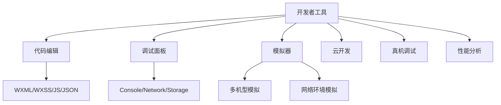
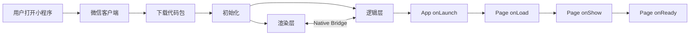

# 小程序入门

## 学习目标

- 理解小程序的概念和应用场景
- 掌握注册小程序账号的流程
- 掌握开发者工具的安装和使用
- 能够创建并运行小程序项目

---

## 小程序介绍

### 什么是微信小程序

微信小程序是一种不需要下载安装即可使用的应用，实现了应用"触手可及"的梦想，用户扫一扫或搜一下即可打开应用。

### 小程序的特点

- **无需安装**：扫码或搜索即可使用，用完即走
- **跨平台**：在 Android 和 iOS 上体验一致
- **轻量级**：包体积限制在 2MB（主包 + 分包可达 20MB）
- **丰富的 API**：调用手机硬件（相机、GPS、蓝牙等）
- **流量红利**：微信生态内的社交传播

### 小程序 vs H5 vs App

| 特性 | 小程序 | H5 | 原生 App |
|------|-------|----|---------|
| 安装成本 | 无需安装 | 无需安装 | 需要下载 |
| 开发成本 | 中 | 低 | 高 |
| 用户体验 | 接近原生 | 一般 | 最好 |
| 流量入口 | 微信生态 | 浏览器/社交 | 应用商店 |
| 更新方式 | 审核发布 | 即时更新 | 审核发布 |

---

## 注册流程

1. 访问 [微信公众平台](https://mp.weixin.qq.com/)
2. 点击"立即注册"，选择"小程序"
3. 填写邮箱、密码等信息
4. 激活邮箱
5. 完善主体信息（个人或企业）
6. 完成注册，获取 AppID

---

## 开发者工具

### 下载和安装

从 [微信开发者工具官网](https://developers.weixin.qq.com/miniprogram/dev/devtools/download.html) 下载对应版本的开发者工具。

### 工具体验

开发者工具提供的核心功能：



### 创建项目

```bash
# 在开发者工具中
1. 打开开发者工具
2. 点击"+ 新建项目"
3. 填写项目名称
4. 选择项目目录
5. 输入 AppID（注册后获取）
6. 选择开发模式（JavaScript / TypeScript）
7. 点击确定
```

---

## 小程序项目结构

```
miniprogram/
├── app.json              # 全局配置
├── app.wxss              # 全局样式
├── app.js                # 小程序逻辑
├── project.config.json   # 项目配置
├── pages/                # 页面目录
│   ├── index/
│   │   ├── index.js      # 页面逻辑
│   │   ├── index.json    # 页面配置
│   │   ├── index.wxml    # 页面模板
│   │   └── index.wxss    # 页面样式
│   └── logs/
│       ├── logs.js
│       ├── logs.json
│       ├── logs.wxml
│       └── logs.wxss
├── components/           # 自定义组件
├── images/               # 图片资源
├── utils/                # 工具函数
├── api/                  # API 封装
└── sitemap.json          # 搜索配置
```

---

## 小程序运行机制



### 双线程模型

小程序的运行环境分为渲染层和逻辑层，两个线程并行运行：

- **渲染层**：负责页面渲染（WebView）
- **逻辑层**：负责逻辑处理（JSCore）
- 通过 Native Bridge 通信，而非直接 DOM 操作

---

## 自测题

### 问题 1
小程序的包体积限制是多少？如何解决包体积过大的问题？

<details>
<summary>查看答案</summary>
主包限制 2MB，总包（主包 + 分包）限制 20MB。解决方案：1）使用分包加载，将非首页功能拆分为独立分包；2）压缩图片资源；3）使用网络图片替代本地图片；4）清理未使用的代码和资源；5）使用云开发存储文件。
</details>

### 问题 2
小程序的渲染层和逻辑层为什么要分离？

<details>
<summary>查看答案</summary>
分离渲染层和逻辑层是为了提高性能和安全性。渲染层负责 UI 渲染（WebView），逻辑层负责处理业务逻辑（JSCore），两者通过 Native Bridge 异步通信。这种架构避免了 JS 执行阻塞 UI 渲染的问题，同时逻辑层运行在沙箱环境中，无法直接操作 DOM，提高了安全性。
</details>

### 问题 3
小程序和普通网页开发的主要区别是什么？

<details>
<summary>查看答案</summary>
1）架构不同：小程序使用双线程模型（渲染层+逻辑层），网页是单线程；2）开发语言：小程序使用 WXML/WXSS/JS，网页使用 HTML/CSS/JS；3）运行环境：小程序在微信客户端中运行，网页在浏览器中运行；4）API 不同：小程序提供微信原生 API；5）发布审核：小程序需要审核发布，网页可随时更新。
</details>