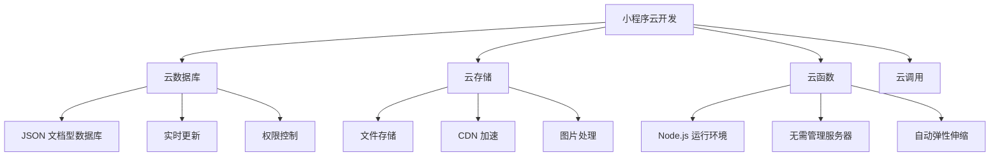

# 小程序云开发

## 学习目标

- 理解云开发（Serverless）的概念和优势
- 掌握云函数的创建和使用
- 掌握云数据库的增删改查
- 掌握云存储的文件管理

---

## 云开发简介

云开发是微信团队提供的 Serverless 解决方案，让开发者无需搭建服务器即可开发小程序。



### 云开发的优势

- **免运维**：无需管理服务器，自动扩缩容
- **按量付费**：只有使用才收费，成本更低
- **快速开发**：内置数据库、存储、函数等能力
- **天然安全**：微信安全风控，防刷能力

### 开通云开发

```javascript
// app.js - 初始化云开发
App({
  onLaunch() {
    wx.cloud.init({
      env: 'your-env-id',  // 云环境 ID
      traceUser: true       // 追踪用户
    });
  }
});
```

---

## 云函数

### 创建云函数

```javascript
// cloudfunctions/getUserInfo/index.js
const cloud = require('wx-server-sdk');
cloud.init();

// 获取数据库和存储引用
const db = cloud.database();

// 云函数入口函数
exports.main = async (event, context) => {
  // event: 调用时传入的参数
  // context: 函数调用上下文
  
  const { OPENID, APPID, UNIONID } = cloud.getWXContext();

  try {
    const result = await db.collection('users')
      .where({ openid: OPENID })
      .get();

    return {
      code: 0,
      data: result.data,
      message: 'success'
    };
  } catch (error) {
    return {
      code: -1,
      data: null,
      message: error.message
    };
  }
};
```

### 调用云函数

```javascript
// 小程序端调用
wx.cloud.callFunction({
  name: 'getUserInfo',
  data: {
    userId: '123'
  },
  success(res) {
    console.log(res.result);
  },
  fail(err) {
    console.error(err);
  }
});

// 使用 Promise
const res = await wx.cloud.callFunction({
  name: 'getUserInfo',
  data: { userId: '123' }
});
```

### 云函数的事件触发

```json
// cloudfunctions/handleOrder/config.json
{
  "permissions": {
    "openapi": []
  },
  "triggers": [
    {
      "name": "orderTimer",
      "type": "timer",
      "config": "0 0 2 * * * *"  // 每天凌晨 2 点执行
    }
  ]
}
```

---

## 云数据库

### 数据库基础操作

```javascript
const db = wx.cloud.database();
const _ = db.command;

// 查询
// 获取单条
const res1 = await db.collection('todos').doc('id123').get();

// 条件查询
const res2 = await db.collection('todos')
  .where({
    _openid: 'user_openid',
    status: 'done',
    priority: _.gt(3),
    tags: _.in(['work', 'study']),
    createTime: _.and(_.gt(new Date('2024-01-01')), _.lt(new Date()))
  })
  .orderBy('createTime', 'desc')
  .limit(20)
  .skip(0)
  .get();

// 聚合查询
const res3 = await db.collection('orders')
  .aggregate()
  .match({ status: 'paid' })
  .group({
    _id: '$category',
    totalAmount: _.sum('$amount'),
    count: _.sum(1)
  })
  .sort({ totalAmount: -1 })
  .end();

// 添加
const res4 = await db.collection('todos').add({
  data: {
    text: '学习云开发',
    status: 'todo',
    priority: 1,
    createTime: db.serverDate()
  }
});

// 更新
const res5 = await db.collection('todos')
  .doc('id123')
  .update({
    data: {
      status: 'done',
      completedAt: db.serverDate()
    }
  });

// 删除
const res6 = await db.collection('todos')
  .doc('id123')
  .remove();
```

### 数据库权限控制

```javascript
// 权限类型
// 仅创建者可读写（默认）
// 仅创建者可读，所有人可写
// 所有人可读，仅创建者可写
// 所有人可读写

// 使用安全规则（更灵活）
// 在云开发控制台配置
```

### 实时数据监听

```javascript
// 监听数据变化
const watcher = db.collection('messages')
  .where({
    toUser: 'user_openid'
  })
  .watch({
    onChange(snapshot) {
      console.log('数据变化:', snapshot);
      // snapshot.docChanges: 变化的文档列表
      // snapshot.docs: 当前完整数据
    },
    onError(err) {
      console.error('监听错误:', err);
    }
  });

// 取消监听
watcher.close();
```

---

## 云存储

### 文件上传和下载

```javascript
// 选择图片
wx.chooseImage({
  count: 9,
  sizeType: ['original', 'compressed'],
  sourceType: ['album', 'camera'],
  success(res) {
    const filePath = res.tempFilePaths[0];

    // 上传到云存储
    wx.cloud.uploadFile({
      cloudPath: `images/${Date.now()}.jpg`,
      filePath: filePath,
      success(result) {
        // fileID: 云存储文件标识
        console.log('上传成功:', result.fileID);
      }
    });
  }
});

// 下载文件
const res = await wx.cloud.downloadFile({
  fileID: 'cloud://example-file-id'
});
// res.tempFilePath: 临时文件路径

// 删除文件
await wx.cloud.deleteFile({
  fileList: ['cloud://example-file-id']
});
```

### 获取文件临时 URL

```javascript
// 获取临时 URL（有效期 2 小时）
const res = await wx.cloud.getTempFileURL({
  fileList: ['cloud://file-id-1', 'cloud://file-id-2']
});
console.log(res.fileList);
// [{ fileID: '...', tempFileURL: 'https://...', status: 0 }]
```

---

## 完整云开发示例

```javascript
// cloudfunctions/submitOrder/index.js
const cloud = require('wx-server-sdk');
cloud.init();
const db = cloud.database();

exports.main = async (event) => {
  const { OPENID } = cloud.getWXContext();
  const { items, address, remark } = event;

  try {
    // 计算总价
    const totalAmount = items.reduce((sum, item) => {
      return sum + item.price * item.quantity;
    }, 0);

    // 创建订单
    const orderResult = await db.collection('orders').add({
      data: {
        _openid: OPENID,
        items: items,
        address: address,
        remark: remark,
        totalAmount: totalAmount,
        status: 'pending',
        createTime: db.serverDate(),
        updateTime: db.serverDate()
      }
    });

    // 扣减库存
    for (const item of items) {
      await db.collection('products')
        .doc(item.productId)
        .update({
          data: {
            stock: _.inc(-item.quantity)
          }
        });
    }

    return {
      code: 0,
      data: {
        orderId: orderResult._id,
        totalAmount: totalAmount
      }
    };
  } catch (e) {
    return { code: -1, message: e.message };
  }
};
```

---

## 自测题

### 问题 1
云函数和小程序端直接调用数据库有什么区别？

<details>
<summary>查看答案</summary>
小程序端直接调用数据库受权限控制限制（如仅创建者可读写），适合简单场景。云函数使用服务端 SDK 调用数据库，不受客户端权限限制，可以执行复杂业务逻辑。云函数还能获取用户的 OPENID，适合需要用户身份验证的操作，且可以组合多个数据库操作在事务中执行。
</details>

### 问题 2
云开发中的数据库权限如何正确设置？

<details>
<summary>查看答案</summary>
云数据库权限分为四种：仅创建者可读写（最安全）、仅创建者可读（适合公开内容）、所有人可读仅创建者可写（适合评论）、所有人可读写（不安全，不推荐）。对于复杂场景，建议使用自定义安全规则（在云开发控制台配置），可以基于用户身份、文档字段等条件精细控制读写权限。通常推荐：敏感数据在云函数中操作，公开数据使用安全规则。
</details>

### 问题 3
云函数的冷启动是什么？如何优化？

<details>
<summary>查看答案</summary>
云函数在长时间未被调用后，函数实例会被回收。下次调用时需要重新初始化运行环境（冷启动），会导致响应延迟增加（通常 1-3 秒）。优化方案：1）设置并发配置，保留一定数量的预热实例；2）合理组织云函数，避免过于碎片化；3）使用定时触发器定期调用云函数保持活跃；4）优化函数代码减少加载时间；5）使用层（Layer）共享公共依赖。
</details>