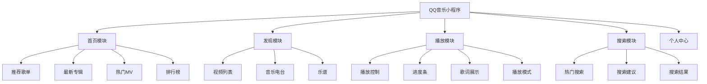
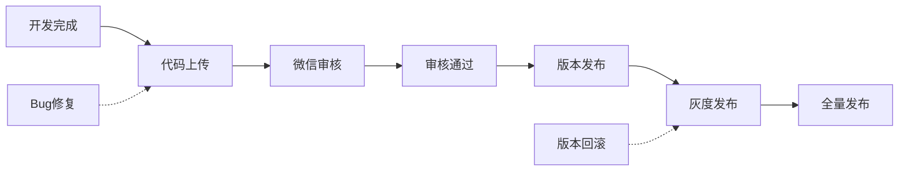

# 小程序项目实战

## 学习目标

- 掌握小程序的完整开发流程
- 掌握项目架构设计和代码组织
- 掌握分包优化的策略
- 掌握小程序的打包和发布流程

---

## 项目架构

### 项目目录设计

```
miniprogram/
├── app.js                          # 全局逻辑
├── app.json                        # 全局配置
├── app.wxss                        # 全局样式
├── project.config.json             # 项目配置
├── sitemap.json                    # 搜索配置
│
├── pages/                          # 主包页面
│   ├── index/                      # 首页
│   ├── recommend/                  # 推荐页
│   ├── search/                     # 搜索页
│   └── my/                         # 个人中心
│
├── package-music/                  # 音乐分包
│   ├── pages/
│   │   ├── player/                 # 播放器
│   │   ├── playlist/               # 歌单详情
│   │   ├── artist/                 # 歌手详情
│   │   └── album/                  # 专辑详情
│   └── components/
│       └── song-item/
│
├── components/                     # 公共组件
│   ├── nav-bar/                    # 导航栏
│   ├── loading/                    # 加载组件
│   ├── empty/                      # 空状态
│   └── song-item/                  # 歌曲项
│
├── services/                       # 服务层
│   ├── request.js                  # 请求封装
│   ├── api.js                      # API 定义
│   └── config.js                   # 配置
│
├── store/                          # 状态管理
│   ├── store.js
│   └── actions.js
│
├── utils/                          # 工具函数
│   ├── util.js
│   ├── format.wxs                  # 格式化函数
│   └── throttle.js                 # 节流
│
└── assets/                         # 静态资源
    ├── images/
    └── icons/
```

---

## 项目功能模块



---

## 通用组件封装

### 请求封装

```javascript
// services/request.js
let baseURL = 'https://api.example.com';

const request = (url, method = 'GET', data = {}) => {
  wx.showLoading({ title: '加载中...', mask: true });

  return new Promise((resolve, reject) => {
    wx.request({
      url: baseURL + url,
      method,
      data,
      header: {
        'Content-Type': 'application/json'
      },
      success(res) {
        if (res.statusCode === 200) {
          resolve(res.data);
        } else {
          reject(res.data);
        }
      },
      fail(err) {
        wx.showToast({
          title: '网络异常',
          icon: 'error'
        });
        reject(err);
      },
      complete() {
        wx.hideLoading();
      }
    });
  });
};

// 封装 GET/POST
const get = (url, params) => request(url, 'GET', params);
const post = (url, data) => request(url, 'POST', data);

module.exports = { get, post };
```

### API 定义

```javascript
// services/api.js
const { get, post } = require('./request');

module.exports = {
  // 首页
  getBanners: () => get('/banner'),
  getRecommends: () => get('/personalized'),
  getPlaylistDetail: (id) => get('/playlist/detail', { id }),

  // 播放
  getSongUrl: (id) => get('/song/url', { id }),
  getSongDetail: (ids) => get('/song/detail', { ids }),
  getLyric: (id) => get('/lyric', { id }),

  // 搜索
  search: (keywords) => get('/search', { keywords }),
  searchSuggest: (keywords) => get('/search/suggest', { keywords }),

  // 歌手
  getArtistList: (type, area) => get('/artist/list', { type, area })
};
```

---

## 状态管理

```javascript
// store/store.js
const EventEmitter = require('./events');

class Store {
  constructor() {
    this.data = {
      currentSong: null,
      playList: [],
      playStatus: 'pause',  // play | pause
      playMode: 'loop',     // loop | single | random
      currentIndex: -1,
      progress: 0,
      duration: 0
    };
    this.emitter = new EventEmitter();
  }

  // 获取状态
  getState(key) {
    return key ? this.data[key] : this.data;
  }

  // 更新状态
  setState(key, value) {
    this.data[key] = value;
    this.emitter.emit(key, value);
    this.emitter.emit('change', this.data);
  }

  // 订阅
  subscribe(key, callback) {
    this.emitter.on(key, callback);
    return () => this.emitter.off(key, callback);
  }
}

module.exports = new Store();
```

---

## 分包优化

### 分包策略

```json
{
  "pages": [
    "pages/index/index",
    "pages/search/search"
  ],
  "subpackages": [
    {
      "root": "package-player",
      "name": "player",
      "pages": [
        "pages/player/player",
        "pages/playlist/playlist",
        "pages/lyric/lyric"
      ]
    },
    {
      "root": "package-user",
      "name": "user",
      "pages": [
        "pages/profile/profile",
        "pages/settings/settings"
      ],
      "independent": true
    }
  ],
  "preloadRule": {
    "pages/index/index": {
      "packages": ["package-player"],
      "network": "wifi"
    }
  }
}
```

### 分包的最佳实践

1. **按功能拆分**：播放器、用户中心等独立功能模块
2. **按访问频率**：低频功能放入分包
3. **按页面深度**：二级及以上页面放入分包
4. **独立分包**：完全不依赖主包的功能使用独立分包

---

## 发布流程



### 发布前检查

```javascript
// 1. 开发环境检查
// - 去除所有 console.log
// - 确认 API 域名已配置
// - 检查图片资源大小
// - 验证分包配置

// 2. 性能检查
// - 主包大小 < 2MB
// - 总包大小 < 20MB
// - 首屏加载时间 < 5s

// 3. 体验检查
// - 真机测试（Android + iOS）
// - 弱网测试
// - 不同机型适配
```

---

## 自测题

### 问题 1
小程序分包加载的实现原理是什么？

<details>
<summary>查看答案</summary>
分包加载将小程序代码拆分为主包和分包。用户首次打开时只下载主包，当用户访问分包中的页面时才下载对应的分包。小程序启动时只加载主包，减少了首屏加载时间。分包可以设置预加载规则，在用户访问某个页面时预先下载可能访问的分包包，提升页面切换体验。
</details>

### 问题 2
小程序的代码上传和发布流程是怎样的？

<details>
<summary>查看答案</summary>
1）在开发者工具中点击"上传"按钮，将代码上传到微信后台；2）登录微信公众平台，进入"版本管理"；3）在开发版本中选择要提交审核的版本，填写版本号和更新说明；4）提交审核，等待审核结果（通常 1-7 天）；5）审核通过后，可以选择"全量发布"或"灰度发布"；6）发布后可通过"版本管理"回滚到之前的版本。
</details>

### 问题 3
在项目中如何组织通用的请求封装？需要考虑哪些方面？

<details>
<summary>查看答案</summary>
通用的请求封装需要考虑：1）统一的 BASE_URL 配置；2）请求/响应拦截器（添加 token、处理错误码）；3）统一的 loading 和错误提示；4）超时处理；5）请求取消（页面离开时取消未完成的请求）；6）请求缓存（相同的请求不重复发送）；7）类型定义（TypeScript 项目中）；8）环境区分（开发/测试/生产环境切换不同的 API 地址）。
</details>