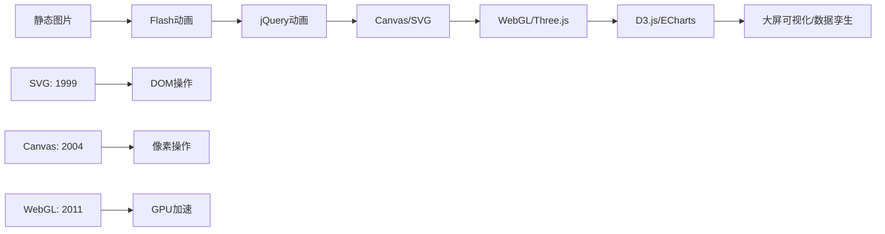
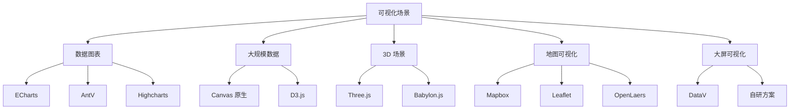

# 前端可视化入门

## 学习目标

- 理解前端可视化的发展历程
- 掌握坐标系和图形学基础
- 了解 3D 和 2.5D 的概念和应用
- 了解前端可视化的技术选型

---

## 前端可视化发展史



### 发展脉络

1. **早期**：图片和 Flash 动画
2. **H5 时代**：CSS3 动画 + Canvas + SVG
3. **数据驱动**：D3.js、ECharts 等数据可视化库
4. **3D 时代**：WebGL、Three.js、Babylon.js
5. **大屏时代**：数据大屏、数字孪生、AR/VR

---

## 坐标系基础

### 2D 坐标系

Canvas 的坐标系原点在左上角，x 轴向右为正，y 轴向下为正：

```javascript
// Canvas 坐标系
// (0,0) -------------> x
//   |
//   |
//   |
//   v
//   y

// CSS 变换坐标系
// transform-origin 默认为 center

// SVG 坐标系
// 起始点 (0,0) 在左上角
```

### 3D 坐标系

Three.js 使用右手坐标系：

```javascript
// Three.js 右手坐标系
// x: 右
// y: 上
// z: 朝向观察者

const camera = new THREE.PerspectiveCamera(75, width/height, 0.1, 1000);
camera.position.set(0, 5, 10);
camera.lookAt(0,0,0);
```

---

### Canvas vs SVG 对比

| 特性 | Canvas | SGG |
|-----|-------|---|
| 渲染方式 | 位图（像素） | 矢量（DOM）|
| 性能 | 适合大量元素 | 适合少量元素 |
| 缩放 | 失真 | 不失真 |
| 事件绑定 | 需要手算坐标 | 支持 DOM 事件 |
| 动画 | 逐帧重绘 | CSS 动画 + SMIL |
| 适用场景 | 游戏、大数据 | 图、图表 |

---

## 2.5D 概念

2.5D（等轴测投影）是在 2D 平面上模拟 3D 效果的技术：

```javascript
// 2.5D 等轴测投影
function isoTo2D(x, y, z) {
  const screenX = (x - y) * Math.cos(Math.PI / 4);
  const screenY = (x + y) * Math.sin(Math.PI / 4) - z;
  return { x: screenX, y: screenY };
}

// 2D 转等轴测
function toIso(x, y) {
  const isoX = (x + y) / 2;
  const isoY = (y - x) / 2;
  return { x: isoX, y: isoY };
}
```

---

## 可视化技术选型



---

## 自测题

### 题 1
前端可视化的主要技术方案有哪些？选择标准是什么？

<details>
<summary>查看答案</summary>
主要方案：1）Canvas：像素级操作，适合游戏和高频更新；2）SVG：DOM 级操作，适合交互式图和图；3）WebGL：GPU 加速，适合 3D 和大规模粒子系统；4）Canvas2：新能优化版本。选择标准：数据量级、交互复杂度、性能要求、开发周期、团队技术栈。
</details>

### 问题 2
2.5D 和在3D 有什么区别？

<details>
<summary>查看答案</summary>
2.5D（等轴测投影）是在 2D 平面上模拟 3D 视觉效果，没有真实深度信息，视角固定。真 3D 使用 WebGL 渲染，具有完整的 x/y/z 坐标系、光照、阴影、透视效果，视角可自由旋转。2.5D 的实现复杂度低、性能开销小，适合社类游戏和数据可视化中的伪 3D 效果。
</details>

### 问题 3
SVG 和 Canvas 在事件处理上有什么不同？

<details>
<summary>查看答案</summary>
SVG 中的每个图形都是 DOM 元素，可以直接绑定点击、悬停等 DOM 事件。Canvas 是位图模式，画布上的图形不是独立 DOM 元素，需要通过计算鼠标坐标和在画布中的位置来判断是否点击到某个图形。因此 SVG 适合交互密集型的图表，Canvas 适合需要高性能渲染的场景。
</details>