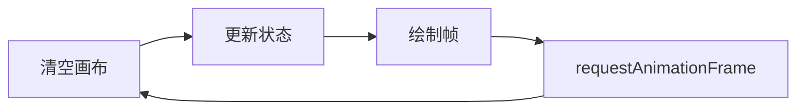

# Canvas 动画

## 学习目标

- 理解 Canvas 动画的基本原理
- 掌握 requestAnimationFrame 的使用
- 能够实现时钟动画
- 理解粒子系统的基本实现

---

## 动画基本原理

Canvas 动画通过不断清除画布并重新绘制来实现动画效果：



```javascript
// 动画循环的基本结构
function animate() {
  // 1. 清空画布
  ctx.clearRect(0, 0, canvas.width, canvas.height);

  // 2. 更新状态
  update();

  // 3. 绘制当前帧
  draw();

  // 4. 请求下一帧
  requestAnimationFrame(animate);
}

animate();
```

---

## requestAnimationFrame

### 基本使用

```javascript
let animationId = null;
let fps = 60;
let lastTime = 0;

function animate(timestamp) {
  // timestamp: 当前时间戳（毫秒）

  // 限制帧率
  const deltaTime = timestamp - lastTime;
  if (deltaTime < 1000 / fps) {
    animationId = requestAnimationFrame(animate);
    return;
  }
  lastTime = timestamp;

  // 更新和绘制
  update(deltaTime);
  draw();

  animationId = requestAnimationFrame(animate);
}

// 启动动画
animationId = requestAnimationFrame(animate);

// 停止动画
function stopAnimation() {
  if (animationId) {
    cancelAnimationFrame(animationId);
    animationId = null;
  }
}
```

### requestAnimationFrame 的优势

```javascript
// 对比 setInterval
// setInterval 的缺点：
// 1. 即使页面不可见也会继续执行（浪费资源）
// 2. 不跟随显示器刷新率（可能掉帧或跳帧）
// 3. 回调时间不精确（受其他任务影响）

const timer = setInterval(() => {
  // 动画逻辑
  draw();
}, 1000 / 60);

// requestAnimationFrame 的优势：
// 1. 页面不可见时自动暂停（节省资源）
// 2. 跟随显示器刷新率（60Hz/120Hz）
// 3. 浏览器优化调度（合并动画帧）
// 4. 提供高精度时间戳
```

---

## 时钟案例

```javascript
function drawClock() {
  const canvas = document.getElementById('clock');
  const ctx = canvas.getContext('2d');
  const radius = canvas.width / 2;
  ctx.translate(radius, radius);

  function drawFace() {
    // 表盘
    ctx.beginPath();
    ctx.arc(0, 0, radius * 0.9, 0, 2 * Math.PI);
    ctx.fillStyle = '#fff';
    ctx.fill();
    ctx.strokeStyle = '#333';
    ctx.lineWidth = 4;
    ctx.stroke();

    // 刻度
    for (let i = 0; i < 12; i++) {
      const angle = (i * 30) * Math.PI / 180;
      ctx.beginPath();
      ctx.moveTo(
        Math.sin(angle) * radius * 0.8,
        -Math.cos(angle) * radius * 0.8
      );
      ctx.lineTo(
        Math.sin(angle) * radius * 0.9,
        -Math.cos(angle) * radius * 0.9
      );
      ctx.strokeStyle = i % 3 === 0 ? '#333' : '#999';
      ctx.lineWidth = i % 3 === 0 ? 4 : 2;
      ctx.stroke();
    }
  }

  function drawHands() {
    const now = new Date();
    const hours = now.getHours() % 12;
    const minutes = now.getMinutes();
    const seconds = now.getSeconds();

    // 时针
    const hourAngle = (hours * 30 + minutes * 0.5) * Math.PI / 180;
    drawHand(ctx, hourAngle, radius * 0.5, 8);

    // 分针
    const minuteAngle = minutes * 6 * Math.PI / 180;
    drawHand(ctx, minuteAngle, radius * 0.7, 4);

    // 秒针
    const secondAngle = seconds * 6 * Math.PI / 180;
    drawHand(ctx, secondAngle, radius * 0.8, 2, '#FF6B6B');

    // 中心点
    ctx.beginPath();
    ctx.arc(0, 0, 10, 0, 2 * Math.PI);
    ctx.fillStyle = '#333';
    ctx.fill();
  }

  function drawHand(ctx, angle, length, width, color = '#333') {
    ctx.beginPath();
    ctx.moveTo(0, 0);
    ctx.lineTo(Math.sin(angle) * length, -Math.cos(angle) * length);
    ctx.strokeStyle = color;
    ctx.lineWidth = width;
    ctx.lineCap = 'round';
    ctx.stroke();
  }

  function updateClock() {
    ctx.clearRect(-radius, -radius, canvas.width, canvas.height);
    drawFace();
    drawHands();
    requestAnimationFrame(updateClock);
  }

  updateClock();
}
```

---

## 粒子系统

### 粒子类

```javascript
class Particle {
  constructor(x, y) {
    this.x = x;
    this.y = y;
    this.vx = (Math.random() - 0.5) * 4;    // x 速度
    this.vy = (Math.random() - 0.5) * 4;    // y 速度
    this.size = Math.random() * 5 + 1;      // 大小
    this.color = `hsl(${Math.random() * 360}, 50%, 50%)`;  // 颜色
    this.life = 1.0;                        // 生命值
    this.decay = Math.random() * 0.02 + 0.01;  // 衰减速度
    this.gravity = 0.05;                    // 重力
  }

  update() {
    this.x += this.vx;
    this.y += this.vy;
    this.vy += this.gravity;
    this.vx *= 0.99;     // 空气阻力
    this.life -= this.decay;
  }

  draw(ctx) {
    ctx.save();
    ctx.globalAlpha = this.life;
    ctx.fillStyle = this.color;
    ctx.beginPath();
    ctx.arc(this.x, this.y, this.size, 0, Math.PI * 2);
    ctx.fill();
    ctx.restore();
  }

  isDead() {
    return this.life <= 0 || this.y > canvas.height;
  }
}
```

### 粒子系统

```javascript
class ParticleSystem {
  constructor(canvas) {
    this.canvas = canvas;
    this.ctx = canvas.getContext('2d');
    this.particles = [];
    this.maxParticles = 200;
  }

  emit(x, y, count = 10) {
    for (let i = 0; i < count; i++) {
      if (this.particles.length < this.maxParticles) {
        this.particles.push(new Particle(x, y));
      }
    }
  }

  update() {
    // 更新所有粒子
    for (let i = this.particles.length - 1; i >= 0; i--) {
      this.particles[i].update();

      // 移除死亡粒子
      if (this.particles[i].isDead()) {
        this.particles.splice(i, 1);
      }
    }
  }

  draw() {
    this.ctx.clearRect(0, 0, this.canvas.width, this.canvas.height);

    this.particles.forEach(particle => {
      particle.draw(this.ctx);
    });
  }

  animate() {
    this.update();
    this.draw();
    requestAnimationFrame(() => this.animate());
  }
}

// 鼠标交互
const system = new ParticleSystem(canvas);

canvas.addEventListener('mousemove', (e) => {
  const rect = canvas.getBoundingClientRect();
  const x = e.clientX - rect.left;
  const y = e.clientY - rect.top;
  system.emit(x, y, 3);
});

system.animate();
```

---

## 性能优化

```javascript
// 1. 离屏 Canvas
const offscreen = document.createElement('canvas');
const offCtx = offscreen.getContext('2d');
// 在离屏 Canvas 上绘制静态内容
offCtx.drawImage(img, 0, 0);
// 主 Canvas 直接复制
ctx.drawImage(offscreen, 0, 0);

// 2. 限制绘制区域
ctx.save();
ctx.beginPath();
ctx.rect(x, y, width, height); // 只绘制需要更新的区域
ctx.clip();
// ... 绘制内容
ctx.restore();

// 3. 分层 Canvas
// 静态层：只绘制一次
// 动态层：单独绘制变化的内容

// 4. 避免浮点坐标
ctx.drawImage(img, Math.round(x), Math.round(y));

// 5. 批量绘制
ctx.beginPath();
particles.forEach(p => {
  ctx.moveTo(p.x, p.y);
  ctx.arc(p.x, p.y, p.size, 0, Math.PI * 2);
});
ctx.fill();
```

---

## 自测题

### 问题 1
requestAnimationFrame 和 setInterval 实现动画的区别？

<details>
<summary>查看答案</summary>
requestAnimationFrame 由浏览器专门优化，会跟随显示器刷新率同步执行（通常 60Hz 即每秒 60 帧），页面不可见时自动暂停以节省资源，并提供高精度时间戳。setInterval 是定时器机制，即使页面不可见也会继续执行，且如果回调执行时间超过间隔时间会导致跳帧问题。现代浏览器中请求动画帧优先使用 requestAnimationFrame。
</details>

### 问题 2
Canvas 动画中如何限制帧率（FPS）？

<details>
<summary>查看答案</summary>
通过时间戳差值控制：在 requestAnimationFrame 回调中记录上一次执行时间，比较当前时间戳与上次时间的差值，如果小于 1000/目标FPS 则跳过本次更新并继续请求下一帧。例如限制 30fps 时，如果 deltaTime < 33.3ms 则跳过更新。这样可以平衡不同显示器刷新率下的动画速度，保证动画在不同设备上表现一致。
</details>

### 问题 3
粒子系统中为什么要倒序遍历粒子数组？

<details>
<summary>查看答案</summary>
因为粒子死亡后需要从数组中移除（splice），倒序遍历可以保证移除元素时不会影响未遍历元素的索引。如果正序遍历，移除一个元素后，后续元素的索引会前移，导致跳过一个粒子的处理。倒序遍历（从最后一个到第一个）是处理动态数组移除操作的经典模式。
</details>