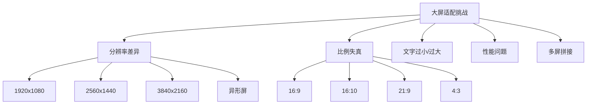
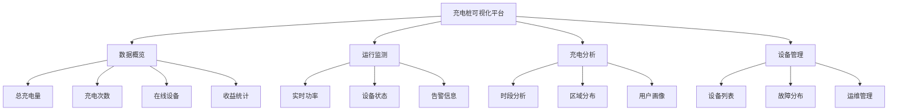

# 大屏适配

## 学习目标

- 理解大屏适配的核心问题
- 掌握常见的适配方案
- 掌握大屏项目的架构设计
- 能够实现数据大屏项目

---

## 大屏适配难点



---

## 适配方案

### 方案 1：CSS Transform 缩放

```javascript
function adaptScreen(designWidth = 1920, designHeight = 1080) {
  const container = document.getElementById('screen-container');

  function setScale() {
    const scaleX = window.innerWidth / designWidth;
    const scaleY = window.innerHeight / designHeight;
    const scale = Math.min(scaleX, scaleY); // 等比缩放

    container.style.transform = `scale(${scale})`;
    container.style.transformOrigin = 'left top';

    // 居中处理
    const marginX = (window.innerWidth - designWidth * scale) / 2;
    const marginY = (window.innerHeight - designHeight * scale) / 2;
    container.style.marginLeft = `${marginX}px`;
    container.style.marginTop = `${marginY}px`;
  }

  setScale();
  window.addEventListener('resize', setScale);
}
```

```css
#screen-container {
  width: 1920px;
  height: 1080px;
  position: relative;
  overflow: hidden;
}
```

### 方案 2：rem + vw/vh

```javascript
// 基于 rem 的适配
function setRem(baseWidth = 1920) {
  const scale = document.documentElement.clientWidth / baseWidth;
  document.documentElement.style.fontSize = `${100 * scale}px`;
  // 1rem = 100px（设计稿尺寸）
}

setRem();
window.addEventListener('resize', setRem);

// CSS 中使用
// .box { width: 1.92rem; height: 1.08rem; } -> 192px 108px
// .text { font-size: 0.14rem; } -> 14px
```

### 方案 3：动态计算

```javascript
// ECharts 字体自适应
function getScale(baseWidth = 1920) {
  return window.innerWidth / baseWidth;
}

// 工具函数
function px(val) {
  return val * getScale();
}

// 使用
const option = {
  title: {
    text: '大屏标题',
    textStyle: { fontSize: px(24) }
  },
  xAxis: {
    axisLabel: { fontSize: px(12) }
  }
};
```

### 方案对比

| 方案 | 优点 | 缺点 | 适用场景 |
|-----|------|-----|---------|
| CSS Transform | 开发体验好，直接按设计稿写 | 点击事件偏移 | 无交互的大屏 |
| rem | 字号自动适配 | 需要计算 | 内容型大屏 |
| 动态计算 | 精确控制 | 代码量大 | ECharts 图表 |
| 流式布局 | 自适应好 | 设计受限 | 简单大屏 |

---

## 新能源充电桩可视化项目

### 项目架构



### 布局结构

```html
<div class="screen-wrapper">
  <!-- 顶部标题 -->
  <header class="screen-header">
    <h1>新能源充电桩可视化平台</h1>
    <div class="header-info">
      <span class="time">{{ currentTime }}</span>
    </div>
  </header>

  <!-- 主体内容 -->
  <main class="screen-main">
    <!-- 左侧区域 -->
    <div class="panel-left">
      <div class="panel" id="realTimePower">实时功率</div>
      <div class="panel" id="deviceStatus">设备状态</div>
    </div>

    <!-- 中间区域 -->
    <div class="panel-center">
      <div class="panel" id="mapContainer">地图分布</div>
      <div class="panel" id="statistics">核心指标</div>
    </div>

    <!-- 右侧区域 -->
    <div class="panel-right">
      <div class="panel" id="chargingAnalysis">充电分析</div>
      <div class="panel" id="alarmList">告警列表</div>
    </div>
  </main>
</div>
```

### 核心数据面板

```javascript
// 核心指标卡片
const statisticsOption = {
  series: [
    {
      type: 'gauge',
      min: 0,
      max: 100,
      data: [{ value: 75, name: '设备利用率' }],
      detail: { fontSize: 20 },
      axisLine: {
        lineStyle: {
          color: [
            [0.5, '#FF6B6B'],
            [0.8, '#FFE66D'],
            [1, '#4ECDC4']
          ]
        }
      }
    }
  ]
};

// 充电时段分布
const timeOption = {
  xAxis: {
    data: ['00', '02', '04', '06', '08', '10', '12', '14', '16', '18', '20', '22']
  },
  yAxis: { type: 'value' },
  series: [
    {
      type: 'line',
      data: [20, 15, 10, 25, 80, 95, 70, 85, 90, 75, 60, 35],
      areaStyle: {
        color: new echarts.graphic.LinearGradient(0, 0, 0, 1, [
          { offset: 0, color: 'rgba(78, 205, 196, 0.8)' },
          { offset: 1, color: 'rgba(78, 205, 196, 0.1)' }
        ])
      }
    }
  ]
};
```

### 数据轮询

```javascript
class DataUpdater {
  constructor(interval = 5000) {
    this.timers = [];
    this.interval = interval;
  }

  startPolling(charts, fetchFn) {
    const poll = async () => {
      try {
        const data = await fetchFn();
        charts.forEach(({ chart, option }) => {
          chart.setOption(option(data));
        });
      } catch (error) {
        console.error('数据更新失败:', error);
      }
    };

    // 立即执行一次
    poll();
    // 定时轮询
    this.timers.push(setInterval(poll, this.interval));
  }

  stop() {
    this.timers.forEach(timer => clearInterval(timer));
    this.timers = [];
  }
}
```

---

## 自测题

### 问题 1
CSS Transform 缩放大屏方案的优缺点是什么？

<details>
<summary>查看答案</summary>
优点：1）开发时直接按照设计稿尺寸（1920x1080）编写，无需计算；2）所有元素等比缩放，视觉比例完美；3）不改变 DOM 结构，开发体验好。缺点：1）缩放后的点击事件坐标会发生偏移，需要额外处理；2）缩放后的文字可能模糊（特别是缩小场景）；3）大屏中嵌套 iframe 或地图时，内部元素不跟随缩放；4）缩放比例过小时交互体验差。
</details>

### 问题 2
大屏可视化项目中如何处理数据实时更新？

<details>
<summary>查看答案</summary>
常用方案：1）轮询（Polling）：使用 setInterval 定时请求最新数据，实现简单但存在延迟；2）WebSocket：建立长连接，服务端主动推送数据，实时性最好；3）Server-Sent Events（SSE）：单向数据流，适合服务端到客户端的推送。实际项目通常组合使用：关键指标使用 WebSocket 实时推送，非关键数据使用较长间隔的轮询。同时需要处理页面可见性变化（Page Visibility API），不可见时暂停更新以节省资源。
</details>

### 问题 3
大屏项目中的性能优化有哪些要点？

<details>
<summary>查看答案</summary>
1）图表优化：减少不必要的动画帧率，关闭非活跃图表的动画；2）数据更新：增量更新而非全量替换，使用 requestAnimationFrame 合并多次更新；3）渲染优化：使用离屏 Canvas 缓存静态图层，使用 CSS3 硬件加速；4）资源优化：图片使用 WebP 格式，大图使用渐进式加载；5）代码优化：使用 Web Workers 处理数据计算，使用防抖/节流控制更新频率；6）按需加载：非首屏可视区域的图表延迟初始化。
</details>