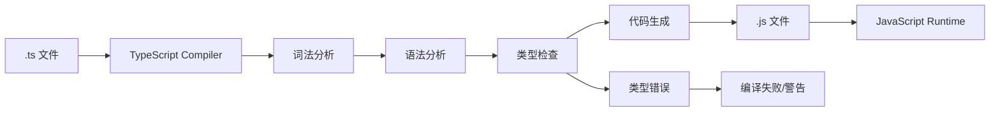

# TypeScript 入门

## 学习目标

- 理解 TypeScript 的设计目标和优势
- 掌握 TypeScript 的编译流程
- 掌握 tsconfig.json 的常用配置
- 能够搭建 TypeScript 开发环境

---

## TypeScript 介绍

TypeScript 是 Microsoft 开发的开源编程语言，是 JavaScript 的超集，添加了可选的静态类型系统和基于类的面向对象编程。

### TypeScript 的优势


### 安装和编译

```bash
# 全局安装
npm install -g typescript

# 查看版本
tsc --version

# 编译单个文件
tsc hello.ts

# 监听模式
tsc hello.ts --watch
```

---

## 编译流程



```typescript
// 即使有类型错误，TypeScript 也会生成 .js 文件
let message: string = 'Hello TypeScript';
console.log(message);
```

### 编译选项

```bash
# 常用编译选项
tsc --target ES2020          # 目标 ECMAScript 版本
tsc --module ESNext          # 模块系统
tsc --strict true            # 启用所有严格检查
tsc --outDir ./dist          # 输出目录
tsc --rootDir ./src          # 源码目录
tsc --declaration            # 生成 .d.ts 文件
tsc --sourceMap              # 生成 source map
```

---

## tsconfig.json

### 基础配置

```json
{
  "compilerOptions": {
    // 编译目标
    "target": "ES2020",
    "module": "ESNext",
    "lib": ["ES2020", "DOM", "DOM.Iterable"],

    // 输出
    "outDir": "./dist",
    "rootDir": "./src",

    // 严格模式
    "strict": true,
    "noImplicitAny": true,
    "strictNullChecks": true,
    "strictFunctionTypes": true,
    "strictBindCallApply": true,
    "noUnusedLocals": true,
    "noUnusedParameters": true,

    // 模块解析
    "moduleResolution": "node",
    "esModuleInterop": true,
    "allowSyntheticDefaultImports": true,
    "resolveJsonModule": true,

    // 源映射
    "sourceMap": true,
    "declaration": true,
    "declarationMap": true,

    // JS 支持
    "allowJs": true,
    "checkJs": false,

    // 其他
    "skipLibCheck": true,
    "forceConsistentCasingInFileNames": true
  },
  "include": ["src"],
  "exclude": ["node_modules", "dist"]
}
```

### 常用配置模式

```json
// 开发环境
{
  "compilerOptions": {
    "target": "ESNext",
    "module": "ESNext",
    "sourceMap": true,
    "outDir": "./dist"
  }
}

// 生产环境
{
  "compilerOptions": {
    "target": "ES5",
    "module": "CommonJS",
    "outDir": "./dist",
    "strict": true,
    "removeComments": true
  }
}

// 库项目
{
  "compilerOptions": {
    "target": "ES2015",
    "module": "ESNext",
    "declaration": true,
    "outDir": "./lib"
  }
}
```

---

## 项目搭建

### 使用 ts-node 直接运行

```bash
npm install -g ts-node
ts-node hello.ts
```

### 使用 tsx（推荐）

```bash
npm install -g tsx
tsx hello.ts
```

### Vite + TypeScript

```bash
npm create vite@latest my-app -- --template react-ts
```

### tsconfig 参考

```json
{
  "compilerOptions": {
    "target": "ES2020",
    "useDefineForClassFields": true,
    "lib": ["ES2020", "DOM", "DOM.Iterable"],
    "module": "ESNext",
    "skipLibCheck": true,

    "moduleResolution": "bundler",
    "allowImportingTsExtensions": true,
    "resolveJsonModule": true,
    "isolatedModules": true,
    "noEmit": true,
    "jsx": "react-jsx",

    "strict": true,
    "noUnusedLocals": true,
    "noUnusedParameters": true,
    "noFallthroughCasesInSwitch": true
  },
  "include": ["src"]
}
```

---

## 自测题

### 问题 1
TypeScript 相比 JavaScript 的核心优势是什么？

<details>
<summary>查看答案</summary>
核心优势是静态类型系统。它在编译时即能发现类型错误，避免运行时才暴露问题。同时类型系统提供了更好的 IDE 支持（自动补全、重构、跳转定义），提升了开发效率。类型本身也起到了文档作用，提高了代码的可读性和可维护性。大型项目中 TypeScript 的优势尤其明显。
</details>

### 问题 2
tsconfig.json 中的 strict: true 会启用哪些检查？

<details>
<summary>查看答案</summary>
strict: true 会启用一系列严格检查模式，主要包括：1）noImplicitAny（禁止隐式 any）；2）strictNullChecks（严格空值检查）；3）strictFunctionTypes（严格函数类型检查）；4）strictBindCallApply（严格 bind/call/apply 检查）；5）strictPropertyInitialization（严格属性初始化检查）；6）noImplicitThis（禁止隐式 this）；7）alwaysStrict（始终使用严格模式）。这些检查可以最大程度地捕获潜在错误。
</details>

### 问题 3
TypeScript 编译时即使有类型错误也会生成 .js 文件，这是为什么？如何改变这种行为？

<details>
<summary>查看答案</summary>
这是 TypeScript 的默认行为设计，目的是保证开发体验：即使类型有误，生成的 JavaScript 仍然可以运行（渐进采用）。但生产环境中这可能导致隐患。可以通过配置改变：在 tsconfig.json 中设置 noEmitOnError: true，这样编译错误时不会生成 JS 文件。或者在 CI/CD 管道中配置 tsc --noEmitOnError，仅在类型检查通过后才执行编译。
</details>